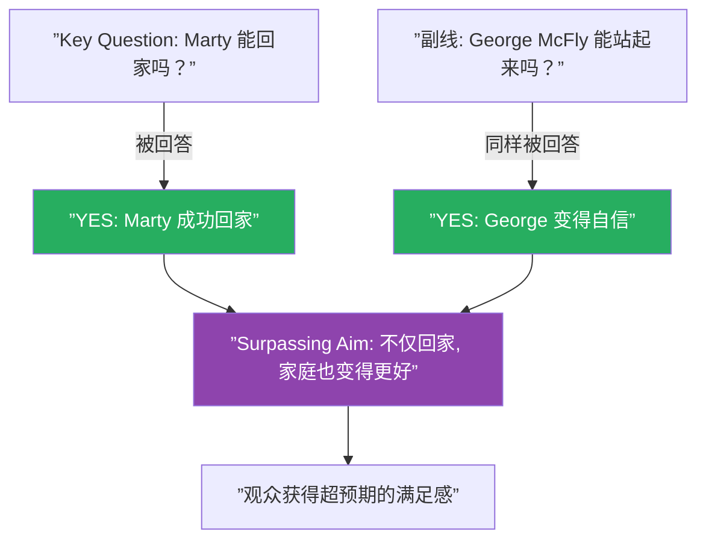
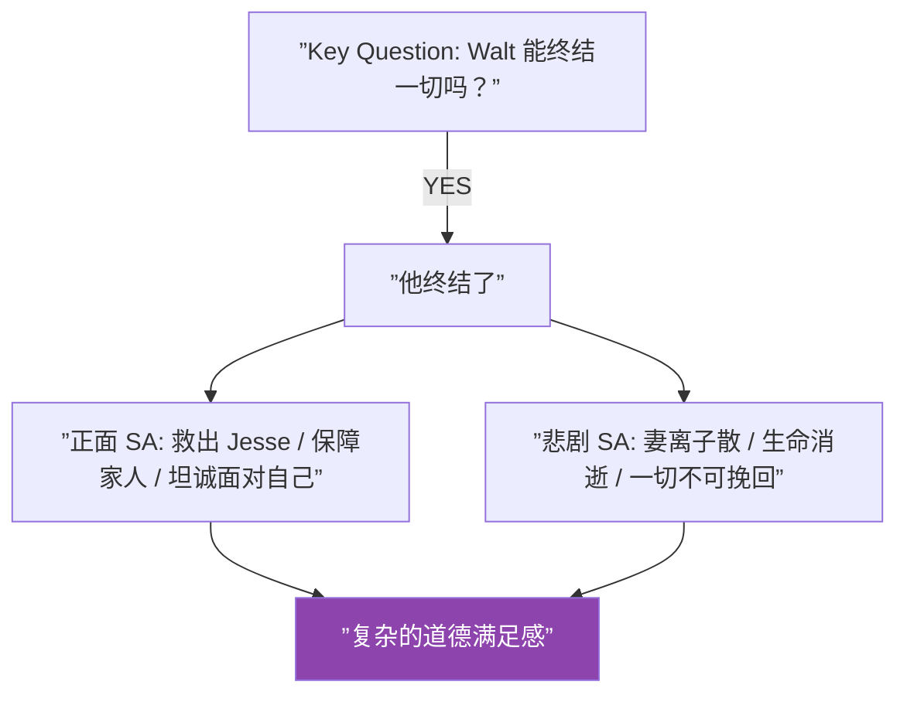

# 第25课：超越目标

## 核心命题

**真正令人满足的故事结局，不是"主角得到了他想要的"，而是"他得到了，还得到了意想不到的更多"。**

这就是 Surpassing Aim（超越目标）。故事的 key question 被回答只是基础——surpassing aim 是那额外的、让观众感觉"这太棒了"的东西。

## 超越目标的机制

Surpassing aim 的本质是：**额外的 knowledge gap——一个观众没有预料到会被回答的问题——被回答了**。

## 经典案例：《Back to the Future》

**Key Question**：Marty 能回到未来吗？

**答案**：YES——他成功回到 1985 年。

**Surpassing Aim**：Marty 不仅回家了，他还发现：

- George McFly 变成了一个自信、成功的男人
- 父母的关系变得更好、更幸福
- 整个家庭从失败者变成了成功者
- 他的存在实际上**改善**了所有人的生活

> [!note]
> 如果电影只回答"能回家"，那只是一个合格的动作片结局。但额外收获——家庭变得更好——把观众从"问题解决了"提升到了"问题解决了，而且世界变得更美好了"的层面。这就是 surpassing aim 的力量。

## 场景级别的 Surpassing Aim

Surpassing aim 不仅适用于故事整体，也适用于每个场景。

一个场景的 key question 可能是"他能赢得这场战斗吗？"。YES 是基础，但 surpassing aim 是"他不仅赢了，还在这个过程中学到了尊重对手"。

> [!tip]
> 在每个场景结束时问自己：除了回答场景问题，我的角色还获得了什么意外的收获？这个额外的收获不必是积极的——也可以是一个意想不到的代价或洞见。

## 《Breaking Bad》的结局式 Surpassing Aim

> [!warning]
> 以下包含《Breaking Bad》结局的剧透。

Walter White 的 key question："他能用自己的方式终结一切吗？"

答案是 YES——但他获得的 surpassing aim 是矛盾的双重收获：

| 层面 | 内容 |
|------|------|
| 正面超越 | 他最终承认："我做这一切是为了我自己——因为我喜欢。"这是角色的终极诚实 |
| 悲剧超越 | 他救出了 Jesse，安排了家人的经济安全，完成了自己的"复仇"——但代价是一切 |

Surpassing aim 让这个结局成为"既满足又痛苦"的经典。不是简单的"好人有好报"或"坏人被惩罚"，而是**超越这两者的、复杂的道德收束**。

## Surpassing Aim 的四种类型

| 类型 | 描述 | 例子 |
|------|------|------|
| 正面超越 | 主角得到意外的好东西 | Marty 回家+家庭变好 |
| 悲剧超越 | 主角得到却失去更多 | Walt 获得自由+失去一切 |
| 洞见超越 | 主角获得比目标更深刻的理解 | 复仇者发现宽恕的意义 |
| 代价超越 | 主角用意想不到的代价换取了成功 | 赢得战斗但失去了伙伴 |

> [!question]
> 你的故事中，除了回答 key question 之外，还有什么"额外的东西"可以让观众感到惊喜？那个额外的收获是否与故事的核心主题一致？

## 【自我检测】

点击展开

**问题 1**：Surpassing aim 和 plot twist（情节反转）有什么区别？

> Plot twist 是改变故事方向或重新定义已发生事件的意外信息。Surpassing aim 是 key question 被回答之后的额外收获，它不改变已经发生的事情，而是提升观众对整个故事的感受。Plot twist 是"事情不是你以为的那样"，surpassing aim 是"事情比你以为的更好（或更复杂）"。

**问题 2**：如何判断我的故事是否有 surpassing aim？

> 在回答了 key question 之后，问自己：还有什么意外的问题被回答了？角色是否获得了超越目标之外的东西？如果去掉这一切，故事的结局是否会变得平庸？如果答案是"是"，那你已经有了 surpassing aim。

**问题 3**：场景级别的 surpassing aim 如何设计？

> 每个场景都有一个本地的 key question（如"他能在酒吧里找到那个人吗？"）。在回答 YES/NO 之后，增加一个额外的发现——比如他找到了那个人（YES），但同时发现那个人其实是他的老朋友（SA）。这个额外的发现让场景不仅仅是推动情节。

---

## 回顾清单

- [ ] 我能识别出故事整体的 key question 和 surpassing aim
- [ ] 我检查了每个场景是否包含了超越性的额外收获
- [ ] 我区分了超越目标与情节反转
- [ ] 我的 surpassing aim 增强了而不是削弱了故事的核心主题

---

**下一步：[第26课：角色成长](/lessons/0026-character-growth.md)**