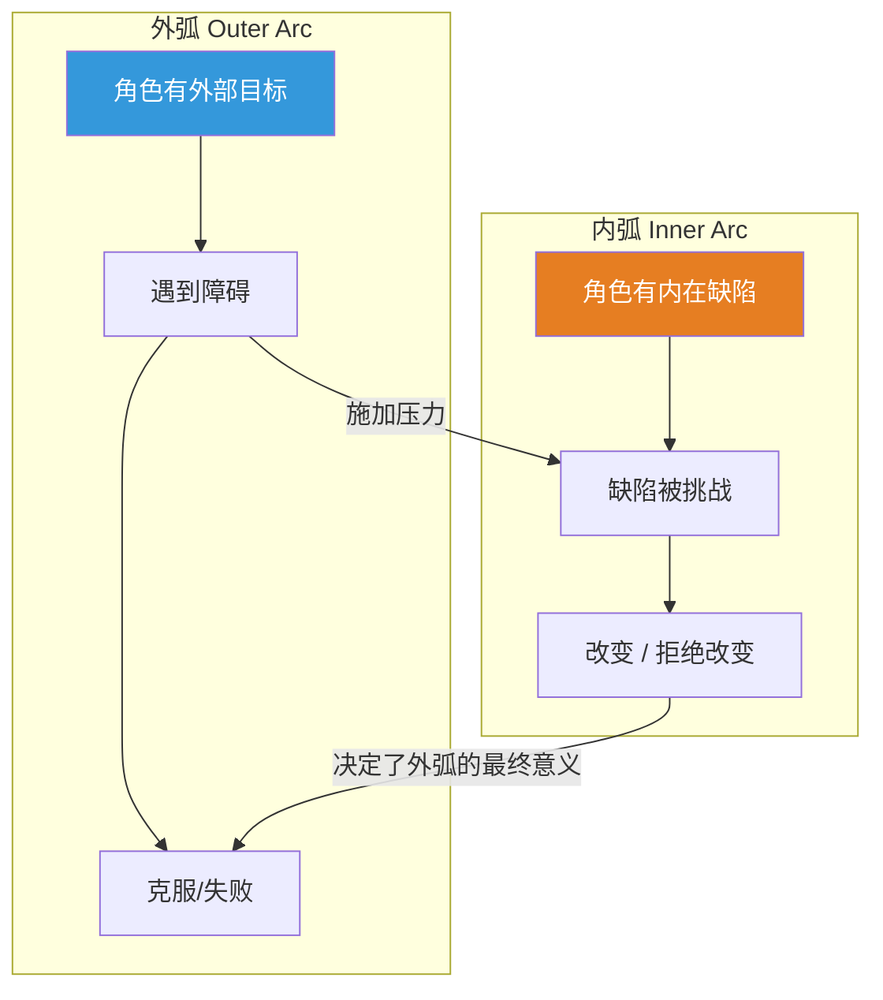

# 第26课：角色成长

## 核心命题

**角色成长（Character Growth）是大多数成功故事的 storification 核心。**

观众离开电影院时，带走的不是情节细节，而是"那个角色变了"的感受。这种变化就是角色成长——而它正是观众在填补知识 gaps 过程中得到的最珍贵的东西。

## 内弧与外弧

角色成长由两条弧线共同驱动：

- **外弧（Outer Arc）**：角色追求一个可衡量的外部目标（找到宝藏、赢得比赛、救出人质）
- **内弧（Inner Arc）**：角色在面对外部挑战时，其内在缺陷被暴露、被挑战，最终发生变化

> [!note]
> 外弧提供的是**压力**，内弧提供的是**意义**。没有内弧的故事只是"事件列表"；没有外弧的故事则缺乏推动成长的动力。

## Classic Example 1: George McFly（《Back to the Future》）

| 维度 | 开始 | 结束 |
|------|------|------|
| 外弧 | 被 Biff 欺负的懦弱者 | 最终打倒了 Biff |
| 内弧 | 不相信自己有勇气 | 发现了自己的勇气，成为一个自信的人 |
| 成长方向 | 正面成长：从懦弱到勇敢 | |

> [!tip]
> George McFly 的成长不仅仅服务于他自己的角色弧——它同时也是 Marty 故事的 surpassing aim。角色成长可以同时服务于多个故事层面。

## Classic Example 2: Mr. Banks（《Mary Poppins》）

| 维度 | 开始 | 结束 |
|------|------|------|
| 外弧 | 想维持家庭秩序和纪律 | 和孩子们一起放风筝 |
| 内弧 | 认为"正确"比"开心"更重要 | 发现"开心"和"家庭"比"正确"更重要 |
| 成长方向 | 正面成长：从僵化到温暖 | |

> [!question]
> Mr. Banks 是主角吗？从情节上看不是，Mary Poppins 才是。但故事中最重要的角色成长发生在他的身上。这告诉我们：角色成长属于谁，故事的核心意义就属于谁。

## Classic Example 3: Woody 和 Buzz（《Toy Story》）

**Woody 的成长**：

- 开始：嫉妒、需要确认自己是"最受喜爱的玩具"
- 结束：学会了分享和合作，明白了 "being a toy" 的意义在于给孩子快乐

**Buzz 的成长**：

- 开始：认为自己是一个真正的太空骑警，不承认自己是玩具
- 结束：接受了自己是玩具的事实，但发现这并不减损他的价值

> [!warning]
> 最强大的故事往往包含**两个或更多角色的平行成长弧**，它们互相映照、互相推动。Woody 和 Buzz 各自需要对方来发现自己的缺陷并完成成长。

## 正面成长 vs 负面成长

角色成长不一定是"变好"。它可以是：

| 成长方向 | 描述 | 例子 |
|----------|------|------|
| 正面成长 | 角色克服缺陷，变得更完整 | George McFly 从懦弱到勇敢 |
| 负面成长 | 角色拥抱缺陷，变得更黑暗 | Walter White 从好教师到毒枭 |
| 悲剧成长 | 角色付出巨大代价获得洞见 | 复仇者在复仇后明白仇人的痛苦 |

> [!note]
> 即使是负面成长，只要它遵循角色内弧的逻辑、产生于合理的压力之下，观众仍然会获得 storification——只不过那是一种"警示性"的洞见："如果我像他这样，也会变成这样的人。"

## 角色成长是 storification 的载体

回顾我们的核心框架：

1. 作者创造知识 gaps
2. 接收者填补 gaps
3. Storification 产生

角色成长是**接收者最愿意填补的 gap 类型**。因为：

- 人类天然对"他人如何变化"感兴趣（社会认知本能）
- 角色成长映射到观众自己的生活可能性——"如果我也这样，会怎样？"
- 它是抽象的、需要解读的，因此最适合知识 gap 的机制

## 【自我检测】

点击展开

**问题 1**：外弧和内弧的关系是什么？

> 外弧为内弧提供压力——角色在追求外部目标时，其内在缺陷会暴露出来并被挑战。内弧为外弧提供意义——单纯的外部目标达成（如"赢了比赛"）如果没有伴随内在变化，就是空洞的。两者缺一不可。

**问题 2**：如何设计一个可信的角色成长弧？

> (1) 先确定角色的内在缺陷；(2) 设计外弧事件，这些事件专门挑战该缺陷；(3) 让角色在压力下做出艰难选择；(4) 显示变化的累积——成长不是瞬间的，通常需要多次挑战；(5) 在结局中让变化得到最终的检验。

**问题 3**：如果我的角色没有成长，故事还有价值吗？

> 有可能，但需要其他 storification 来源，如：揭示一个隐藏的真相、改变读者对故事世界的理解、或者通过角色的不变来暗示某种悲剧性。但作为一般规则，角色成长是最直接、最通用的 storification 来源。

---

## 回顾清单

- [ ] 我为角色设计了内弧和外弧
- [ ] 外弧事件确实对内弧缺陷施加了压力
- [ ] 角色的成长方向（正面/负面）与故事主题一致
- [ ] 我确认了核心 storification 通过哪个角色的成长来承载
- [ ] 如果故事有多角色，它们的成长弧互相映照

---

**下一步：[第27课：真实谎言与声明虚构](/lessons/0027-true-lies-declared-fiction.md)**