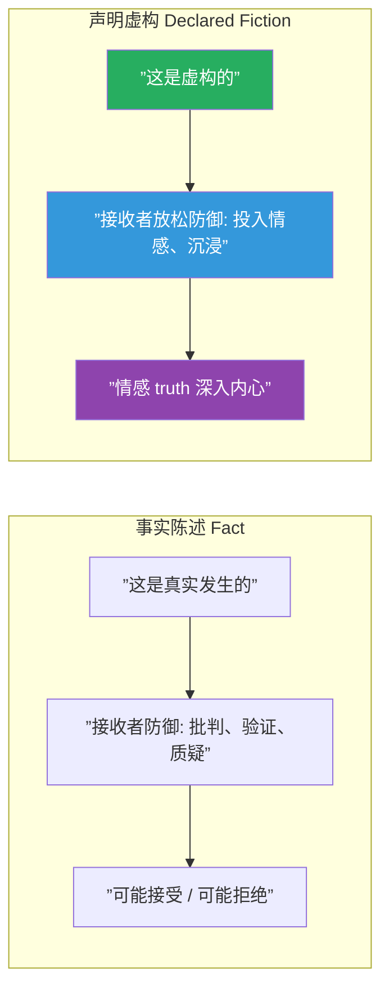
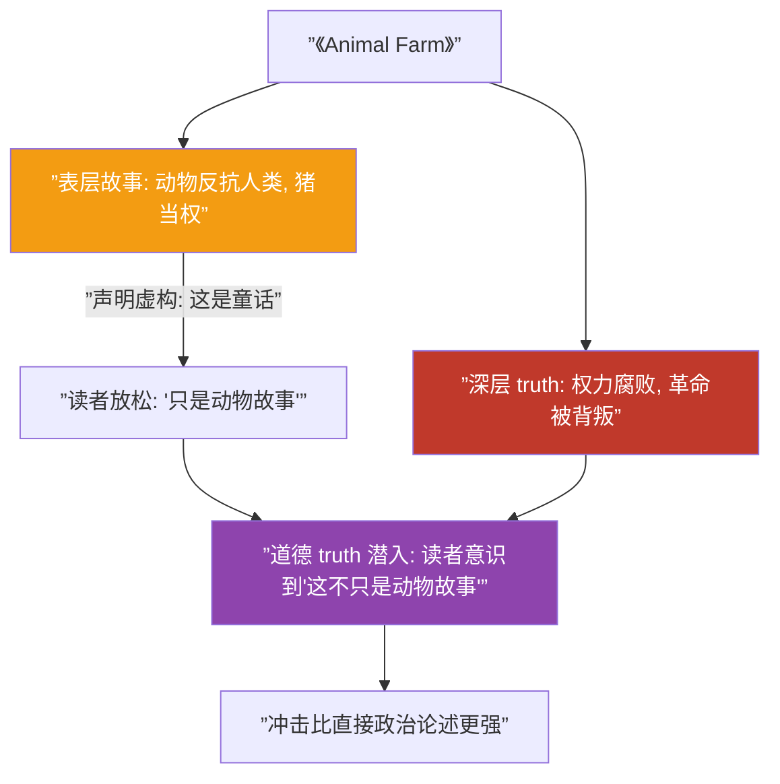
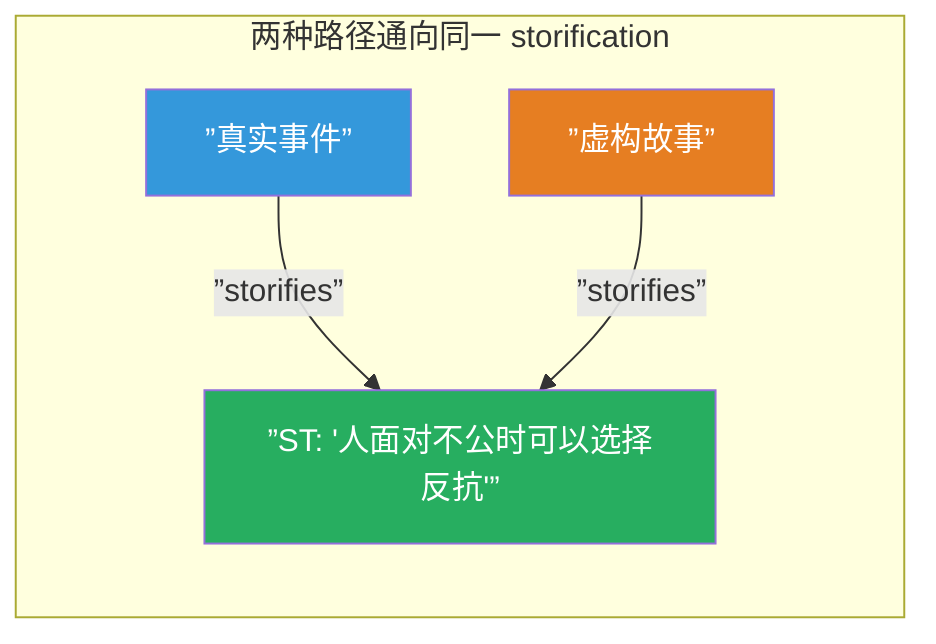
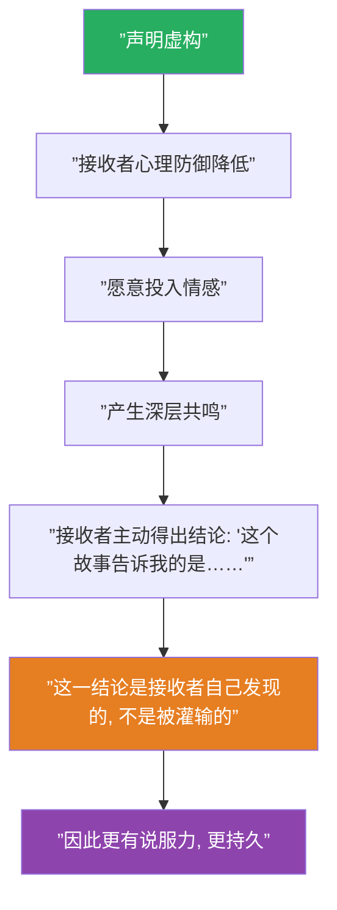

# 第27课：真实谎言与声明虚构

## 核心悖论

**"这是一个虚构的故事"——当作者声明这句话时，反而让更深层的 truth 得以进入接收者的心智。**

这就是 Declared Fiction（声明虚构）的力量。看起来矛盾，但本质上是一个精妙的心理机制：当接收者知道故事"不是真的"，他们的心理防御会降低，从而更开放地接受故事传达的情感 truth。

## 声明虚构的契约

在故事开始之前，作者和接收者之间达成一个隐含的契约：

> **作者说**："我接下来要讲的事情不是真的。它们没有在现实中发生过。"
> 
> **接收者同意**："我知道这不是真的。但我愿意暂时相信它，进入这个故事世界。"

这份契约让接收者暂停了现实检验机制，从而：

1. **降低批判防御**：不再追问"这真的发生了吗？"，而是问"这意味着什么？"
2. **开放情感通道**：因为"这是安全的"（不是真的），接收者允许自己感受更深
3. **转向意义寻找**：注意力从"事实核实"转向"storification"

> [!note]
> 这就是为什么寓言、神话、科幻和奇幻故事能够触及最深刻的 truth——它们公开声明自己是虚构的，因此接收者不会在事实层面进行抵抗。

## 经典案例：《Animal Farm》

George Orwell 的《Animal Farm》在封面上写了"a fairy story"（一个童话故事）。表面上是关于农场动物的故事，实际上是对苏联极权主义的批判。

> [!question]
> 为什么 Orwell 不直接写一本关于苏联的纪实作品？因为直接的政治批判会引起读者的意识形态防御。作为"童话"（declared fiction），Animal Farm 绕过了这种防御，让真理以更隐蔽、更强大的方式进入读者的心智。

## 故事中的 truth 类型

| Truth 类型 | 定义 | 例子 |
|------------|------|------|
| 事实 truth (Factual Truth) | 现实中发生的事情 | "1945 年二战结束" |
| 情感 truth (Emotional Truth) | 情感的忠实呈现 | "失去亲人的痛苦" |
| 道德 truth (Moral Truth) | 关于人应该如何生活的洞见 | "权力导致腐败" |
| 系统 truth (Systemic Truth) | 关于世界如何运作的理解 | "极权主义如何逐渐吞噬自由" |

> [!tip]
> Declared fiction 最适合承载**情感 truth、道德 truth 和系统 truth**。它不擅长（也不需要）承载事实 truth——那属于新闻报道和纪实文学。如果你想让接收者理解"人类在某种处境下的感受"，fired declared fiction 是最好的容器。

## "The truth is in what it storifies"

回顾本课程的核心洞见：

> **故事中的 truth 不在于事实，而在于它 storifies 了什么。**

一个实际发生的事件可能 storifies 某个意义，一个完全虚构的事件也可以 storifies 完全相同的意义。事实和虚构在 storification 层面是等价的。

## 为什么声明虚构反而更有力量

> [!warning]
> 一个常见的误解是"虚构故事就是逃避现实"。恰恰相反，精心设计的 declared fiction 是直面现实的最有力方式之一。它不是让接收者逃离现实，而是让接收者以新的视角重新审视现实。

## 【自我检测】

点击展开

**问题 1**：为什么声明"这是虚构的"反而让故事更有力量？

> 因为接收者知道故事"不是真的"之后，会降低批判性防御，暂停现实检验，更愿意投入情感。同时，接收者从故事中得出的结论是自己"发现"的，而不是被"灌输"的，因此更有说服力。

**问题 2**：Declared fiction 和"谎言"有什么区别？

> 声明虚构是作者和接收者之间的透明契约——双方都知道这不是真的。而谎言是欺骗——接收者以为是真的，但事实并非如此。谎言一旦被揭穿就失去效力，而声明虚构的效力恰恰建立在其被公开承认的基础上。

**问题 3**：如何使用 declared fiction 来承载道德 truth？

> 设计一个表层故事，使其中的角色和事件能自然地映射到你想传达的道德 truth 上。不要直接说"权力导致腐败"——而是展示一群动物如何在革命后逐渐被他们选出的猪领导者压迫。让接收者在关掉书后自己得出"哦，这说的就是我们现实中的政治"的结论。

---

## 回顾清单

- [ ] 我理解了声明虚构的心理机制——为什么"假的"反而更有力量
- [ ] 我能区分事实 truth 和故事中的 truth
- [ ] 我意识到故事中的 truth "不在于事实，而在于它 storifies 什么"
- [ ] 我可以设计一个虚构故事来承载情感或道德 truth
- [ ] 我理解了声明虚构契约的运作方式

---

**下一步：[第28课：隐喻与寓言](/lessons/0028-metaphor-allegory.md)**