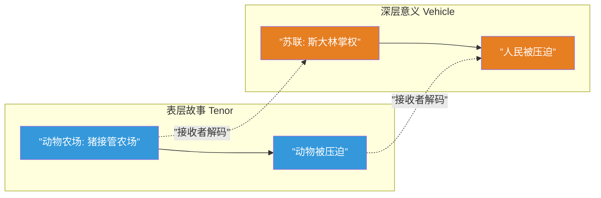
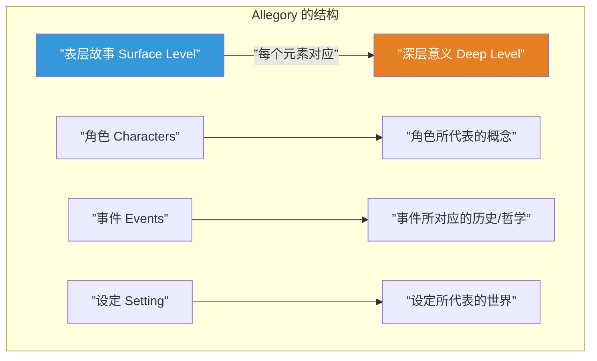
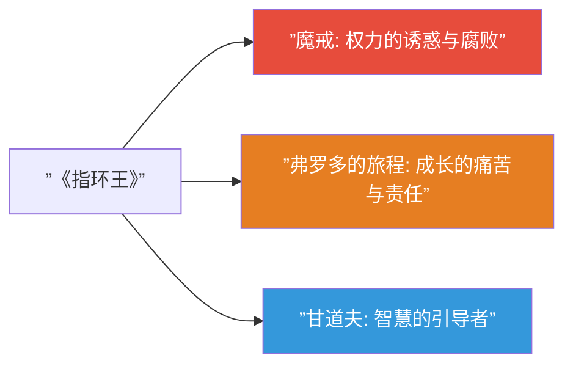
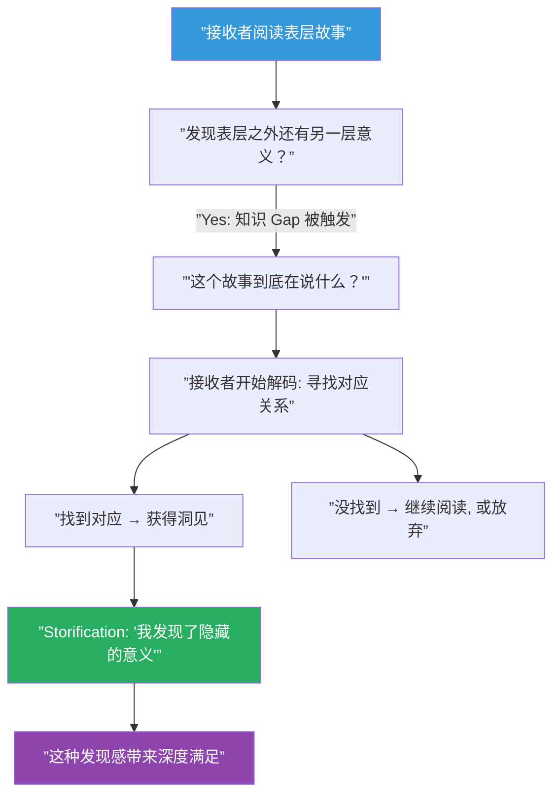

# 第28课：隐喻与寓言

## 核心命题

**隐喻（Metaphor）和寓言（Allegory）是在意义层面创造知识 gaps 的技术——让接收者必须解码"这个故事到底在说什么"。**

当故事的表层（tenor）和深层（vehicle）同时运作时，接收者就有两个层面的 gaps 需要填补。这种双层面运作创造了极深的 storification 空间。

## Tenor 与 Vehicle

隐喻理论中的两个基本概念：

| 术语 | 含义 | 例子 |
|------|------|------|
| **Tenor（本体）** | 原本要表达的事物 | 苏联极权主义 |
| **Vehicle（喻体）** | 用来表达的事物 | 动物农场上的猪 |

> [!note]
> Tenor 和 vehicle 之间的 gap 就是知识 gap 的典型形态。如果两者完全重合（"苏联就是苏联"），就没有 gap，没有 storification。如果两者毫无关联（"吃苹果就是苏联"），gap 太大，无法解码。**最佳状态是足够相关以引导解码，又足够不同以创造意义深度。**

## Allegory（寓言）：完整的故事层面映射

Allegory 是隐喻的延伸——整个故事同时作为两个完整的意义层面运作。

### Allegory 的类型：

| 类型 | 描述 | 例子 |
|------|------|------|
| 政治寓言 | 表层故事映射政治现实 | 《Animal Farm》→ 苏联 |
| 道德寓言 | 表层故事传递道德教导 | 《龟兔赛跑》→ 坚持不懈 |
| 宗教寓言 | 表层故事映射宗教叙事 | 《纳尼亚传奇》→ 基督教 |
| 哲学寓言 | 表层故事探索抽象概念 | 《洞穴寓言》→ 知识与启蒙 |

> [!tip]
> 设计 allegory 的关键：**表层故事必须本身就能独立存在，作为一个好故事。** 如果脱离了深层意义，表层就不能成立，那这个 allegory 是失败的。最好的 allegory 即使读者完全不解码深层意义，仍然是一个有趣的故事。

## Metaphor（隐喻）：局部映射

Metaphor 是比 allegory 更局部的映射——一个角色、物品或事件可以代表另一事物，而不需要整个故事都"有第二层意义"。

- **魔戒** = 权力的隐喻——谁都戴着它都会受影响，越强大的人越容易被腐蚀
- **弗罗多的旅程** = 成长的隐喻——任务超出了他的能力，但他必须承担
- **甘道夫** = 导师的隐喻——他引导但不替代

> [!note]
> 与 allegory 不同，metaphor 是局部的。《指环王》不是一部 allegory（它没有系统性地映射某个具体的历史或政治事件），但它包含了丰富的隐喻层。

## 隐喻/寓言如何创造 storification gap

关键点是：**接收者必须主动参与解码。** 这种参与本身就是 storification 的核心——"我发现了别人可能没看到的意义"的感觉，是故事体验中最深层的满足之一。

## 如何设计有意为之的隐喻层级

1. **先确定深层意义**：你想通过这个故事表达什么 truth？不要从表层开始设计——从你想要传达的洞见开始。
2. **找到合适的 vehicle**：什么故事能自然地承载这个洞见？vehicle 应该足够接近 tenor（以便解码），又足够不同（以创造新视角）。
3. **一致性检查**：检查表层故事中是否有元素破坏了深层映射的一致性。
4. **不要过度设计**：不是故事中的每件事都需要有"第二层意义"。过度设计会导致混乱。

> [!warning]
> 初学者常犯的错误：为了隐喻而隐喻。他们从"我要写一个关于 X 的寓言"开始，结果写出来的故事僵硬、做作、充满说教。正确的顺序是：**先写一个好故事，然后才检查它是否承载了隐喻意义。** 或者：先有想传达的洞见，再找到能自然承载它的故事——但故事本身必须是好的。

## 接收者的解码愉悦

解码隐喻和寓言给接收者带来独特的愉悦：

- **智力愉悦**："我明白它在说什么"
- **归属感愉悦**："我属于能理解这个的群体"
- **发现刷新愉悦**："原来它不只是关于一个农场——它是关于我的世界"
- **重读价值**：每次阅读都可能发现新的对应关系

> [!question]
> 你的故事中有没有可以承载多层意义的角色、物品或事件？这些元素是否可以设计成让接收者在发现"隐藏意义"时获得独特的满足感？

## 【自我检测】

点击展开

**问题 1**：Allegory 和 metaphor 的关键区别是什么？

> Allegory 是系统性的——整个故事都作为两个意义层面运作，每个元素都有对应的深层意义。Metaphor 是局部性的——某个角色、物品或事件代表另一事物，但整个故事不必是双层面的。Allegory 是全书的隐喻系统，metaphor 是局部的隐喻。

**问题 2**：为什么表层故事必须能独立存在？

> 因为如果表层故事本身不够好，读者就不会继续阅读，也就永远不会进入深层解码。好的 allegory 是"可选的深度"——读者可以选择只读表层（仍然是一个好故事），也可以选择解码深层（获得额外满足）。如果表层是空洞的，整个结构就会崩塌。

**问题 3**：如何避免过度设计隐喻？

> (1) 专注故事本身——先把表层故事写成一个完整的、自洽的好故事；(2) 让隐喻自然地从故事中浮现，而非强加于故事之上；(3) 测试：如果去掉隐喻解读，故事还成立吗？(4) 检查：每个看似有隐喻的元素是否在表层故事中有合理的存在理由。

---

## 回顾清单

- [ ] 我理解了 tenor 和 vehicle 的区别
- [ ] 我能区分 allegory（系统性映射）和 metaphor（局部映射）
- [ ] 我的表层故事可以独立存在并自洽
- [ ] 隐喻/寓言层与故事主题一致，而非强行附加
- [ ] 我允许接收者主动发现深层意义，而不是直接点明

---

**下一步：[第29课：道德论证](/lessons/0029-moral-argument.md)**