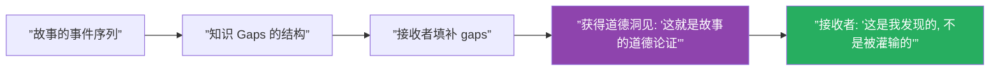
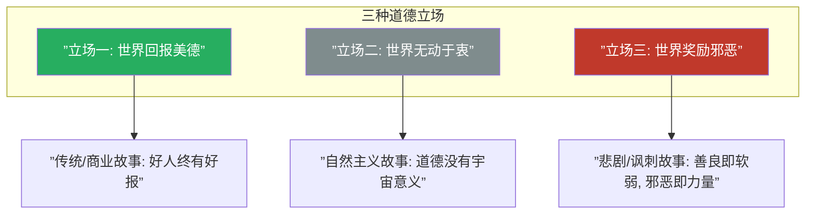
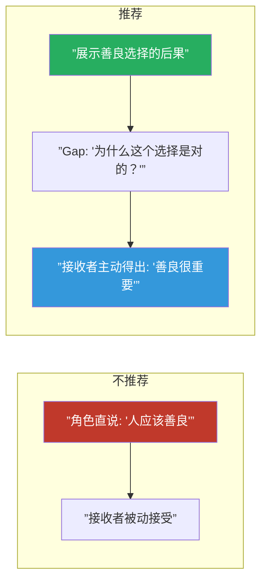
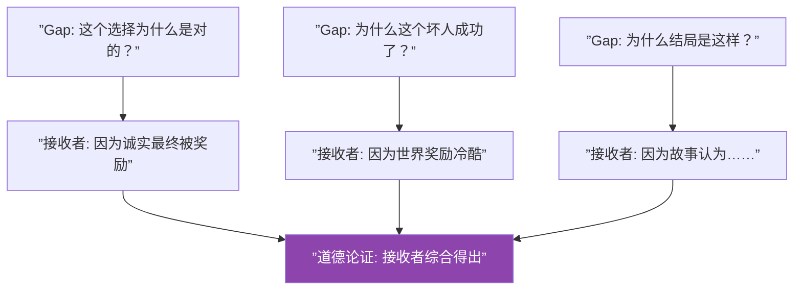
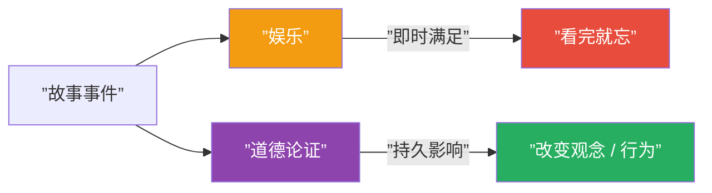

# 第29课：道德论证

## 核心命题

**每一个故事都在做一项道德主张——"人应该如何生活？"或"这个世界是怎样的？"**

这个道德主张（Moral Argument）不一定要大声陈述出来。它通过知识 gaps 的结构和接收者的填补过程自然地浮现。接收者不是在"被告知"一个道德——而是在故事体验中**发现**了它。

## 三种基本的道德位置

故事的 moral argument 可以归入三种基本立场：

### 立场一：世界回报美德

**主张**：善良、诚实、勇敢最终会得到回报。

- 这是大多数商业故事和传统叙事的基本立场
- 例子：《复仇者联盟》——英雄们的牺牲最终保护了地球
- 优势：令人满意、鼓舞人心
- 风险：如果处理得不好，会显得天真或说教

> [!note]
> 世界回报美德不意味着主角不会受苦难。恰恰相反——主角必须经历苦难和选择，最终因为坚持了美德而获得回报。关键在于：**苦难不是对美德的惩罚，而是对美德的检验。**

### 立场二：世界无动于衷

**主张**：宇宙不在乎你的道德选择。好事发生在好人和坏人身上，坏事也一样。

- 这是自然主义和现实主义文学的基本立场
- 例子：许多村上春树的作品——角色做出道德选择，但世界并不因此奖赏或惩罚他们
- 优势：真实感强，不掩饰世界的复杂性
- 风险：可能让读者感到空虚或失去动力

> [!question]
> 立场二不等于"没有道德"。即使世界是无动于衷的，角色仍然可以做出道德选择——而且这些选择在角色自己的生命中有意义。只是宇宙不会因为角色的选择而改变因果。

### 立场三：世界奖励邪恶

**主张**：在这个世界里，善良是软弱，邪恶是力量。

- 这是悲剧、黑色电影和讽刺作品的常见立场
- 例子：某些黑色电影中，好人总是输，坏人总是赢
- 优势：强大的冲击力，批判现实的力量
- 风险：容易滑向虚无主义，让观众感到沮丧

> [!warning]
> 立场三最难写好。如果故事只是"好人输了，坏人赢了"，观众会觉得被操控。最好的立场三故事会揭示"为什么"世界奖励邪恶——通常是社会机制或人性的黑暗面。

## 道德论证不需要被陈述

道德论证最强大的形式是**隐含的**：

- 不要让角色说"善良是很重要的"
- 而是展示角色做出善良的选择，并展示其后果
- 让接收者在填补 gaps 的过程中自己得出"善良很重要"的结论

## 道德论证如何从知识 gaps 中浮现

接收者在填补知识 gaps 的过程中，会不断问自己：

- "这个角色做得对吗？"
- "如果是我，我会怎么做？"
- "故事的结局告诉我什么？"

这些问题的答案累积成故事的道德论证：

> [!tip]
> 如果你想测试你故事的道德论证是否清晰，可以这样做：找一个没有听过你故事的人，讲完故事后问他："你觉得这个故事是在说人应该怎么生活？"如果他的回答接近你想要的道德论证，说明你的知识 gaps 设计是成功的。

## 文化背景与道德论证

不同的文化可能对同一个故事产生不同的道德解读：

| 文化背景 | 可能读出的道德论证 |
|---------|-------------------|
| 个人主义文化 | 个人奋斗最终获得成功 |
| 集体主义文化 | 个人牺牲为集体谋福利 |
| 宗教文化 | 神意/命运的安排不可抗拒 |
| 世俗文化 | 人的选择和行动决定命运 |

> [!note]
> 作者无法完全控制道德论证的文化解读。但作者可以通过精确设计 gaps 来**引导**大多数目标受众走向预期的道德论证方向。

## 道德论证与故事的不可翻译

Moral argument 是故事"为什么值得讲"的根本原因。没有道德论证的故事只是一个娱乐品，可能有趣但不会在接收者的心中留下持久的印记。

## 【自我检测】

点击展开

**问题 1**：故事的 moral argument 和"主题"有什么区别？

> 主题是故事探讨的领域（如"爱"、"权力"、"自由"），而 moral argument 是故事在这个领域中所采取的立场（如"爱需要牺牲"、"权力导致腐败"、"自由比安全更重要"）。主题是"关于什么"，moral argument 是"说了什么"。

**问题 2**：如何确保道德论证是"被发现"而不是"被告知"的？

> (1) 不要让角色直接说出道德主张；(2) 通过角色选择、事件结果和知识 gaps 的结构来暗示道德立场；(3) 给接收者足够的空间去自己得出结论；(4) 可以设置"测试"场景——角色面临道德两难时，让接收者自己思考"我会怎么做"。

**问题 3**：如果我的故事有多个可能的道德解读，这是好还是坏？

> 这取决于你的意图。如果你希望所有接收者得到大致相同的道德教训，那么 gaps 需要更精确的控制。如果你旨在传达复杂性（如"道德没有简单的答案"），那么多重解读是自然且可取的。关键在于：**你作为作者必须知道你在做什么。**

---

## 回顾清单

- [ ] 我识别了我故事中的道德立场（世界回报美德 / 无动于衷 / 奖励邪恶）
- [ ] 我的道德论证是"发现"的，而不是"被告知"的
- [ ] 知识 gaps 的设计指向了预期的道德论证方向
- [ ] 我考虑了目标受众的文化背景对道德解读的影响
- [ ] 故事中的道德两难场景足够有力量

---

**下一步：[第30课：识别与文化典故](/lessons/0030-recognition-allusion.md)**