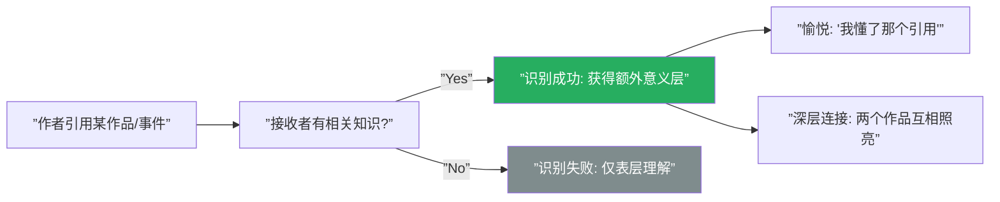
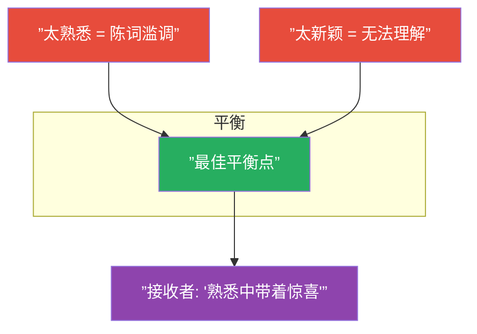
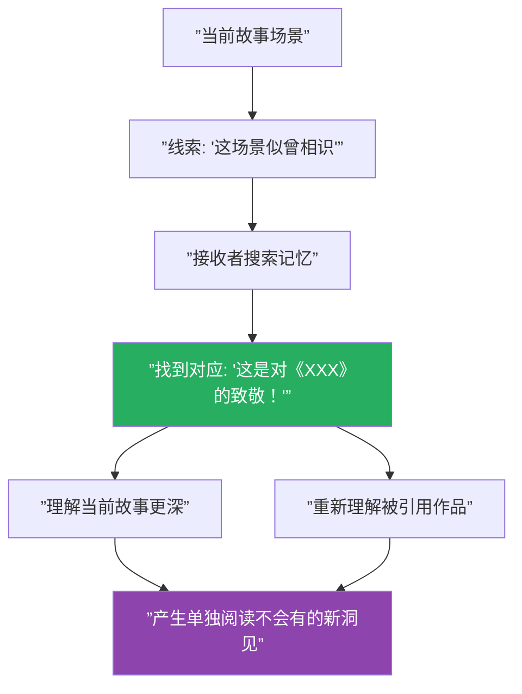

# 第30课：识别与文化典故

## 核心命题

**当接收者在故事中"认出了"某个熟悉的模式、引用或原型时，他们填补了一个连接"这个故事"和"我已有的文化知识"的知识 gap。这种识别带来独特的愉悦和深度。**

这就是 Recognition（识别）和 Cultural Allusion（文化典故）的力量——它们将当前故事置入一个更大的文化网络中，让接收者感受到"我理解并属于这个传统"。

## 三种识别类型

### 1. 原型模式识别（Archetypal Pattern Recognition）

接收者识别出深层的故事结构——这些结构跨越文化和时代，具有普遍性。

| 原型 | 描述 | 例子 |
|------|------|------|
| 英雄旅程 | 普通人被召唤冒险 | 《星球大战》《哈利波特》 |
| 救赎弧线 | 堕落者获得救赎 | 《圣诞颂歌》 |
| 复仇故事 | 受伤害者寻求报复 | 《基督山伯爵》 |
| 成长故事 | 天真者经历成长 | 《杀死一只知更鸟》 |

> [!note]
> 原型模式识别的核心愉悦来自于：接收者在内心深处已经"知道"这个故事的走向，但他们想看的不是"**是否**"会发生，而是"**如何**"发生。这种"预期中的确认"本身就是一种深层满足。

### 2. 文化典故（Cultural Allusion）

作者有意引用其他作品、历史事件或文化符号。

触发条件：接收者必须拥有相关的文化知识。

典故的效果取决于接收者是否"接住了"它：

- **成功识别**：接收者获得"我属于知道这个的文化圈"的归属感
- **失败识别**：接收者只理解表层意思，不会损失故事情感体验——但失去了深层连接

> [!tip]
> 设计典故时，要确保：**如果接收者错过了这个典故，故事在表层仍然是完整的、享受的。** 典故是锦上添花，而不是必要条件。

### 3. 体裁惯例（Genre Convention）

接收者通过经验积累了对特定体裁的期待模式。

| 体裁 | 惯例期待 |
|------|---------|
| 悬疑 | 凶手在最后被揭示 |
| 浪漫喜剧 | 情侣最终在一起 |
| 恐怖片 | 有人会做愚蠢的决定 |
| 西部片 | 决斗在正午 |

> [!question]
> 体裁惯例的识别是最微妙的一种。太符合惯例 = 陈词滥调（cliche）；太偏离惯例 = 让观众困惑。最成功的作品在"遵循惯例"和"颠覆惯例"之间找到了平衡点。

## 熟悉与新颖的平衡

这是故事设计中最微妙的艺术之一：

| 程度 | 效果 | 风险 |
|------|------|------|
| 100% 熟悉 | 陈词滥调，无聊 | 接收者觉得"老套" |
| 70% 熟悉 + 30% 新颖 | 最佳状态 | "经典但又有新意" |
| 50% 熟悉 + 50% 新颖 | 可接受，但有风险 | 部分观众跟不上 |
| 100% 新颖 | 难以理解 | 接收者无法找到锚点 |

## Allusion 的内在机制

Allusion 作为一种精炼的知识 gap：

1. **作者埋下线索**：一个名字、一个场景、一句台词，与某部已知作品相似
2. **接收者检测线索**："这听起来好像……"
3. **接收者填补连接**：将当前故事与被引作品建立联系
4. **产生额外意义**：两个作品互相阐发，产生单独看任何一个都不会有的意义

## "被包括在内"的心理满足

Allusion 识别带来的最重要心理效应是**归属感**：

> "我懂了。我属于能理解这个的群体。"

这不是一种排外的精英主义——而是人类最基本的社群认同需求之一。当接收者识别出一个巧妙隐含的典故时，他们感觉自己**参与了**一个文化对话。

> [!note]
> 这种"内部人"感受是所有知识 gap 填补中最令人满足的形式之一。它不仅是智力上的"我懂了"，更是情感上的"我属于这里"。

## 如何设计 Recognition 和 Allusion

1. **了解你的受众**：他们拥有什么文化知识储备？太冷门的典故会被错过，太热门的典故会显得廉价。
2. **从故事需求出发**：典故应该服务于故事，而不是展示作者的博学。问：这个典故的存在，使得故事的 storification 更深了吗？
3. **多重层次**：为不同知识水平的受众提供不同层次的识别点。老读者发现深层典故，新读者享受表层故事。
4. **不要解释**：一旦你解释典故（"正如莎士比亚在《哈姆雷特》中写道……"），它就失去了知识 gap 的性质。让接收者自己去发现。

> [!warning]
> 过度使用典故的风险：(1) 故事变得像"致敬合集"而不是独立作品；(2) 没有相关文化知识的受众感到被排斥；(3) 典故取代了原创性——作者的创意被引用取代。好的典故是**点缀**，不是**主体**。

## 【自我检测】

点击展开

**问题 1**：Recognition 和 Allusion 的核心区别是什么？

> Recognition 更广泛——指接收者识别出任何熟悉的模式（原型、体裁惯例、叙事结构等）。Allusion 更具体——是作者有意引用特定作品、历史事件或文化符号。Recognition 可以是无意的自然发生（"这个故事很像英雄旅程"），而 allusion 是故意的设计（"这个角色叫 Gatsby"）。

**问题 2**：为什么"太新颖"和"太熟悉"都是问题？

> 太新颖意味着接收者没有可用于填补 gap 的已有知识，gap 太大无法解码。太熟悉则意味着 gap 太小，接收者不需要思考就能预期到一切，失去了填补的愉悦。最佳状态是在熟悉的结构中提供新颖的处理——"意料之外，情理之中"。

**问题 3**：如何确保不熟悉典故的读者不会受到惩罚？

> 确保故事在表层是完全自洽和令人满意的。典故是额外的奖励层，而不是意义的核心载体。检验方法：找一个不熟悉目标文化背景的人来读故事，观察他是否仍然能获得完整的故事体验。

---

## 回顾清单

- [ ] 我识别了故事中的原型模式并确保它们被有效使用
- [ ] 我的文化典故是服务于故事的，而非自我展示
- [ ] 不熟悉典故的读者仍然可以获得完整的故事体验
- [ ] 我在"熟悉"和"新颖"之间找到了适当的平衡
- [ ] 我设计的识别点能带给接收者"被包括在内"的满足感

---

**下一步：Module 5 完结。继续前往 [Module 6 课程](/lessons/)**