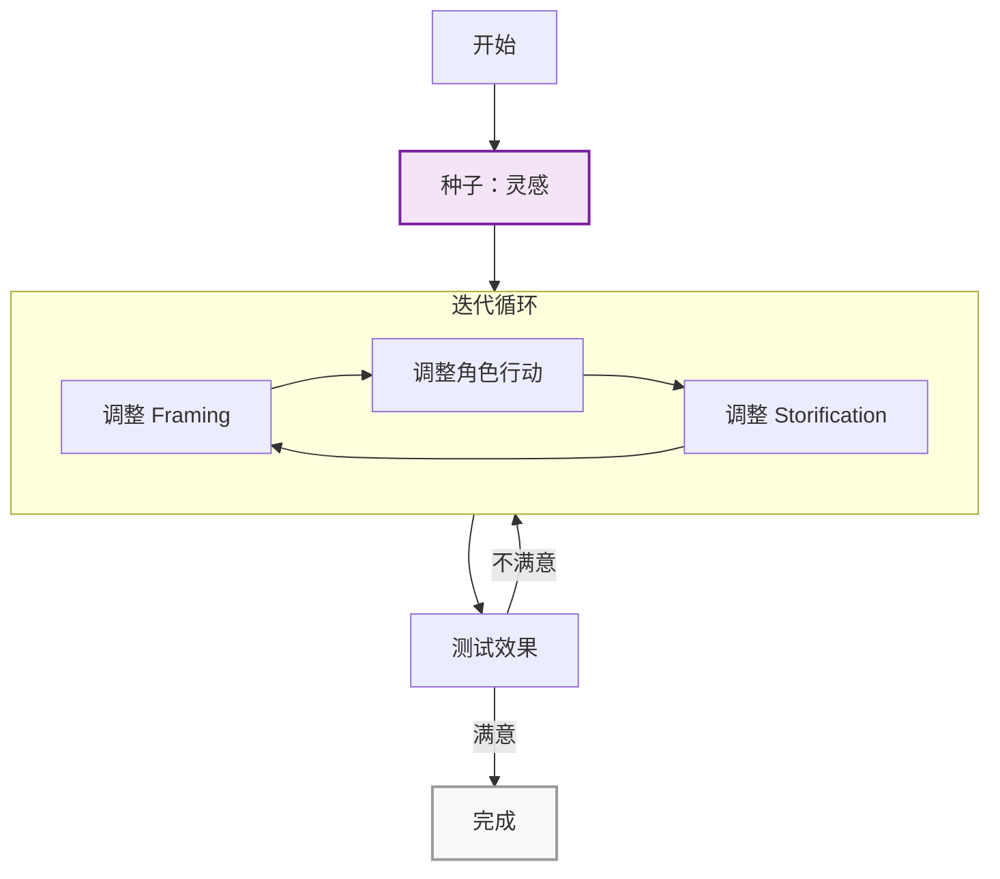

# 第31课：故事开发流程概览

## 一个常见的误解

大多数人对故事开发的想象是这样的：你有一个灵感，然后写大纲，然后写初稿，然后修改，然后完成。像盖房子——一块砖一块砖地往上垒。

**这是错的。**


> 标题：线性流程（错误理解）
> 这是大多数人对故事开发的想象，但它与真实创作经验完全不符。

故事开发不是串行过程（serial process）。你不能把故事像乐高积木一样一块块拼起来，然后期望它自动运转。

## 故事是引擎，不是建筑

一个故事是一个**引擎（engine）**——由多个相互咬合的齿轮（cogs）组成。

```mermaid
graph TB
    subgraph ”故事引擎 The Story Engine”
        F[Framing Cog<br/>作者的角色定位<br/>基于灵感] --> CA[Character Action Cog<br/>角色的行动]
        CA --> S[Storification Cog<br/>接收者心中的意义]
        S -.->|反馈回路| F
        S -.->|反馈回路| CA
    end
    style F fill:#e1f5fe,stroke:#0288d1,stroke-width:2px
    style CA fill:#fff3e0,stroke:#f57c00,stroke-width:2px
    style S fill:#e8f5e9,stroke:#388e3c,stroke-width:2px
```

> 标题：故事引擎的三齿轮模型

### 三大齿轮

**齿轮一：Framing Cog（框架齿轮）**

这是作者的角色定位。你选择以什么身份讲述这个故事？你站在什么位置？你的态度是什么？这一切都基于你的**灵感（inspiration）**——你最初被打动的那个瞬间。

Framing 决定了：
- 谁是 narrator
- 故事的 tone 和 mood
- 什么被呈现、什么被隐藏
- 作者与素材之间的距离

**齿轮二：Character Action Cog（角色行动齿轮）**

角色在故事中做了什么。不是他们想了什么、感受了什么——而是他们**实际上做了什么**。行动是故事的骨骼。

Character Action 决定了：
- 情节的推进
- 冲突的产生与升级
- 角色的转变轨迹
- 观众的代入感

**齿轮三：Storification Cog（故事化齿轮）**

意义在接收者（读者/观众/听众）心中是如何形成的。同一个事件，在不同的人心中产生不同的意义。这个齿轮负责确保你的故事在接收者心中产生你期望的**意义（meaning）**。

Storification 决定了：
- 故事最终传达的信息
- 观众的 emotional takeaway
- 故事的生命力和影响力

> **关键洞察：任何一个齿轮的变化都会影响其他两个齿轮。**
>
> 如果你改变了角色行动（比如让角色做了一个不同的选择），Framing 可能需要调整（作者的态度变化），Storification 也会改变（观众感受到不同的意义）。反之亦然。

## 非线性开发的含义

因为三个齿轮相互影响，故事开发必然是一个**非线性（non-linear）的迭代过程**。



> 标题：非线性迭代开发流程

这个模型意味着：
- 你不需要一次就把所有东西做对
- 你需要在三个齿轮之间反复穿梭
- 每次修改都是一个"牵一发而动全身"的操作

## Heart + Head 双阶段策略

如果三个齿轮相互影响，从哪里开始？

答案是：**从 Heart 开始，用 Head 收尾。**

```mermaid
graph TB
    subgraph ”阶段一：Heart（用心）”
        H1[自由创作] --> H2[追随直觉]
        H2 --> H3[不设限制]
    end
    subgraph ”阶段二：Head（用脑）”
        H3 --> HD1[分析结构]
        HD1 --> HD2[打磨齿轮]
        HD2 --> HD3[榨取最大力量]
    end
    style H1 fill:#fce4ec,stroke:#c62828,stroke-width:2px
    style H2 fill:#fce4ec,stroke:#c62828,stroke-width:2px
    style H3 fill:#fce4ec,stroke:#c62828,stroke-width:2px
    style HD1 fill:#e8eaf6,stroke:#283593,stroke-width:2px
    style HD2 fill:#e8eaf6,stroke:#283593,stroke-width:2px
    style HD3 fill:#e8eaf6,stroke:#283593,stroke-width:2px
```

> 标题：Heart + Head 双阶段策略

### 阶段一：Heart——让心自由奔跑

- 让你的 emotional impulse 引导你
- 不要分析，不要评判，不要过滤
- 写那些让你兴奋、让你流泪、让你愤怒的东西
- 把"它该不该在这里"的疑问推迟到第二阶段

> [!tip] Heart 阶段的纪律
> 这个阶段的唯一纪律就是：**没有纪律**。你越是放纵自己，越是追随 rabbit holes，你的故事就越有可能拥有真正的生命力。

### 阶段二：Head——用脑榨取最大力量

- 等 Heart 阶段产生了足够的原材料，再切换到 Head 模式
- 分析结构：三个齿轮如何配合？
- 从可用素材中"squeeze maximum power"
- 删减、强化、重组

> [!note] Heart 优先，Head 随后
> 如果你在 Heart 阶段就开始用 Head 分析，你的故事会变得机械和死板。如果你一直只用 Heart 而不切换到 Head，你的故事会散乱无力。顺序很重要：先让 Heart 说够，再让 Head 来整理。

## 本模块的目标

Module 6 的每一课都在教你如何在三个齿轮之间工作：

| 课程 | Heart/Head | 对应齿轮 |
|------|-----------|---------|
| 第31课：流程概览 | 两者 | 整体框架 |
| 第32课：种子生长 | Heart | Framing + Character Action |
| 第33课：步骤大纲 | Head | 全部三个齿轮 |
| 第34课：Bella 案例研究 | 两者 | Framing + Character Action + Storification |

**本模块的根本问题**：在你的故事投注大量时间写出完整手稿之前，如何先找到它真正的力量所在（where the power lies）？

---

## 回顾清单

- [ ] 我理解故事是引擎而非建筑——三个齿轮相互影响
- [ ] 我能够识别 Framing Cog、Character Action Cog、Storification Cog 各自的作用
- [ ] 我理解任何一个齿轮的变化都会影响其他两个
- [ ] 我已经记住 Heart + Head 双阶段策略及其正确顺序
- [ ] 我知道 Module 6 的目标是在投入完整手稿之前找到故事的力量

## 下一步

[第32课：种子生长——从灵感到前提](/lessons/0032-seed-grows.md)