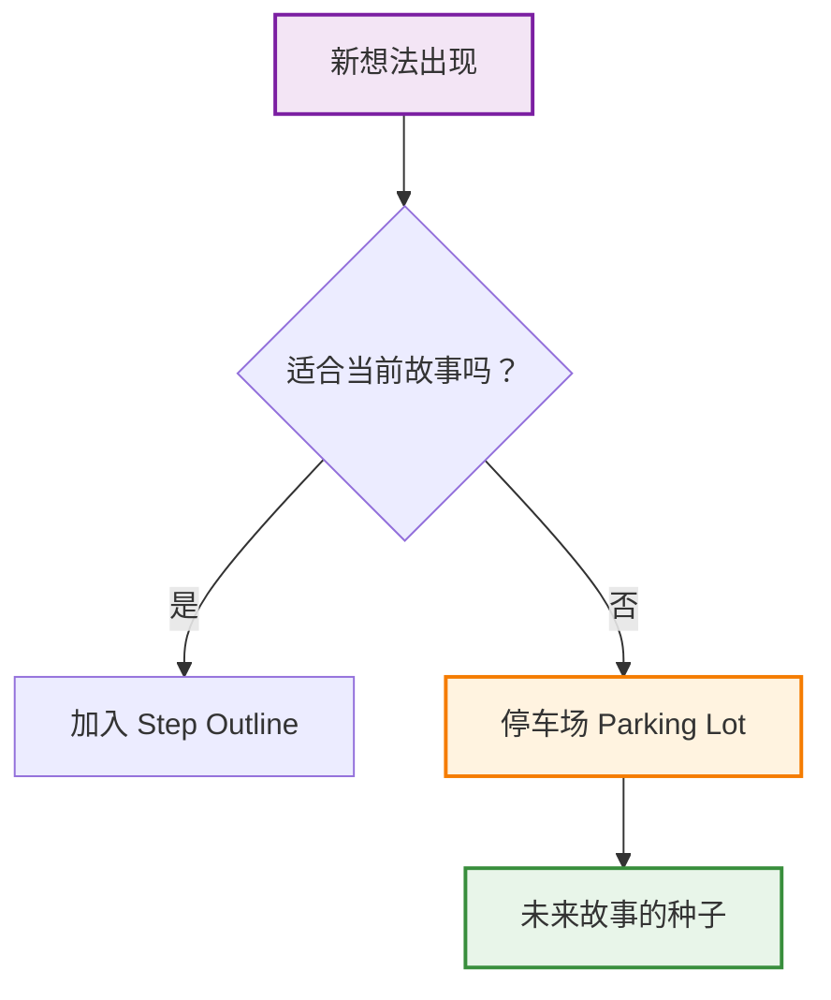

# 第33课：步骤大纲

一旦你有了前提（premise），下一步是什么？直接开始写剧本或小说吗？

**不。** 至少，不应该。

你需要一个工具——一个让你能在不投入大量时间的情况下测试、调整、重构故事的沙盒。这个工具就是 **Step Outline（步骤大纲）**。

## 什么是 Step Outline？

Step Outline 是一份高层次的场景级笔记（scene-by-scene notes），每一"步"（step）用一个或几个句子描述场景中**发生了什么**——但不包含细节。

```mermaid
graph TB
    subgraph ”Step Outline 的结构”
        S1[Step 1: 角色 X 做了 Y] --> S2[Step 2: 因为 Y 导致 Z]
        S2 --> S3[Step 3: 角色 X 发现...]
        S3 --> S4[...]
        S4 --> SN[Step N: 最终结果]
    end
    style S1 fill:#e1f5fe,stroke:#0288d1,stroke-width:2px
    style S2 fill:#e1f5fe,stroke:#0288d1,stroke-width:2px
    style S3 fill:#e1f5fe,stroke:#0288d1,stroke-width:2px
    style S4 fill:#e1f5fe,stroke:#0288d1,stroke-width:2px
    style SN fill:#e1f5fe,stroke:#0288d1,stroke-width:2px
```

> 标题：Step Outline 的基本形式——每个 Step 是一句高层描述

### Step Outline 的核心规则

**规则一：每个 step 不超过 2-3 句话**

如果某个 step 需要你写一段话才能说清楚——说明你还不够高层。再退一步，抓住本质。

> 好的 step: "Sarah 进入空房子，发现地上有一张照片。"
> 不好的 step: "Sarah 推开吱呀作响的木门，阳光从破洞的窗帘缝隙洒进来，照在地板上的灰尘上，她低头看到一张泛黄的照片，上面是一个 smiling 的小女孩，大约七岁，笑容很灿烂..."

第二个版本的问题是：你已经写了具体的细节——阳光、灰尘、吱呀作响的门。这些细节现在绑住了你。当你需要改变场景时，你会舍不得它们。

**规则二：不要写对话或具体措辞**

对话是最危险的东西——它最迷人，也最难割舍。在 Step Outline 阶段，坚决不写对话。你只需要知道"这场戏里角色 A 告诉角色 B 某件事"。具体怎么说——留到以后。

**规则三：Step 的顺序是可变的**

把你的 steps 想象成卡片。你可以在桌面上随意排列它们。如果 Step 5 放在 Step 2 前面效果更好——移动它。这就是 Step Outline 的真正力量：**灵活性（flexibility）**。

## 为什么要保持高层？

### "Kill Your Babies" 的陷阱

每个创作者都体会过这种感觉：你写了一段你认为很美的对话、一个精妙的场景描述、一个巧妙的转折——你很爱它。但当整个故事需要调整时，你发现这个"宝贝"必须被删掉。

问题不在于你的"宝贝"不好——而在于你太早产生了依恋。**Step Outline 的核心理念就是：在你确定故事结构之前，不要创造让你舍不得删除的东西。**

```mermaid
flowchart LR
    subgraph ”过早投入细节”
        A[写美丽的对话] --> B[爱上它]
        B --> C[需要调整结构]
        C --> D[舍不得删 → 结构妥协]
        D --> E[故事变弱]
    end
    subgraph ”使用 Step Outline”
        F[高层场景笔记] --> G[灵活调整结构]
        G --> H[结构确定]
        H --> I[再写细节]
        I --> J[故事强大]
    end
    style A fill:#fce4ec,stroke:#c62828,stroke-width:2px
    style D fill:#fce4ec,stroke:#c62828,stroke-width:2px
    style E fill:#fce4ec,stroke:#c62828,stroke-width:2px
    style F fill:#e8f5e9,stroke:#388e3c,stroke-width:2px
    style J fill:#e8f5e9,stroke:#388e3c,stroke-width:2px
```

> 标题：过早投入细节 vs. 使用 Step Outline

> [!warning] "Kill Your Babies"
> 威廉·福克纳的名言："在写作中，你必须杀死你的宝贝（kill your babies）。" Step Outline 的策略是：在你确定它们真的是"宝贝"之前，不要生下它们。这样你就不需要杀死什么了。

## 用 Step Outline 追踪什么

### 五项追踪指标

当你在 Step Outline 中排列场景时，时刻用以下五个维度审视每一步：

| 追踪维度 | 要问的问题 |
|---------|-----------|
| **Character Journey（角色旅程）** | 这一步中角色的内在状态有何变化？从恐惧到勇敢？从无知到了解？ |
| **Knowledge Gaps（知识缺口）** | 这一步中，观众知道什么？角色知道什么？两者之间的差距是什么？ |
| **Conflict Escalation（冲突升级）** | 这一步比上一步的冲突更强还是更弱？冲突是升级还是降温？ |
| **Turning Points（转折点）** | 这一步是否改变了故事的方向？如果没有，它是否必要？ |
| **Storification（故事化）** | 这一步在接收者心中产生了什么意义？它如何贡献于你的 premise？ |

### 一个例子

假设你正在写一个关于"原谅"的故事，前提是"真正的原谅不是忘记，而是学会带着伤痛继续生活"。

| Step | 内容 | 角色旅程 | 知识缺口 | 冲突 | 转折点 | 故事化 |
|-----|------|---------|---------|------|-------|-------|
| 1 | 主角发现伴侣背叛 | 信任→怀疑 | 观众不知道背叛的起因 | 设定基线冲突 | 是：打破平衡 | 信任的脆弱性 |
| 2 | 主角质问伴侣 | 怀疑→愤怒 | 伴侣隐瞒部分真相 | 升级 | 否（exploration） | 愤怒如何阻碍理解 |
| 3 | 主角独自回忆 | 愤怒→悲伤 | 观众了解过去的细节 | 内化（降温） | 是：视角转换 | 原谅需要面对伤痛 |

> [!question] 如果一步没有助益任何追踪指标，应该怎么办？
> 删除它。或者重新设计它，让它至少在至少一个维度上发挥作用。如果一个场景既不推进角色旅程、不创造知识缺口、不升级冲突、不是转折点、也不贡献于故事化——它在你的故事里没有位置。

## Step Outline 作为 Sandbox

Step Outline 的真正价值在于它是一个**沙盒（sandbox）**——你可以在这里安全地测试破坏性想法。

**想试试把结局倒过来？** 在 Outline 里调整最后五个 step，看看有没有道理。不需要重写 50 页。

**想加入一个新角色？** 添加几个步骤，看看现有的步骤需要怎么调整。不需要重新 casting。

**觉得中间部分太拖沓？** 删除步骤 12-18，看看故事是否仍然成立。

> [!tip] 测试三种不同的版本
> 当我对一个故事的结构不够确信时，我会用 Step Outline 做出三个完全不同的版本。一个版本主角是积极的行动者，一个版本主角是被动的观察者，一个版本是两者的混合。然后在 outline 层面比较哪个最有力量。这只需要周末的一个下午——而不是三个月的写作时间。

## 处理你爱但用不上的想法

创作过程中，你一定会产生一些你很爱、但它不符合当前故事的想法。

**不要扔掉它们。**

建立一个"停车场（parking lot）"——一个专门存放这些想法的文件。把它们记录下来，标注上它们可能适合的故事类型。它们不是你当前故事的"错误"，而是你下一个故事的"种子"。



> 标题：创意停车场——当前不用的想法是未来故事的种子

---

## 回顾清单

- [ ] 我已为故事创建 Step Outline，每个 step 不超过 2-3 句话
- [ ] 我没有在 Outline 中写入对话或具体措辞
- [ ] 我检查了每个 step——如果我必须删除它，我会舍不得吗？如果会，说明我过早投入了细节
- [ ] 我使用五项追踪指标审视了每个 step
- [ ] 我测试了至少一个"破坏性"想法（比如移动或删除某个 step）
- [ ] 我建立了一个"停车场"，存放当前不适用但值得保留的想法

## 下一步

[第34课：Bella 案例研究](/lessons/0034-bella-case-study.md)