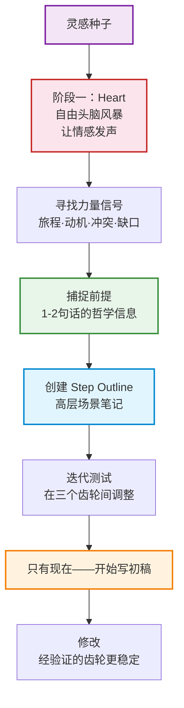

# 第34课：Bella 案例研究

这是 Module 6 的最后一课。我们将通过一个完整的案例——David 的短片 **Bella**——来看故事开发流程如何在实际创作中运作。

> [!note] 观看建议
> 如果你还没有看过 Bella，建议先观看短片再读本课。本课的分析假定你已经熟悉故事内容。

## 灵感种子：从葬礼开始

每一部作品都始于一个被触动（touched）的瞬间。Bella 的种子在 David 母亲的葬礼上种下。

**情境：** David 刚刚经历了母亲的葬礼。这不是他第一次面对死亡，但这次不同——是他的母亲。他感到一种深刻的不确定性：葬礼之后，生活怎么继续？悲伤应该如何被安放？那个"正常的世界"还能回来吗？

**最初的冲动：** 在葬礼上，David 注意到人们从最初的沉默和哭泣，逐渐开始分享关于母亲的故事——笑着讲、哭着讲、又笑又哭着讲。他发现这个过程有一种奇妙的转化力：**通过分享和仪式（ritual），悲伤被转化成了对生命的庆祝。**

David 没有决定"我要写一个关于悲伤的故事"。他只是记住了这个瞬间。他感觉到了什么——一个模糊的 knowledge gap 的雏形，一种 emotional truth 的震颤。

> 灵感不是一个预先包装好的"故事概念"。灵感是一种感觉——你感觉到这里有东西，但你还不确定它是什么。Bella 的种子就是这种感觉。

## 从感觉到故事

### 第一步：找到角色

灵感本身不是故事。故事需要一个角色来承载它。

David 花了很长时间寻找正确的角色。谁的故事最能承载"通过仪式转化悲伤"这个感觉？

最终他找到了：**一个正在经历 grief 的女人。**

为什么是女人？这不是一个理性分析的结果。从统计角度，任何性别都可以。但 David 的 Heart 告诉他：这个故事是关于一个女性。所以他听从了 Heart。

> [!question] 为什么不是男性主角？
> 这不是一个政治正确的选择。David 无法解释为什么"感觉对"，但他的创作经验告诉他：当 Heart 说"就是这个人"，不要问为什么。有时候，创作的理由在创作完成之后才会显现。

### 第二步：找到 Knowledge Gap

故事的核心引擎是 knowledge gap。David 问自己："观众在什么时候最投入？当他们在问问题的时候。那么，我希望观众问什么问题？"

答案是：**"这个女人到底在做什么？"**

于是 David 做了一个关键决定——**隐藏角色行动的真实目的（Hide the true purpose of her actions）。**

| 观众看到什么 | 观众不知道什么 |
|-------------|--------------|
| 她买了一盒火柴 | 为什么需要火柴？ |
| 她买了一卷绳子 | 绳子用来做什么？ |
| 她买了一把铲子 | 她要挖什么？ |
| 她在花园里挖洞 | 洞是用来做什么的？ |
| 她给她的狗 Bella 戴上了一个项圈 | --- |

> [!warning] 隐藏 vs. 欺骗
> 隐藏（hiding）和欺骗（deceiving）有本质区别。你隐藏的是角色的最终目的，但你必须展示角色**实际在做什么**。观众看到她在挖洞——那是真实的。只是观众不知道洞的用途。如果她假装挖洞但其实没挖，那是欺骗。前者是故事，后者是谎言。

每一个被展示的行动都创造一个问题，每一个问题都驱动观众继续看下去。这就是 knowledge gap 的力量。

### 第三步：设计 Revelations

Knowledge gap 需要有一个 pay-off——那个"原来如此"的瞬间。

David 在 Bella 中设计了多层次的 revelation：

1. **表层 revelation：** 她在为一个仪式做准备——是一个葬礼吗？谁的葬礼？
2. **中层 revelation：** 她是在为自己死去的狗 Bella 举办一个仪式——她要纪念它
3. **深层 revelation：** 这个仪式不是关于死亡，而是关于**庆祝生命（celebration of life）**

```mermaid
graph TB
    subgraph ”观众的发现之旅”
        L1[表层：她在准备一个仪式] --> L2[中层：为死去的小狗 Bella 举办告别]
        L2 --> L3[深层：这不是哀悼——是庆祝生命]
    end
    subgraph ”对应的 Knowledge Gaps”
        G1[她在做什么？→ 火柴、绳子、铲子的用途]
        G2[谁的葬礼？→ Bella 是谁？]
        G3[为什么这些行动看起来不像悲伤？→ 她真的 OK 吗？]
    end
    L1 -.-> G1
    L2 -.-> G2
    L3 -.-> G3
    style L1 fill:#e1f5fe,stroke:#0288d1,stroke-width:2px
    style L2 fill:#fff3e0,stroke:#f57c00,stroke-width:2px
    style L3 fill:#e8f5e9,stroke:#388e3c,stroke-width:2px
    style G1 fill:#e1f5fe,stroke:#0288d1,stroke-width:1px,stroke-dasharray: 5 5
    style G2 fill:#fff3e0,stroke:#f57c00,stroke-width:1px,stroke-dasharray: 5 5
    style G3 fill:#e8f5e9,stroke:#388e3c,stroke-width:1px,stroke-dasharray: 5 5
```

> 标题：Bella 的多层次发现之旅

每一层 revelation 都让观众重新理解之前所看到的一切。"原来她买火柴不是为了烧东西——是为了点蜡烛。"

### 第四步：找到 Storification

当所有行动被呈现、所有 gaps 被填补之后，观众在脑中完成了故事的"拼图"。他们产生的意义——那是 **storification**。

David 希望观众带走的信息是什么？

> **"适当的哀悼是治愈的必要条件。"**

这个信息不是被"说"出来的。没有任何角色站在镜头前说"You need to grieve properly to heal."。相反，它是通过以下方式被"感受"到的：

- 女人的行动中透出的爱与悲伤
- 她的 ritual 的细致和用心
- 小狗 Bella 的名字被温柔地说出
- 最后的平静与释然

> [!tip] "Show, don't tell" 的真正含义
> "Show, don't tell" 不是关于视觉 vs. 语言。它是关于让观众通过自己的推理和情感体验来获得结论，而不是被直接告知结论。Storification 发生在大脑里，不是发生在屏幕上。

### 第五步：找到 Moral Argument

Bella 的 moral argument 是什么？

> **"当死亡进入你的生活时，接受它已经发生，并允许自己去哀悼。"**

这是一个可以被辩论的立场。不是所有人都同意——有些人认为"向前看"才是最好的方式，有些人认为沉浸在悲伤中是有害的。正因为它是可辩论的，它才有力量。

```mermaid
graph TB
    subgraph ”三大齿轮协同工作”
        F[Framing<br/>作者选择：隐藏真实的<br/>仪式目的，从外部观察]
        CA[Character Action<br/>女人买火柴、绳子、铲子<br/>在花园挖洞、点火]
        S[Storification<br/>观众推理出：这是<br/>对生命的庆祝]

        F --> CA
        CA --> S
        S -.->|Audience 的 emotional takeaway<br/>适当的哀悼是治愈的必要条件| F
    end
    style F fill:#e1f5fe,stroke:#0288d1,stroke-width:2px
    style CA fill:#fff3e0,stroke:#f57c00,stroke-width:2px
    style S fill:#e8f5e9,stroke:#388e3c,stroke-width:2px
```

> 标题：Bella 的三齿轮协同

## Module 6 总结：故事开发流程回顾



> 标题：Module 6 完整开发流程

如果想回顾整个模块的核心概念，从头开始：

1. **第31课：** 故事是引擎，三大齿轮相互影响。Heart + Head 双阶段。
2. **第32课：** 从灵感→素材→力量信号→前提的三步流程。
3. **第33课：** Step Outline 作为沙盒——保持高层、灵活调整。
4. **第34课（本课）：** Bella 案例——框架齿轮 + 行动齿轮 + 故事化齿轮协同。

---

## 回顾清单

- [ ] 我理解了 Bella 从葬礼灵感到完成短片的完整开发路径
- [ ] 我看到了 Knowledge Gap 如何被有意设计：隐藏真实目的，展示真实行动
- [ ] 我理解了多层次 Revelation 的结构
- [ ] 我理解了 Bella 的 Storification（适当的哀悼是治愈的必要条件）如何被"感受"到而非"告知"
- [ ] 我看到了 Framing、Character Action、Storification 三个齿轮如何协同
- [ ] 我理解了 Moral Argument 需要是可辩论的才会有力量
- [ ] 我已经准备好将 Module 6 的流程应用于自己的故事开发

## 下一步

[返回 Module 6 首页](/lessons/)