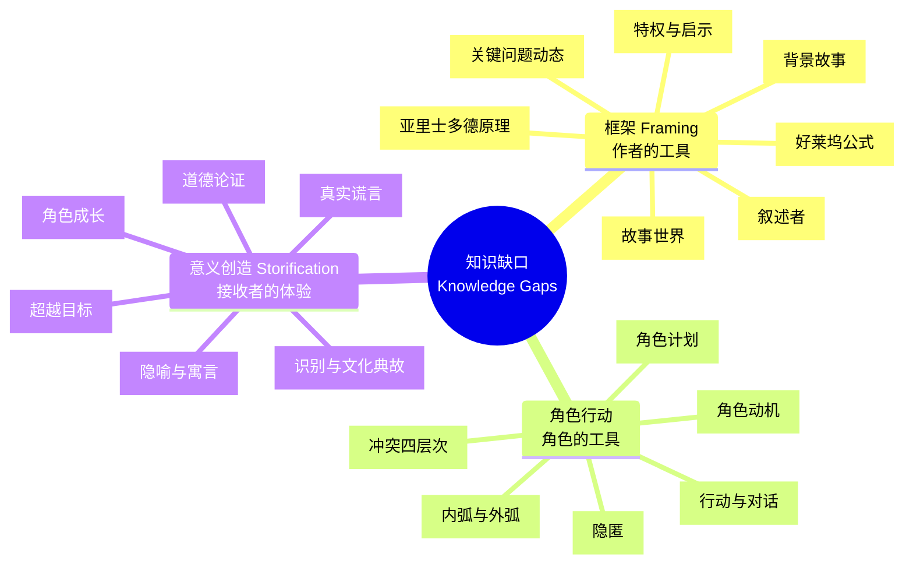
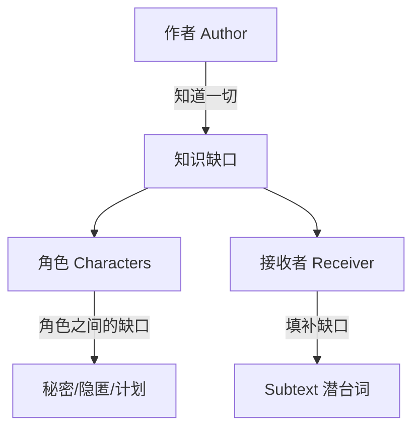

# 知识缺口速查表

## 三级分类



## 核心公式

```
信息 + 知识缺口 → 接收者填补 → Subtext → Storification → 意义
```

**渔网比喻**：信息是绳，知识缺口是洞。没有洞的渔网捕不到鱼。

**六词小说**："For sale: baby shoes, never worn."——6个词的信息，无数种填补，一个悲剧故事。

## 缺口方向速查

| 类型 | 观众 vs 角色的知识 | 效果 | 适用场景 |
|------|-------------------|------|---------|
| 特权 Privilege | 观众知道更多 | 紧张、悬疑 | 恐怖片、悬疑片 |
| 启示 Revelation | 观众知道更少 | 神秘、惊喜 | 侦探片、推理片 |

**二刷效应**：第一遍的启示缺口 → 第二遍变为特权缺口。

## 缺口深度

| 深度 | 持续时间 | 示例 |
|------|---------|------|
| 浅层 | 单场景 | "她真是个……"句子未完成 |
| 中层 | 数场戏 | 角色是否有秘密计划 |
| 深层 | 整个故事 | Breaking Bad 的 Heisenberg 身份秘密（60+集） |

## 与角色的关系

**三种角色之间的知识缺口**



## 常见故事结构的缺口分析

| 结构 | 缺口的本质 |
|------|-----------|
| 关键问题动态 | "主角能否达成目标？"——一个贯穿全篇的大缺口 |
| 好莱坞公式 | 转折点 = 命运方向的缺口开合 |
| 亚里士多德 | Hamartia = 失衡缺口；Anagnorisis = 填补缺口；Peripeteia = 期望与现实之间的缺口 |
| 冲突 | 每个冲突层次都是"角色能否克服"的缺口 |
| 超越目标 | 关键问题之外的意外收获 = 出乎意料的额外缺口填补 |
| 不可靠叙述者 | 叙述者的谎言 = 观众被误导的持久缺口 |

## 自检：分析任何故事的缺口

1. 这个故事的**关键问题**是什么？（如果有）
2. 观众在**特权**中知道什么？在**启示**中不知道什么？
3. 角色之间有**秘密**或**隐匿**吗？
4. 最大的知识缺口持续了多久？
5. 高潮时缺口的**填补**方式是否令人满意？
6. 故事的**Storification**（意义）是什么？观众通过填补什么缺口得出这个意义？

---

**返回**：[[index|课程首页]]  
**相关**：[[reference/glossary|故事理论术语表]]