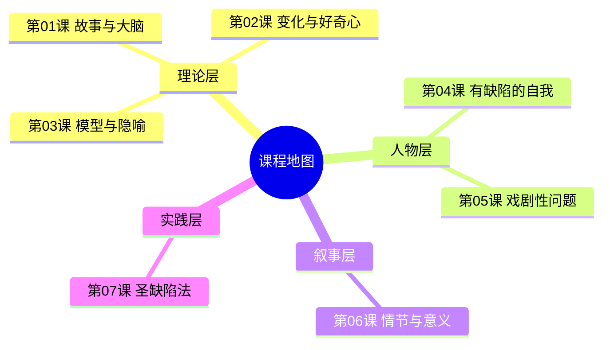

# 课程地图

## 推荐学习路径

## 内容依赖关系

| 课程 | 前置依赖 | 并行建议 |
|------|----------|----------|
| 第01课 | 无 | — |
| 第02课 | 第01课 | — |
| 第03课 | 第02课 | — |
| 第04课 | 第02课 | 第03课 |
| 第05课 | 第03课, 第04课 | — |
| 第06课 | 第05课 | — |
| 第07课 | 第05课, 第06课 | — |

## 知识层次

## 学习建议

1. **理论先行**：前三课奠定神经科学的理论基础，建议顺序学习
2. **人物核心**：第04-05课是全书精华——理解"缺陷驱动故事"是掌握 Storr 方法的关键
3. **实践收尾**：第07课是实用工作坊，建议完成前六课后进行
4. **交叉参考**：随时查阅[[reference/glossary|术语表]]和[[reference/cheatsheet|速查表]]