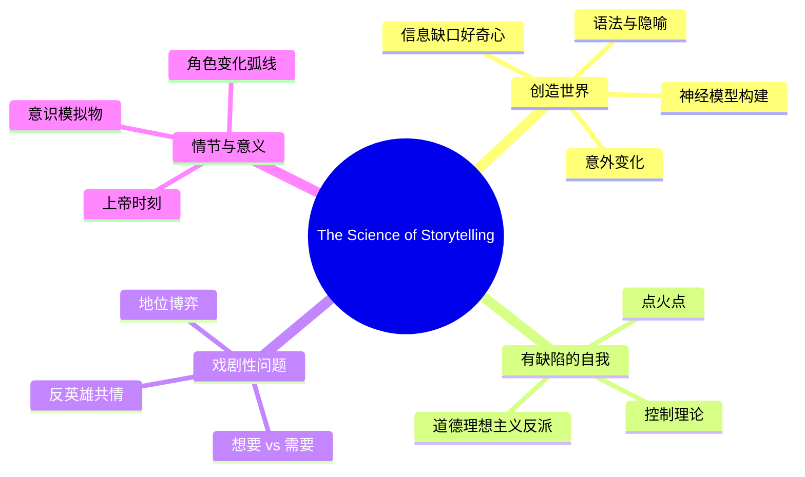

# The Science of Storytelling 课程笔记

## 简介

> 故事是从人类心灵中自然产生的，就像呼吸从嘴唇间自然产生一样。你不需要成为天才才能掌握它——你已经在做了。更好地讲故事只是向内观察心灵本身，并询问它是如何做到的。

本课程基于 Will Storr 的《The Science of Storytelling》，从认知神经科学的角度解构叙事艺术。Storr 的核心洞见是：故事之所以有效，是因为它利用了大脑自然感知和建构世界的方式。

## 目标读者

- 编剧、作家、内容创作者
- 对叙事心理学感兴趣的读者
- 希望从科学角度理解"什么让故事引人入胜"的人

## 课程结构

| 课号 | 标题 | 核心主题 |
|------|------|----------|
| 第01课 | [[lessons/0001-introduction|故事与大脑：引言]] | 故事为何重要，大脑作为故事处理器 |
| 第02课 | [[lessons/0002-creating-a-world|创造世界：变化、好奇心与心智理论]] | 变化检测、信息缺口、社会大脑 |
| 第03课 | [[lessons/0003-model-making|创造世界：模型制造、语法与隐喻]] | 神经模型、展示而非告知、隐喻的力量 |
| 第04课 | [[lessons/0004-flawed-self|有缺陷的自我：性格与失控理论]] | 核心缺陷、控制理论、反派作为道德理想主义者 |
| 第05课 | [[lessons/0005-dramatic-question|戏剧性问题：隐藏的挣扎与人性真相]] | 虚构叙事、想要 vs 需要、地位博弈 |
| 第06课 | [[lessons/0006-plot-and-meaning|情节、结局与意义]] | 情节作为变化交响乐、故事作为意识模拟物 |
| 第07课 | [[lessons/0007-sacred-flaw-approach|圣缺陷法：实用角色创作]] | 从圣缺陷到五幕结构的完整创作流程 |

## 参考资料

- [[reference/glossary|关键概念术语表]]
- [[reference/cheatsheet|讲故事情节速查表]]

## 核心洞见

## 引用

> Will Storr, *The Science of Storytelling: Why Stories Make Us Human and How to Tell Them Better*. William Collins, 2020. ISBN: 978-0-008-27693-5.