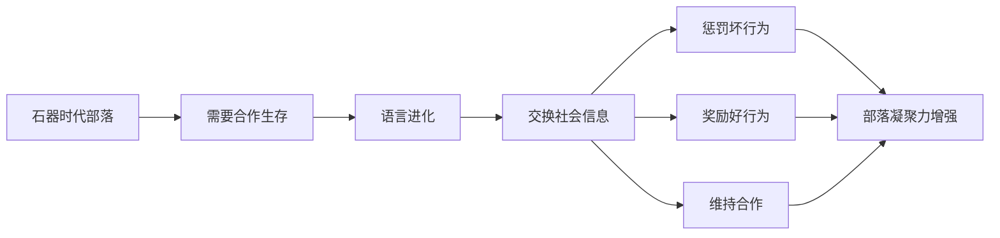
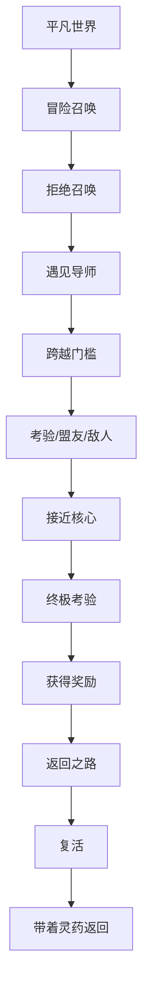

# 第01课：故事与大脑：引言

## Learning Objectives

- 理解故事为何是"存在恐惧的解药"，以及它如何为人类提供目标和意义
- 掌握语言进化与社会信息交换之间的关系
- 认识大脑作为"故事处理器"而非逻辑处理器的本质
- 区分科学方法与传统情节配方（如 Campbell 单一神话）的根本差异
- 理解"人物优先"原则相对于"情节优先"的优势
- 掌握全书的四层讲故事结构

## Core Idea

Will Storr 在《The Science of Storytelling》引言中提出了一个颠覆性的命题：**故事不是人类文化的奢侈品，而是人类大脑的必需品。** 讲故事的能力深深植根于我们神经系统的运作方式之中。要理解为什么某些故事能打动我们而其他故事不能，我们必须先理解大脑如何感知世界、如何处理信息、如何建构意义。

### 1. 故事作为存在恐惧的解药

人类是唯一意识到自己终将死亡的物种。这种意识带来了一种深层的存在恐惧——我们对"虚空"（the void）的恐惧。生命本质上是无意义的，但故事通过给我们设定目标和奋斗意义来分散这种恐惧。

> [!TIP] Key Insight
> 故事是"存在恐惧的解药"。当我们沉浸在一个故事中时，我们暂时忘记了自己存在的虚无感。故事中的角色有目标、有挑战、有奋斗——这一切让我们的大脑相信：生活是有方向的，努力是有意义的。

Storr 引用了一个关键观点：**故事为混乱的世界施加秩序。** 我们的大脑无法忍受混沌和无序，故事通过提供一个有因果关系的叙事来满足大脑对秩序的渴望。在这方面，故事的功能类似于宗教——两者都为人类的痛苦和死亡提供了解释框架。

书中举例了马克思的《共产党宣言》开场白："**A spectre is haunting Europe — the spectre of communism.**"（一个幽灵，共产主义的幽灵，在欧洲游荡。）这句话本身就是一个小型故事：它创造了悬念（什么是这个幽灵？）、设定了冲突（幽灵在欧洲游荡意味着什么？）、并暗示了即将到来的变化。

### 2. 语言为社交八卦而进化

语言进化不是为了描述客观世界，而是为了交换"社会信息"（social information）。



在石器时代，人类部落通过讲故事来维持社会秩序。如果有人违反部落规则，关于这个人的故事会迅速传播，作为社会惩罚。如果有人做了好事，关于这个人的故事也会传播，作为社会奖励。**讲故事是人类最早的社会治理工具之一。**

这一观点由 Robin Dunbar 等人的研究支持：人类语言进化的大部分时间都花在了"八卦"上——不是现代意义上的流言蜚语，而是关于谁可信、谁不可信、谁做了什么的社交信息交换。这种信息交换使得大规模合作成为可能，而大规模合作正是人类文明的基础。

对编剧的启示：**故事的核心功能是社会性的。** 即使是讲述个人内心挣扎的故事，最终也在探讨一个人在社会关系中的位置。理解这一点有助于编剧抓住故事的真正驱动力——人际关系和群体动态。

### 3. 大脑是"故事处理器"而非逻辑处理器

社会心理学家 Jonathan Haidt 提出了一个关键比喻：**大脑不是逻辑处理器，而是故事处理器。** 故事从人类大脑中自然产生，就像呼吸一样自然。

这意味着：

- **故事是人类思维的默认模式。** 我们不需要刻意学习如何理解故事——大脑自动将输入的信息组织成叙事形式。
- **逻辑推理是后天习得的技能。** 相比之下，逻辑思维需要刻意训练，它并不天然。
- **故事比数据和论证更有说服力。** 因为故事直接"喂养"大脑的叙事处理系统，而数据和论证需要大脑额外转换才能理解。

> [!TIP] Key Insight
> 如果故事是你的内容，大脑就是为你量身定做的播放器。你的工作不是创造一个新的格式，而是提供大脑天然渴求的内容。

### 4. 科学方法 vs 传统情节配方

在编剧理论的历史中，有两种主要方法：

| 方法 | 代表 | 特点 | 问题 |
|------|------|------|------|
| 传统配方法 | Joseph Campbell, Christopher Vogler, Blake Snyder | 寻找故事结构的通用公式 | 导致"火星棒故事"——冷漠、工业化、委员会式生产 |
| 科学方法 | Will Storr 等 | 从大脑认知机制出发理解故事 | 更灵活，但也更复杂 |

**"火星棒故事"（Mars Bar story）** 是 Storr 使用的术语，指那些按照公式生产出来的、缺乏灵魂的故事。它们就像工业化生产的糖果——技术上没问题，但没有真正的生命力。

Storr 并不完全否定传统方法。他指出 Campbell 的单一神话之所以有效，**不是因为它是宇宙真理，而是因为它恰好是最简洁展示深层人物变化的方式。** 换句话说，传统结构有效，是因为它反映了人类大脑理解人物成长的自然方式，而不是因为结构本身有魔力。

对编剧的启示：**不要从结构出发去填充故事，而是从人物和变化出发让结构自然浮现。**

### 5. 人物优先 vs 情节优先

这是本书最核心的实践原则之一：

> 令人信服的情节更可能来自人物，而非来自清单式的结构要点。

为什么？

- **人物是因果关系的载体。** 情节的本质是"因为A所以B"，而A和B应该是人物的选择和行为。
- **人物产生情感投入。** 我们关心故事不是因为事件本身的壮观，而是因为事件发生在我们关心的人身上。
- **人物驱动的情节更独特。** 结构（如三幕、五幕）可以被复制，但一个有血有肉的人物只能属于一个特定的故事。

例如，莎士比亚的《哈姆雷特》不是因为它遵循了某种结构而伟大，而是因为哈姆雷特这个人物——他的犹豫、他的洞察力、他的痛苦——驱动了整个故事的发展。

### 6. Campbell 的单一神话及其局限

Joseph Campbell 在《千面英雄》中提出的"单一神话"（Monomyth）或"英雄之旅"是这个领域最著名的结构理论。它的基本模式是：**英雄从平凡世界进入非凡世界，经历考验，获得奖励，然后返回平凡世界。**



Storr 的评价：

- **有用但有限。** Campbell 的结构确实反映了某些跨文化模式，但它更像是对故事模式的描述而非解释。
- **它回答了"什么"而非"为什么"。** Campbell 告诉我们英雄之旅是什么样子，但没有告诉我们为什么这种模式能打动人类大脑。
- **它往往被误用为公式。** 创作者把英雄之旅当作填空工具，而不是理解人物变化的理论框架。

Storr 的科学方法试图弥补这一不足：**用神经科学和认知心理学来解释为什么某些叙事模式有效，而不是简单地罗列它们。**

### 7. 全书结构：四层讲故事

本书围绕四个层次展开，每一层都建立在前一层之上：

```mermaid
graph TB
    subgraph ”四层讲故事结构”
        L1[”第一层：创造世界<br/>大脑如何构建现实模型”]
        L2[”第二层：有缺陷的主角<br/>角色的失控与性格”]
        L3[”第三层：隐藏的斗争<br/>戏剧性问题与潜意识挣扎”]
        L4[”第四层：情节、结局与意义<br/>故事如何给予我们慰藉”]
    end
    
    L1 --> L2 --> L3 --> L4

    subgraph ”核心问题”
        Q1[”大脑如何感知和建构世界？”]
        Q2[”为什么角色必须有缺陷？”]
        Q3[”戏剧性问题如何驱动叙事？”]
        Q4[”好结局为何让人满足？”]
    end
    
    L1 --- Q1
    L2 --- Q2
    L3 --- Q3
    L4 --- Q4
```

- **第一层：创造世界** —— 大脑通过模型制造来感知现实。故事创作者需要理解这个模型制造过程，才能有效地"建造"读者体验到的故事世界。（第02-03课）
- **第二层：有缺陷的主角** —— 角色的核心缺陷（flaw）是故事的引擎。这个缺陷来自角色的"控制理论"——一种关于如何获得安全感和自尊的错误信念。（第04课）
- **第三层：隐藏的斗争** —— 在表面情节之下，角色在进行一场潜意识的斗争：对抗自己的缺陷。这个"戏剧性问题"（dramatic question）才是故事真正的驱动力。（第05课）
- **第四层：情节、结局与意义** —— 情节不是事件清单，而是变化的交响曲。好结局让读者获得一种"控制感"和意义的满足。（第06课）

## 全书叙事架构

以下是本书的知识体系地图，展示了各课程之间的关系：

```mermaid
graph LR
    subgraph ”第一部分：大脑如何构建世界”
        L01[”第01课：引言<br/>故事作为存在恐惧的解药”]
        L02[”第02课：创造世界<br/>变化、好奇心与心智理论”]
        L03[”第03课：创造世界<br/>模型制造、语法与隐喻”]
    end
    
    subgraph ”第二部分：角色与冲突”
        L04[”第04课：有缺陷的自我<br/>性格与失控理论”]
        L05[”第05课：戏剧性问题<br/>隐藏的挣扎与人性真相”]
    end
    
    subgraph ”第三部分：情节与创作”
        L06[”第06课：情节、结局与意义”]
        L07[”第07课：圣缺陷法<br/>实用角色创作工作坊”]
    end
    
    L01 --> L02
    L02 --> L03
    L03 --> L04
    L04 --> L05
    L05 --> L06
    L06 --> L07
```

## Worked Example

### 马克思的《共产党宣言》开场白

我们来看看 Storr 引用的这个例子如何体现上述原理：

> **A spectre is haunting Europe — the spectre of communism.**

这句话只有 9 个单词，但包含了故事的所有核心元素：

1. **意外变化（"haunting"）** —— 欧洲被一个"幽灵"困扰，这意味着正常秩序被打破
2. **信息缺口（什么是"幽灵"？）** —— 读者产生好奇心：这个幽灵是什么？它为什么在游荡？
3. **冲突暗示（共产主义 vs. 旧秩序）** —— 存在对抗关系
4. **方向感（最终会发生什么？）** —— 读者期待后续发展

这证明了：**一个好故事的开场不需要复杂的人物介绍或背景铺垫，只需要创造一个"不对劲"的世界，然后让读者渴望知道接下来会发生什么。**

### "火星棒故事"的例子

想象一个按照"英雄之旅"公式写出来的电影：

- 主角是普通上班族（平凡世界）
- 被卷入了某个阴谋（冒险召唤）
- 有一个导师帮他训练（遇见导师）
- 经过一系列打斗场景（考验）
- 最终打败了坏蛋（终极考验）
- 回到日常生活，变得更成熟（返回）

这个结构"没错"，但它是空心的。因为主角的内心变化被忽略了——他为什么要改变？他的缺陷是什么？这个问题将在后续课程中深入探讨。

## Practice

> [!QUESTION] Self-check 1
> 为什么故事是"存在恐惧的解药"？请用自己的话解释。

<details>
<summary>Reveal answer</summary>

人类是唯一意识到自己终将死亡的物种。故事通过给混乱的世界施加秩序、为角色设定目标并提供奋斗的意义，帮助我们暂时忘记存在的虚无感。当我们沉浸在一个故事中时，我们的大脑相信生活是有方向的、努力是有意义的——即使这种意义是虚构的。
</details>

---

> [!QUESTION] Self-check 2
> 语言进化的主要目的不是为了描述客观世界，而是为了什么？

<details>
<summary>Reveal answer</summary>

语言进化的主要目的是交换"社会信息"（social information），也就是"八卦"。在石器时代，人类通过讲故事来传播谁可信、谁不可信的信息，同时通过故事来惩罚坏行为、奖励好行为，从而维持部落合作和社会秩序。
</details>

---

> [!QUESTION] Self-check 3
> 什么是"火星棒故事"？为什么它不好？

<details>
<summary>Reveal answer</summary>

"火星棒故事"指那些严格按照传统结构公式（如 Campbell 的英雄之旅）生产出来的故事。它们技术上没有大问题，但缺乏灵魂和生命力——就像工业化生产的糖果一样冷漠、可预测、令人厌倦。问题不在于结构本身，而在于从结构出发而不是从人物出发。
</details>

---

> [!QUESTION] Self-check 4
> Campbell 的"单一神话"（英雄之旅）为什么有效？Storr 的科学方法比它好在哪？

<details>
<summary>Reveal answer</summary>

Campbell 的单一神话之所以有效，是因为它恰好是最简洁展示深层人物变化的方式。但它的局限在于只描述了"什么"有效，没有解释"为什么"有效。Storr 的科学方法用神经科学和认知心理学来解释为什么某些叙事模式能打动人类大脑，而不是简单地罗列结构公式。科学方法更灵活、更有解释力，也更能帮助创作者理解故事的本质。
</details>

---

> [!QUESTION] Self-check 5
> 本书的四层讲故事结构是什么？每一层对应什么问题？

<details>
<summary>Reveal answer</summary>

1. **创造世界** —— 大脑如何感知和建构世界？（第02-03课）
2. **有缺陷的主角** —— 为什么角色必须有缺陷？（第04课）
3. **隐藏的斗争** —— 戏剧性问题如何驱动叙事？（第05课）
4. **情节、结局与意义** —— 好结局为何让人满足？（第06课）

每一层建立在前一层之上，从大脑如何构建现实一路延伸到故事如何给予我们慰藉和意义。
</details>

## Key Takeaways

- 故事是人类大脑处理信息的基本方式，不是奢侈品而是必需品
- 语言进化的核心驱动力是社会信息交换（八卦和社交监控）
- 大脑是"故事处理器"，不是逻辑处理器——故事天然就是大脑的"母语"
- 不要迷信传统结构公式（如英雄之旅），要从人物出发让结构自然浮现
- 本书的四层结构：创造世界 → 有缺陷的主角 → 隐藏的斗争 → 情节与意义

## Citation

Will Storr, *The Science of Storytelling: Why Stories Make Us Human, and How to Tell Them Better*, Introduction.

## Next Step

继续学习 [[0002-creating-a-world|第02课：创造世界——变化、好奇心与心智理论]]。在这一课中，我们将深入探讨大脑如何检测变化、好奇心如何被触发、以及人类作为超社会物种如何通过心智理论理解他人。