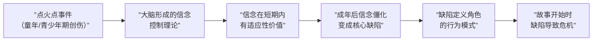
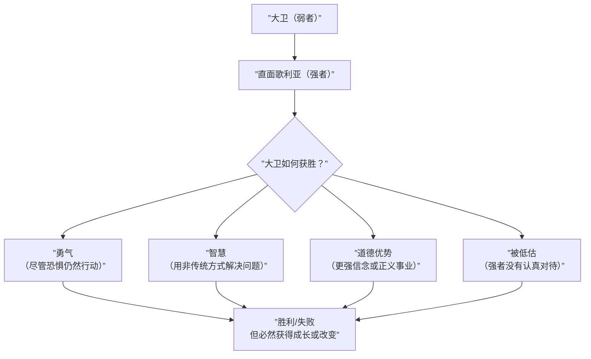

# 第04课：有缺陷的自我：性格与失控理论

## Learning Objectives

- 理解"有缺陷的自我"与"控制理论"的核心概念及其相互关系
- 掌握性格与情节的辩证关系——情节是性格的展开而非外在于角色的框架
- 了解性格通过环境、视角两种主要方式的表达机制
- 认识东西方故事在个人主义与集体主义维度上的根本差异
- 掌握缺陷的起源"点火点"（Ignition Point）概念及其创作应用
- 理解"虚构记忆"与"道德错觉"——大脑如何重构记忆以维护自我英雄叙事
- 理解反派作为道德理想主义者的概念，以及"每个反派都是自己故事中的英雄"
- 掌握大卫与歌利亚模式及其变体
- 理解有缺陷的角色如何通过努力克服缺陷的过程赋予故事意义

## Core Idea

前两课（[[0002-creating-a-world|第02课]] 和 [[0003-model-making|第03课]]）奠定了"大脑如何建构世界模型"的基础。现在，我们将这个框架应用于故事的心脏——**角色**。具体地说：有缺陷的角色。

Storr 的核心命题：**故事不是关于完美的人，而是关于有缺陷的人在努力控制失控的生活。** 角色的缺陷不是故事的小瑕疵——它是故事的引擎。

### 1. 有缺陷的自我与失控理论

#### 所有动物寻求控制

所有动物都试图控制外部世界以获得所需：

- **生存控制**：寻找食物、避免被捕食
- **繁殖控制**：争夺交配机会、保护后代
- **社会控制**：在群体中确立地位

人类的大脑在这方面与其他动物没有本质区别。但人类有一个独特的困境：**我们能意识到自己试图在控制，而且我们能意识到控制常常失败。**

> [!TIP] Key Insight
> 角色的"控制理论"（Control Theory）指的是他们对"如何在这个世界上获得想要的东西"的一套内隐信念。当这套信念系统出错时——也就是角色的**核心缺陷**——故事就开始了。

#### 控制理论的构成

每个角色都有一套（通常是潜意识的）控制理论：

| 控制理论的类型 | 角色的信念 | 可能的缺陷 |
|---------------|-----------|-----------|
| 完美主义型 | "我必须完美，否则就不会被爱" | 自我苛求、无法容忍错误 |
| 取悦型 | "我必须让别人快乐，否则会被抛弃" | 失去自我、没有边界 |
| 控制型 | "我必须掌控一切，否则会陷入混乱" | 强势、无法信任他人 |
| 逃避型 | "只要我不当真就不会受伤" | 无法承诺、情感疏离 |
| 受害者型 | "世界对我太不公平" | 自怜、被动、拒绝负责 |
| 英雄型 | "我必须拯救所有人" | 自我牺牲、越界帮助 |

#### 当控制理论失败时

角色的控制理论在大部分日常生活中可能"勉强够用"。但故事开始时，**环境发生了变化**——这个变化使得角色原有的控制理论不再有效。

例如：

- 一个完美主义者在工作中一直非常成功（控制理论有效），但某一天她犯了一个公开的、无法挽回的错误（控制理论失效）
- 一个逃避型的人通过保持距离来避免受伤（控制理论有效），但遇到了一个他无法不在乎的人（控制理论失效）

**故事的本质就是角色面对控制理论的失效，挣扎、重塑、成长或毁灭的过程。**

### 2. 性格与情节交织

这是本书最重要的认识论命题之一：**情节不是外在于角色的框架，而是角色性格的展开过程。**

#### 传统观念的误区

在许多写作教程中，"情节"被当作一个可以独立于角色设计的结构——角色被塞进预设的三幕或英雄之旅结构中。Storr 认为这是本末倒置。

```mermaid
graph LR
    subgraph ”传统方法（错误的）”
        A[”先有情节框架”] --> B[”将角色放入框架中”]
        B --> C[”故事僵硬、空心”]
    end

    subgraph ”Storr 方法（正确的）”
        D[”先有角色及缺陷”] --> E[”角色面对变化的环境”]
        E --> F[”角色的性格驱动决策”]
        F --> G[”决策的因果链构成情节”]
        G --> H[”情节是性格的展开”]
    end
```

#### 性格即情节

Storr 引用了一个核心公式：**Character = Plot**（角色即情节）。

这不是文字游戏。它意味着：

1. 如果你创造了一个真实、有缺陷的角色，这个角色面对特定环境时"必然"会做出某些选择
2. 这些选择必然导致特定的后果
3. 这些后果反过来影响角色——成功或失败、成长或堕落
4. 这个因果链条——从一个有缺陷的角色出发——就是**情节**

> [!TIP] Key Insight
> 当角色创造得足够好时，情节几乎是"自动发生的"。一个好的角色在面对一个变化时会"自然地"做出有缺陷的选择，从而推动故事前进。你不需要一个复杂的情节大纲——你只需要一个深刻理解的角色和一个打破平衡的事件。

### 3. 性格通过环境表达

角色居住的世界是其内心世界的外部化。

#### 环境作为角色镜

这不是指"环境反映角色的阶级或身份"这种表面含义，而是指**角色的选择和生活方式会在物理世界中留下痕迹，这些痕迹反过来揭示了角色的内心**。

编剧的黄金问题：**如果你不让角色谈论自己，他的世界会如何讲述他的故事？**

| 角色的内心 | 可能在环境中留下的痕迹 |
|-----------|----------------------|
| 强迫性 | 物品排列整齐、重复性的日常痕迹 |
| 孤独 | 一张单人的餐桌、电视总是开着但无人看 |
| 怀旧 | 保留着多年前的纪念品、时钟停了但没换电池 |
| 愤怒 | 墙上的拳头印、被摔碎后粘好的物品 |
| 焦虑 | 门锁了三遍、烟灰缸里堆满烟蒂 |

#### Mary Shelley 的 Frankenstein 的怪物之屋

Storr 用 Frankenstein 中的怪物寻找庇护所的场景展示了环境如何表达内心。怪物找到了一间废弃的小屋——不是通过描述怪物的感受，而是通过小屋的状态（破败、寒冷、被人类遗弃）来映射怪物的内心状态（被世界遗弃、冰冷、破碎）。**角色选择安身的环境本身就是角色性格的延伸。**

### 4. 性格通过视角表达

角色看待世界的方式——他们的**视点**（Point of View, POV）——是其性格的直接窗口。

#### Henry James 的视点革命

Henry James 是现代小说中"视点"技术的关键革新者。他发展出"受限第三人称"（limited third person）——叙事者只能知道主角知道的信息、只能感受主角感受的情感。这种技术让每一位读者都"住进"了主角的大脑。

> [!TIP] Key Insight
> 视角限制不是限制，而是**放大**。当你只能通过一个角色的眼睛看世界时，读者对那个角色的认知和情感投入被深度放大。

#### 视角的选择决定故事的类型

同一个事件，通过不同角色的视角讲述，会产生完全不同的故事：

| 视角角色 | 故事类型 | 读者的体验 |
|---------|---------|-----------|
| 警察 | 犯罪调查 | 追踪线索、寻找真相的刺激 |
| 受害者 | 恐惧惊悚 | 被威胁、无助的恐惧 |
| 旁观者 | 道德困境 | 旁观的不确定性和道德压力 |
| 凶手 | 心理剧 | 扭曲的内心世界和犯罪逻辑 |

Storr 强调：**视角不是一个技术选择——它是故事的心脏。** 选择谁的视角，就是选择让读者"成为"谁。

### 5. 东西方故事差异

Storr 在书中讨论了东西方故事的根本差异，这一差异根植于更深层的社会认知结构。

#### 西方故事：个人英雄主义

- 核心价值：追求自我实现
- 冲突模式：个人 vs 体制、个人 vs 自然、个人 vs 另一个个体
- 典型结构：主角通过个人努力改变世界或自己
- 经典例子：《奥德赛》、《哈姆雷特》、《星球大战》

#### 东方故事：集体和谐与责任

- 核心价值：维护集体和谐
- 冲突模式：个人 vs 集体期望、责任 vs 欲望
- 典型结构：主角通过自我牺牲或适应来维持集体平衡
- 经典例子：《源氏物语》、许多中国古典文学

```mermaid
graph TB
    subgraph ”西方叙事模式”
        W1[”个人欲望”] --> W2[”追求个人目标”]
        W2 --> W3[”遭遇阻碍”]
        W3 --> W4[”通过个人努力克服阻碍”]
        W4 --> W5[”个人成长或毁灭”]
    end

    subgraph ”东方叙事模式”
        E1[”集体责任”] --> E2[”个人的位置被定义”]
        E2 --> E3[”个人欲望与集体责任冲突”]
        E3 --> E4[”通过妥协或牺牲恢复平衡”]
        E4 --> E5[”集体状态的变化”]
    end
```

> [!TIP] Key Insight
> 这并不是说东方故事没有个人英雄主义，或西方故事没有集体主义意识。而是**故事的"默认情感货币"不同**。在西方故事中，读者的默认移情对象是"追求个人自由的个体"；在东方故事中，读者的默认移情对象是"维护集体平衡的节点"。

**对编剧的启示**：了解你的受众的"默认移情模式"。面向全球观众的故事需要这种差异的平衡——但千万不要无意识地假设"所有文化都讲同样的故事"。

### 6. 缺陷的起源：点火点（Ignition Point）

角色的核心缺陷不是与生俱来的——它源于"点火点"：通常是在童年或青少年期的某个关键事件。

#### 点火点的机制

1. 角色经历了一个**情感冲击事件**（通常是创伤性的）
2. 大脑为了应对这种冲击，发展出一个**保护性信念**（控制理论）
3. 这个信念在当时是有适应性价值的——它帮助角色度过了那个艰难的时期
4. 但在成年后，这个信念变得**僵化、过度**——曾经保护角色的机制现在限制了角色



#### 示例：Frank 的《革命之路》

在 [[0002-creating-a-world|第02课]] 我们讨论了 Frank 和 April 的心智理论错误。现在我们可以追溯这些错误的根源：

- **Frank 的点火点**：童年时他感到父亲是"失败者"，他发誓永远不要像父亲一样。这导致了他的控制理论："我必须向世界证明我是一个成功、有力量的男人。"
- **这个控制理论的表现**：他需要被崇拜、被仰视；他无法接受任何形式的"控制权丧失"
- **这个控制理论如何成为缺陷**：当 April 想要去巴黎时，Frank 表面上支持梦想，但实际上他无法接受放弃他的工作（他唯一能证明自己"成功"的东西），因此他暗中破坏了计划

**对编剧的指导**：问自己角色的"点火点是什么？"——不比回答"角色的目标是什么"更重要，但它是理解角色为何有特定目标的关键。

### 7. 虚构记忆与道德错觉

这是本课最复杂也最具人性深度的概念。

#### 大脑重构记忆

你的记忆不是录像带——它是**每次回忆时都重新建构的叙事**。大脑在重构记忆时，会：

1. **删减** —— 去掉难以接受或尴尬的细节
2. **强调** —— 放大让自己看起来更好的部分
3. **合理化** —— 为自己的选择补充"合理"的动机
4. **重写** —— 有时甚至完全改变事件的意义

> [!WARNING] Shocking Fact
> 我们不是在"回忆"过去——我们在**编辑**过去。每一次回忆都是一次新的编辑。经过多次编辑后，原始事件和我们的"记忆"之间的差距可能巨大得惊人。

#### 道德错觉与自我英雄叙事

Storr 指出：**大脑让我们感觉自己是我们生命故事中的道德英雄。** 这不是自恋——这是大脑正常运作的副产品。

大脑不断在讲述一个关于"我"的故事。在这个故事中：

- 我们是主角
- 我们的动机是良善的
- 我们的选择是有道理的
- 我们行为的负面后果是"不得已"的或者另有原因

**"事实"往往服从于这个叙事**，而不是叙事服从于事实。

#### 对故事创作的启示

> [!TIP] Key Insight
> 每个角色都对自己"讲述"一个故事——关于他们是谁、为什么他们做他们做的事。这个自我叙事几乎总是"自我美化"的。角色的自我认知和真实情况之间的差距，是戏剧张力的金矿。

这就是为什么经典悲剧中主角往往在最后才"看清自己"——因为在那之前，他们的自我叙事一直在保护他们免于面对真相。

### 8. 反派与道德理想主义

这是 Storr 全书最深刻的人物洞察之一。

#### 最令人信服的反派不认为自己邪恶

平庸的反派知道自己是坏人——他们"为邪恶而邪恶"，或者他们有一个空洞的动机（"统治世界"）。但真正令人信服的反派是**道德理想主义者**。

Storr 的核心论点：**每个反派都是自己故事中的英雄。**

```mermaid
graph TB
    subgraph ”反派的世界观”
        A[”反派的点火点”] --> B[”反派形成控制理论”]
        B --> C[”反派相信自己<br/>在做正确的事”]
        C --> D[”反派的目标是”><br/>通常涉及'让世界更美好'”]
    end

    subgraph ”英雄的世界观”
        E[”英雄的点火点”] --> F[”英雄形成控制理论”]
        F --> G[”英雄相信自己<br/>在做正确的事”]
        G --> H[”英雄的目标是”><br/>通常涉及'保护某些价值'”]
    end

    subgraph ”冲突的本质”
        I[”不是善恶对抗<br/>而是两种不同<br/>'正确观念'的对抗”]
    end

    D --> I
    H --> I
```

#### 道德理想主义反派的特征

| 特征 | 说明 | 例子 |
|------|------|------|
| 自认为正确 | 从不认为自己邪恶 | 《黑暗骑士》中的小丑（他认为自己在揭露社会的虚伪） |
| 有正当的动机 | 动机可以被理解甚至同情 | 《复仇者联盟3》灭霸（消灭一半人口以拯救宇宙） |
| 有清晰的逻辑 | 能在自己的框架内自圆其说 | 《守望者》中的 Ozymandias（以少量牺牲换取世界和平） |
| 往往比主角更坚定 | 愿意为"正确"付出更大代价 | 《老无所依》中的 Anton Chigurh（他的"原则"从未动摇） |

#### 为什么道德理想主义反派更有效

1. **更真实** —— 现实世界中的"恶"很少是自觉的恶，而往往是自以为是的善
2. **更复杂** —— 当反派有自己的道德逻辑时，读者陷入"我该支持谁？"的困惑
3. **更有威胁感** —— 一个相信自己正确的人比一个知道自己邪恶的人更难被说服、更难被阻止
4. **为主角提供镜像** —— 反派的哲学往往在映射或挑战主角的哲学

> [!TIP] Key Insight
> 当你写反派时，不要问"他有多邪恶？"，而要问**"他认为自己在做什么正确的事？"** 一旦你回答了这个问题，你的反派就从"功能性的障碍物"变成了"有血有肉的存在"。

### 9. 有毒的自尊与英雄制造叙事

大脑的自我英雄叙事有一个黑暗面：**有毒的自尊（toxic self-esteem）**。

#### 自尊的两面性

| 健康自尊 | 有毒自尊 |
|---------|---------|
| "我犯了错误，但这不意味着我是个坏人" | "我绝不能犯错，否则我就毫无价值" |
| "我可以从批评中学习" | "任何批评都是对我的攻击" |
| "我需要改进" | "我已经完美了，问题出在别人身上" |

#### 有毒自尊如何生成故事

当一个人的自我英雄叙事受到威胁时（控制理论面临挑战），大脑的防御机制就会启动：

1. **否认** —— "这件事没有发生"或"不是这样的"
2. **投射** —— "不是我的问题，是他的问题"
3. **扭曲** —— "我这样做是为了你好"
4. **升级** —— "你逼我这样做的！"

这些防御机制的运作就是戏剧的天然原料。角色的"失控"——当控制理论面临崩溃时——是最有戏剧性的时刻。

**对编剧的指导**：把角色逼到角落里，让他们的自我英雄叙事无处可逃。当防御机制崩溃、角色被迫面对真实的自己时——那就是故事的高潮。

### 10. 大卫与歌利亚模式

这是一个跨文化的原型叙事模式：**弱者对抗强者**。

#### 为什么这个模式如此普遍

- **认知不对称** —— 弱者被视为"更"人类（因为我们的进化背景让我们更关注弱势群体成员）
- **情感投资** —— 我们天然站在"不利于"的一方，因为获胜需要更多努力
- **自我投射** —— 每个读者都知道自己是一个"弱者"（在某个方面），所以大卫是每个人的自我投射



#### 大卫与歌利亚的变体

- **精神上的弱者** —— 主角是社交低地位者（《壁花少年》）
- **智力上的弱者** —— 主角面对更聪明的对手（《阿甘正传》）
- **道德上的弱者** —— 主角面对更强大但更腐败的体制（《飞跃疯人院》）
- **身体的弱者** —— 主角面对更强的物理对手（《洛奇》）

Storr 指出：**这个模式之所以有效，不是因为"弱者必然获胜"的乐观主义——而是因为它展示了"控制"的本质。** 大卫不是"赌了一把然后赢了"——大卫是通过使用非传统的策略（投石索 - 他作为牧羊人掌握的技能）重新获得了控制权。

**对编剧的启示**：弱者的胜利不应该是"奇迹"，而应该是**利用他作为弱者本身就拥有的、被强者忽视的资源**。

### 11. 有缺陷的角色如何创造意义

这是本课的总结——也是通往 [[0005-dramatic-question|第05课：戏剧性问题]] 的桥梁。

#### 意义来自克服缺陷

Storr 指出：**故事中的"意义"不是一种抽象的概念——它来自角色通过努力克服缺陷的过程。**

- 如果角色没有缺陷，就没有"成长"的空间——故事变成了一系列事件，没有意义
- 如果缺陷不需要努力克服，就没有"斗争"——故事变成了一帆风顺的无聊之旅
- 如果努力没有代价，就没有"牺牲"——故事变得廉价

```
意义 = 缺陷 × 努力克服的挣扎 × 代价
```

#### 为什么读者需要角色的缺陷

读者不来找完美的人——读者来找：

- **同类** —— "这个角色和我一样不完美"
- **希望** —— "如果他/她可以改变，我也许也可以"
- **警告** —— "如果我不改变，我可能会像他/她一样"

> [!TIP] Key Insight
> 一个有缺陷的角色不是在讲述一个有缺陷的故事——而是提供了一个让读者自己看到"我也可以改变"的镜子。这是故事最深层的疗愈功能。

## Worked Example

### 案例一：反派的道德理想主义——Frank Underwood（《纸牌屋》）

Frank Underwood 是一个"典型"的反派吗？他谋杀、操纵、出卖——但他从不认为自己是个坏人。

他的控制理论："在这个世界上，有两种人——吃别人的人，和被吃的人。我选择做吃人的人。"

他的道德逻辑："我做这些肮脏的事，是因为只有这样才能获得改变体制的力量。等我真正掌控了一切，我会用我的权力做好事。"

他的点火点：可能是某个早期生涯中被背叛或轻视的经历，让他相信"世界是弱肉强食的"，因此"我要成为最强的那一个"。

这个自我叙事的欺骗性在于：它让 Underwood 为自己所有的恶行找到了"更高尚的理由"——这是典型的有毒自尊运作。

### 案例二：点火的运用——《了不起的盖茨比》

Gatsby 的核心缺陷是什么？他无法接受自己"只是 Jay Gatz 这个穷小子"。

- **点火点**：年轻时遇到 Daisy，但因为自己的阶级地位无法得到她
- **控制理论**："只要我变得足够富有、足够成功，我就能重写过去——我就能拥有 Daisy"
- **缺陷的表现**：他建造了整个物质世界（豪宅、派对、汽车）来"证明"自己是配得上 Daisy的人
- **缺陷如何导致毁灭**：他无法接受 Daisy 已经改变了的事实——他的整个自我叙事建立在一个已经不复存在的可能性上

Gatsby 的悲剧在于：他的控制理论不仅在功能上是错误的——它本质上就是**时间不可逆**这个宇宙真理的对立面。他试图控制不可控制的东西。

## Practice

> [!QUESTION] Self-check 1
> 什么是角色的"控制理论"？它和"缺陷"是什么关系？

<details>
<summary>Reveal answer</summary>

控制理论是角色对"如何在这个世界上获得想要的东西"的一套内隐信念——通常形成于童年或青少年时期的关键事件（点火点）。当控制理论出错——变得僵化、过度、不适应环境——它就成为了角色的核心缺陷。控制理论是"病因"，缺陷是它表现出来的"症状"。
</details>

---

> [!QUESTION] Self-check 2
> 如何理解"Character = Plot"（角色即情节）？

<details>
<summary>Reveal answer</summary>

这不是说角色和情节是同一件事——而是说情节是角色性格的展开过程。如果你创造了一个真实、有缺陷的角色，这个角色面对特定环境时"必然"会做出某些选择，这些选择导致特定后果，后果反过来影响角色——这个因果链条就是情节。好的角色让情节"自动发生"。传统方法把角色塞进情节框架（错误），Storr 的方法是从角色出发让情节自然浮现（正确）。
</details>

---

> [!QUESTION] Self-check 3
> 请列举三种性格通过环境表达的方式，各用一个例子说明。

<details>
<summary>Reveal answer</summary>

1. **物理痕迹反映心理状态** —— 强迫性角色房间里的物品排列整齐、重复性日常痕迹
2. **居所的选择映射内心** —— Frankenstein 怪物选择废弃小屋（破败、被遗弃）映射其内心状态
3. **物品状态暗示情感** —— 单人的餐桌暗示孤独、未拆封的信件暗示逃避、墙上的拳头印暗示愤怒

关键在于：角色在环境中的"痕迹"是他们的选择或行为的结果——读懂了这些痕迹，就读懂了角色。
</details>

---

> [!QUESTION] Self-check 4
> 东西方故事在核心价值取向上有什么根本差异？

<details>
<summary>Reveal answer</summary>

西方故事的核心价值取向是**个人英雄主义**——个人通过努力实现自我，改变世界或自己。冲突模式通常是个人 vs 外部力量。东方故事的核心价值取向是**集体和谐与责任**——个人通过妥协或牺牲来维护集体平衡。冲突模式通常是个人欲望 vs 集体期望。这不是说东方没有英雄主义或西方没有集体意识，而是故事的"默认情感货币"不同——读者对不同价值的情感投入优先级不同。
</details>

---

> [!QUESTION] Self-check 5
> 什么是角色的"点火点"？它如何形成角色的核心缺陷？请以《革命之路》的 Frank 为例说明。

<details>
<summary>Reveal answer</summary>

点火点是角色在童年或青少年期经历的关键事件（通常是创伤性的），大脑为应对它发展出了一个保护性信念（控制理论）。这个信念在短期内具有适应性价值，但在成年后变得僵化，成为核心缺陷。

Frank 的点火点是童年时感到父亲是"失败者"，他发誓永远不要像父亲一样。这形成了他的控制理论："我必须向世界证明我是一个成功、有力量的男人。"这个信念导致他无法接受任何形式的"控制权丧失"——当 April 提出去巴黎时，他表面支持但暗中破坏，因为他无法放弃能证明他"成功"的工作。
</details>

---

> [!QUESTION] Self-check 6
> 为什么最令人信服的反派不认为自己邪恶？什么是"道德理想主义反派"？

<details>
<summary>Reveal answer</summary>

最令人信服的反派是道德理想主义者——他们不认为自己邪恶，而是认为自己正在做"正确的事情"。他们通常有一个可以被理解甚至同情的动机和目标（比如"让世界更美好"），有清晰的内部逻辑。他们之所以是反派，是因为他们的"正确"与主角的"正确"产生了冲突。这种反派更真实（现实中的"恶"很少是自觉的恶）、更复杂、更有威胁感，也让故事更加深刻。每个反派都是自己故事中的英雄。
</details>

---

> [!QUESTION] Self-check 7
> 什么是"虚构记忆"和"道德错觉"？它们在角色塑造中有什么作用？

<details>
<summary>Reveal answer</summary>

"虚构记忆"指大脑不是像录像机一样储存和播放记忆，而是每次回忆时重新建构记忆——这个过程会删减、强调、合理化甚至重写过去。"道德错觉"是这种记忆重构的副产品——大脑不断讲述一个关于"我"的故事，在其中我们是道德英雄，动机是良善的，选择是有道理的。

在角色塑造中：每个角色都对自己"讲述"一个美化过的自我故事。角色的自我认知和真实情况之间的差距是戏剧张力的金矿。经典悲剧中主角在最后"看清自己"——是因为在那之前自我叙事一直在保护他们免于面对真相。
</details>

---

> [!QUESTION] Self-check 8
> 综合应用：思考一个你熟悉的故事主角，分析他/她的点火点、控制理论和核心缺陷。然后写出在故事中控制理论如何被挑战，以及最终角色如何（或未能）克服缺陷。

<details>
<summary>Reveal answer</summary>

示例：《海底总动员》中的 Marlin

- **点火点**：鲨鱼袭击导致他失去了妻子和几乎所有的孩子，只剩下 Nemo
- **控制理论**："世界是危险的。保护 Nemo 的唯一方式就是让他远离一切风险。"
- **核心缺陷**：过度保护 / 恐惧导致的控制型养育
- **控制理论被挑战**：Nemo 被抓走——当 Marlin 最恐惧的事情发生时，他的控制理论（"只要我足够警惕就能阻止坏事"）被彻底击碎
- **克服缺陷的旅程**：Marlin 必须学会信任——信任 Dory、信任其他海洋生物、最终信任 Nemo 能够自己应对世界。他通过认识到"控制一切"不是保护孩子的方式，而是控制理论错了

这个例子说明了一个成功的角色弧线：点火点 → 有适应性价值的信念 → 僵化为缺陷 → 面临挑战 → 成长或毁灭。
</details>

## Key Takeaways

- **核心缺陷是故事的引擎** —— 角色的控制理论（如何获得想要的东西）出错时就形成了核心缺陷。故事的本质是角色面对控制理论失效时的挣扎过程
- **性格即情节** —— 情节不是独立于角色的结构，而是角色性格在面对环境时的自然展开。好的角色让情节"自动发生"
- **性格通过环境与视角表达** —— 角色居住的世界是其内心世界的外部化；视角的选择决定了读者体验故事的维度
- **东西方叙事差异根植于价值观** —— 西方：个人英雄主义；东方：集体和谐与责任。了解受众的"默认移情模式"至关重要
- **点火点塑造缺陷** —— 角色的核心缺陷通常源于童年或青少年期的关键事件。理解点火点才能理解角色的深层动机
- **虚构记忆维护自我英雄叙事** —— 大脑在每次回忆时重构过去，让我们感觉自己是我们生命故事中的道德英雄。角色的自我叙事与真相的差距是戏剧张力的金矿
- **每个反派都是自己故事中的英雄** —— 最令人信服的反派是道德理想主义者。写反派时，问"他认为自己在做什么正确的事？"而不是"他有多邪恶？"
- **大卫与歌利亚是控制权故事** —— 弱者的胜利不是奇迹，而是利用被强者忽视的资源重新获得控制权
- **意义来自克服缺陷的挣扎** —— 意义 = 缺陷 × 努力克服的挣扎 × 付出的代价

## Citation

Will Storr, *The Science of Storytelling: Why Stories Make Us Human, and How to Tell Them Better*, Chapter 2: The Flawed Self (subsections on control theory, character as plot, environment and perspective, Eastern vs Western storytelling, ignition points, confabulation, villains as moral idealists, David and Goliath, and meaning through flawed characters).

## Next Step

继续学习 [[0005-dramatic-question|第05课：戏剧性问题：隐藏的挣扎与人性真相]]。这一课将深入探讨戏剧性问题的运作机制——角色表面的追求和潜意识中的真正需求之间的张力，以及这个张力如何驱动故事的核心动力。