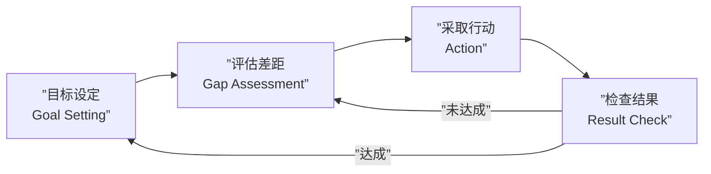

# 第06课：情节、结局与意义

## Learning Objectives

- 理解目标导向性在生活和故事中的核心地位
- 掌握 Eudaimonia（幸福即繁荣）的概念及个人项目在叙事中的作用
- 区分"情节作为配方"与"情节作为变化交响乐"两种观点
- 理解最终之战作为角色转化的本质而非物理对抗
- 掌握结局的控制感与"上帝时刻"的叙事功能
- 理解故事作为"意识模拟物"的理论
- 分析"运输"（Transportation）状态的机制及其对读者的影响
- 认识故事赋予混乱以秩序和意义的慰藉力量

## Core Idea

### 1. 目标导向性：生活与故事的共同引擎

> [!TIP] Key Insight
> 生活是目标导向的——故事也是。没有目标就没有叙事，没有方向就没有意义。大脑在本质上是一台"目标追求机器"。

从神经科学的角度看，人类大脑的运作模式是**目标导向**的：

1. **设定目标**：大脑选择想要达到的状态（生存、安全、地位、归属感）
2. **评估现状**：大脑评估当前状态与目标之间的差距
3. **采取行动**：大脑发出指令缩小差距
4. **评估结果**：大脑检查目标是否达成，然后设定下一个目标



**这对故事创作意味着什么？**

- **角色必须有目标**。没有目标的角色不是一个角色——他是一个观察者，而观察者不适合当主角
- **故事的动力来自"目标与障碍之间的差距"**。这个差距就是戏剧张力（第05课的"戏剧性问题"）
- **角色的目标不能太容易实现**。每一个阻碍都应该迫使角色面对自己的缺陷

> 这与 [[0005-dramatic-question|第05课：戏剧性问题]] 紧密相关：角色的有意识目标（"想要"）和无意识需求（"需要"）之间的张力，推动了整个叙事。

### 2. Eudaimonia（幸福）与个人项目

亚里士多德的 **Eudaimonia**（幸福/繁荣）概念是理解故事目标的关键。

> Eudaimonia 不是"快乐"或"开心"——它指的是**一个人作为人类蓬勃发展的状态**。它是一种深层的、持久的"好的生活"，而不仅仅是短暂的情绪满足。

如何实现 Eudaimonia？亚里士多德认为，通过追求**有意义的个人项目**（Personal Projects）：

- 学习一门技能
- 建立家庭
- 创造一件艺术品
- 服务社区
- 追求真理

> [!TIP] Key Insight
> 故事模拟的是人类追求 Eudaimonia 的过程。角色追求的个人项目就是故事的驱动力。读者之所以被故事吸引，是因为他们也在自己的生活中追求个人项目——故事是对这种追求的训练和模拟。

故事中的"个人项目"可能看起来五花八门（复仇、寻宝、救人、实现梦想），但在本质层面，它们都在探讨同一个问题：**什么样的生活是值得过的？**

这个问题始终存在于好故事的底层。它可能永远不会被直接说出口，但读者/观众在潜意识里一直在和角色一起追问这个问题。

### 3. 情节作为配方 vs 情节作为变化交响乐

这是本课最核心的区分。

#### 传统观点：情节作为配方

传统编剧理论倾向于将情节视为**配方**（Recipe）：

- 第一步：展示平凡世界
- 第二步：出现冒险召唤
- 第三步：英雄拒绝召唤
- （按照清单一步步走）

这种观点的问题：
- 把故事等同于**填空游戏**——填入恰当的组件就能产出好故事
- 忽略了**因果关系**——A导致B，B导致C是故事的内在逻辑，不是步骤清单
- 导致了"火星棒故事"（第01课）——形式上完整但缺乏灵魂

#### Storr 的观点：情节作为变化交响乐

Storr 提出了一个替代模型：**情节是一系列变化的交响乐。**

```mermaid
graph TB
    subgraph ”传统观点：情节作为配方”
        A[”步骤一：开场<br/>背景介绍”] --> B[”步骤二：冲突引入”]
        B --> C[”步骤三：升级”]
        C --> D[”步骤四：高潮”]
        D --> E[”步骤五：解决”]
    end
    
    subgraph ”Storr 观点：情节作为变化交响乐”
        C1[”事件1：角色失去工作<br/>→ 地位下降<br/>→ 自我怀疑”]
        C2[”事件2：遇见新朋友<br/>→ 获得支持<br/>→ 控制理论受挑战”]
        C3[”事件3：尝试新方向<br/>→ 暂时成功<br/>→ 旧缺陷再现”]
        C4[”事件4：重大危机<br/>→ 虚构叙事崩溃<br/>→ 不得不面对真相”]
        C5[”事件5：关键选择<br/>→ 克服或屈服于缺陷<br/>→ 新的自我或毁灭”]
    end
    
    subgraph ”关键区别”
        D1[”配方：关注步骤的结构<br/>'故事看起来应该是什么样'”]
        D2[”交响乐：关注状态的变化<br/>'角色的内心发生了什么变化'”]
    end
    
    C1 -.->|”每一个事件<br/>都改变角色状态”| C2
    C2 -.->|”每一次变化<br/>都为下一步铺垫”| C3
    C3 -.->|”变化之间<br/>有逻辑因果关系”| C4
    C4 -.->|”变化链导致<br/>最终转化”| C5
    
    style C1 fill:#4fc3f7,color:#fff
    style C2 fill:#4fc3f7,color:#fff
    style C3 fill:#ffa726,color:#fff
    style C4 fill:#ef5350,color:#fff
    style C5 fill:#66bb6a,color:#fff
```

**"变化交响乐"模型的核心原则：**
- 每一个情节事件都**改变角色的状态**——内心的、外部的、关系的
- 每一次变化都**逻辑地导致下一步**——不是机械的步骤，而是因果的链条
- 变化的**累积效应**导致最终的转化——角色在故事结束时不等于故事开始时
- **变化的模式本身构成节奏**——快慢交替、升降穿插，像交响乐的乐章

> 一个检验方法：如果你去掉故事中的一个事件后角色状态没有变化，这个事件就没有存在的必要。每一个事件都必须留下"痕迹"——改变角色的认知、情感或处境。

#### 为什么五幕结构有效？

Storr 指出：五幕结构（或三幕结构）本身并不神秘。它之所以有效，**不是因为它是宇宙的叙事真理，而是因为它是最有效展示角色从"旧自我"到"新自我"的完整变化过程的方式。**

```mermaid
graph TB
    subgraph ”五幕结构：从角色变化视角”
        A[”第一幕：设定<br/>展示角色的缺陷和控制理论<br/>'这就是他的世界'”]
        B[”第二幕：冲突开始<br/>缺陷被挑战<br/>'他的控制理论开始动摇'”]
        C[”第三幕：危机<br/>缺陷遇到最大挑战<br/>'他的世界开始崩塌'”]
        D[”第四幕：觉醒<br/>面对真相<br/>'他终于看到了自己'”]
        E[”第五幕：选择<br/>改变或被毁灭<br/>'他变成了另一个人'”]
    end
    
    A -->|”变化1：平衡被打破”| B
    B -->|”变化2：不安加剧”| C
    C -->|”变化3：彻底崩溃”| D
    D -->|”变化4：领悟到来”| E
    
    subgraph ”角色的变化链”
        CA[”旧自我 ← 控制理论虚构叙事”] --> CB[”自我怀疑”]
        CB --> CC[”抗拒变化”]
        CC --> CD[”崩溃”]
        CD --> CE[”领悟”]
        CE --> CF[”新自我 或 毁灭”]
    end
    
    style A fill:#e0e0e0
    style B fill:#4fc3f7,color:#fff
    style C fill:#ffa726,color:#fff
    style D fill:#ab47bc,color:#fff
    style E fill:#66bb6a,color:#fff
```

**关键洞察：** 五幕结构反映的不是"故事应该怎么写"，而是**"人如何改变"**。追求结构等于追求真相——结构之所以有效，是因为它映射了人类心理变化的自然过程。

### 4. 最终之战作为角色转化

传统叙事中，高潮是一场"战斗"——主角和反派之间的终极对决。Storr 对这个场景进行了重新定义：

> [!TIP] Key Insight
> 最终之战的真正意义不在于物理对抗——谁赢了？谁死了？——而在于**角色面对自己的缺陷并做出了关键选择**。

"战斗"只是一个隐喻。真正的战斗是在角色内心发生的：

- **主角面对的不是反派，而是自己的缺陷的化身**
- **反派之所以是反派，是因为他让主角的缺陷无法逃避**
- **主角战胜反派的方式，不是靠更强的武力，而是靠克服自己的缺陷**

| 故事 | 物理战斗 | 内心的真正战斗 |
|------|----------|----------------|
| 《星球大战：新希望》 | Luke 炸毁死星 | Luke 学会相信原力（克服对自己的怀疑） |
| 《黑客帝国》 | Neo 与 Agent Smith 的对决 | Neo 接受自己就是"救世主"（克服自我否定） |
| 《国王的演讲》 | Bertie 发表战时演讲 | Bertie 接纳不完美的自己（克服童年创伤） |

**最终之战检验的是角色的变化。** 如果角色在故事中没有改变，那么最终之战就只是感官刺激——它可能看起来很过瘾，但不会给人留下持久的印象。

> 对编剧的启示：在设计最终之战时，不要只考虑"怎样的动作场面最精彩"。先问自己：**这个场景是如何测试角色的缺陷的？角色在这个场景中必须做出什么关于自我的抉择？**

### 5. 结局、控制感与"上帝时刻"

#### 结局为什么重要？

> 好结局给读者一种**理解**和**掌控**的感觉。**大脑之所以喜欢好结局，是因为它需要感觉世界是可预测的、有秩序的、可以理解的。**

一个令人满意的结局必须做三件事：

1. **回答戏剧性问题**：角色克服了他的缺陷吗？如果答案是"否"（悲剧），读者也需要理解为什么不能
2. **完成因果链**：故事开始时的事件必须被解释——每一个"为什么"都要有"因为"
3. **给予控制感**：读者在故事结束时应该感觉"对，这就是会发生的结果"——不是可预测，而是**事后看来合理**

#### "上帝时刻"（God Moment）

> [!TIP] Key Insight
> "上帝时刻"是角色获得洞察的瞬间——他意识到自己真正是谁，他的缺陷在哪里，他需要改变什么。这是整个故事的内在意义第一次变得完全清晰的时刻。

"上帝时刻"的特征：
- **通常是安静的**——它与外在的噪音形成对比，往往是暴风雨后的平静
- **角色的视角发生了根本性的转变**——他看到了自己一直在逃避的真相
- **读者也经历了同样的领悟**——通过角色的眼睛，读者也"看到了"

> 经典例子：《教父》的最后一个场景。Michael Corleone 关上门。他的妻子 Kay 从外面看着门被关上。门缝逐渐缩小，Kay 的脸从期待变为恐惧——她知道 Michael 变成了什么。
>
> Michael 的"上帝时刻"：他平静地接受了助手对新教父的吻手礼——他意识到自己已经完全变成了他父亲那样的人，甚至更糟。
>
> Kay 的"上帝时刻"：她终于看清了 Michael 的真正面目。
>
> 观众的"上帝时刻"：我们意识到——权力腐蚀了 Michael 的灵魂。这不是胜利，这是悲剧。

```mermaid
graph TB
    subgraph ””上帝时刻”的结构”
        A[”角色达到<br/>最低点/最高点”] --> B[”一个关键信息/事件<br/>改变了他对自我的认知”]
        B --> C[”角色的世界观<br/>被彻底颠覆”]
        C --> D[”新自我诞生<br/>或旧自我被确认”]
        D --> E[”新的选择/行动<br/>揭示了变化”]
    end
    
    subgraph ”上帝时刻之后”
        F[”故事的问题<br/>有了最终答案”]
        G[”读者获得了<br/>完整的理解”]
        H[”意义感产生”]
    end
    
    E --> F
    F --> G
    G --> H
    
    style C fill:#ff7043,color:#fff
    style H fill:#66bb6a,color:#fff
```

### 6. 故事作为意识的模拟物

Storr 提出了一个极具启发性的理论：**故事是人类意识的模拟物（simulacrum of consciousness）。**

> [!TIP] Key Insight
> 故事的结构反映了意识的结构。意识从混沌中寻找模式、因果和意义——故事也做同样的事。这就是为什么故事对我们来说是如此"自然"的交流形式——它复制了我们大脑的运作方式。

意识的运作方式：
1. 通过感官接收来自世界的混乱信息
2. 识别模式——寻找熟悉的东西
3. 建立因果关系——"因为A所以B"
4. 创造意义——"这一切意味着什么？"
5. 形成叙事——"这是一个关于X的故事"

故事的运作方式：
1. 创建一个世界（有秩序或混乱）
2. 引入变化（打破平衡）
3. 建立因果链（事件A导致事件B）
4. 揭示意义（"这一切意味着什么？"）
5. 完成叙事（结局）

```mermaid
graph LR
    subgraph ”意识的运作”
        A1[”混沌输入”] --> A2[”模式识别”]
        A2 --> A3[”因果建立”]
        A3 --> A4[”意义创造”]
        A4 --> A5[”叙事输出”]
    end
    
    subgraph ”故事的运作”
        B1[”世界建立”] --> B2[”变化引入”]
        B2 --> B3[”因果链条”]
        B3 --> B4[”意义揭示”]
        B4 --> B5[”结局完成”]
    end
    
    A1 -.- B1
    A2 -.- B2
    A3 -.- B3
    A4 -.- B4
    A5 -.- B5
```

**这个理论的含义：**

- 故事之所以无处不在（跨文化、跨时代），是因为它映射了意识的底层结构
- 故事不是人类发明的"文化产品"——它是意识活动的自然产物
- 理解大脑就是理解故事——反之亦然
- 当读者"沉浸在故事中"时，他们实际上是在体验一种模拟的意识——角色的意识

### 7. 运输（Transportation）

> [!TIP] Key Insight
> "运输"（Transportation）是读者完全沉浸在故事世界中的状态——现实世界暂时消失了。在这种状态中，读者不是在"观察"故事，而是在"体验"故事。

心理学家 Richard Gerrig 提出了"运输"的概念。其特征是：

1. **注意力的完全集中**：读者不再注意现实世界的事件
2. **情感的深度投入**：读者对角色产生真实的情感反应（哭泣、大笑、恐惧）
3. **心智理论的高度活跃**：读者的大脑在模拟角色的内心世界
4. **时间感的丧失**：读者感觉不到真实时间的流逝
5. **世界感的转移**：故事世界变得比现实世界更"真实"

**运输是如何发生的？**

三个关键条件：

1. **可信的世界**：故事世界必须有一致的内在逻辑，不能出现破坏沉浸感的漏洞
2. **有共鸣的角色**：读者必须能在某种程度上"看到自己"在角色身上
3. **适度的信息缺口**：完全的信息会扼杀好奇心，信息太多或太少都会打破运输

> 运输的反面是"出戏"（being pulled out of the story）。出戏的原因通常包括：不合逻辑的情节发展、角色行为不一致、作者的"说教"、明显的公式化套路。

**运输为什么重要？**

因为在被运输的状态下，读者的大脑对故事中的信息**更少防备、更容易接受**。这解释了为什么故事是最强大的说服工具——在运输状态下，读者不是在被"说服"，而是在"体验"一个新世界。

> 对编剧的启示：你最大的目标不是让读者"欣赏"你的故事，而是让读者**沉浸**到你的故事中。每一个选择——从语法到节奏到细节密度——都应该服务于这一目标。

### 8. 故事的力量与慰藉

> 故事通过赋予混乱以秩序和意义来提供慰藉。

这是全书的终点——也是起点的回归。

[[0001-introduction|第01课：故事与大脑：引言]] 提出了"故事是存在恐惧的解药"。经过六个课时的旅程，Storr 在这里给出了最终的答案：

**为什么故事能给我们慰藉？**

1. **混乱无法忍受**：人类大脑无法忍受无序和不可预测。故事通过提供清晰的因果链条来消除认知不适
2. **模式带来安全感**：当我们看到事件的模式时（"这就是悲剧的模式""这就是救赎的模式"），我们感到对世界的理解加深了
3. **同理心验证**：当我们看到角色经历与我们相似的挣扎时，我们感觉自己的痛苦被"见证"了——不再孤独
4. **控制感的恢复**：在故事结束时，我们知道了整个事件的"为什么"。这种"知道"带来了一种控制感——即使我们无法控制真实生活，至少在故事中一切都是"有道理的"
5. **意义的承诺**：故事最深层的力量在于它承诺——**生活中所有的事件，无论多么随机和痛苦，都有其意义。**

```mermaid
graph TB
    subgraph ”故事提供的慰藉”
        A[”故事开始：<br/>混乱、失衡、问题”]
        B[”故事推进：<br/>建立因果、揭示模式”]
        C[”故事高潮：<br/>面对真相、做出选择”]
        D[”故事结局：<br/>秩序恢复、意义浮现”]
    end
    
    A -->|”慰藉：<br/>你在困惑中<br/>不再孤单”| B
    B -->|”慰藉：<br/>事件是有原因的<br/>世界是可理解的”| C
    C -->|”慰藉：<br/>你关于自我的<br/>斗争是普遍的”| D
    D -->|”慰藉：<br/>一切都值得了<br/>生命有意义”| E[”读者获得：<br/>秩序感、控制感<br/>理解感、意义感”]
    
    style E fill:#81c784,color:#fff
```

> 对编剧的终极启示：你的故事的力量不在于它多么奇特或复杂，而在于它多么有效地帮助读者**面对混乱、找到意义**。当你写作时，你不仅仅在"讲一个故事"——你在为读者的大脑提供它最渴求的东西：一个有序的、有意义的、可以理解的世界。

## 节奏与变化：交响乐的结构美学

"情节作为变化交响乐"不仅是一个理论框架，也是一种创作审美。让我们更深入地理解"变化的节奏"。

### 变化的类型

| 变化类型 | 例子 | 对角色状态的影响 |
|----------|------|------------------|
| 地位变化 | 从高到低/从低到高 | 角色的社会尊严改变 |
| 认知变化 | 发现一个真相 | 角色的世界观改变 |
| 关系变化 | 从敌到友/从友到敌 | 角色的社会网络改变 |
| 命运变化 | 从安全到危险 | 角色生存状态改变 |
| 情感变化 | 从爱到恨/从恨到爱 | 角色的情感地图改变 |

### 变化的节奏

好的情节像一首交响乐——变化不是均匀分布的，而是有节奏的：

- **第一乐章：变化缓慢，逐步建立** —— 世界介绍、角色亮相、缺陷展示
- **第二乐章：变化加速，冲突升级** —— 障碍出现、挫败加剧、压力增大
- **第三乐章：变化极限，危机爆发** —— 达到最低点、虚构叙事崩溃
- **第四乐章：变化减速，走向解决** —— 领悟到来、选择和结局

> 注意：这听起来像五幕结构。没错。这就是为什么五幕结构有效——不是因为结构本身有魔力，而是因为它**恰好对应了变化的自然节奏**。

## Worked Example

### 案例：《教父》最终之战的分析

传统视角：Michael Corleone 在教堂参加洗礼的同时，他的手下同时暗杀了五个家族的领导人。这是电影史上最经典的高潮场景之一。

**从"变化交响乐"视角分析：**

| 事件 | 角色的状态变化 | 食尸变化链 |
|------|---------------|-----------|
| Michael 参加洗礼 | 表面上的虔诚教徒 | 起点 |
| 亲吻圣经 | 同意成为教父 | 承诺的改变 |
| 手下执行暗杀 | Michael 下令处决敌人 | 行动的升级 |
| 拒绝 Kay 的疑问 | 对妻子撒谎 | 关系的变化 |
| 门被关上 | Michael 完全进入黑暗 | 最终身份转变 |

**"上帝时刻"分析：**
- Michael 的上帝时刻不是在外表的枪战中，而是在**安静的最后一刻**
- 门被关上时，Kay 的表情从期待变为恐惧——这是**观众**的上帝时刻
- 我们意识到：这场"胜利"其实是 Michael 灵魂的失败
- 戏剧性问题的回答：Michael 没有克服缺陷——他完全变成了缺陷本身

### 案例：故事作为慰藉的例子

**Robert McKee** 引用过一个关于一位临终老人的故事：

> 一个老人躺在病床上，他的女儿问他："爸爸，你觉得这一生值得吗？"
>
> 老人想了想，说："我不知道。但我知道，我做了一个很好吃的派。"

这个故事为什么让人感到慰藉？

- **因果链**：老人的一生从"寻找宏大的意义"降级为"一件简单的事"
- **模式**：这不是悲剧，而是"小而美的完成"的模式
- **反讽**：巨大的生命意义被简化成一只派——但正是这种简化让人感动
- **意义**：意义不必宏大——做好一件小事也足够

## Practice

> [!QUESTION] Self-check 1
> 请用自己的话解释"情节作为配方"和"情节作为变化交响乐"的区别。

<details>
<summary>Reveal answer</summary>

"情节作为配方"把故事结构看作一个清单——满足了步骤A、B、C，故事就成立了。这导致了形式完整但缺乏灵魂的"火星棒故事"。

"情节作为变化交响乐"把情节看作一系列的状态变化——每一个事件都改变角色的内心状态（认知、情感、关系、地位），每一次变化都有因果逻辑地导致下一次变化，最终的累积效应带来了角色的转化。

核心区别：配方关注"故事看起来应该长什么样"，交响乐关注"角色的内心发生了什么变化"。
</details>

---

> [!QUESTION] Self-check 2
> 什么是"上帝时刻"？它为什么重要？

<details>
<summary>Reveal answer</summary>

"上帝时刻"（God Moment）是角色获得关键洞察的瞬间——他意识到自己真正是谁、自己的缺陷在哪里、需要改变什么。这是整个故事的内在意义第一次变得完全清晰的时刻。

它的重要性在于：
1. 角色的视角发生了根本性的转变——不再是表面的认知
2. 读者经历同样的领悟——产生了最深层的共情
3. 它是戏剧性问题的答案的"亮相"——角色走向改变还是毁灭终于明朗
4. 它创造了强烈的意义感和满足感——读者"理解"了一切

上帝时刻往往是安静的——暴风雨后的平静，而非高潮的打斗场面。
</details>

---

> [!QUESTION] Self-check 3
> 为什么"最终之战"的本质不是物理对抗，而是内心的战斗？

<details>
<summary>Reveal answer</summary>

因为最终之战的真正意义在于检验角色的变化——他是否克服了自己的缺陷。物理战斗只是一个隐喻，真正的战斗发生在角色内心：

1. 主角面对的不是反派，而是自己缺陷的化身
2. 反派之所以是反派，因为他让主角的缺陷无法逃避
3. 主角战胜反派的方式不是靠更强的武力，而是靠克服自己的缺陷
4. 如果角色在最终之战中没有展现任何内心变化，它就只是感官刺激

例子：《星球大战》中 Luke 炸毁死星时的关键不是他有多好的飞行员，而是他学会"相信原力"——克服了对自己的怀疑。
</details>

---

> [!QUESTION] Self-check 4
> 什么是"运输"（Transportation）？它发生的三个关键条件是什么？

<details>
<summary>Reveal answer</summary>

"运输"是读者完全沉浸在故事世界中的状态——现实世界暂时消失，读者不是在"观察"故事，而是在"体验"故事。

发生的三个关键条件：
1. **可信的世界**：故事世界必须有一致的内在逻辑，不能出现破坏沉浸感的漏洞
2. **有共鸣的角色**：读者必须能在某种程度上"看到自己"在角色身上
3. **适度的信息缺口**：完全的信息会扼杀好奇心，信息太多或太少都会打破运输

在运输状态下，读者的大脑对故事中的信息更少防备、更容易接受——这是故事能说服和影响人的关键机制。
</details>

---

> [!QUESTION] Self-check 5
> 故事为什么能给予人类慰藉？请从大脑的认知需求角度解释。

<details>
<summary>Reveal answer</summary>

故事通过赋予混乱以秩序和意义来提供慰藉。从认知需求的角度：

1. **大脑无法忍受无序**：故事通过提供清晰的因果链条来消除认知不适
2. **模式带来安全感**：当读者看到事件的模式时，感到对世界的理解加深了
3. **同理心验证**：当角色经历与我们相似的挣扎时，孤独感减轻
4. **控制感的恢复**：故事结束时读者"理解了一切"——即使无法控制真实生活，至少在故事中一切都是"有道理的"
5. **意义的承诺**：故事最深层的慰藉在于它承诺——生活中所有的事件，无论多么随机和痛苦，都有其意义
</details>

---

> [!QUESTION] Self-check 6
> 五幕结构为什么有效？仅仅因为它是一个"好用的配方"吗？

<details>
<summary>Reveal answer</summary>

不。五幕结构有效**不是因为它是神秘的宇宙真理或好用的配方**，而是因为它**最有效地展示了角色从"旧自我"到"新自我"的完整变化过程**。

五幕结构（设定→冲突→危机→觉醒→选择）映射了人类心理变化的自然过程：
1. 平衡态
2. 被打破
3. 抗拒
4. 不得不面对
5. 改变或毁灭

**追求结构等于追求真相**——结构之所以有效，是因为它映射了人类如何改变的自然模式，而不是因为结构本身有魔力。
</details>

## 创作练习

> 用"变化交响乐"检视你的故事：

1. **列出所有关键事件**：写下故事中所有的主要事件
2. **标注每个事件的状态变化**：在每个事件旁边写下"这个事件改变了角色的______"（认知？地位？关系？情感？）
3. **检查变化链的因果性**：事件A直接从因果关系上导致事件B吗？如果去掉事件A，事件B还能成立吗？
4. **找到"上帝时刻"**：角色的关键洞察发生在什么时候？这个时刻是否足够"安静"——还是被外部的噪音掩盖了？
5. **检验最终之战**：在最终之战中，角色面对的是自己的缺陷还是外部的敌人？两者如何关联？

## Key Takeaways

- **目标导向性是生活也是故事的核心**——没有目标的角色不能成为主角
- **Eudaimonia 是深层幸福的本质**——故事模拟的是人类追求"繁荣"的过程
- **情节不是配方，而是变化交响乐**——每一个事件必须改变角色的状态，变化必须有因果逻辑
- **五幕结构有效是因为它映射了人的变化过程**——不是神秘宇宙真理，而是最自然的心理变化展示
- **最终之战是内心的战斗**——角色面对自己的缺陷并做出关键选择
- **"上帝时刻"是关键洞察的瞬间**——角色的视角发生根本转变，读者也经历同样的领悟
- **故事是意识的模拟物**——它的结构复制了大脑从混乱中寻找模式、因果和意义的方式
- **运输是最理想的阅读状态**——读者被完全沉浸，对故事内容最开放
- **故事的根本慰藉在于赋予混乱以秩序和意义**

## Citation

Will Storr, *The Science of Storytelling: Why Stories Make Us Human, and How to Tell Them Better*, Chapter 4: Plots, Endings and Meaning.

## 与前后课程的联系

- **前一课：** [[0005-dramatic-question|第05课：戏剧性问题：隐藏的挣扎与人性真相]]——第05课讨论了戏剧性问题如何驱动叙事，本课则讨论戏剧性问题的"答案"如何构成情节、高潮和结局。角色的"想要 vs 需要"在本课中演变为"变化交响乐"的核心材料。
- **下一课：** [[0007-sacred-flaw-approach|第07课：圣缺陷法：实用角色创作工作坊]]——本课的理论框架（变化交响乐、上帝时刻、角色转化）将在下一课中被转化为具体的角色创作工具。圣缺陷法将教会你如何系统性地应用这些原理。