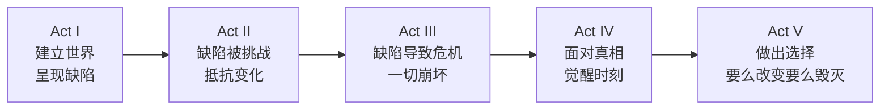

# 讲故事技巧速查表

## 开场技巧

| 技巧 | 原理 | 示例 |
|------|------|------|
| 意外变化 | 大脑持续扫描变化，变化立即吸引注意 | "妈妈今天死了。或者昨天。" |
| 变化威胁 | "恐怖不在于爆炸本身，而在于对它的预期"(Hitchcock) | "德思礼一家 perfectly normal——thank you very much" |
| 信息缺口 | 不完整信息集激发好奇心 | "雪在融化，Bunny 已经死了好几个星期了" |

## 保持吸引力的四大引擎

### 1. 信息缺口（第02课）

> 好奇心 = n 形曲线，最佳位置是"有点知道但不完全确定"

- 在适当时机揭示信息
- 用神秘盒子维持悬念
- 让观众自己拼凑答案

### 2. 心智理论（第02课）

> 每个场景问：角色 A 认为角色 B 在想什么？

- 让人物的心智模型出错的时刻 = 戏剧
- 陌生人心智读取准确率仅 20%，朋友 35%
- 喜剧建立在心智理论错误之上

### 3. 神经模型构建（第03课）

> 阅读 = 在脑中构建神经电影

- **主动句 > 被动句**：Jane kissed Dad 优于 Dad was kissed by Jane
- **具体 > 抽象**："深蓝色地毯"优于"好看的地毯"
- **展示 > 告知**：不要写"可怕"，让读者自己觉得可怕
- **感官多重激活**：视觉 + 嗅觉 + 触觉 + 听觉

### 4. 隐喻与联想（第03课）

> 大脑每 10 秒使用 1 个隐喻

- 新鲜隐喻激活额外神经区域，产生更多意义
- 陈腐隐喻不会激活运动系统
- 隐喻让抽象概念获得物理属性

## 角色塑造工具箱

### 圣缺陷发现流程（第07课）

```
选择起点 (Milieu / What-If / Argument)
    ↓
找到圣缺陷（破碎的控制理论）
    ↓
定位起源创伤（何时、如何形成的）
    ↓
创造特征世界（环境即心理）
    ↓
设计故事事件（测试缺陷的事件）
    ↓
构建五幕结构（面对 → 抵抗 → 崩溃 → 觉醒 → 选择）
```

### 圣缺陷提示句

| 句式 | 用途 |
|------|------|
| "别人最欣赏我的一点是……" | 角色自我认知的优势 |
| "我只有在……的时候才安全" | 角色的安全感来源 |
| "人生最重要的是……" | 核心价值观 |
| "幸福的秘诀是……" | 简化的人生哲学 |
| "我最棒的一点是……" | 自我标榜的核心特质 |
| "别人最可怕的一点是……" | 对外界的核心恐惧 |
| "我明白的别人都不懂的道理是……" | 傲慢/偏见的来源 |

### 三维角色构建（第05课）

| 维度 | 内容 | 对应 |
|------|------|------|
| 表面自我 | 社交面具，对外展示 | "想要"的层面 |
| 冲突自我 | 内心矛盾的多重声音 | "想要"的脆弱性 |
| 深层自我 | 无意识的真实需求 | "需要"的层面 |

## 情节设计

### 五幕结构（角色优先视角）



### 想要 vs 需要（第05课）

| 想要 (Want) | 需要 (Need) |
|-------------|-------------|
| 有意识的目标 | 无意识的需求 |
| 角色会直接说出来 | 需要通过行动揭示 |
| 通常源于圣缺陷 | 克服缺陷才能获得 |
| 表层情节的驱动力 | 深层主题的来源 |

## 对话写作原则

- 对话暴露**心智理论错误**（角色对他人的误解）
- 对话是**未说出的内容**比说出的更重要
- 每场对话都是**地位博弈**
- 角色说话的方式 = 性格的直接窗口

## 结局设计

| 要素 | 功能 |
|------|------|
| 最终之战 | 角色面对缺陷并作出关键选择 |
| 上帝时刻 | 角色获得深刻洞察 |
| 控制感 | 观众终于理解一切如何关联 |
| 安慰 | 混乱被赋予秩序，意义被揭示 |

## 常见陷阱

| 陷阱 | 问题 | 解决方案 |
|------|------|----------|
| 情节配方 | 角色为情节服务，缺乏灵魂 | 从缺陷开始，情节自然生成 |
| 圣缺陷模糊 | "他很骄傲"太笼统 | 用提示句找到精确的圣缺陷 |
| 过分依赖环境 | 概念有趣但无人将代入 | 用人物优先解决 |
| 反面角色扁平 | 反派纯粹邪恶 | 反派也是自己故事中的英雄 |
| 忽略潜意识 | 只有行动没有内心挣扎 | 建立"想要"和"需要"的张力 |

> Will Storr, *The Science of Storytelling*, 2020.