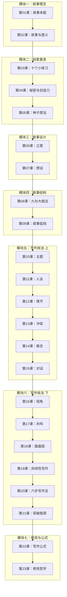

# 课程地图



## 学习建议

### 路径一：顺序学习（推荐）
按课程编号从第01课到第23课依次学习。各模块前后依赖，前面的知识是后面练习的基础。

### 路径二：快速套用
如果已经有故事创作经验、想快速获取实用工具：
> 第08课 → 第09课 → 第11课 → 第13课 → 第14课 → 第18课 → 第20课 → 第22课 → 第23课

### 路径三：按需查阅
| 你想解决什么问题 | 推荐课程 |
|----------------|----------|
| 找不到灵感/素材 | 第03、04、05课 |
| 写不下去/结构散乱 | 第06、07、08、09课 |
| 人物扁平不生动 | 第11课 |
| 情节平淡无冲突 | 第12、13课 |
| 读者没耐心读完 | 第14、18课 |
| 对话写得像说教 | 第15课 |
| 故事没有感染力 | 第16、17课 |
| 初稿粗糙需要修改 | 第22、23课 |

## 课程结构

```
模块一：故事的理念（第01-02课）
  └─ 为什么我们需要故事 / 故事如何赋予生活意义
  
模块二：故事创意激发（第03-05课）
  └─ 10个生活练习 → 秘密写作 → 种子想法培育
  
模块三：故事设计（第06-07课）
  └─ 立意（戏剧性问题） → 预设（故事世界的真理）
  
模块四：故事结构（第08-09课）
  └─ 9句大纲法 → 叙事弧线五阶段
  
模块五：写作技法·上（第10-15课）
  └─ 主题 → 人设 → 情节 → 冲突 → 悬念 → 对话
  
模块六：写作技法·下（第16-21课）
  └─ 视角 → 共鸣 → 画面感 → 非线性写作 → 六步法 → 突破瓶颈
  
模块七：写作公式与修改（第22-23课）
  └─ 好故事的公式 → 最终修改清单
```