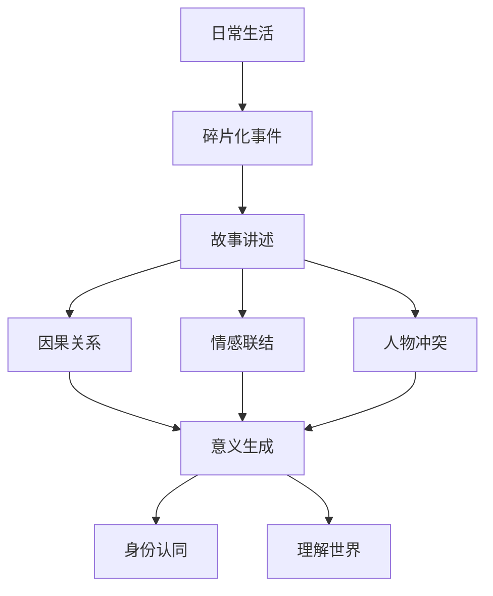

# 第01课：故事的本能——我们为什么渴望故事

## 学习目标

- 理解人类为什么天然渴望故事
- 识别故事的核心：麻烦缠身的人物
- 对比平淡叙述与精彩故事之间的差异
- 认识讲故事技巧的重要性

## 我们天然渴望故事

人类天然渴望故事，因为故事好听、好看。从远古时代围坐在篝火旁口耳相传的神话传说，到如今刷不完的电影、剧集和小说，故事始终是人类生活中不可或缺的部分。每个人内心都蕴藏着巨大的能量，需要一个出口。对于写作者而言，讲故事就是那个出口。

但渴望只是起点。要想讲好一个故事，除了渴望和勇气，你还需要一套系统的技巧。这就像每个人都想唱好歌，但仅凭热爱无法让你登上舞台——你需要练习发声、理解乐理、掌握技巧。

> [!NOTE] 故事的本质
> 故事的根本并非华丽的辞藻或精巧的结构，而在于**麻烦缠身的人物**。故事的真正精髓，是记录人物如何应对高风险、高收益的麻烦事。一个好的故事要给读者坐过山车一样的体验——呼吸急促、尖叫连连。

## 两种讲述方式

让我们通过一个经典案例来理解讲述方式的巨大差异。

同样是《老人与海》的故事，有两种完全不同的讲法：

### 平淡的叙述

一位老人独自划着小船出海，钓到了一条非常大的鱼。这条大鱼把小船拖到了大海的深处。老人与大鱼较量了两天两夜，期间还与闻着血腥味赶来的鲨鱼搏斗。最后老人回来时，这条大鱼剩下不到一半了。当几个捕鱼人赶来时，看到老人正在流泪。

### 有血有肉的故事

一位老人独自驾着一条小船，在湾流中捕鱼。这一次他已经连续84天一无所获。头40天还有个男孩跟着他，老人教会了男孩捕鱼，孩子爱他。后来男孩的父母觉得这老头运气太差，就安排男孩上了另外一条船。但男孩还是常常过来和老人聊天，用他们专属的对话方式。

老人浑身上下都显得苍老，只有那双眼睛，有着和大海一样的颜色，看上去生机勃勃，有一股不服输的劲儿。

一天老人再次驾着小船出海，这一次他钓到了一条巨大的马林鱼。这条鱼亮闪闪的，头部和背部呈深紫色，尖状的嘴足有棒球棒那么长。它是那么漂亮、沉静、高贵，老人对它充满了敬佩。与此同时，老人总是想起：如果那个男孩在就好了。

老人与大鱼进行了两天两夜的较量，终于将大鱼弄上了船。追随而来的鲨鱼对大鱼和老人发起了进攻，老人用尽力气与鲨鱼搏斗。他用木棍狠狠地将鲨鱼打晕，一只、两只……经过全力战斗，老人最后带着剩下的半条鱼回来了。

虽然筋疲力尽，但他知道：没有什么能把他打垮。一个人可以被毁灭，但不能给打败。

一个好的故事诞生了——这便是海明威的《老人与海》。

| 对比维度 | 平淡叙述 | 有血有肉的故事 |
|---------|---------|--------------|
| 人物背景 | 无 | 84天一无所获、与男孩的羁绊 |
| 情感温度 | 零度 | 敬佩大鱼、思念男孩、不服输 |
| 细节密度 | 事件梗概 | 眼睛的颜色、鱼的形态、专属对话 |
| 主题升华 | 无 | "一个人可以被毁灭，但不能给打败" |
| 读者体验 | 知道发生了什么 | 感受到人物在经历什么 |

> [!TIP] 关键启示
> 同样的情节框架，不同的讲述方式决定了故事的生命力。不要只告诉读者"发生了什么"，要让他们感受到"人物正在经历什么"。

## 故事的意义：身份认同

1951年，在加勒比海岸的一个小镇上，一位富商爱上了一个出身平庸的姑娘，于是买下镇上最豪华的房子，举行了奢华的婚礼。新婚之夜，他发现新娘不是处女，就把新娘送回了娘家。新娘遭到毒打和逼问，无奈之下说出一个青年的名字，说是他破坏了自己的贞洁。新娘的两个哥哥为了家庭的荣誉，扬言要杀了那个青年。然而，全村没有一个人阻止了这场悲剧。

三十年后，加西亚·马尔克斯重返小镇，一一寻访故事的参与者和目击者，最终写下了《一桩事先张扬的凶杀案》。他说："我们这样做并不是由于渴望解开谜团，而是因为，如果不能确知命运指派给我们怎样的角色和使命，我们就无法继续活下去。"

故事给了我们身份认同，故事给了我们意义。我们对讲故事能力的渴望，和我们听故事的渴望一样强烈。

## 故事的五个创作步骤

本课程将帮助你通过五个步骤，从零开始写故事：

1. **种子想法** —— 找到故事的萌芽
2. **立意** —— 让你的故事立起来、站住脚
3. **搭建结构与塑造人物** —— 情节、冲突、人物刻画
4. **写作与打磨** —— 对话、视角、画面感
5. **修改** —— 最终打磨，让故事发光

> [!WARNING] 常见误区
> 很多初学者认为故事创作靠的是灵感和天赋，因此迟迟不敢动笔。实际上，故事创作是一项可以习得的技能，它需要的是系统的方法和持续的练习，而不是等待缪斯降临。

## 实践练习

> [!QUESTION] 自我检测
> 回忆你最近看过的一个让你印象深刻的故事（可以是电影、小说或剧集）。试着用两种方式重新讲述它：第一种，只用三句话概括情节（平淡叙述）；第二种，加入一个关键细节和一种情感色彩（有血有肉的故事）。观察两者给听者带来的不同感受。

查看参考答案

以《肖申克的救赎》为例：

**平淡叙述版**：一个银行家被冤枉入狱，在监狱里待了二十年，挖了一条隧道逃了出去，最后在墨西哥过上了自由生活。

**有血有肉版**：一个银行家被冤枉送进了肖申克监狱。在那里，他目睹了狱友被体制化后的崩溃，也结识了被判无期的瑞德。他用20年的时间，用一把小锤子，在墙上挖了一条隧道。每个夜晚，当其他囚犯沉睡时，他在黑暗中一寸一寸地敲掉墙壁。越狱那晚，他爬过500码的污水管道，在暴雨中张开双臂——那一刻，他失去的不仅仅是监狱的高墙，更是对"体制"的恐惧。他留给瑞德的话是："要么忙着活，要么忙着死。"

对比两者的差异：第二版不仅包含事件，还包含了人物的处境、内心的挣扎、主题的升华和情感的冲击力。

## 课后任务

回顾你今天接触到的每一个故事——新闻、社交媒体上的帖子、朋友讲述的经历——试着分析它们为什么吸引人（或不吸引人）。把观察记录下来，这将是你作为写作者的第一份素材库。

现在你已经理解了人类为什么渴望故事，下一课我们将深入探讨故事与意义的关系：[[0002-story-and-meaning|第02课：故事与意义]]——没有故事，我们每个人都是碎片。