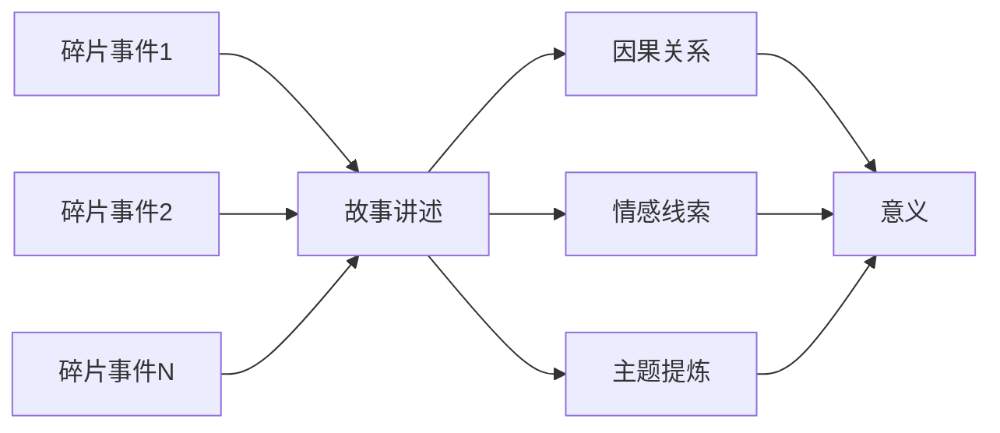
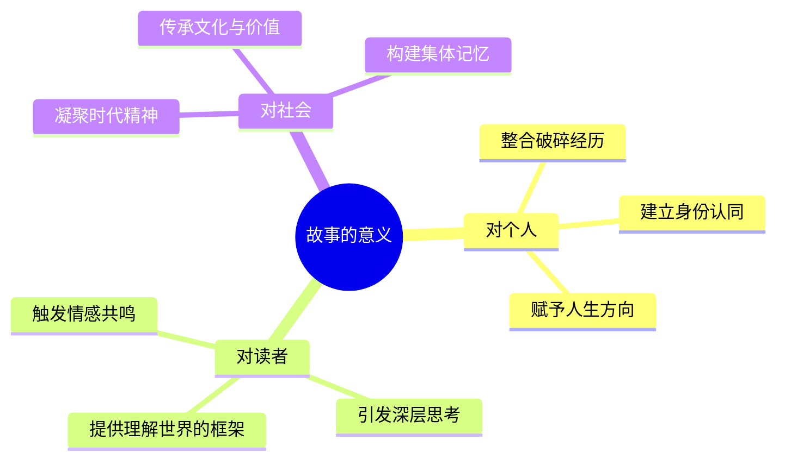

# 第02课：故事与意义——没有故事，每个人都是碎片

## 学习目标

- 理解故事如何赋予生活以意义
- 掌握将碎片化事件转化为故事的核心方法
- 运用因果关系、转折连词和冲突构建故事张力
- 认识故事对人类理解世界的必要性

## 没有故事，每个人都是碎片

由作家郝景芳主讲的本课的核心观点是：如果没有故事，如果没有我们对生活的讲述，那么任何人的生活都是碎片化的，是一盘散沙。

为什么这么说？我们需要从一个根本的问题谈起：我们的意义在哪里？小到一次事件的意义，大到人生的意义、世界的意义。人工智能每天也可以接收到很多信息，可以阅读到很多世界上发生的事情，但它处理这些信息的方式和我们人类有什么不一样呢？如果我们把生活中的一切都看成信息和碎片，那么意义本身发生在哪里呢？生活中的这些事件到底是一些随机的碎片，还是有发生的意义呢？

故事就是世界的意义。故事是日常所有碎片信息的连接方式。本来这个事情没有什么意义，但是故事让这些碎片连接在一起，就有了意义。

> [!NOTE] 核心命题
> 故事并不是事件本身，也不是万千琐事的简单罗列。故事本身就是你的讲述方式，是一种你看待这些碎片的方式，是你选出哪些碎片、把它们组合起来，以及你想通过这样的碎片达到什么样的目的、呈现什么样的讲述内容。

## 从碎片到意义

每个人从小到大经历了很多事情，这些事情是每天随机发生的，它们其实没有直接的因果关系。但是如果你给它一个讲述，你就可以这样说：

"我小学四年级的时候，偶尔看到一本书，后来就尝试写了东西。再后来我上了初中，把写的东西拿给语文老师看，他给了我很大的鼓励，那个时候我就有了新的写作想法。到高中的时候，我参加了新概念作文比赛得了一等奖，这让我产生了当作者的念头。后来我就出了书，还得了雨果奖。"

如果这样讲起来，似乎一切都是顺理成章、互为因果的。但实际上不是——所有的这些事件都是零星的，在它们之间并没有必然的联系。但是通过把这些碎片事件连接起来，给它们建立了联系，就把生活中的一些碎片组成了一个故事。故事的讲述方式就是人生方式。

这就好比一个句子：我们不能把句子拆成笔画和字母去寻找它的意义。句子的意义完全在于这些字母和词语的拼装方式。同样，段落的意义、故事的意义，都在于最终的讲述方式。

## 三个关键工具：如何把碎片变成故事

### 工具一：因果关系

在《故事技巧》一书中提到：故事不是简单的叙述。如果说"国王死了，王后也死了"——这是按照时间发生顺序进行的叙述，但不能算故事。国王可能死于一种疾病，王后死于另一种疾病，毫无关系。

但如果说"国王死了，王后因为哀痛而去世"——这就是故事了。我们给这个事件赋予了因果联系，它马上就有了很强的故事意味。

如果我们进一步思考：王后因为哀痛而死，那她是有多么爱国王啊？国王是为什么死的？王后为什么这么哀痛？王后哀痛到死去的过程中发生了什么？——我们会本能地希望知道事件之间的因果关系。这种本能正是小说家得以生存、小说家得以受欢迎的原因。

无论是作者还是读者，心里都渴望着给碎片的世界一个相对完满的讲述方式。有时候加一个简单的动机，就可以使事件变成故事。

| 叙述类型 | 例句 | 是否有故事性 | 原因 |
|---------|------|:----------:|------|
| 时间顺序叙述 | 国王死了，王后也死了 | 否 | 两件事无关联 |
| 因果叙述 | 国王死了，王后因哀痛而死 | 是 | 建立了因果关系 |
| 深入因果 | 国王被刺杀，王后因哀痛绝食七日而死 | 强故事性 | 多重因果链引发想象 |

### 工具二：转折连词

"A很愤怒，但是B默默吃饭"——这样的两个句子中间如果没有连接，就是不相关的两件事：很可能是餐厅里的两个人，一个在生气，另一个在吃饭，毫无关系。

但如果加上一个转折连词"但是"，一切就变了。A很愤怒，但B故意不理A。B是故意在这里默默吃饭——那么接下来我们就会揣测：他们两个人的关系是什么？A为什么愤怒？B为什么默默吃饭？B默默吃饭也许是想示威，也许是想逃避。因为这样一个关系，我们对两个人的人际关系进行猜测想象。

一旦我们建立人物之间的关系和事件之间的联系，事情本身就会触发读者的思考。故事的意义就在于故事把无关的事件联系起来，而这个联系在一刹那引发读者深入的联想和思考。

> [!TIP] 转折的力量
> 在写作中，转折连词（但是、然而、却、可是）是最廉价的冲突制造机。当你觉得故事平淡时，试着在两个句子之间加上一个"但是"——奇迹往往就此发生。

### 工具三：冲突

"猫坐在垫子上"——这本身完全不是一个故事，这只是一张照片。但是如果你加上一个限定词："猫坐在**狗的**垫子上"——故事立刻就出来了。

我们会立刻去想：这是一条什么样的狗？狗为什么不在？猫为什么坐在它的垫子上？狗回来了会怎么办？狗回来了会把猫赶走吗？它会和猫打架吗？猫会还击还是会跑掉？

冲突是什么？冲突是引入两个个体不同的诉求——不管是利益诉求还是精神诉求。一旦个体的某个行为或诉求跟其他个体的行为或诉求有矛盾，立刻就产生了冲突。一旦有冲突、有人际关系，许许多多问题在瞬间就产生了。

这种人际关系之间的交互与升级，会产生许多新的疑问——新的疑问带来新的故事，新的故事又带来新的疑问。

> [!WARNING] 常见误区
> 很多初学者以为故事必须有宏大的矛盾和激烈的对抗才算有冲突。事实上，最动人的冲突往往发生在最微小的日常之中——一个眼神、一次沉默、一个没有接起的电话，都可能比一场战争更富有张力。

## 故事不是消遣，而是必需

我不同意说故事是生活以外的消遣。我一直认为，故事是我们更好地去生活、更理解生活的必需。

从七万年前人类诞生到现在，我们一直需要故事。你回顾自己的一生，给自己讲述人生故事，才能把自己整合成一个完整的人。而小说家通过讲述万千碎片的故事，把这个时代讲成一个很圆融的整体。就像狄更斯说的："这是一个最好的时代，也是一个最坏的时代。"——到底是一个什么样的时代？狄更斯同时代的人也许根本没有一个整体的观念，但是狄更斯会用几个词把他所生存的世界总结出来，这个世界就有了整体样貌，就有了意义。

## 实践练习

> [!QUESTION] 因果转换练习
> 以下三组"叙述"都只是事件的简单罗列，请为每一组加上因果关系，将它们改写成"故事"。
>
> 1. 她打开了门。她看到了那封信。她哭了。
> 2. 他辞去了工作。他买了一张火车票。他去了一个陌生的城市。
> 3. 他一直没说话。她收拾了行李。她走出了家门。

查看参考答案

**第1组改写示例**：她打开了门，看到了地上那封信——信封上是他熟悉的字迹。三个月了，他终于回信了。她用颤抖的手拆开，读完后，眼泪无声地滑落。他知道了一切，但他说"对不起，请忘了我"。

**第2组改写示例**：他辞去了那份做了七年的工作——在同一个格子间里，他逐渐忘记了自己曾经想成为一个什么样的人。那天晚上，他买了一张去往漠河的火车票。他要去中国最北的地方，不是因为那里有什么，而是因为他还不知道自己在寻找什么。

**第3组改写示例**：他一直没说话，只是看着窗外。她等了很久，从黄昏等到夜深。最后她明白了——有些沉默本身就是回答。她收拾了行李，轻轻带上门。在楼道里，她没有听到身后有任何声音。那个夜晚，她终于承认：不是所有的爱都能被回应。

## 课后任务

从今天的日常生活中找出三件看似毫无关联的小事，尝试用因果关系将它们编织成一个微型故事。字数不限，但必须有"因"有"果"。完成后回顾整个过程，思考：是什么让你的编织具有说服力？

回顾上一课：[[0001-why-we-crave-stories|第01课：故事的本能]]，然后继续前往下一课：[[0003-ten-exercises-from-life|第03课：从生活出发]]，我们将通过十个小练习找到故事的雏形。