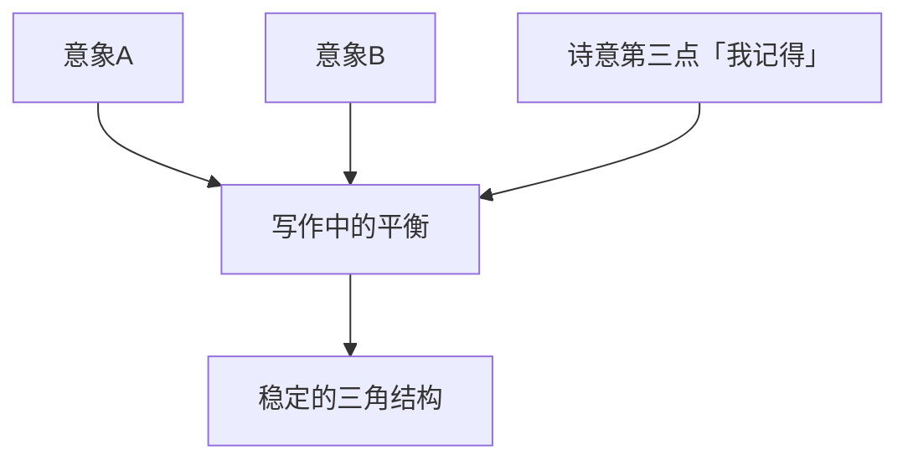

# 第03课：从生活出发——十个小练习

## 学习目标

- 掌握从日常生活中提取写作素材的方法
- 完成十组渐进式的创意写作练习
- 培养扎根大地、放飞想象的双重能力
- 将零散的意象编织成故事雏形

## 从生活出发

一提到写作，大家往往会联想到一些很宏大的命题，比如爱、纠葛或是死亡。但事实上，所有这些抽象的概念都源自于我们实际而具体的日常生活当中。写作其实是来自我们体内的气息，是关于身体的，关于一些非常实在的具体的东西——就像跳舞、吃东西、做梦、打呼噜一样。

美国印第安纳大学资深的创意写作教授凯瑟琳·鲍曼（Catherine Bowman）设计了这十个小练习，帮助你深入自我、深入日常生活。那些曾经被你所忽视的细节，也许正是写作最有生命力的地方。

> [!NOTE] 练习准备
> 准备好纸和笔。这些练习需要你亲手书写，不要用电脑——手写会激活大脑中不同的区域，让创意更容易涌现。每个练习之间不要停顿太久，让思绪自然地流淌。

## 十个练习详解

### 练习一：扎根大地

在写作当中可以破坏规则，从而产生创意，但首先我们要深深地扎下一个根，从而牢牢地站在大地上。

现在请你在大脑里面想象**四个具体的意象**。它可以是一个场景，也可以是一个事物。请记住，你要像一个摄影机那样把它的特点记录出来，不要有任何引申的意义。

> 例如：一只白色的小鸡站在一辆红色的汽车旁边。或者：在一棵银杏树下，有个男人躺在一张椅子上。

这四个具体的意象可能与你的触觉、视觉、听觉、味觉或嗅觉有关，但不要说出它的意义，就只停留在具体的意象上。比如：一个婴儿用的小条羹，上面还有牙齿的印记。

### 练习二：平衡

写作就像文字在纸上跳舞一样。如果要保持平衡，不能只是侧重某一方面，而需要由好几个方面不同的力量来对抗，达到某种平衡——这样舞蹈才会好看。

把刚刚写下来的句子或短语中自己最喜欢的那个意象圈出来，然后再写几句话，就像给之前的意象找"伙伴"一样——跟它有关，但又不能是一样的。比如从"牙齿的印记"跳到"穿着黄色围裙的妈妈在厨房"的意象。跟刚才一样，要写具体的东西：具体的颜色、味道、触觉、声音，哪怕只是简单的一句也可以。

### 练习三：三角地图写作法

要达到一种稳定的平衡，就要形成一个三角的关系。在这一步，我们要添加一个抒情的、诗意的意识。诗歌与歌两者往往有很紧密的关系，所以一般讲到诗歌时，往往会谈到文字当中的音乐感。

当我们旅行的时候，不会从出发点直接走到目的地——也许会走到一个不知名的地方，看到一片美丽的风景，我们会绕一下路，去其他地方逛一逛，而不是直奔目的地。写作也是这样，要绕一绕，而不是平铺直叙。

跳出刚才创作的那两个意象，跳到第三个点上去。不要考虑跟前面两句话有什么关联，就以"我记得"作为开头，让这个想法把你的思维扩散开去。写下让你印象非常深刻的东西，要具体、要有细节。还是跟刚才的要求一样：要有具体的颜色、味道、声音，并且文字要有音乐之美。

### 练习四：中间地带

十月是一个过渡性的月份，既有些冷又有一点热，有点像你对一个人又爱又恨的感觉。写作的时候也是这种既爱又恨、既喜欢又讨厌的感觉。最好的写作往往是那种能把矛盾的情感融合在一起的作品，让不同的力量牵扯对抗。

分两步完成：

**第一步**：先问自己一个问题，然后做出回答，但内容要与提问无关——也就是答非所问。例如：问"今晚你想吃什么？"回答说"我听说日本发洪水了"；问"你有没有养过狗？"回答说"向日葵总在六月开放"。

**第二步**：刚才我们写了好多的场景，都是一个个不连贯的画面。现在需要把它们归拢一下，从中挑出四个词，把它们串联成一两句话。例如：第一个词是"黄色"，第二个是"风"，第三个是"星星"，第四个是"桃子"。最后这句话可能会写成："一个男人骑着黄色的自行车，带着一些桃子走在星光下。"——这样就出现了一个新的组合，形成了一个新的意象、新的场景。

> [!TIP] 中间地带的力量
> 答非所问在写作中不是错误，而是通往潜意识的捷径。当你不按常理出牌时，最真实的、最未被修饰的情感往往会浮现出来。

### 练习五：不稳定

之前我们已经有了一个相对稳定的结构，下面要让它动荡起来，处于一种不稳定的状态。

回想一下生活中有没有这样的时刻——觉得自己好像跟周围的环境和人都格格不入，或者觉得挺迷失的，好像内心已经没有了力量，不知道自己该怎么做。把这样的状态用几句话描述出来。注意，不一定非得是很大的失落或沮丧——一些小小的不高兴、小情绪、小沮丧都可以，就是生命中不愉快的时刻。可以与前面的内容没有关联，待会儿你会发现有意想不到的效果。

### 练习六：开心的事

线性思维的写作是很无聊的，写作也是要跳来跳去才有趣的。如果作者自己都觉得很无聊的话，读者会喜欢这样无聊的作品吗？

我们首先要扎根在大地上，确保自己跳来跳去都不会飞起来——就像一棵大树，根茎拼命地往下扎，枝叶才会向上生长。没有深扎的根，就没有伸向空中的繁茂枝叶。写作也是一定要跟日常生活紧密相连：吃了什么、天气怎样、打了个喷嚏或是哭了、听了什么音乐——都是生活中的具体细节。

在练习五中我们写了生命中比较沮丧的时刻，那么在练习六中，就要写生活中让你开心的东西。例如，练习五写"我失去了丈夫，觉得很伤心，不知道自己该怎么办"，那么练习六就写"他帮我烤了一条鱼，我是多么喜欢这条鱼"，或者是"早晨醒来闻到咖啡的香味"。练习六所写的内容可以与练习五有关联，也可以没有——主要是写你在日常生活中喜欢的、觉得高兴的细节、场景或意象。要写三个。

### 练习七：物质到精神

我们要在日常生活中发现超常的东西，充分发挥想象力，营造一个神奇的世界。

到目前为止，我们做的练习都是跟五感（味觉、嗅觉、视觉、听觉、触觉）有关的，一直处在现实世界当中。下面我们要跳一步，跳到精神世界里，去发现在日常生活中不会出现的内容。

回顾一下自己写的前六步，从里面找到一个意象或细节，把它抽出来，放到一个非真实的、想象的世界里去。

> 例如：我曾经在文章里写到"口袋里有一枚硬币"。在等车的时候，我要把这枚硬币投进公交车的投币箱。在那一刻，我突然想象硬币变成了一条鳗鱼，游到了大海当中——因为那天刚好在下雨，而鳗鱼是喜欢水的。

### 练习八：创造自己的天堂

把你前面七步的内容读一遍，看看它反映了自己的哪部分特质，有没有一些之前没发现的东西。

接下来再写两到三句话或短语，把你看到的那个"自我"写出来——看看自己创造出了什么东西。可以是解释性的语言，也可以用具象的描述。

> [!NOTE] 自我发现
> 写作不仅是向外表达，更是向内探索。当你回看自己写下的文字时，你可能会惊讶地发现：原来我一直在乎的是这件事，原来我的快乐和悲伤都围绕着同一个核心——这就是你的写作主题，就是你的"天堂"。

### 练习九：走出舒适区

从之前所写的东西里找出一个意象，把它从原来的语境中抽出来，放到野蛮或文明的场景中，凭你自己的喜好任选其一。

在做梦的时候，经常会有些不合逻辑的场景出现——可能是在厨房里看到一头牛，或是打开抽屉发现里面有个鸟巢，或是看到树上挂着个茶杯。把这种错位和移位的场景表现出来。

### 练习十：上升与下降

最后一步，要用类似于三角结构这样的写法——它们并不一定要构成一个完整的三角形，但两者之间要有一个对应的关系：一个下降，一个上升。

在古老的故事传说中，经常会有关于下降或上升的内容。请你写两句话：第一句写过去，第二句写现在。把之前写过的那些意象再做一次回顾，看看能不能从中找到一个可以帮你想起一些过去的事情——也许能让你联想起自己祖先的故事，让你走进历史。

第一句写过去或是自己内心深处的某个部分，然后第二句要再把你带回到现实当中来。第一句下降，第二句上升。

最后，试着把所有练习的内容尝试构成一个完整的故事，并且读出来。

| 练习编号 | 练习名称 | 核心动作 | 训练目标 |
|:-------:|---------|---------|---------|
| 1 | 扎根大地 | 记录4个具体意象 | 观察与捕捉 |
| 2 | 平衡 | 给意象找伙伴 | 联想与跳跃 |
| 3 | 三角地图 | 加入诗意的第三点 | 音乐性与扩散思维 |
| 4 | 中间地带 | 答非所问+串连意象 | 突破逻辑束缚 |
| 5 | 不稳定 | 描述迷失状态 | 接纳负面情绪 |
| 6 | 开心的事 | 写高兴的细节 | 平衡情绪光谱 |
| 7 | 物质到精神 | 意象飞入想象世界 | 超现实转化 |
| 8 | 创造天堂 | 从内容中发现自我 | 自我认知与主题提炼 |
| 9 | 走出舒适区 | 意象错位/陌生化 | 打破惯性思维 |
| 10 | 上升与下降 | 写过去和现在 | 时间纵深与整合 |

> [!WARNING] 常见误区
> 很多初学者在写意象时会不由自主地开始解释"这个意象的意义"。请克制这种冲动。意象本身就是意义——一只白色的小鸡站在红色汽车旁边，不需要任何解释，它自己就是完整的。意义会在这些意象的碰撞中自然产生。

## 实践练习

> [!QUESTION] 完整练习挑战
> 从今天开始，按照这十个练习的顺序完整做一遍。不要跳步，每个练习至少写两到三句话。全部完成后，把十个练习的内容连起来读一遍。你发现了什么？

查看参考答案与示范

以下是一个学员的真实练习示范（部分）：

**练习一**：① 一只白色的小鸡站在红色的汽车旁。② 银杏树下，一个老人躺在长椅上，脸上盖着草帽。③ 婴儿的小条羹，上面有牙齿印。④ 雨后的泥土气息，混着青草的味道。

**练习二**（伙伴跳跃）：从"婴儿的小条羹"跳到——妈妈穿着黄色的围裙在厨房里煎鱼，油锅滋滋响，她的额头上渗出汗珠。

**练习三**（三角地图——我记得）：我记得外婆家的井，夏天的西瓜泡在井水里，捞起来时水珠在绿色的瓜皮上滚动，闪着光。

**练习四**（中间地带）：
- 问：你幸福吗？答：窗外的梧桐树开始落叶了。
- 四个词串联：白色、小鸡、井水、煎鱼→白色的小鸡跳进了井边的水盆里，溅起的水花打湿了妈妈正在煎鱼的围裙。

**练习五至十**（继续......）

做完后回顾，你会发现这些看似零散的意象其实指向了同一个主题：童年与故乡。你的写作主题其实一直都在那里，只是你以前没有发现它。

## 课后任务

将你最喜欢的一组练习成果整理成一个微型故事（300-500字）。不必追求完整的情节，只需要让意象自然地流动。完成后把故事读出声来——你会发现，文字一旦被朗读，它的节奏和音乐感会告诉你哪里需要调整。

回顾上一课：[[0002-story-and-meaning|第02课：故事与意义]]，然后继续前往下一课：[[0004-write-your-secrets|第04课：写下你的秘密]]，我们将进入秘密与谎言的写作领域。