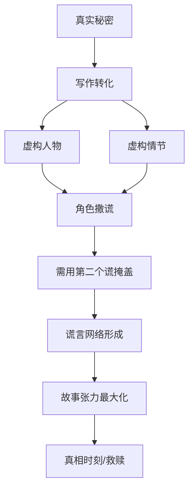

# 第04课：写下你的秘密——开启创造力

## 学习目标

- 理解秘密中蕴藏的创造力源泉
- 掌握从真实秘密到虚构故事的转化方法
- 运用"谎言写作"技巧编织故事网络
- 学会将内疚与遗憾转化为写作主题

## 秘密中的创造力

谈论秘密和谎言需要很大的勇气，毕竟秘密是用来保守的。但你一定也会承认：你不讨厌听到别人的秘密。我们每个人在生活中总是试图表现得冷静，好让自己看起来有能力控制自己的生活，可以做生活的主人。而谈论秘密和谎言，则很容易把我们推入失控且受伤的那部分自我，于是我们往往选择逃避。

但如果你是一个写作者，你渴望写出一些能打动人心的故事，那么千万别忽视了你内心深处的秘密花园——这将是你洞察力的源泉，甚至是启示。因为只有敏锐地把握自己，才能探索人物的内心世界。

写下你曾经试图隐藏的那部分内容吧——这会是一次让你心跳加速的练习。你将一步步逼近自己的内心，探索自己最不为人知的一面。这一刻，你既是自己，也是那个倾听秘密的树洞。

> [!NOTE] 核心观点
> 你的秘密里藏着巨大的创造力。那些你最不愿示人的部分，恰恰是你最独特的写作素材。因为没有人比你更了解你自己的秘密——这就是你作为写作者的不可替代性。

## 秘密写作练习

如果你害怕把自己的秘密拿给别人看，那么就抱着这样的一种心态去写：一旦写完，就把这些暴露真相的纸统统烧掉。你要做的只是在洁净的页面上敞开自己，唤醒你的人生记忆，将琐碎的生活细节转化为精彩的写作素材。

### 第一步：写下秘密

请你写下一个你藏了很久很久、从来没有告诉过任何人的秘密。想象一下，如果你把它说出来会发生什么？如果那个说出秘密的时刻到来了，你觉得是什么让你不再隐藏这个秘密，而选择把它说出来呢？你会把这个秘密讲给谁听？是那个你喜欢的人吗？为什么？或者为什么不？如果你把一个秘密告诉了某个人，而他却把你的秘密泄露给了另外一个人，你会是什么感受？

### 第二步：谎言写作

在《追风筝的人》里，阿米尔的爸爸对阿米尔说："罪行只有一种，那就是盗窃。其他罪行都是盗窃的变种。当你说谎，你偷走别人知道真相的权利。"但阿米尔的爸爸偷了阿里的女人——他对阿米尔撒了谎，偷了阿米尔得知有兄弟的权利，偷了哈桑知晓自己身份的权利。谎言、背叛、救赎，正是《追风筝的人》这部作品的内核。

请你写下一个你曾经撒过的弥天大谎。想象一下，就像老电影当中的那样——如果你坦白了，会发生什么？有没有对你来说非常重要的人曾经对你说谎，而你却发现了真相？你是什么感受？你又做了些什么？

接下来写一篇标题为《论谎言》的文章，去探索撒谎行为以及谎言的性质，把个人经验和哲学立场都融合进去。

最后写一个场景：一个角色正在向另外一个角色撒谎。然后再写第二个场景：必须撒第二个谎以掩盖第一个谎言。继续写下去，用这种方式为你的角色编出一个错综复杂的网络。

### 第三步：内疚与遗憾

内疚和遗憾的感觉可以是毁灭性的。我们如此深刻地感受到它们，以至于它们可以成为一种很好的创意源泉，也许还能成为你的写作主题。

试着写下一个你感受到的遗憾——你挣扎了好长时间才克服它。你做了什么、或者没做什么导致了那个遗憾？你是如何设法克服它的？它现在对你的生活还有多大影响？

为你的遗憾创造一个隐喻，使感受具体化为一个有形的物体，这样你就可以以一种崭新的方式去探索你的感受。用一个隐喻化的陈述开头，比如"遗憾就是蛰伏在心里的虫"，然后顺着这个比喻写下去。如果你更喜欢写小说的话，那就把这句话用在一个场景中，也可以直接以这个场景开头。

写一件让你内疚的事情。它在你内心是否仍然具有引发感情的能量？描述一下这种内疚的源泉，以及你要如何处理这种感受。

> [!TIP] 从情绪到故事
> 内疚和遗憾是最容易被忽视的故事引擎。一个心怀愧疚的角色远比一个完美的角色更有看头。当你不知道如何让人物变得立体时，给他一个无法释怀的遗憾——他立刻就有了灵魂。

## 让角色带着秘密活起来

写一个场景：一个角色自称感到内疚，但显然他并不那么想——用动作、手势和语言去解释他真正的感情。你也可以尝试用相反的途径做上面的练习：写一个场景或者一段独白，一个角色自称对内疚和后悔处之泰然，但显然他正在这些情绪中苦苦挣扎。

内疚和遗憾的陈词滥调是什么呢？哪些手势、行动、语言太过经常用来表达这些感情？给这些情绪设置一个人物，找到新的途径去表达它——避免那些耷拉着脑袋、愤怒、暴怒等自我憎恨的表情。理解并接受别人的罪过远比承认自己的内疚和后悔要好得多——或许你的角色可以通过这些感受找到一种新的目标和方向。

| 情绪 | 陈词滥调的表达 | 创新表达方式 |
|------|--------------|------------|
| 内疚 | 低着头说"对不起" | 反复擦拭一件早已干净的物品 |
| 遗憾 | "我本应该..." | 每天在同一时刻看向同一个方向 |
| 秘密 | 欲言又止、眼神闪躲 | 过度热情地谈论其他话题 |
| 羞愧 | 脸红、不敢直视 | 突然变得极其注重细节和秩序 |

## 从秘密到故事的转化技巧

秘密写作的核心在于转化——不是你把自己的秘密原封不动地写进故事，而是从秘密中提炼情感模式，然后将其嫁接到虚构的人物身上。

具体的转化步骤：

1. **提取情感内核**：你的秘密让你感受到了什么？恐惧？羞耻？解脱？那种情感就是你要保留的"种子"。
2. **剥离具体事实**：把真实的人物、地点、时间全部去掉，只保留情感结构。
3. **赋予虚构躯体**：为这种情感找到一个新的故事容器——不同的人物、不同的背景、不同的时代。
4. **放大与变形**：将原本的秘密进行夸张或变形，使其更符合戏剧需要。
5. **审查与保护**：检查成品，确保只有你自己知道原始素材的来源。

> [!WARNING] 写作与现实的边界
> 秘密写作不是为了暴露自己或伤害他人。在写作之前，你必须划清一条明确的界限：哪些是可以写出来的，哪些是你需要保护自己和他人不被伤害的。专业的写作者知道如何从真实中提取普遍性，而不是简单地自曝隐私。如果你不确定，先写下来，然后烧掉——写作行为的本身就是治疗和创造。

## 实践练习

> [!QUESTION] 综合创作练习
> 从以下三个主题中任选两个，写一个融合了秘密、谎言与内疚的微型故事（500字以内）：
> 1. 一个角色终于决定说出隐藏了十年的秘密
> 2. 一个谎言像滚雪球一样越来越大
> 3. 一个无法弥补的遗憾改变了角色的人生选择

查看参考答案与示范

**主题2示范：谎言雪球**

林芳告诉同事们她周末去参加了一场音乐会——其实她只是在家看了两天的电视。但周一中午，同事问："音乐会怎么样？"她不得不编造细节："很棒，小提琴手加演了三首曲子。"周三，部门主管说："听说你懂古典乐，下季度的团建就交给你策划了。"她点头，当晚搜索了三个小时的古典乐入门知识。

周五，主管让她在全员会上分享音乐会心得。她站在会议室里，面对着四十多双眼睛，突然说："其实我没去音乐会。我周末哪儿也没去。"

会议室安静了三秒。然后主管笑了："这个开场白不错，然后呢？"

林芳愣了一下。她发现自己无路可退——要么继续编下去，要么承认一切。她深吸一口气，说："然后我发现，不去音乐会的周末也可以很有意义。"

她讲了一个新的故事。这一次，是真的。

**分析**：这个微型故事展示了谎言是如何一步步扩大、最终迫使角色面对真相的。故事的张力来源于"收不了场"的窘境——这是每一个撒过谎的人都曾经历过的情感。

## 课后任务

选择一个你愿意面对的、较小的秘密（或者一个让你耿耿于怀的遗憾），按照本课教的"提取情感内核-剥离具体事实-赋予虚构躯体"三步法，将其转化为一个虚构人物的故事片段（300字左右）。注意：完成后检查一遍，确保没有任何人能从中看出原始素材的来源。

回顾上一课：[[0003-ten-exercises-from-life|第03课：从生活出发]]，然后继续前往下一课：[[0005-seed-ideas|第05课：种子想法]]，我们将学习如何利用种子想法展开故事情节。