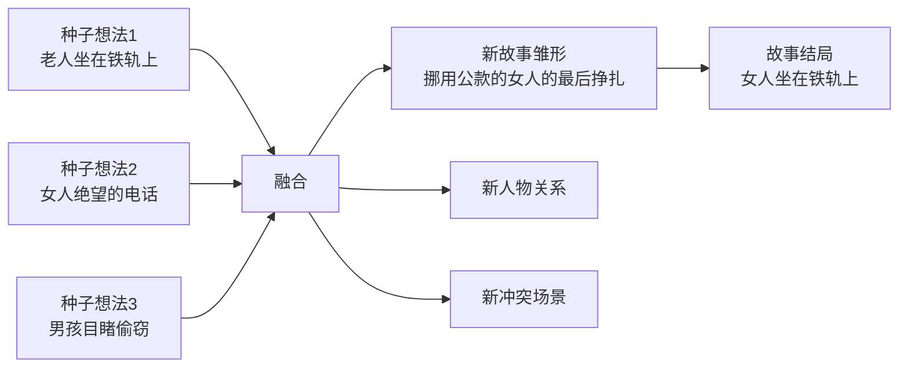

# 第05课：种子想法——展开故事情节的技巧

## 学习目标

- 理解什么是种子想法以及它为什么重要
- 学会从日常生活中捕捉种子想法
- 掌握"压缩融合法"，将多个种子想法编织成故事
- 培养随时记录和反复打磨种子的习惯

## 每一朵花起初都只是一粒种子

每一只鸟起初都是鸟蛋，每一朵花起初都只是一粒种子。同样的，当故事还小的时候，它也只是一些萌芽的种子想法。

这个种子想法可以是一个你脑海中模糊的形象，可以是一个你反复念叨的句子，也可以是一个你想了无数遍的开头，或者是一个概念、一段经历。不管多么微不足道，它都能使你的想象力得到充分的发挥，进而把这个想法变成一个更为丰满、有血有肉的故事。

例如，对于福克纳来说，看到荡秋千的小女孩露出带泥点的内裤，就是小说《喧嚣与骚动》的种子想法。一个如此微小的画面，最终生长成了一部伟大的文学作品。

> [!NOTE] 什么是种子想法
> 种子想法是故事的胚胎——一个画面、一句话、一个念头，它本身并不完整，但拥有生长的潜力。就像一粒种子包含了整棵植物的全部基因，一个好的种子想法也包含了整篇故事的核心能量。

## 到哪里去找种子想法

种子想法就在你的日常生活中，无处不在：

- 公交车上无意中听到的对话——有人说"昨晚他的女友把他的眼镜片打破了"
- 杂志上的一张照片——一个人正骑着马，艰难地在大雪之中行走
- 街角看到的一幕——一个老人坐在高高的铁轨上，来回摇晃，自言自语
- 朋友随口讲的一个经历——他的钱包被偷了，但三天后有人寄了回来，里面一分钱没少
- 你自己做过的梦——梦里你在一个陌生城市的车站，不知道要去哪里

你也可以从之前的写作练习中找找看——比如[[0003-ten-exercises-from-life|第03课]]的十个小练习，你写下的那些意象中，有哪些种子想法跳了出来，渴望被你进一步讲述？

关键是你需要**反复思考**这个种子想法：这个人是谁？他要去哪里？他从哪里来？发生了什么事？接下来会发生什么事？他的世界中还有谁？这个故事中还有谁？

一边想一边做笔记，想象人物，画出可能的场景。不要忘了，你是在努力将这个种子想法发展为一个新颖的、令人激动的、感情强烈的故事。

## 种子想法的特征

一个好的种子想法应该具备以下特征：

| 特征 | 说明 | 好例子 | 差例子 |
|------|------|-------|-------|
| 具体性 | 可感知的细节 | 一个老人坐在高高的铁轨上摇晃 | 某人进退两难 |
| 开放性 | 留有想象空间 | 一个女人对着电话说"我现在就会离开" | 一个女子为逝去的爱情憔悴 |
| 冲突暗示 | 暗示矛盾即将发生 | 小男孩看到有人从老人口袋偷钱 | 一个好人做了好事 |
| 独特性 | 有打破常规的元素 | 厨房里有一头牛 | 厨房里有锅碗瓢盆 |

## 四步压缩融合法

这是本课的核心技巧：像织毛衣那样，把几个种子想法编织成一个故事。

> [!TIP] 核心方法
> 创造力的一个基本方面就是把看上去不同、似乎毫无关联也毫无可能产生关联的事情联系到一起。天才可能不知不觉地就能把他们联系起来，而我们这些不是天才的人，也许就需要启动这个练习过程。

### 第一步：选出三个种子想法

不管是你偶然听到的、看到的、别人告诉你的，或是你亲身经历的，只要你觉得它可以作为小说中的一个人物或者一个冲突的起点，就可以。这些种子想法必须非常简短，通常是一个短语或者一句话就足够了，但是一定要非常明确具体，不能是模糊的抽象的概念。

好的种子想法示例：

1. 一个老人坐在高高的铁轨上，来回摇晃，自言自语。
2. 一个小男孩看到一个男人正从一位老人的口袋中偷一打钱。
3. 一名女子对着电话那头说："现在做什么都没用了，结束了，完了，我今天晚上就会离开。"

### 第二步：展开第一个种子想法

挑一个你最感兴趣的种子想法，花大约十五分钟，以草稿或笔记的形式把这个想法写成一个故事情节。在这十五分钟之内，你要写尽可能多的内容——至少要写明主要人物是谁、故事发生在哪里、什么时候、冲突是什么。你可能还要写点发生的事情。不过，不要担心写得好不好，只要去写就可以了。记住：你不是在写故事，你只是在打草稿——只要将十五分钟内能想到的东西写下来就好。

### 第三步：融合第二个种子想法

从剩下的两个种子想法中挑出一个，把它融入你已经写好的故事情节中——就好像把它压缩，然后放进第一个里，让两者互相作用。为了做到这一点，两个种子想法以及正在发展的故事情节可能需要做一点改变——这样就形成了第二个故事情节。不要害怕打乱原来的故情节，因为它一定会形成一个更新的、更有趣的情节。再用十五分钟对这个修改后的情节进行简单描述。

**融合示范**：

你可能首先写了一个关于"小男孩看到有人从老人口袋中偷钱"的故事。现在试着把"一个女人绝望地对着电话说她不得不离开"这个想法压缩植入到这个故事里。

要使这两个想法合二为一，你可能要把这个故事改为：一个女人挪用了公司的零散现金，害怕被抓而准备采取措施。她急切地想弄清楚接下来该怎么办，于是给朋友打电话，承认了自己做的事，并说自己没有别的出路，只能逃跑。

原来的故事中的"小男孩"被忽略了，而"偷钱的男人"换成了一个"挪用公款的女人"。由此，把两个完全不同的想法压缩在一起，产生了一个全新的故情节——通常这个新的故事要比第一个更新颖、更刺激。

### 第四步：融合第三个种子想法

再用十五分钟把第三个想法压缩进来。你可能会成功，也可能不成功，但是值得一试。同样的，压缩的时候原本的故事可能发生改变。

继续前面的例子：你可能突然意识到，"那个坐在高高的铁轨上来回晃荡的老人"可能变成了那个盗用公款的女人——这样故事的最后一幕也就有了：那个女人最后绝望了，周围的一切都向她逼近，最后的结局是她没有逃跑，而是坐在高高的铁轨上来回晃荡，难以脱身。

就这样，将三个种子想法揉杂到一起，你就形成了一个故事的雏形。

## 养成记录种子的习惯

你要养成一个好的习惯：不要放弃任何一个种子想法，随时随地记录下来。

准备一个专门的笔记本（或者手机备忘录），当你听到有趣的对话、看到动人的画面、脑海中闪过奇怪的念头时——立刻记下来。这些记录就是你未来的故事素材库。

等你正在进行故事创作时，翻翻这个素材库，试试看能否把其中的一些想法压缩融合进去。

> [!WARNING] 常见误区
> 很多写作者过于珍惜自己的第一个种子想法，不舍得让它被其他想法"污染"。但压缩融合法的精髓恰恰在于：让不同的种子互相碰撞、互相改变。你最喜欢的第一个想法很可能会在融合过程中被大幅修改甚至完全消失——这没关系。最终的故事才是目的，不是中间的任何一步。

## 实践练习

> [!QUESTION] 三种子融合创作
> 从以下五个种子想法中任选三个，按照四步压缩融合法进行创作：
>
> A. 一个男人每天在同一家咖啡店点同样的咖啡，坐了十年。
> B. 一个行李箱被错拿，里面装满了手写信。
> C. 一个女人在深夜的便利店里买了一把最便宜的伞。
> D. 一个孩子在学校门口等一个人，等了整整一个下午。
> E. 一个老人在拆迁的老房子墙壁里发现了一个铁盒子。

查看参考答案与示范

**选中的种子想法**：A + B + D

**第一步：展开A（咖啡店的男人）**
李明，35岁，单身，在中关村一家科技公司做程序员。每天早上8:15，他会出现在公司楼下的咖啡店，点一杯美式咖啡，不加糖。收银员小王认得他，已经认识他十年了。十年里，李明从初级程序员做到了技术总监，从一个人来变成了带着团队来。但是没有人知道，他为什么总是在8:15这个时间来。

**第二步：融合B（装满手写信的行李箱）**
把B压缩进来：李明十年前有一个女朋友，叫小鹿。他们在一起三年，后来小鹿出国了。分手那天，小鹿说："我会给你写信的。"她真的写了，每个月一封。前两年，信准时到达。后来间隔越来越长。最后一封信是在七年前——小鹿说她要结婚了。之后的某一天，李明在清理旧物时发现了一个行李箱，里面装满了小鹿写给他的信，一共37封。从那天起，他每天早上8:15到楼下的咖啡店——那是当年小鹿还在时，他们每天一起吃早餐的时间。

**第三步：融合D（在学校门口等了一下午的孩子）**
再融合D：转折发生了。十年后的某一天，李明的公司来了一个新同事——一个大学刚毕业的男孩。男孩姓陆。第一天上班，李明带他去喝咖啡。在咖啡店里，男孩看着墙上的钟说："我妈妈以前也爱在这个时间来咖啡店。"李明随口问："你妈妈在哪里？"男孩沉默了一下，说："她在我六岁那年去世了。她叫小鹿。"

故事的结尾：李明辞职了。没有人知道他去了哪里。收银员小王偶尔还会想起那个每天8:15来的男人。但她不知道，此刻李明正坐在一辆绿皮火车上——他要去男孩说的城市，看看小鹿生活过的地方。他的背包里，放着那37封信。

**分析**：三个原本毫无关联的种子想法，通过压缩融合法形成了一个完整的故事——一个关于时间、等待和告别的故事。每一个种子想法都在融合中改变了面貌，但都保留了各自的核心能量。

## 课后任务

在接下来的三天里，随身携带笔记本或使用手机备忘录，捕捉至少五个种子想法。它们可以是你听到的对话片段、看到的画面、突然冒出的念头。每天结束时，挑出其中两个种子想法，尝试用压缩融合法将它们合并成一个微型故事大纲（200字左右）。三天后，你将有至少三个故事雏形。

回顾上一课：[[0004-write-your-secrets|第04课：写下你的秘密]]。本课是"激发故事创意的头脑风暴"系列的最后一期，下一课我们将进入故事诞生的第二步——让你的故事立起来。欢迎继续学习后续课程。