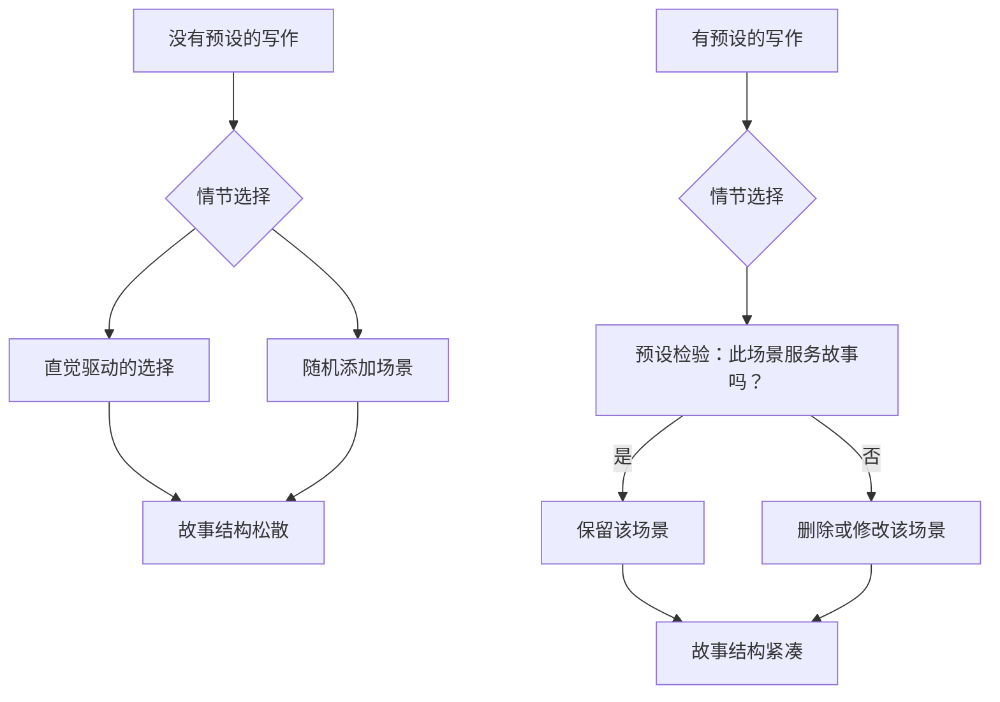
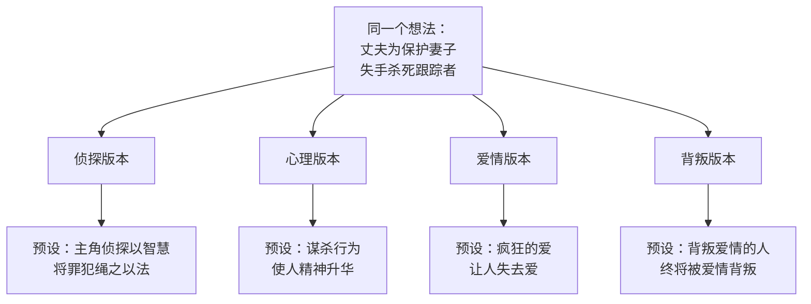

# 第07课：预设——故事世界的真理

## 学习目标

- 理解想法、立意、预设三者之间的递进关系
- 掌握预设的定义：角色 + 冲突 + 结论
- 学会回答两个关键问题以找到故事的预设
- 理解同一个想法如何演变为完全不同的预设版本

## 从想法到立意再到预设

在上一课中，我们学习了如何将一个模糊的想法通过"如果……将会怎样"的提问法提升为立意。但故事开发的过程并没有结束。立意让你有了故事的戏剧性前提，而**预设**则让你真正理解你的故事是关于什么的。

让我们用一个简单的例子来理解这三者的关系：

| 概念 | 示例 | 作用 |
|---|---|---|
| 想法 | 写一个关于如何在经济大萧条中生存的故事 | 故事的最初萌芽 |
| 立意 | 在经济大萧条中通过偷窃别人的食物生存下来 | 引入了冲突和利害关系 |
| 预设 | 一个男孩得知自己的父母在经济大萧条中靠着偷窃才活了下来，这个真相摧毁了他对父母的认知 | 将冲突置于人物身上，揭示了故事走向 |

看到了吗？**人物的介入**就是立意转化为预设的本质。立意告诉你"故事中发生了什么冲突"，预设则告诉你"这个冲突发生在谁身上，以及它导致什么结果"。

> [!NOTE] 预设的准确定义
> 预设是对发生在角色身上事件的叙述，也是故事里核心冲突的结果。简单来说，预设 = 角色 + 冲突 + 结论。

## 预设：故事结构的指南针

预设是一个作家最重要的工具之一。有了它，你的故事材料才得以被塑造。用强烈的预设来编织你的故事，你的作品将中心突出并富有戏剧性。

你可能会问：为什么一定要把控制性原则置于故事创作中？难道通过无拘无束的想象力来完成故事，不是更有趣吗？

的确，随着幻想流走的感觉很好——但这正是问题所在。创作故事是把幻想编织成清晰连贯事件的能力。而把这些幻想组织成一系列流畅事件的能力，就是预设的力量。

如果你不清楚预设是什么，你就像轻率地踏上了没有路标的旅途，而在路上到处都是偏僻小路与死胡同。在理想的故事中，一切都是相关的。一旦作者能够明确有力地表达预设，他就能用它来测试每个使剧情复杂化的因素，并追问：**这个情节对于完成故事是否有必要？**

## 两个关键问题

要找到故事的预设，你需要回答两个问题。

### 问题一：你的故事是关于什么的？

这个问题是在追问你故事的核心主题。很多写作新手明明有着丰富的素材，却不知道如何将它们变成好的故事，原因就是——他们不清楚自己想写的故事是关于什么的。

一个好的戏剧故事就是**人性的实验室**。它展示了作者深信不疑的某些人性面。故事应该写人们生活里的某些方面，而不是所有方面。在故事中，我们会把生活中一个或两个方面置于显微镜下，进行一场名为"冲突"的实验，并记录下发生的事。

> [!TIP] 核心洞察
> 如果你想写出精彩的故事，在故事的特定环境里，你必须对你所展现的人性价值观深信不疑。假设你要写一个跟爱有关的故事，你首先要明白：只有某种力量强大的爱才值得一写——不论是为人子女的、兄弟间的、爱人之间的，还是充满欲望的、偏执的。

### 问题二：在故事的角色身上会发生什么事？

当你有了一个好的故事模子，还需要思考：这个故事的主要镜头会落在谁身上？在他身上会发生什么事？

请仔细观察下面的例子：

> 如果你想写一个偏执的爱情故事，主要镜头落在男主人公身上。男主人公疯狂地爱着自己的妻子，甚至到了偏执的程度。他会因为害怕自己的爱人喜欢上别人，就把她捆绑在家里。这样的爱变得不可承受。男主人公最终失去了自己的爱人，自杀了。**偏执的爱使人走向死亡**，就是这个故事的预设。

一旦你有了预设，你就了解了一切。你会立刻知道：

- 男主人公的童年经历中，哪些是相关的——比如他母亲有无数的情人，他小时候经常看到父亲孤单地坐在客厅，这与预设吻合，所以应该保留。
- 哪些是多余的——比如男主人公的祖母对他非常溺爱，这个情节对证明"偏执的爱使人走向死亡"没有作用，因此应该删去。

## 四种预设版本的启示

假设你某天晚上做了一个噩梦，梦里你实施了犯罪行为，法律的裁决正向你逼近。你满身大汗地醒来，觉得这个题材似乎能成为一个很棒的故事。

这个噩梦是你的故事最原始的想法。第二天你坐在电脑前写下了这些想法，开始注入更多内容——一个平凡的男人犯下谋杀罪，或许是因为某些高尚的原因。后来你在报纸上读到一篇关于跟踪者的文章，于是故事更清晰了：一个女人的丈夫为了保护被跟踪的妻子，在争执中失手杀死了跟踪者。

现在你有了想法和立意，但仍然缺少**预设**。因为预设还包含了故事的结尾——角色们最后的结局是什么。

你的故事是关于什么的？在角色身上会发生什么？以下是一些可能的选择：

### 版本一：侦探故事

在这个设定中，主人公是一名侦探。故事预设也是典型的侦探小说预设：故事主角以果断的推理能力将罪犯绳之以法。故事的焦点在于展现凶手复杂的作案手法以及侦探更高明的破案能力。

### 版本二：中国版的《罪与罚》

这是一个关于悔改与心灵转变的故事。焦点从凶手的罪行与悔恨着眼，审视他的一生。警察轻而易举地捉住了凶手，但小说不会这样结尾，它将继续深入展示凶手的转变。预设是：**谋杀行为使人精神升华**。

### 版本三：爱情故事

凶手很爱他的妻子，不能想象如果妻子受到伤害会怎样。然而，妻子得知丈夫为她杀人后感到恐惧。故事以讽刺的事实结尾：他为爱而杀人，却失去了爱人。预设是：**疯狂的爱让人失去爱**。

### 版本四：背叛的故事

妻子故意令丈夫误以为被人跟踪，她想让丈夫杀害跟踪者。丈夫坐牢了，妻子也就摆脱了他。妻子和情人私奔，但情人知道她曾经的背叛行为后也背叛了她。预设是：**背叛爱情的人终将被爱情背叛**。

> [!WARNING] 关键认识
> 以上四种版本中的任何一种，只要处理得当，都能写成一个非常棒的故事。选择哪一个取决于你自己的价值观和信仰——你选择的故事预设就是你创造的世界里事物的真理所在。

## 故事是人性的实验室

当你写下一个故事时，你实际上是在实验室里进行一场人性实验。你设定初始条件（角色的处境），施加变量（冲突），然后观察结果（角色的选择与命运）。

这就是为什么预设如此重要——它不是你凭空捏造的"套路"，而是你对人性的理解在故事中的具体体现。你的预设只有你能明白，它是你的视角，是你的信仰，是你所创造的世界里事物运行的真理。

> [!QUESTION] 自我检测
> 选取一个你准备创作的故事想法，回答以下问题：
>
> 1. 这个故事的初始想法是什么？一句话描述。
> 2. 通过"如果……将会怎样"提问法，你能为它注入什么冲突？升级后的立意是什么？
> 3. 这个故事的预设可能是什么？请用"角色 + 冲突 + 结论"的格式写出来。
> 4. 这个预设反映了你对人性的什么看法？

参考示范

假设你的初始想法是：一个高中女生发现自己的同桌有超能力。

第一步——想法：一个关于超能力的故事。

第二步——立意（通过"如果……将会怎样"升级）：如果这位同桌的超能力是看到别人死亡的时间，而她发现自己的死亡时间就在明天，将会怎样？

第三步——预设：一个女孩得知好友将在明天死去，她必须在24小时内找到改变命运的方法。**爱能战胜命运**。

第四步——人性信念：你认为爱和友谊的力量足够强大，可以打破看似不可改变的规则。这个信念将贯穿整个故事，驱动每一个情节选择。

## 总结

| 概念 | 核心内容 |
|---|---|
| 想法 | 灵感的萌芽，缺乏具体方向和冲突 |
| 立意 | 引入冲突的戏剧性问题 |
| 预设 | 角色 + 冲突 + 结论，故事的核心概括 |
| 预设的作用 | 筛选情节、保持焦点、统一主题 |
| 两个关键问题 | 故事是关于什么的？角色身上会发生什么？ |
| 本质 | 故事是人性的实验室，预设是作者的真理 |

找到预设之后，你的故事就有了灵魂。但一个灵魂还需要一个骨架来支撑。在下一课中，我们将学习如何用九句话为你的故事搭建完整的结构骨架。

继续学习：[[0008-九句大纲法]]

## 课后作业

选一个你熟悉的故事（可以是电影、小说或你自己的创作），尝试找出它的预设：

1. 这个故事的主人公是谁？他想要什么？
2. 核心冲突是什么？
3. 故事的结局说明了什么道理？
4. 套用"角色 + 冲突 + 结论"的公式，写出这个故事的一句话预设。

完成后再思考：如果换一种预设来描述同一个故事，它会变成完全不同的作品吗？试着写出一个不同的预设版本。