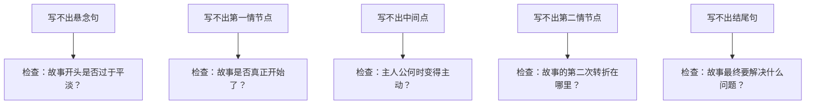

# 第08课：九句大纲法——任何一个故事都可以浓缩为九句话

## 学习目标

- 理解故事结构的四个部分和五个转折点
- 掌握九句大纲法的九个节点及其作用
- 学会用九句话为任何故事搭建骨架
- 了解九句话如何扩展为完整的场景大纲

## 方法的起源与价值

美国知名写作教练拉里·布洛克斯告诉我们：稳定的故事结构有五个重要的转折点，并通过四个部分来展现。写下这九个故事节点，你就有了一份完整的大纲。

你可能会怀疑：一个故事真的可以用九句话来概括吗？答案是肯定的。实际上，浓缩为一句话也是可能的。但是九句话可以更完整地展现故事的结构层次。这里的数字九不是随意编造的——它对应着五个转折点和四个部分的交界面。

> [!NOTE] 为什么要用九句话
> 这个方法之所以有效，是因为它迫使你去思考故事的主要组成部分，为你具体的场景设置打开大门。如果你不能用九句话概括你的故事，那么你的故事很可能存在结构上的问题。

## 故事的四个部分与五个转折点

在进入九个具体句子之前，我们需要先理解它们背后的结构框架。

```mermaid
flowchart LR
    subgraph Part1[第一部分：布局]
        A[悬念] --> B[布局展开]
    end
    B --> C{第一情节点}
    C --> subgraph Part2[第二部分：反应]
        D[主人公做出反应]
    end
    D --> E{中间点}
    E --> subgraph Part3[第三部分：行动]
        F[主人公主动行动]
    end
    F --> G{第二情节点}
    G --> subgraph Part4[第四部分：催化剂]
        H[主人公推动结局]
    end
    H --> I{结尾}
```

| 部分 | 占比 | 主人公状态 | 对应转折点 |
|---|---|---|---|
| 第一部分：布局 | 前20% | 被动，被故事事件裹挟 | 悬念 → 第一情节点 |
| 第二部分：反应 | 20%-50% | 对新的情况作出反应 | 第一情节点 → 中间点 |
| 第三部分：行动 | 50%-75% | 变得积极主动，采取行动 | 中间点 → 第二情节点 |
| 第四部分：催化剂 | 75%-100% | 推动最终解决问题 | 第二情节点 → 结尾 |

## 九个句子详解

### 第一句：设置悬念

故事的第一个句子要提出一个悬念性的问题。这个问题不需要是整本书的核心谜题，但必须是足以抓住读者好奇心的东西。

以《饥饿游戏》为例：在故事的开始，凯特尼斯的妹妹波利姆在第十二区的收获节上被选为贡品。凯特尼斯自愿代替妹妹参加饥饿游戏。**凯特尼斯能否活着回来？他要如何活下来？** 这个悬念牢牢抓住了读者的心。

### 第二句：开始布局

第一部分（前20%）的场景向读者展示主人公的日常生活，建立角色背景和世界观。同时，它必须为即将到来的变化埋下伏笔。

在《饥饿游戏》中，这些场景向我们展示了凯特尼斯过去的生活——在丛林中狩猎动物、拿到市场换取生活必需品、与大家告别的过程。接着凯特尼斯乘车前往凯皮特，与来自十二区的另一个贡品皮塔一起，在导师和看护者的指导下接受训练。

### 第三句：第一情节点

从这里开始，故事发生改变，节奏更加紧张。第一情节点是故事真正的起点。

《饥饿游戏》的第一情节点是：导师暗示凯特尼斯和皮塔可以靠假扮情侣赢得更多支持。起初凯特尼斯拒绝，但此时她似乎接受了这一战略联盟。他们成为游戏中的合作伙伴，两个人的关系构成了故事弧线，成为他们希望的来源。

### 第四句：主人公做出反应

在第二部分中，主人公开始对这个新的旅程或探索做出反应。通常主人公是出于被迫，而不是主动选择。

凯特尼斯华丽地完成了自己的最后准备——一箭射中桌上的苹果，获得11分的高分，成功引起了所有人的注意。接着真正的游戏开始了：凯特尼斯险些被杀，逃入丛林躲避其他人的追逐，寻找庇护所与水源。同时她发现皮塔居然正与追逐她的一伙人在一起。

> [!TIP] 反应阶段的关键
> 在反应阶段，主人公还没有完全掌握主动权。他们是在"接招"，而不是"出招"。这个阶段的重点是展现主人公的脆弱和不确定性，让读者为后面的转变积累情感。

### 第五句：中间点

中间点是一个关键的转折——主人公从一个被动的角色转变为主动的行动者。**主人公不再等待事情发生，而是开始让事情发生。**

在《饥饿游戏》中，凯特尼斯利用致命的蜂窝对等待杀掉她的贡品们发起攻击。她开始与可爱而聪明的贡品露露结盟。从这一刻起，她从一个四处游荡的潜在受害者转变为一名斗士。

### 第六句：主人公主动行动

在第三部分中，主人公变得积极主动地采取一系列行动来达成目标。她不再只是应对危机，而是主动制造机会。

凯特尼斯与露露合作，逐渐从箭伤中恢复。她护理着伤口，同时酝酿计划，准备攻击活下来那伙贡品的物资储藏处。计划成功了，但是露露却死了。

### 第七句：第二情节点

第二情节点是一个关键的信息转折。主人公获得新的认识或信息，改变了故事的走向，为结尾做好了铺垫。这是主人公的"顿悟时刻"。

贡品们接到通知：游戏规则改变，大赛允许来自同一区的两名贡品同时活下来。严重受伤的皮塔与凯特尼斯重聚，他们和解了。他们的关系似乎成为真正的情侣之间的爱慕——这是他们活下来的最好机会。

> [!WARNING] 第二情节点不可缺失
> 很多新手的故事在中间点之后就开始"往下滑"，缺少了第二情节点带来的第二次转折。没有第二情节点，故事就会变得可预测、缺乏层次。记住：中间点让主人公从被动变主动，第二情节点让主人公获得新认识、找到新方法。

### 第八句：主人公成为催化剂

在第四部分中，主人公不再只是解决自己的问题，而是成为推动整个事件向结局发展的催化剂。

凯特尼斯和皮塔找到一处庇护所。凯特尼斯留下皮塔，只身前往物资领取处，差一点送命。幸好与露露来自同一区的另一个贡品救了她。接着杀人变异狗被释放出来，一路将他们追至宇宙之脚，进行最后的生死对决。

### 第九句：结尾

故事的问题在这里得到解决——但不一定是完美的解决。好的结尾会同时带来满足和回味。

凯特尼斯与皮塔成功地逃脱了变异狗，在与最邪恶的贡品的终极对决中活了下来，被宣布为第74届饥饿游戏的获胜者。但是故事突然急转直下：导师警告他们，总统对他们很不满，觉得他们一同赴死的约定让凯皮特蒙羞。他们还没有完全脱离危险——这就为续集做好了铺垫。

## 为什么这个方法有效

九句大纲法的力量在于它强迫你回答一个关键问题：**我的故事到底在讲什么？**

如果你在尝试填写这九个句子时感到困难，那些困难本身就是线索：
- 如果你写不出"悬念"，说明你的故事缺乏一个吸引人的开始
- 如果你写不出"中间点"，说明你的主人公缺乏主动性
- 如果你写不出"结尾"，说明你没有想清楚故事的最终走向



> [!NOTE] 从概要到场景
> 如果你能将这九个句子中的每一个扩展为更多的句子——最终每个句子描述一幕场景——那么你就可以接受祝贺了：你刚刚写下了整个故事的大纲。相比于修改故事草稿，修改这九个句子的效率要高得多。

## 九句大纲法 vs 叙事弧线

九句大纲法和[[0009-叙事弧线]]是两种不同的结构工具。它们帮助写作者从不同的角度理解故事结构：

| 维度 | 九句大纲法 | 叙事弧线 |
|---|---|---|
| 视角 | 横向——故事按时间顺序展开的节点 | 纵向——故事张力的起伏曲线 |
| 关注点 | 每个节点"发生了什么" | 每个阶段"张力如何变化" |
| 适用阶段 | 搭建骨架时使用 | 优化节奏时使用 |
| 核心优势 | 检验故事是否完整 | 检验张力是否充分 |

你可以选择你觉得顺手的那一个来帮助你构思。故事就是故事，不管你在哪里讲故事，故事的基本原则都是不变的。

> [!QUESTION] 自我检测
> 选择一个你最喜欢的故事（电影或小说皆可），尝试用九句话概括它：
>
> 句子一：悬念是什么？
> 句子二：布局阶段展示了什么？
> 句子三：第一情节点是什么？
> 句子四：主人公如何做出反应？
> 句子五：中间点发生了什么转折？
> 句子六：主人公采取了什么行动？
> 句子七：第二情节点带来了什么新认识？
> 句子八：主人如何推动结局？
> 句子九：故事如何结尾？

<details>
<summary>参考答案</summary>

以电影《摔跤吧！爸爸》为例：

1. **悬念**：前摔跤冠军马哈维亚能否实现让印度获得世界金牌的梦想？
2. **布局**：马哈维亚因体制问题无缘世界比赛，将希望寄托于未出生的儿子，却接连得到女儿。
3. **第一情节点**：女儿们将男同学打得鼻青脸肿，马哈维亚发现了她们的摔跤天赋。
4. **反应**：女儿们被迫接受严酷训练，心生反抗，训练偷工减料。
5. **中间点**：女儿们参加同龄女孩的婚礼，得知她们的命运是嫁给陌生人、与锅碗为伴，明白了摔跤可以改变命运。
6. **行动**：吉塔和巴比塔积极投入训练，吉塔赢得全国冠军，进入国家体育学院。
7. **第二情节点**：吉塔在世界赛上连续失败，终于意识到爸爸的训练方法是对的，向爸爸道歉。
8. **催化剂**：吉塔在爸爸的远程指导下艰难闯进英联邦运动会总决赛，爸爸却被教练设计困住。
9. **结尾**：吉塔在没有父亲在场指导的情况下，凭借记忆中的技巧赢得冠军，实现了父亲的梦想。
</details>

## 总结

| 九个节点 | 所属部分 | 作用 |
|---|---|---|
| 句一：悬念 | 第一部分（布局） | 提出让读者好奇的问题 |
| 句二：布局展开 | 第一部分（布局） | 建立世界观和角色背景 |
| 句三：第一情节点 | 第一部分 → 第二部分 | 故事真正开始的地方 |
| 句四：主人公反应 | 第二部分（反应） | 主人公被动应对变化 |
| 句五：中间点 | 第二部分 → 第三部分 | 主人公从被动转为主动 |
| 句六：主人公行动 | 第三部分（行动） | 主人公主动推进剧情 |
| 句七：第二情节点 | 第三部分 → 第四部分 | 新信息带来新的转折 |
| 句八：主人公催化 | 第四部分（催化剂） | 主人公推动结局到来 |
| 句九：结尾 | 第四部分 | 问题得以解决 |

在下一课中，我们将学习另一种结构工具——叙事弧线，通过五个阶段来审视故事张力的起伏曲线。

继续学习：[[0009-叙事弧线]]

## 课后作业

1. 选择你正在创作的一个故事（或构思中的故事），用九句话写出大纲。
2. 如果某些句子写不出来，标记出来——这可能是故事的薄弱环节，需要重点思考。
3. 将九句话中的每一句扩展为三到五个场景，看看它们是否能够形成完整的故事脉络。
4. 对比你的九句大纲与实际写出来的故事，检查是否有偏离。大纲是你衡量故事是否"跑偏"的坐标。