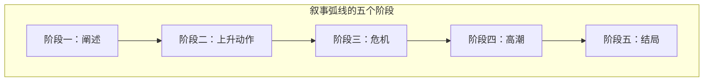

# 第09课：叙事弧线——故事就是一场战争

## 学习目标

- 掌握叙事弧线的五个阶段及其各自的任务
- 理解阐述阶段"少即是多"的原则
- 认识上升动作中张力和悬念的构建方法
- 学会在危机阶段设置主人公的领悟点
- 了解高潮和结局的正确收尾方式

## 故事就是一场战争

自亚里士多德在《诗学》中将故事划分为开头、中间和结尾三部分以来，故事结构就不再是什么秘密。我们生活在一个资源匮乏的世界，人们常常需要就某样东西进行争夺——从挤地铁到赢得爱情，欲望制造了冲突。故事通常从一个充满欲望的人物开始，他努力克服成功道路上的障碍，并最终成功或者失败。这就形成了故事的经典结构：**人物 → 困境 → 解决困境**。

用视觉图表来展现这个结构，就得到了**叙事弧线**。

叙事弧线的五个阶段并不是随意划分的。每一个阶段都有其特定的功能和情感任务。好的故事就像一场精心策划的战争：你需要在合适的时间投入合适的兵力，在合适的地点引爆冲突，最终以决定性的战役收尾。

> [!NOTE] 九句大纲法与叙事弧线的关系
> 在上一课中我们学习了[[0008-九句大纲法]]，九句大纲法是横向的——关注故事按时间顺序排列的关键节点。叙事弧线是纵向的——关注故事张力的起伏曲线。它们是同一枚硬币的两面，都是帮助你搭建故事结构的工具。

## 阶段一：阐述

阐述部分的写作技巧在于一句话：**只需要告诉读者他们必须知道的信息，仅此而已**。

新手作者常常会犯一个典型的错误：将他们心中关于主人公的所有信息一股脑全部放进背景介绍中去，从而推迟了本该一开始就抓住读者的故事线。读者并不需要在第一页就知道主人公的星座、血型、童年阴影和大学专业。他们只需要知道：

- 主人公是谁（基本身份）
- 主人公在什么地方（时空背景）
- 主人公想要什么（核心欲望）
- 什么在阻碍他（即将到来的困境）

| 阐述内容 | 需要告知 | 可以推迟 |
|---|---|---|
| 主人公的核心欲望 | 必须尽早 | 可以稍后 |
| 世界观的核心规则 | 必须尽早 | 可以逐步揭示 |
| 主人公的完整背景 | 不必要 | 穿插在故事中 |
| 配角的详细经历 | 不必要 | 只在需要时揭示 |

在阐述部分，作者可以通过预示即将发生的戏剧性事件来吸引读者：略提一下改变主人公命运的那个契机，展示日常之下暗流涌动的裂缝。

在好莱坞标准120分钟的电影中，阐述通常在**第8分钟**结束，主人公陷入困境。这个"8分钟现象"几乎适用于所有商业类型片：前8分钟建立世界，第8分钟打破平衡。

> [!TIP] 阐述的检验方法
> 写完故事的开始部分后，逐句审视：去掉这一句，读者会不会感到困惑？如果不会，删掉它。每一个句子都应该是读者理解故事必不可少的拼图碎片，而不是你展示素材库存的陈列窗。

### 案例：《摔跤吧！爸爸》的阐述阶段

前印度全国摔跤冠军马哈维亚因为体育局的无能，无缘参加世界摔跤比赛、为国争光，心中留有遗憾。退役后他一直没有放弃摔跤，把希望寄托于未出生的儿子身上——这是他的欲望。他陷入的困境是：妻子生下一个又一个的女儿。这个困境在第8分钟左右清晰地呈现在观众面前，阐述阶段完成。

## 阶段二：上升动作

在叙事弧线的五个阶段中，上升动作所占的分量最重。在大多数故事里，上升动作占据了故事的主体篇幅——一部120分钟的标准好莱坞电影，可能会在上升动作阶段用上100分钟。

上升动作的任务是**创造并维持戏剧张力**。只有当故事达到高潮、困境得到解决之时，这个张力才能获得释放。

### 制造张力的方法

**方法一：主人公遭遇连续的失败**

在上升动作阶段，主人公会遇到一个又一个的困境，他努力去克服，但最终以失败告终。如果你一秒钟就解决了问题，那就没有故事可言了。

**方法二：情节点制造新麻烦**

上升动作的弧线上有许多情节点，大多数情节点会给主人公制造新的麻烦。每一个情节点都表示故事会朝一个新的方向发展和推动。它们使整个故事的情节迂回曲折、环环相扣。

**方法三：希望的新生与幻灭**

好的叙事会随着主人公获得成功的希望的起伏而展开。蝙蝠侠赢了，希望变强；小丑赢了，希望变弱。希望的新生与幻灭、谜题的设定与揭晓、悬念的形成与解开、故事的峰回路转——都出现在上升动作阶段。

**方法四：扣人心弦的章节悬念**

在每一个章节的结尾处留点悬念，把你的主人公和读者都吊足胃口。这是让你读者不断翻页的秘密武器。

### 案例：《摔跤吧！爸爸》的上升动作

正当马哈维亚心灰意冷之时，大女儿吉塔和二女儿巴比塔在学校把男同学打得鼻青眼肿，家长们纷纷前来告状。马哈维亚看到了女儿们的摔跤潜力，希望重新燃起。

但是：

- 摔跤是男孩子的运动，马哈维亚冒着全村人的冷嘲热讽训练女儿
- 剪了她们心爱的头发
- 摔跤场不准女孩进入，马哈维亚就自己动手建摔跤场
- 两个女儿受不了训练和同学的嘲讽，决定反抗，训练偷工减料，让马哈维亚非常失望

后来，两个女儿看到同龄女孩出嫁后一辈子只能与锅碗为伴，明白了父亲的用心——摔跤可以掌握自己的未来。希望重新燃起。吉塔第一次参加比赛虽然输了，但让所有人刮目相看。她们一步步获胜，从帮冠军到参加全国比赛，吉塔三年蝉联全国冠军。

吉塔去了国家体育学院，留起长发，忘掉爸爸的训练方法，过上新生活，变得自大，看不起父亲老派的摔跤方法——两人关系决裂。

## 阶段三：危机

危机是叙事弧线波浪的尖锋，对整个故事叙述者来说都是一个关键点。在这里，情况变得**不能再糟了**。通常只有主人公采取新的行动，问题才能得到解决。

危机阶段的力量会带来深刻的变化。故事会到达一个**领悟点**——在这个点上，主人公开始对世界有了新的认识。罗伯特·麦基曾经说过：如果你比较主人公在电影开头和结尾的不同境况，你会发现结尾处主人公的境遇已得到改观，不再是刚开始的样子了。

> [!WARNING] 危机不是高潮
> 很多写作者把危机和高潮混为一谈。危机是"最黑暗的一刻"，是主人公感到绝望的时刻。高潮是"决战的时刻"，是问题最终被解决的时刻。危机在前，高潮在后——主人公必须先经历绝望，然后才有力量进行最后的战斗。

### 案例：《摔跤吧！爸爸》的危机

吉塔将爸爸摔倒在地，与妹妹巴比塔产生分歧。随后，吉塔参加世界赛，巴比塔参加全国赛。两种训练方法展开较量——是防守还是进攻？

吉塔输了。巴比塔赢了。

接下来吉塔连续输掉好几场世界赛。教练说："有些人注定与世界冠军无缘。"——这是最黑暗的时刻。在这个领悟点上，吉塔终于意识到爸爸是对的。她向爸爸道歉，剪短头发，重新按照爸爸的方法训练。

## 阶段四：高潮

如果前期的铺垫都做好了，高潮就变得容易多了。高潮是一系列解决危机的事件。它不是单一的瞬间，而是一个**释放的过程**——所有在上升动作中积累起来的张力，在这里集中释放。

### 案例：《摔跤吧！爸爸》的高潮

2010年英联邦运动会，印度作为东道主。吉塔在爸爸的指导下打破首轮被淘汰的魔咒，闯入总决赛。教练对马哈维亚的参与不满，设计困住了爸爸。

吉塔艰难地进行着总决赛——最后一局，节奏慢下来。吉塔到底能否在没有父亲指导的情况下赢得胜利？这成为整部电影最大的悬念。

最后，吉塔以最漂亮的动作赢得了冠军，成为第一位获得英联邦运动会的印度女子摔跤冠军。国歌奏响——马哈维亚终于在观众席上听到了自己等待一生的旋律。

## 阶段五：结局

高潮将你带到了故事的顶峰。从这以后，你就要开始下行了——这就是所谓的**下降动作**。故事逐渐放缓并接近尾声。

在结尾时请记住：下降动作已经释放了故事所有的戏剧张力。读者想知道一些答案，但故事动力的引擎已经关闭，留下的动力不足以再带读者前进了。所以，**尽快结束故事，离开舞台**。不要在结尾处添加新的冲突、新的悬念或者新的信息——那是属于下一个故事的事情。

> [!TIP] 好结尾的标志
> 好结尾让读者感到满足，同时又留下回味的空间。它不会悬而未决，也不会拖泥带水。它准确地解决了故事的核心问题——不多也不少。

### 案例：《摔跤吧！爸爸》的结局

马哈维亚被放出来，赶到现场。大女儿将金牌交给他。马哈维亚摸着吉塔的头说："你是我的骄傲。"——情感在这里得到了最大的升华。故事结束。

## 叙事弧线全景图

下面是叙事弧线五个阶段在《摔跤吧！爸爸》中的完整对应：

| 阶段 | 在故事中的位置 | 核心事件 | 情感效果 |
|---|---|---|---|
| 阐述 | 前8分钟 | 马哈维亚的冠军梦碎，寄望于儿子却得女儿 | 建立认同和期待 |
| 上升动作 | 8分钟至90分钟 | 发现女儿天赋、训练、反抗、醒悟、全国冠军、学院冲突 | 希望与绝望交替 |
| 危机 | 90分钟左右 | 吉塔连续输掉世界赛，领悟父亲是对的 | 最黑暗的时刻 |
| 高潮 | 110分钟左右 | 吉塔在无人指导的总决赛中赢得冠军 | 情感释放和满足 |
| 结局 | 最后3分钟 | 马哈维亚说"你是我的骄傲" | 情感升华 |

## 比较：叙事弧线与九句大纲法

| 维度 | 叙事弧线 | 九句大纲法 |
|---|---|---|
| 关注点 | 张力的起伏曲线 | 故事推进的关键节点 |
| 适合谁 | 注重节奏和情感体验的写作者 | 注重结构和逻辑的写作者 |
| 最佳用途 | 优化故事的节奏和张力 | 检验故事的结构是否完整 |
| 核心问题 | 读者此刻的情感状态是什么？ | 故事此刻必须发生什么？ |

你不需要在两者之间二选一。很多成熟的作家会先使用九句大纲法搭建骨架，再用叙事弧线来调整节奏。两个工具配合使用，效果最佳。

> [!QUESTION] 自我检测
> 以《哈利·波特与魔法石》为例，根据叙事弧线填写各阶段的核心事件：
>
> 1. **阐述**：故事开始时，哈利·波特过着怎样的生活？他的欲望是什么？困境是什么？
> 2. **上升动作**：进入霍格沃茨后，哈利经历了哪些希望和挫折的交替？
> 3. **危机**：最黑暗的时刻是什么？哈利领悟到了什么？
> 4. **高潮**：最终的决战在哪里发生？如何解决的？
> 5. **结局**：故事如何收尾？情感如何升华？

参考思路

《哈利·波特与魔法石》的叙事弧线：

1. **阐述**：哈利在德思礼家受虐待，收到霍格沃茨录取信，得知自己是巫师——欲望是逃离现状、找到归属；困境是被压制和阻挠。

2. **上升动作**：进入霍格沃茨，发现魔法世界的奇妙（希望升起）→ 遭遇马尔福、斯内普的敌意（挫折）→ 成为格兰芬多魁地奇球员（希望）→ 发现巨怪闯关、魔法石可能被盗（危机升级）。

3. **危机**：哈利、罗恩和赫敏发现斯内普并非坏人，真正想偷魔法石的是奇洛教授——而奇洛的后脑勺上附着伏地魔。哈利必须独自面对伏地魔。这是最黑暗的时刻。

4. **高潮**：哈利通过厄里斯魔镜和母亲的爱保护了魔法石，伏地魔逃跑。

5. **结局**：哈利回到医院翼楼，邓布利多解释了真相。格兰芬多因哈利的勇敢赢得学院杯。哈利找到了他从未有过的家。

## 总结

叙事弧线是讲故事的基础工具。它不复杂也不神秘——它就是人类本能地理解一个完整故事的方式：**平静被打破，斗争随之而来，在到达顶峰后回归平静**。

掌握这五个阶段，再配合[[0008-九句大纲法]]的使用，你将能够讲好任何类型的故事。

| 阶段 | 一句话口诀 | 情感任务 |
|---|---|---|
| 阐述 | 少即是多 | 建立认同 |
| 上升动作 | 步步紧逼 | 积累张力 |
| 危机 | 跌入谷底 | 制造领悟 |
| 高潮 | 蓄势爆发 | 释放张力 |
| 结局 | 见好就收 | 情感升华 |

## 课后作业

1. 选一部你喜欢的电影，用秒表计时，标出阐述、第一情节点、中间点、危机、高潮、结局分别在什么时间点出现。观察它们的比例是否符合"前8分钟阐述 + 100分钟上升动作 + 最后10-12分钟高潮+结局"的经典节奏。

2. 用叙事弧线分析你正在创作的故事：
   - 你的阐述阶段给出了多少信息？有没有需要删减的？
   - 上升动作阶段的张力是否足够？希望和挫折是否交替出现？
   - 危机阶段是真的"最黑暗时刻"吗？主人公有没有领悟？
   - 高潮是否充分释放了前期积累的张力？
   - 结局是否太拖沓？

3. 尝试将[[0008-九句大纲法]]和叙事弧线结合使用：先用九句话搭建结构，再用五阶段弧线检验张力节奏。调整那些张力不足或过高过早的地方。