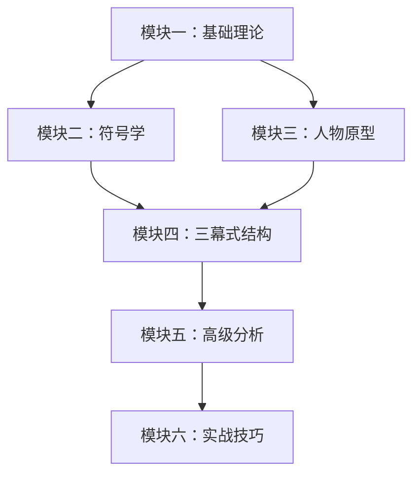

# 课程地图

## 模块一：基础理论

| 课号 | 标题 | 内容 | 来源章节 |
|------|------|------|---------|
| [[lessons/0001-ji-ben-jia-gou|第01课]] | 剧本的基本架构 | 编剧简介、主旨、剧本格式、前期纲要、故事大纲 | 第01章 |
| [[lessons/0002-narrative-theory|第02课]] | 叙述理论 | 亚里士多德六元素、辩证法、五种电影、古希腊悲喜剧 | 第02章 |
| [[lessons/0003-three-act-nine-beats|第03课]] | 三幕剧与经典九拍 | 三幕式结构、经典九拍详解 | 第02章 |
| [[lessons/0004-genre-rhetoric|第04课]] | 类型修辞 | 不同类型的故事修辞策略 | 第02章 |

## 模块二：符号学

| 课号 | 标题 | 内容 | 来源章节 |
|------|------|------|---------|
| [[lessons/0005-semiotics|第05课]] | 符号学：编剧的秘密武器 | Peirce 符号学三要素、认知过程、剧本对应 | 第03章 |
| [[lessons/0006-semiotics-analysis|第06课]] | 符号学分析与应用 | 电影符号学分析、度量与实用性 | 第06章 |

## 模块三：人物原型

| 课号 | 标题 | 内容 | 来源章节 |
|------|------|------|---------|
| [[lessons/0007-character-archetypes|第07课]] | 人物原型体系 | 七大原型详解（体制、英雄、叛逆者等） | 第04章 |
| [[lessons/0008-archetype-relations|第08课]] | 原型间的基本关系 | 八种核心冲突关系 | 第05章 |
| [[lessons/0009-modern-archetypes|第09课]] | 当代人物原型 | 情绪宣泄、同理心、反英雄 | 第07章 |

## 模块四：三幕式结构

| 课号 | 标题 | 内容 | 来源章节 |
|------|------|------|---------|
| [[lessons/0010-act-one|第10课]] | 第一幕：开场 | 钩子、激励事件、转折点 | 第08章 |
| [[lessons/0011-act-two|第11课]] | 第二幕：鲸鱼的肚子 | 英雄之旅、经典节拍、反转反应 | 第09章 |
| [[lessons/0012-act-three|第12课]] | 第三幕：新创建的世界 | 结局的构建 | 第10章 |

## 模块五：高级分析

| 课号 | 标题 | 内容 | 来源章节 |
|------|------|------|---------|
| [[lessons/0013-social-network-analysis|第13课]] | 三幕式架构分析 | 《社交网络》拆解、人物介绍、两种冲突 | 第11章 |
| [[lessons/0014-character-arc-semiotics|第14课]] | 故事弧光与符号学 | 人物弧光、符号学的跨叙事应用 | 第12章 |

## 模块六：实战技巧

| 课号 | 标题 | 内容 | 来源章节 |
|------|------|------|---------|
| [[lessons/0015-scene-writing-1|第15课]] | 场景绘制法则（上） | 剧本语言、单刀直入、场景创建、揭露人物 | 第13章 |
| [[lessons/0016-scene-writing-2|第16课]] | 场景绘制法则（下）& 对话 | 平行情节、场景转换、视觉编写、对话与潜台词 | 第13-14章 |
| [[lessons/0017-feedback-criticism|第17课]] | 作品分享与批评 | 面对批评、作品分析方法 | 第15章 |

## 参考文档

- [[reference/glossary|编剧术语表]]
- [[reference/archetype-reference|人物原型速查]]
- [[reference/semiotics-reference|符号学速查]]
- [[reference/three-act-reference|三幕式结构速查]]
- [[reference/screenplay-format|剧本格式标准]]