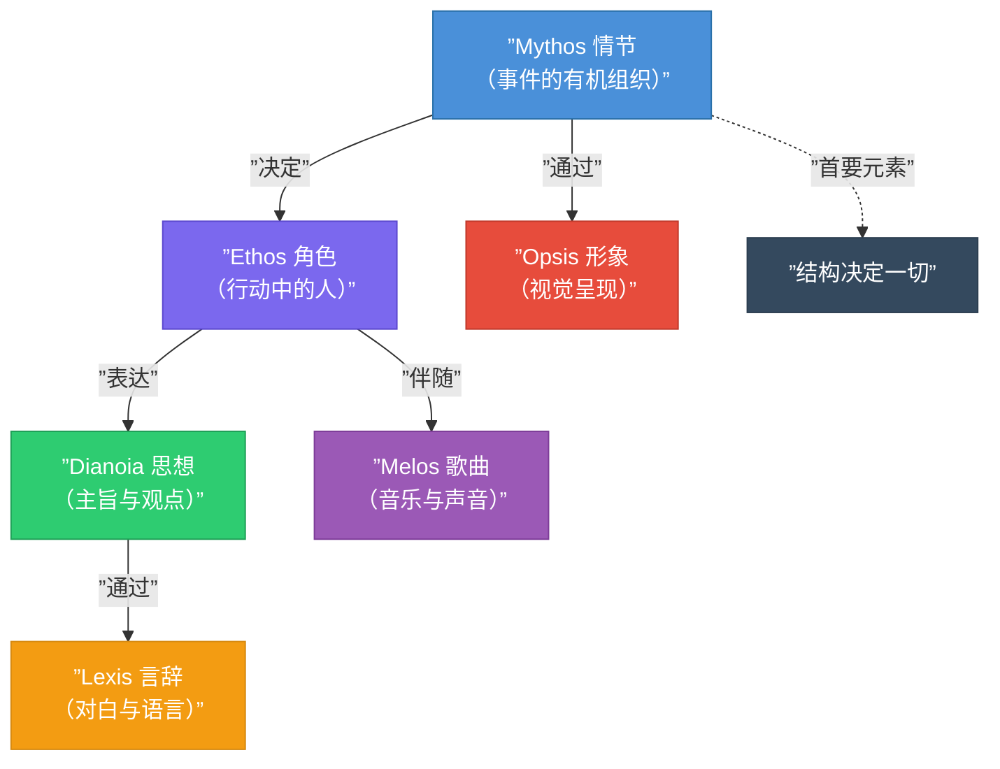
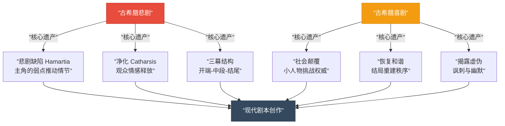

# 第02课：叙述理论——从亚里士多德到现代电影

## Learning Objectives

- 掌握亚里士多德故事结构六元素及其相互关系
- 理解辩证法（thesis / antithesis / synthesis）在剧本创作中的应用
- 识别五种电影类型及其叙事特征
- 理解古希腊悲剧与喜剧对现代电影叙事的影响

## Core Idea

叙事理论并非现代人的发明。两千四百年前，亚里士多德在《诗学》中系统化地分析了希腊戏剧的结构，提出了至今仍在指导编剧创作的六大元素。这套理论不仅是学术遗产，更是理解"故事为什么吸引人"的底层密码。本课将亚里士多德的古典理论与现代电影实践相结合，揭示叙事的基本原则。

## 亚里士多德故事结构六元素

亚里士多德在《诗学》中提出，任何叙事作品都由六种元素构成，按重要性排序如下：

### 六元素详解

| 排名 | 希腊文 | 中文 | 英文 | 定义 |
|------|--------|------|------|------|
| 1 | Mythos | 情节 | Plot | 事件的有机组织与编排，故事的骨架 |
| 2 | Ethos | 角色 | Character | 行动中的人，其道德选择定义角色 |
| 3 | Dianoia | 思想 | Thought / Theme | 角色通过言语表达的观点与故事的主旨 |
| 4 | Lexis | 言辞 | Diction / Language | 对白与叙述的语言表达 |
| 5 | Opsis | 形象 | Spectacle | 舞台呈现与视觉元素 |
| 6 | Melos | 歌曲 | Song / Music | 音乐与声音元素 |

### 六元素关系图

> [!TIP] Key Insight
> 亚里士多德将**情节（Mythos）**置于首位，这个排序本身就是重要的叙事哲学：人物的价值不在于"他是谁"，而在于"他做了什么"。角色的本质通过其行动和选择来揭示，而非通过独白或旁白来宣告。这是"展示而非告知"（Show, Don't Tell）原则的最早起源。

### 对现代编剧的启示

- **情节第一**：先确保故事的事件链条有力，再填充人物和对话
- **角色体现于行动**：不要用对白来描述角色，用抉择和行动来展现
- **思想自然浮现**：主旨应该从情节和角色的行动中自然推导出来

## 亚里士多德传统辩证法

辩证法（Dialectic）是亚里士多德逻辑推理的核心方法，其基本模式为：**正题（Thesis）-> 反题（Antithesis）-> 合题（Synthesis）**。

### 辩证法的三个步骤

1. **正题（Thesis）**：一个初始的主张或状态
2. **反题（Antithesis）**：与正题相对立的主张或力量
3. **合题（Synthesis）**：正题与反题的冲突所产生的新的、更高层次的理解

### 在剧本创作中的应用

辩证法在剧本中无处不在，是驱动戏剧冲突的底层逻辑：

### 经典电影中的辩证法

| 电影 | 正题（主角初始） | 反题（对立力量） | 合题（转变结果） |
|------|------------------|------------------|------------------|
| 《教父》 | 迈克尔拒绝家族生意 | 家族仇杀与背叛 | 迈克尔接受并成为新的教父 |
| 《阿甘正传》 | 阿甘单纯的善良 | 世界的复杂与残酷 | 善良最终战胜复杂 |
| 《黑暗骑士》 | 哈维相信法制系统 | 小丑的无政府主义 | 认识到法制需要牺牲和谎言来维护 |

> [!WARNING]
> 辩证法的目标不是"正题赢了"或"反题输了"，而是通过冲突产生**新的认知**。在好的剧本中，主角和反派各自代表不同的价值观，最终的结果是一种超越二者简单对立的更深刻理解。如果故事只是"好人打败坏人"，那就浪费了辩证法的力量。

## 五种电影类型

从叙事理论的角度，电影可以归纳为五种基本类型。每一种类型都有其独特的叙事逻辑和观众期待。

| 类型 | 核心特征 | 叙事重心 | 典型案例 |
|------|----------|----------|----------|
| **悲剧** | 主角因自身缺陷走向毁灭 | 命运的必然性与人性的弱点 | 《国王的演讲》、《教父》 |
| **喜剧** | 角色克服障碍获得幸福结局 | 社会规范的颠覆与重建 | 《土拨鼠之日》、《伴娘》 |
| **史诗** | 宏大的时间跨度与英雄旅程 | 个人命运与历史洪流的交织 | 《角斗士》、《勇敢的心》 |
| **情节剧** | 情感夸张、道德对立鲜明 | 家庭、爱情与道德困境 | 《泰坦尼克号》、《美丽人生》 |
| **讽刺剧** | 对社会现象的批判与嘲弄 | 揭示矛盾、引发思考 | 《大空头》、《狩猎》 |

### 类型混合

现代电影往往跨越单一类型。理解五种基本类型有助于编剧在混合类型时有意识地组合不同叙事逻辑，例如：

- **悲剧 + 情节剧** = 《赎罪》——个人错误带来的不可挽回的悲剧后果
- **喜剧 + 讽刺剧** = 《大空头》——用幽默外壳包装严肃的社会批判
- **史诗 + 悲剧** = 《角斗士》——个人复仇与帝国兴衰的双线叙事

## 古希腊悲剧与喜剧

### 悲剧的起源与特征

古希腊悲剧起源于对狄俄尼索斯（Dionysus）的宗教祭祀仪式，其核心特征是：

- **主角的"悲剧缺陷"（Hamartia）**：主角因自身的某种性格缺陷（傲慢、嫉妒、贪婪等）导致最终的毁灭
- **"净化"（Catharsis）**：观众通过观看悲剧经历恐惧和怜悯，从而得到情感的净化
- **命运不可逆**：悲剧主角的努力往往是徒劳的，命运是不可逃脱的

### 喜剧的起源与特征

古希腊喜剧同样起源于祭祀狄俄尼索斯的仪式，但加入了狂欢和戏谑的元素：

- **社会规范的颠覆**：喜剧常常让"小人物"挑战权威、颠覆常规
- **恢复和谐**：尽管过程荒谬，但结局通常是社会的重建与和谐
- **揭露虚伪**：喜剧的核心武器是揭露社会面具下的真相

### 对现代剧本的深远影响

> [!EXAMPLE]
> 克里斯托弗·诺兰的《黑暗骑士》就是悲剧结构的现代变体：哈维·丹特的"悲剧缺陷"是傲慢——他相信自己的正义可以战胜一切，最终被小丑摧毁。而小丑本身则带有喜剧角色式的社会颠覆者色彩。这种悲剧与颠覆者的碰撞产生了强大的戏剧张力。

> [!QUESTION] Self-check
> 亚里士多德将"情节（Mythos）"列为六元素之首，但很多初学者认为"角色"才是故事最重要的。请思考：为什么情节比角色更重要？一个"好角色在坏情节中"和一个"坏角色在好情节中"，哪个更可能成为好故事？

Reveal answer

亚里士多德的排序背后有一个深刻的洞察：角色的本质是通过行动被定义的，而不是通过身份或独白。一个"好角色在坏情节中"意味着角色没有机会做出有意义的选择和行动，因此观众无法真正了解他。而一个"坏角色在好情节中"——即一个普通人在极端处境下被迫做出选择——反而可以产生深刻的角色揭示。想想《阿甘正传》：阿甘本身智力有限（看似"坏角色"），但情节将他置于美国历史的重大事件中，他的每一次选择都揭示了角色本质。所以情节是角色的舞台，没有舞台就没有表演。这就是"情节第一"的根本原因。

## 本课总结

- 亚里士多德的六元素按重要性排列为：情节 > 角色 > 思想 > 言辞 > 形象 > 歌曲。情节永远是叙事的首要要素。
- 辩证法（正题-反题-合题）是驱动戏剧冲突的底层逻辑，好的故事不是"好人打败坏人"，而是通过冲突产生新的认知。
- 五种电影类型（悲剧、喜剧、史诗、情节剧、讽刺剧）各有独特的叙事逻辑，现代电影往往是类型的混合体。
- 古希腊的悲剧和喜剧为现代剧本创作奠定了核心概念：悲剧缺陷、净化、社会颠覆与秩序重建。

## Review Checklist

- [ ] 我能列出亚里士多德的六元素并按重要性排序
- [ ] 我能画出一个简单的六元素关系图
- [ ] 我能用辩证法（正题-反题-合题）分析一部电影的角色弧线
- [ ] 我能识别一部电影属于哪种类型或哪些类型的混合
- [ ] 我能解释"悲剧缺陷"和"净化"在现代电影中的体现

## Application Assignment

选择一部你熟悉的电影，分析：

1. 这部电影中主角的"正题"和面对的"反题"分别是什么？
2. 最终的"合题"是什么？
3. 主角是否有"悲剧缺陷"？这个缺陷如何推动了情节？
4. 这部电影属于五种类型中的哪一种，或者哪几种的混合？

## Next Step

亚里士多德的六元素告诉我们"情节第一"，而 [[0003-three-act-nine-beats|第03课：三幕剧与经典九拍]] 将具体展示如何用三幕结构和经典九拍来组织情节。