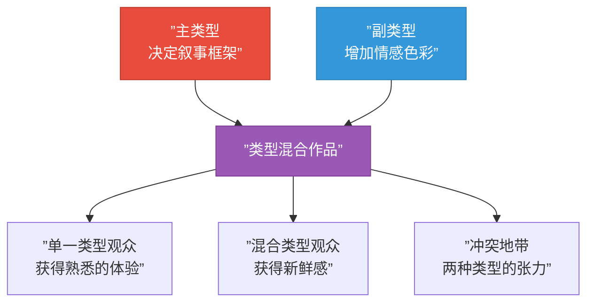

# 第04课：类型修辞

## Learning Objectives

- 理解类型修辞（Genre Rhetoric）的核心概念
- 掌握不同类型电影的独特修辞策略
- 理解观众期待如何影响叙事决策
- 学会在编写中自觉地运用类型修辞

## Core Idea

类型不仅仅是电影标签的分类工具——每一种类型都携带着一套**修辞策略**，即"如何说服观众用特定的方式感受和理解故事"。喜剧有喜剧的表达语法，恐怖片有恐怖片的叙事规则。理解类型修辞，就是理解观众走进电影院时心中已经存在的"期待地图"，并在此基础上进行创作或颠覆。

## 什么是类型修辞（Genre Rhetoric）

类型修辞是从古典修辞学（Rhetoric）延伸而来的概念。在古典修辞学中，演讲者根据听众的期待选择不同的说服策略。同样，编剧根据电影的类型选择不同的叙事策略来"说服"观众以特定方式参与故事。

### 类型的"契约"

每一种类型都与观众之间存在一种隐含的**契约**：

- 观众走进一部喜剧电影，期待的是笑声和圆满的结局
- 观众走进一部恐怖片，期待的是恐惧和紧张
- 观众走进一部悬疑片，期待的是线索和揭秘

类型修辞就是编剧如何**履行或刻意打破**这些期待的策略系统。

> [!TIP] Key Insight
> 类型修辞的核心悖论在于：**规则是用来被打破的，但只有先掌握规则，才有资格打破它**。观众期待类型惯例，但同时又厌倦陈词滥调。最好的编剧在满足期待的同时提供惊喜——这就是类型修辞的艺术。

## 主要类型的修辞策略

### 1. 喜剧（Comedy）的修辞策略

| 修辞要素 | 具体方法 |
|----------|----------|
| 节奏控制 | 快节奏剪辑、密集的笑点分布、三秒定律（笑点间隔不超过三秒） |
| 角色策略 | 小人物 vs 权威、误会导致身份错位、夸张的性格缺陷 |
| 结构策略 | 通常遵循三幕剧，但第三幕的高潮是"真相大白"而非"武力对决" |
| 对白策略 | 双关语、打岔、重复、夸张、反讽 |

**观众期待**：轻松、欢乐、最终的和解与圆满。

**成功示例**：《土拨鼠之日》——主角通过无数次重复来反思自我，最终学会真诚待人。喜剧的"笑"背后有深度的人物转变。

> [!WARNING]
> 喜剧中最常见的错误是"为了搞笑而搞笑"。如果笑点不服务于角色或情节，它就会变得廉价和令人厌倦。好的喜剧笑点应该同时推动叙事或揭示角色——如果去掉这个笑点，故事会有损失，这才是有效的喜剧修辞。

### 2. 恐怖片（Horror）的修辞策略

| 修辞要素 | 具体方法 |
|----------|----------|
| 悬念建构 | 延宕——让观众等待恐惧的到来；间歇暴露——信息不对称（观众知道而角色不知道） |
| 角色策略 | 受害者的无助感、不可靠的感知（角色看到的不一定是真的） |
| 空间策略 | 封闭空间（地下室、森林、太空船）增加无力感 |
| 声音策略 | 寂静的突然打破、低频音效制造的生理不适 |

**观众期待**：恐惧、紧张、心跳加速，以及最终的释放（通常来自幸存者的逃跑或消灭威胁）。

**成功示例**：《闪灵》——杰克·托伦斯在空无一人的酒店中逐渐崩溃。恐怖不是来自外部怪物，而是来自内心的崩解。

### 3. 悬疑/惊悚片（Thriller）的修辞策略

| 修辞要素 | 具体方法 |
|----------|----------|
| 信息控制 | 有策略地释放信息，让观众逐步拼凑真相 |
| 红鲱鱼 | 引入假线索分散注意力 |
| 时间压力 | 设置截止日期（炸弹、计划倒计时）增加紧迫感 |
| 双重叙事 | 侦探 vs 罪犯的双线叙事（观众知道更多） |

**观众期待**：智力挑战、真相的逐步揭露、最后一刻的逆转。

**成功示例**：《七宗罪》——大卫·芬奇让观众在追捕凶手的途中，逐步意识到凶手的目标就是主角自己。信息控制的极致。

### 4. 动作/冒险片（Action / Adventure）的修辞策略

| 修辞要素 | 具体方法 |
|----------|----------|
| 节拍节奏 | 动作场景与文戏交替，遵循"暴涨-回落"的节奏曲线 |
| 升级原则 | 每次动作场面的规模必须大于上一次 |
| 英雄旅程 | 英雄的召唤 → 拒绝 → 启蒙 → 回归 |
| 物理规则 | 在真实感与夸张感之间找到平衡 |

**观众期待**：肾上腺素飙高、英雄的胜利、令人屏息的动作场景。

**成功示例**：《疯狂的麦克斯：狂暴之路》——整个电影就是一个不间断的追逐序列，动作场景层层升级，完全没有冷场。

### 5. 情节剧/爱情片（Melodrama / Romance）的修辞策略

| 修辞要素 | 具体方法 |
|----------|----------|
| 情感放大 | 音乐、灯光和表演的配合放大情感冲击 |
| 牺牲主题 | 爱情与责任之间的冲突，需要做出牺牲 |
| 命运元素 | 巧合、错过、命运的安排 |
| 障碍设置 | 社会阶层、家庭反对、疾病战争等外部障碍 |

**观众期待**：强烈的情感体验、眼泪、最终的圆满或悲壮的牺牲。

**成功示例**：《泰坦尼克号》——灾难背景下的爱情故事，社会阶层的差异成为浪漫与悲剧的源头。

### 6. 科幻/奇幻片（Sci-Fi / Fantasy）的修辞策略

| 修辞要素 | 具体方法 |
|----------|----------|
| 世界建构 | 有说服力的异世界设定，一致的内部逻辑 |
| 隐喻策略 | 科幻设定是现实问题的隐喻（AI = 异化？外星人 = 移民？） |
| 惊奇与敬畏 | "高科技"或"魔法"带来的惊叹感 |
| 知识揭示 | 真相（或更大的真相）的逐步揭示 |

**观众期待**：对未知世界的惊奇敬畏、对人性本质的深层思考、视觉奇观的震撼。

**成功示例**：《降临》——外星人语言是一个思维方式的隐喻，科幻外衣包裹着关于时间、记忆和爱的哲学追问。

## 类型修辞如何影响叙事决策

类型修辞不是写完之后贴上去的标签，而是从**第一个叙事决策开始就必须考虑的核心维度**。以下是一个对比示例，展示同一个核心设定在不同类型下的修辞差异：

### 同一个场景：主角回到空荡的家中

| 类型 | 修辞策略 | 叙事呈现 |
|------|----------|----------|
| 喜剧 | 制造尴尬和误会 | 主角以为被抢劫，结果是家人给他办的惊喜派对，但他失态的反应毁了惊喜 |
| 恐怖 | 制造恐惧和悬念 | 灯打不开，电话没信号，脚步声在楼上响起——观众知道有人潜入 |
| 悬疑 | 制造线索和疑问 | 主角发现家里的东西被移动过，似乎有人在暗示什么——红酒被换成同一个年份的同一品牌 |
| 情节剧 | 制造情感冲击 | 爱人收拾行李离开，留下一封信："我需要时间思考。"主角崩溃 |
| 动作片 | 制造冲突和升级 | 主角发现家里被炸毁，家人失踪。他立即进入战斗模式 |
| 科幻 | 制造惊奇和困惑 | 主角回到家，发现这不是他离开时的那个家——家具对调、照片不同、一个陌生孩子叫他"爸爸" |

> [!EXAMPLE]
> 这个对比清楚地展示了类型修辞的威力。同样的"空房子"，在不同类型下会产生截然不同的故事走向。编剧的核心能力之一就是**类型意识和类型切换能力**——知道不同类型需要用不同的叙事工具来激活观众的情感。

## 类型的混合与颠覆

现代观众对纯类型电影越来越审美疲劳，**类型混合**成为近年最成功的叙事策略之一。

### 常见的类型混合模式

- **Rom-Com + 科幻**：《暖暖内含光》——爱情喜剧的外壳，科幻记忆删除的内核
- **恐怖 + 喜剧**：《僵尸肖恩》——恐怖场景 + 英式冷幽默的化学反应
- **历史剧 + 悬疑**：《猫鼠游戏》——真实历史背景 + 猫鼠游戏的智力对决
- **超级英雄 + 政治惊悚**：《美国队长2：冬日战士》——超级英雄的动作包装下是冷战式的谍战叙事

### 类型混合的原则

1. **主类型决定节奏，副类型决定基调**：主类型提供叙事框架，副类型增加情感色彩
2. **不能均分**：必须有一个主导类型，否则观众会迷失方向
3. **类型冲突创造张力**：当两种类型的期待相互矛盾时，会产生独特的戏剧张力

## 观众期待的管理

类型修辞的终极目标是管理观众的期待。优秀的编剧能够在以下三个层次上管理期待：

### 层次一：满足期待

- 喜剧有笑点，恐怖片有恐怖，动作片有动作——这是基本功
- 如果基本期待没有被满足，观众会感到**被欺骗**

### 层次二：超越期待

- 在满足类型基本要求的前提下，提供超出预期的品质
- 喜剧不仅要好笑，还要有深刻的情感内核
- 恐怖片不仅要可怕，还要有社会隐喻

### 层次三：颠覆期待

- 在观众以为猜到了方向时，出其不意地转向
- 必须**先建立期待，再打破期待**——没有建立就没有颠覆
- 示例：《招魂》中恐怖片经典"衣柜跳杀"之后，真正的威胁从相反方向出现

> [!QUESTION] Self-check
> "满足期待"和"颠覆期待"似乎是矛盾的。编剧如何平衡这两者？

Reveal answer

两者的关系并非矛盾，而是**建立与打破**的关系。颠覆期待的前提是必须先建立期待。用"节奏三明治"来理解：首先，按部就班地满足基本类型期待，建立观众的舒适区（"我知道接下来会发生什么"）；然后，在关键时刻打破这个模式，给出一个出乎意料的转折。这种"满足-颠覆"的模式会让观众既感到熟悉又感到惊喜。举例来说，一部恐怖片中，前三个"有人进入黑暗房间"的场景都按常规出现了惊吓（满足期待），到第四个场景观众已经有预期了——但这次什么都没有发生，真正的恐怖出现在他们转身离开时（颠覆期待）。没有前面三次的"满足"，第四次就无法形成"颠覆"。

## 本课总结

- **类型修辞**是编剧根据电影类型选择叙事策略以管理观众期待的艺术
- 每一种类型都有独特的修辞策略：节奏控制、角色设计、信息管理、视觉风格等
- **类型修辞从第一个叙事决策开始**就发挥作用，而不是后期添加的装饰
- **类型混合**是应对观众审美疲劳的有效策略，但必须有一个主导类型
- 优秀的编剧在三个层次上管理观众期待：满足、超越、颠覆
- **先掌握规则，才有资格打破规则**——类型修辞的核心悖论

## Review Checklist

- [ ] 我能解释"类型修辞"的定义
- [ ] 我能说出至少三种类型的核心修辞策略
- [ ] 我能分析一部电影的类型混合方式
- [ ] 我理解"满足期待"和"颠覆期待"的辩证关系
- [ ] 我能用类型修辞的视角分析一个场景的叙事决策

## Application Assignment

1. 选择一部你喜欢的电影，分析它属于哪种类型或哪几种类型的混合
2. 找出三个场景，说明类型修辞如何影响了场景中的叙事决策（角色做什么、怎么说、摄影如何拍）
3. 设想一个创意概念（比如"一个宇航员在太空站醒来发现队友都死了"），写三个不同类型下的开场段落（恐怖版、喜剧版、悬疑版）
4. 思考一个颠覆类型期待的场景——如何先建立期待再打破它？

## Next Step

这门课程到此已经覆盖了剧本的架构（第01课）、叙事理论（第02课）、三幕结构（第03课）和类型修辞（第04课）。回到 [[../00-course-map|课程地图]]，规划下一阶段的学习目标。

---

> 相关课程：[[0002-narrative-theory|第02课：叙述理论]] 介绍了叙事的底层理论框架，[[0003-three-act-nine-beats|第03课：三幕剧与经典九拍]] 提供了结构的宏观框架，本节从类型维度补充了叙事策略的另一个面向。