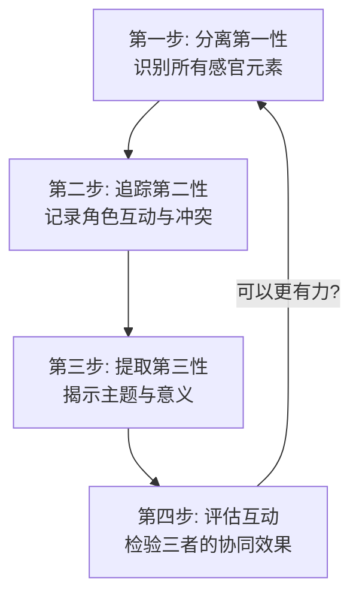

# 第06课：符号学分析与应用

## 概述

在 [[0005-semiotics|第05课]] 中，我们学习了 Peirce 符号学三要素的理论基础。本课将把这些理论落地——你将学会如何用符号学分析一部电影，如何衡量符号学效果，以及如何将符号学作为日常写作的实用工具。

---

## KP-019: 用符号学分析电影

符号学分析不是空中楼阁，而是一种**可操作的拆解方法**。以下是一个四步分析法，可应用于任何电影场景。

### 四步符号学分析法



### 完整案例分析：《教父》开场戏

让我们用四步分析法拆解《教父》备受赞誉的开场。

#### 第一步：分离第一性（感官元素）

在第一性层面，我们识别场景中所有纯粹的感觉输入：

| 感官类型 | 元素 | 效果 |
|---------|------|------|
| **视觉** | 昏暗的房间、逆光摄影、深色西装、阴影中的面孔 | 营造神秘、沉重、庄严的气氛 |
| **听觉** | 低沉的声音、猫的叫声（微弱的环境音）、说话前漫长的沉默 | 制造紧张和不确定感 |
| **空间** | 封闭的书房、大桌子、人物之间的距离 | 权力关系的视觉化 |
| **节奏** | 缓慢的剪辑、长镜头、沉稳的对话节奏 | 建立庄严和仪式感 |

> **关键原则**：在这一步，不要解释——只**描述**。你只是在收集"原材料"。

#### 第二步：追踪第二性（角色互动）

在第二性层面，我们观察角色之间的直接互动和对抗：

```mermaid
flowchart LR
    subgraph ”场景角色”
        A1[殡仪馆老板<br/>Amerigo Bonasera]
        A2[Don Corleone<br/>维托·柯里昂]
        A3[Tom Hagen<br/>家族律师]
    end
    
    A1 -->|”请求: 为我女儿复仇”| A2
    A2 -->|”拒绝: 你以前不尊重我”| A1
    A1 -->|”屈服: 我愿意付出任何代价”| A2
    A2 -->|”接受: 但你欠我一个情”| A1
    
    linkStyle 0,1,2,3 stroke:#333,stroke-width:2px;
```

**关键的第二性元素：**

- **权力不平衡**：Bonasera 站着（恳求姿态），Corleone 坐着（掌控姿态）
- **交易结构**：请求 → 拒绝 → 让步 → 接受 —— 经典的谈判弧线
- **身体语言**：Bonasera 的紧张手指、Corleone 的静止不动

#### 第三步：提取第三性（主题意义）

在第三性层面，我们将具体场景与更大的叙事意义联系起来：

| 具体元素 | 上升为 | 主题意义 |
|---------|-------|---------|
| Bonasera 的请求 | 正义 vs 法律 | 当法律系统失败时，人们会求助于"另一种正义" |
| Corleone 的"交易" | 权力的本质 | 权力不是关于暴力，而是关于"人情债"和互惠义务 |
| 书房+婚礼的并置 | 家与业的模糊 | 黑手党的"家庭"既是血亲也是生意 |
| 猫的出现 | 柔化与矛盾 | 一个爱猫的人也可以是冷酷的黑手党首领 |

> [!WARNING]
> 不要过度解读。第三性应该是叙事**有意为之**的——如果分析出来的意义过于牵强，可能只是观众的投射而非编剧的设计。

#### 第四步：评估互动（三者协同）

最终的评估是检验三者的协同效果：

| 评估维度 | 评分 | 说明 |
|----------|------|------|
| **一致性** | 高 | 视觉风格（第一性）与权力主题（第三性）高度一致 |
| **效率** | 高 | 一个场景同时完成了设定角色、建立冲突、揭示主题三个任务 |
| **记忆性** | 极高 | "他会给你一个无法拒绝的提议"——一句台词浓缩了整个场景的symbol力量 |
| **情感共振** | 高 | 观众在理解权力交换前就已经感受到了不安和敬畏 |

---

## KP-020: 符号学的度量与实用性

符号学不是玄学。你可以用一套**量化指标**来评估剧本中符号使用的有效性。

### 符号学效果度量矩阵

| 指标 | 问题 | 测量方式 | 评分（1-5） |
|------|------|---------|-----------|
| **Icon 清晰度** | 视觉/听觉元素是否明确传达了预期的感受？ | 目标观众反馈：他们"感受"到了什么？ | |
| **Index 连贯性** | 因果关系是否逻辑自洽？ | 检查故事中的因果链是否断裂 | |
| **Symbol 一致性** | 象征符号在全片中是否保持了稳定的含义？ | 追踪同一个符号在不同场景中的使用 | |
| **层次丰富度** | 同一元素是否在三个范畴上都有作用？ | 挑选任意一个关键元素，测试它能同时满足几个层次 | |
| **适度新颖度** | 在"太新"和"太旧"之间是否取得了平衡？ | 相比类型惯例，你的符号体系有多少创新？ | |

### 使用符号学改进剧本的五步自检

```mermaid
flowchart TD
    Q1[”1. 检查 Icon\n观众的感官体验足够丰富吗？\n视觉/听觉是否有明确的设计？”] -->|不通过| A1[”改进: 加入明确的\n感官标记(颜色、声音、纹理)”]
    Q1 -->|通过| Q2
    
    Q2[”2. 检查 Index\n角色的每个行动都有\n合理的因果动机吗？”] -->|不通过| A2[”改进: 补充或\n调整动机链”]
    Q2 -->|通过| Q3
    
    Q3[”3. 检查 Symbol\n故事的核心主题是否\n有清晰的符号载体？”] -->|不通过| A3[”改进: 创建或\n强化核心象征”]
    Q3 -->|通过| Q4
    
    Q4[”4. 检查三层协同\n同一个场景是否同时\n运作三个层次？”] -->|不通过| A4[”改进: 重写场景\n增加层次叠加”]
    Q4 -->|通过| Q5
    
    Q5[”5. 检查创新度\n你的符号体系是否\n过于平庸或过于晦涩？”] -->|不通过| A5[”改进: 调整\n新颖度水平”]
    Q5 -->|通过| DONE[剧本符号学\n通过自检]
```

### 实用技巧清单

以下是将符号学融入编剧日常工作的具体做法：

1. **为每个主要场景做"符号审计"**：列出该场景中所有的 Icon（视觉/听觉元素），检查它们是否服务于 Index（情节）和 Symbol（主题）。

2. **创建"符号辞典"**：为你的剧本创建一个文档，列出所有有意设计的符号及其含义变化。这有助于保持一致性。

3. **使用"三层次测试"**：依次问自己——这个场景的第一性是什么？第二性是什么？第三性是什么？如果某个层次为空，说明场景不够丰满。

4. **观众模拟**：想象一个对你的故事一无所知的观众，他们会从第一性接收到什么？再想象一个理解你故事主题的观众，他们从第三性看到了什么？这两个体验之间的差距就是你的叙事空间。

> [!TIP]
> 符号学最好的使用方式是**作为自检工具**，而不是作为写作指南。不要先想符号再写故事——先写故事，再用符号学检验它。

---

## KP-021: 符号学在创作中的应用结论

### 符号学给编剧的三份礼物

```mermaid
flowchart LR
    subgraph ”符号学的三大贡献”
        G1[精确的语言\n让你能精准诊断问题]
        G2[系统的框架\n让你摆脱直觉写作]
        G3[创新的工具\n让你理解如何颠覆常规]
    end
    
    G1 --> W[更好的剧本]
    G2 --> W
    G3 --> W
```

#### 1. 精确的语言

大多数编剧在讨论问题时只能用模糊的词汇："这个场景感觉不对""这个角色不够立体"。符号学提供了**精确的诊断术语**：

- 不是"感觉不对"，而是"Icon 和 Symbol 之间有冲突"
- 不是"角色不够立体"，而是"角色的第二性行动与第三性主题不一致"
- 不是"故事太平淡"，而是"缺少 Firstness 层面的感官冲击"

#### 2. 系统的框架

符号学让你**从依赖直觉转变为依赖系统**：

- 直觉式创作：写→感觉好/坏→改
- 符号学式创作：写→分析三层→针对性修改

系统化的好处是**可重复、可持续**——你不再是那个偶尔灵感爆发但经常卡壳的编剧。

#### 3. 创新的工具

符号学解释了"创新"的内在机制：

- 想创造新的类型？重新排列符号的层级关系
- 想制造意外结局？在最后时刻重新定义 Index（因果链）
- 想让人物难忘？给人物一个独特的 Icon（视觉标记）和 Symbol（象征意义）

### 最后的话

符号学不是一套创作公式，不会帮你自动生成好故事。它是**放大镜**——让你看清楚自己已经写下的东西，并知道如何让它变得更好。

> [!EXAMPLE]
> 伟大的编剧像伟大的厨师。厨师不需要在每次做饭时都分析食材的化学成分——但当他遇到问题时，化学知识能帮他找到解决方案。同样，你不需要在每次写作时都分析符号学——但当你遇到叙事问题时，符号学能帮你找到病灶。

---

## 本课小结

| 知识点 | 核心内容 |
|--------|---------|
| 四步分析法 | 分离第一性 → 追踪第二性 → 提取第三性 → 评估协同 |
| 度量矩阵 | Icon 清晰度、Index 连贯性、Symbol 一致性等五项指标 |
| 自检五步 | 检验感官、因果、象征、协同、创新五个维度 |
| 三大贡献 | 精确语言 + 系统框架 + 创新工具 |

---

## 继续学习

- 回顾：[[0005-semiotics|第05课：符号学——编剧的秘密武器]]
- 下一步：进入[[0007-character-archetypes|第07课：人物原型体系]] —— 从符号转向人物
- 参考文档：[[reference/semiotics-reference|符号学速查]]

---

## 应用作业

1. 选取任意一部你喜欢的电影的开场三分钟，完成完整的"四步符号学分析"
2. 打开你正在写的剧本（或一个你熟悉的剧本），对第一幕做"符号审计"，列出所有核心符号
3. 使用度量矩阵为你的剧本打分——哪项指标最低？如何改进？