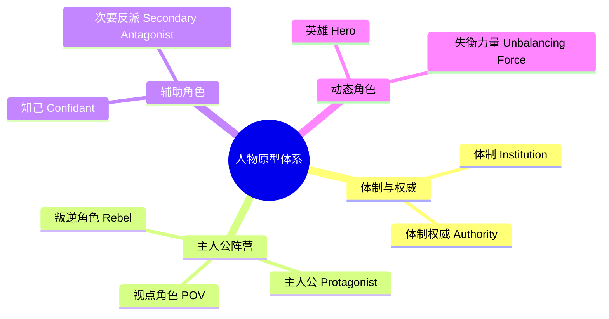
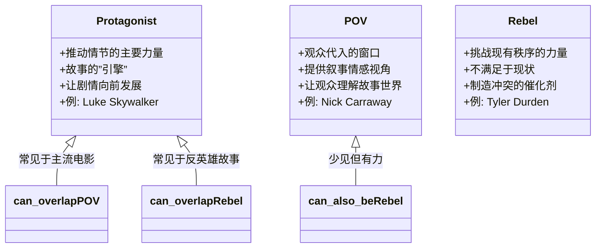
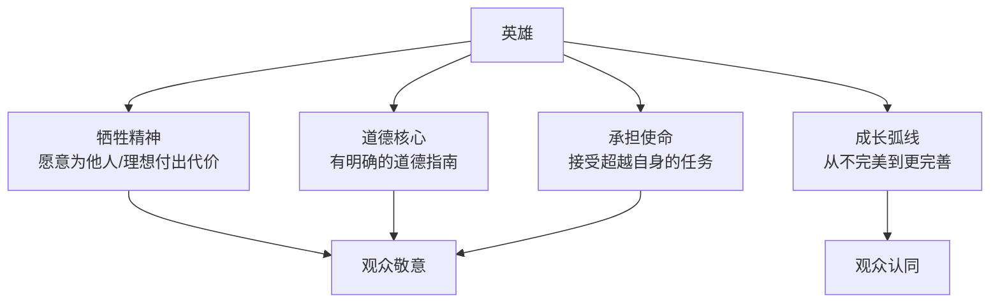

# 第07课：人物原型体系

## 概述

人物是故事的引擎。理解人物原型（Archetypes）不是要给角色贴上刻板标签，而是要掌握**驱动叙事动力的基本力量**。本课将介绍七种核心原型，它们构成了几乎所有叙事作品中的人物生态系统。

> [!TIP]
> 原型不是角色类型，而是**叙事功能**。同一个角色可以在故事中扮演多种原型角色，同一种原型也可以被多个角色分担。

---

## KP-022: 人物原型理论概述

### 什么是原型

原型（Archetype）源于希腊语 `archetypos`（原始模型）。在叙事学中，原型指的是**在不同文化和时代中反复出现的、承载特定叙事功能的角色模式**。

Carl Jung 将原型定义为"集体无意识"中的原始意象。但在编剧语境中，我们更关心的是**原型的功能性——它们如何推动故事发展**。

### 七种原型概览



> [!WARNING]
> 一下列出七种原型可能让人感到信息过载。不必急于一次性记住所有细节——先理解每种原型的基本功能，再通过后续课程中的关系分析来加深理解。

### 角色 vs 原型——关键区分

| 维度 | 角色（Character） | 原型（Archetype） |
|------|------------------|------------------|
| 定义 | 具体的、有名字的剧中人 | 抽象的叙事功能 |
| 特征 | 独特的个性、背景、外貌 | 跨故事共享的模式和功能 |
| 变化 | 可以随剧情发展而改变 | 相对稳定的功能定位 |
| 关系 | 一个角色可以承载多个原型 | 一个原型可以由多个角色实现 |

---

## KP-023: 体制（Institution）与体制权威

### 体制（Institution）

体制是故事中代表**现有秩序、规则和稳定**的力量。它可以是：

- 一个具体的组织（政府、公司、家庭、学校）
- 一套抽象的规则体系（法律、道德、传统）
- 一种社会结构（阶级制度、性别角色、宗教体系）

**体制的核心特征：**

| 特征 | 描述 | 例子 |
|------|------|------|
| 稳定性 | 体制追求维持现状 | 极权政府的宣传机器 |
| 规则性 | 体制通过规则运行 | 学校的校规系统 |
| 非人格化 | 体制不关心个体 | 官僚机构的"公事公办" |
| 自我保存 | 体制的首要目标是自己的延续 | 腐败系统中的内部保护 |

### 体制权威（Authority）

体制权威是**体制的人格化代表**——具体的人物行使体制赋予的权力：

```mermaid
flowchart TD
    subgraph ”体制”
        RULE[规则体系]
        TRADITION[传统]
        LAW[法律/道德]
    end
    
    subgraph ”体制权威”
        JUDGE[法官]
        PRINCIPAL[校长]
        BOSS[老板]
        FATHER[父亲]
    end
    
    RULE --> JUDGE
    TRADITION --> FATHER
    RULE --> BOSS
    LAW --> JUDGE
    TRADITION --> PRINCIPAL
```

**体制 vs 体制权威的关键区分：**

- **体制**是无形的规则网络——是"系统"本身
- **体制权威**是具体的个人，他们既代表体制，也可能与体制产生冲突

> [!EXAMPLE]
> 在《飞越疯人院》中：
> - **体制** = 精神病院的管理系统和"正常"定义
> - **体制权威** = Ratched 护士长（她既是体制的代表，又比体制更冷酷）

---

## KP-024: 主人公、视点角色、叛逆角色的区分

这三个角色在传统叙事中常被混淆。它们实际上承载着**不同的叙事功能**。



### 三者的详细比较

| 维度 | 主人公（Protagonist） | 视点角色（POV） | 叛逆角色（Rebel） |
|------|----------------------|-----------------|-----------------|
| **核心功能** | 推动故事前进 | 提供感知窗口 | 挑战现有秩序 |
| **与冲突的关系** | 主动解决冲突 | 观察和见证冲突 | 制造和激化冲突 |
| **观众的认同** | 通常期待主人公成功 | 通过 POV 的眼睛看世界 | 矛盾的认同（欣赏其勇气但质疑其方法） |
| **变化轨迹** | 经历最大的成长弧线 | 视角可能扩展或转变 | 可能被收编或被消灭 |
| **经典例子** | Luke Skywalker | Nick Carraway (盖茨比) | Tyler Durden (搏击俱乐部) |

> [!QUESTION]
> 想一个让你印象深刻的反英雄角色。他/她同时扮演了哪几种原型？

<details>
<summary>分析示例：Walter White（《绝命毒师》）</summary>

- **主人公**：他是故事的核心推动者，每一个决策都推动剧情
- **叛逆角色**：他挑战整个毒品系统和法律体系
- **不是视点角色**：观众通过多个角色获得了全景视角

Walter White 之所以令人着迷，正是因为他同时充当了主人公和叛逆者的角色，让观众在支持他与反对他之间反复摇摆。

</details>

---

## KP-025: 次要反派角色

### 定义与功能

次要反派（Secondary Antagonist）是主人公在通往主要冲突的路上**需要先克服的障碍**。它通常在叙事中扮演"中级 boss"的角色。

### 次要反派的特征

| 特征 | 说明 | 例 |
|------|------|-----|
| **就近性** | 比主要反派更近、更常出现在主人公的日常中 | 《辛德勒的名单》中的 Amon Goeth |
| **个人化** | 与主人公通常有个人恩怨或具体的利益冲突 | 《饥饿游戏》中的 Effie Trout |
| **可战胜性** | 主人公通常能在故事中段击败次要反派 | 《哈利波特》中的 Draco Malfoy |
| **表征性** | 次要反派通常代表体制的"坏的一面" | 《1984》中的 O'Brien |

### 次要反派的叙事功能

1. **逐步升级冲突**：让冲突有一个渐进的过程，避免"一步到位"的平淡感
2. **展示主人公成长**：主人公战胜次要反派的过程中展示了能力的增长
3. **映射主要反派**：次要反派往往是主要反派的"缩小版"或"表象"
4. **提供临时胜利**：在最终决战前给观众一次情感释放

> [!WARNING]
> 次要反派不能比主要反派更有趣、更强大，否则会分散叙事焦点。著名的"反派魅力陷阱"往往发生在次要反派身上——创作者花太多精力塑造次要反派而忽略了主要反派。

---

## KP-026: 英雄原型

### 英雄的定义

英雄（Hero）是一种**特殊形态的主人公**，其特征是：为了**超越个人利益的目标**而承担巨大的**风险**和**牺牲**。

### 英雄的核心特征



### 英雄的分类

| 英雄类型 | 特征 | 例子 |
|---------|------|------|
| **经典英雄** | 道德清晰，牺牲明确，价值观与观众一致 | Superman, Luke Skywalker |
| **悲剧英雄** | 因自身的缺陷（hamartia）而走向毁灭 | Oedipus, Macbeth |
| **日常英雄** | 普通人在普通处境中做出英雄选择 | Frodo Baggins, Erin Brockovich |
| **反英雄** | 不具备传统英雄的品德但执行了英雄的功能 | Deadpool, The Punisher |

> [!TIP]
> 英雄的关键不是"能力"而是"选择"。一个角色成为英雄不是因为能力有多强，而是因为**在关键时刻做出了正确的选择**，即使这个选择代价惨重。

---

## KP-027: 知己角色

### 知己的定义

知己（Confidant）是与主人公建立**深度信任关系**的角色。他/她的核心叙事功能是**让主人公的内在思想外部化**。

### 知己的叙事功能

```mermaid
flowchart LR
    subgraph ”没有知己的剧本”
        S1[主人公内心活动] -->|只能用旁白或独白| AUD1[观众]
    end
    
    subgraph ”有知己的剧本”
        S2[主人公内心活动] -->|与知己对话| CONF[知己角色]
        CONF -->|承接、质疑、反思| AUD2[观众]
    end
```

### 知己的类型

| 类型 | 特征 | 叙事作用 | 例子 |
|------|------|---------|------|
| **随从型** | 追随主人公，提供支持 | 承接主人公的决策并帮助执行 | Samwise Gamgee |
| **质疑型** | 怀疑主人公，提出异议 | 迫使主人公论证自己的选择，揭示动机的深层原因 | Horatio |
| **互补型** | 拥有主人公缺失的能力或品质 | 补完主人公的不足，形成"完整的团队" | Hermione Granger |
| **黑暗型** | 引导主人公走向错误方向 | 测试主人公的道德底线，制造内心冲突 | Iago（奥赛罗） |

> [!EXAMPLE]
> 《星球大战》中的 C-3PO 和 R2-D2 是两个典型的知己角色。它们承担着"让观众理解 Luke 在想什么"的功能——Luke 对着两个机器人说话时，其实是在对观众说话。

---

## KP-028: 失衡力量

### 失衡力量的定义

失衡力量（Unbalancing Force）是一个**进入现有稳定系统、打破平衡**的角色或事件。它通常出现在故事的**激励事件**中，重新洗牌所有的角色关系。

### 失衡力量的特征

| 特征 | 描述 | 例子 |
|------|------|------|
| **外源性** | 通常来自系统外部 | 外星人入侵（《第九区》） |
| **不可逆性** | 一旦进入就无法恢复原状 | 一封信、一通电话、一个陌生人的到来 |
| **催化性** | 自身不一定是主角，但引发所有后续事件 | Max（《疯狂的麦克斯》）|
| **多重影响** | 同时影响所有角色，不只是主人公 | 新老师的到来（《死亡诗社》） |

### 失衡力量 vs 叛逆角色

| 维度 | 失衡力量 | 叛逆角色 |
|------|---------|---------|
| **来源** | 通常从外部进入 | 通常在系统内部生长 |
| **意图** | 不一定有意挑战体制（可能只是过自己的生活） | 有意挑战体制 |
| **角色定位** | 可能是主人公、配角、甚至是一个事件 | 通常是一个积极行动的角色 |
| **时间性** | 出现在故事开端附近 | 可以在故事任何阶段出现 |

> [!QUESTION]
> 《黑客帝国》中，Morpheus 是失衡力量还是叛逆角色？Neo 呢？

<details>
<summary>分析</summary>

- **Morpheus**：既是失衡力量（他进入 Neo 的"正常"世界打破了平衡），也是叛逆角色（一生都在挑战 Matrix 体制）
- **Neo**：最初是失衡力量的接受者，后来成长为英雄/叛逆者

这个例子说明，一个角色可以同时承载多个原型的叙事功能。

</details>

---

## 七种原型总览

| 编号 | 原型 | 核心功能 | 故事中的角色 |
|------|------|---------|-------------|
| 1 | 体制 Institution | 维持秩序和稳定 | 系统、社会、组织 |
| 2 | 体制权威 Authority | 体制的人格化代表 | 法官、校长、老板 |
| 3 | 主人公 Protagonist | 推动情节的核心力量 | 故事的主要人物 |
| 4 | 视点角色 POV | 提供叙事视角 | 叙述者、观察者 |
| 5 | 叛逆角色 Rebel | 挑战现有秩序 | 革命者、异见者 |
| 6 | 英雄 Hero | 承担牺牲的使命 | 有道德核心的行动者 |
| 7 | 知己 Confidant | 外部化主人公内心 | 朋友、助手、顾问 |
| 8 | 失衡力量 Unbalancing Force | 打破既有平衡 | 催化剂、外来者 |
| 9 | 次要反派 Secondary Antagonist | 逐步升级冲突 | 中级障碍 |

> [!NOTE]
> 九种角色（包括第 8 和第 9）构成了完整的人物原型生态系统。第 8 和第 9 将在 [[0008-archetype-relations|第08课]] 中与其他人物的关系中进行更深入的讨论。

---

## 本课小结

| 知识点 | 核心内容 |
|--------|---------|
| 原型理论 | 原型是叙事功能，不是标签；角色与原型是多对多关系 |
| 体制与权威 | 体制是规则系统，体制权威是其人格化执行者 |
| 三类主角区分 | 主人公=引擎，POV=窗口，Rebel=催化剂 |
| 次要反派 | 中级 boss，逐步升级冲突的工具 |
| 英雄原型 | 核心是牺牲选择而非能力 |
| 知己角色 | 让主人公的内心活动外部化 |
| 失衡力量 | 打破平衡的催化事件/角色 |

---

## 继续学习

- 下一步：[[0008-archetype-relations|第08课：原型间的基本关系]] —— 学习原型之间的冲突与互动
- 参考文档：[[reference/archetype-reference|人物原型速查]]

---

## 应用练习

1. 选择一部你熟悉的电影，识别其中每个角色对应的原型
2. 同一个角色是否同时扮演了多个原型？如果有，这种叠加如何增强了角色魅力？
3. 尝试为你正在构思的故事分配原型：谁是主人公？谁是叛逆角色？失衡力量来自外部还是内部？