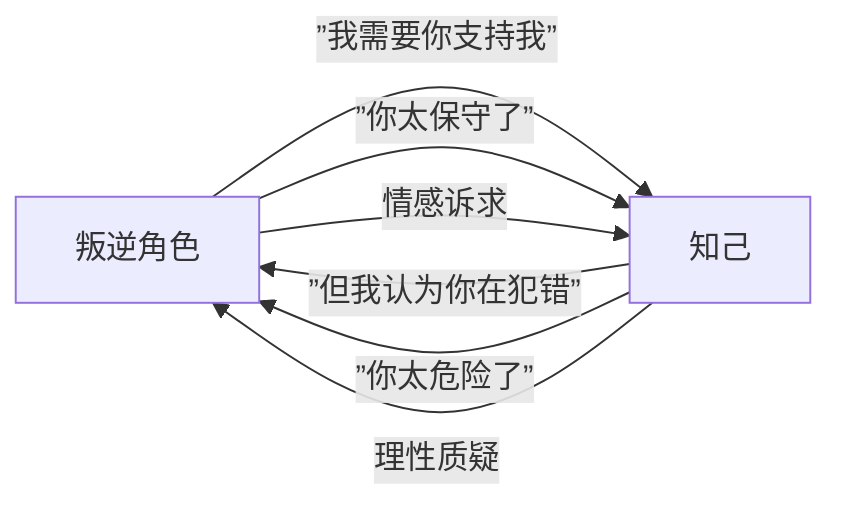
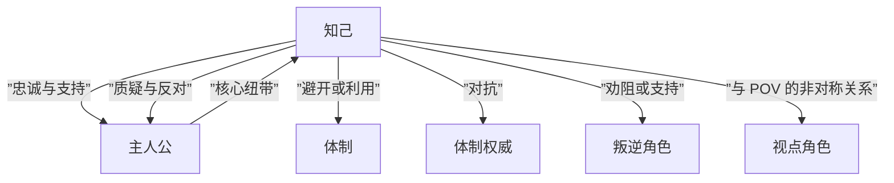

# 第08课：原型间的基本关系

## 概述

孤立地理解原型是不够的——故事的动力来自**原型之间的相互作用**。本课将分析八种核心的原型关系，揭示冲突如何从不同原型的碰撞中自然产生。

> [!TIP]
> 冲突不是意外，而是**不同叙事力量的自然交汇**。如果你能理解每种原型的"力量方向"，你就能预判哪些原型之间会产生冲突。

---

## KP-029: 主要冲突的类型与来源

### 冲突的符号学定义

从符号学视角看（回顾 [[0005-semiotics|第05课]]），冲突的本质是**两个或以上原型的"第二性"（行动意图）之间的对抗**。每个原型都有其内在的"行动方向"：

```mermaid
flowchart TD
    subgraph ”原型力量方向”
        INST[体制: 维持稳定 →]
        AUTH[权威: 执行规则 →]
        PROT[主人公: 实现目标 →]
        REBEL[叛逆: 打破规则 →]
        UNBAL[失衡力量: 改变状态 →]
        SECA[次要反派: 设置障碍 →]
        CONF[知己: 辅助/质疑 →]
    end
    
    REBEL -->|vs| INST
    REBEL -->|vs| AUTH
    REBEL -->|vs| CONF
    UNBAL -->|vs| INST
    PROT -->|vs| AUTH
    PROT -->|vs| INST
    PROT -.->|+ 联手 vs| SECA
    REBEL -.->|+ 联手 vs| SECA
```

### 冲突的三种来源

| 冲突来源 | 定义 | 涉及的原型对 | 例子 |
|---------|------|-------------|------|
| **方向冲突** | 两个原型的行动目标相反 | 叛逆 vs 体制、英雄 vs 反派 | 革命者 vs 政府 |
| **方法冲突** | 目标一致但手段不同 | 知己 vs 主人公（质疑型） | 要不要采取极端手段 |
| **身份冲突** | 角色定位本身带来的矛盾 | 体制内的权威 vs 体制本身 | 好警察在腐败系统中 |

---

## KP-030: 叛逆角色 vs 体制

这是故事中最经典、最核心的冲突之一。

### 冲突的本质

- **叛逆角色**的目标是**改变规则**或**推翻系统**
- **体制**的目标是**维持现有规则**和**自我保存**

```mermaid
flowchart LR
    subgraph ”体制的力量”
        I1[稳定性]
        I2[惯性]
        I3[压制机制]
    end
    
    subgraph ”叛逆角色的力量”
        R1[自由意志]
        R2[创新冲动]
        R3[对不公的敏感]
    end
    
    R1 -->|冲击| I1
    R2 -->|挑战| I2
    R3 -->|揭露| I3
    
    I1 -.->|压制| R1
    I2 -.->|同化| R2
    I3 -.->|打击| R3
```

### 叙事张力

| 维度 | 叛逆角色 | 体制 |
|------|---------|------|
| **观众通常倾向于** | 同情——因为体制往往显得冰冷 | 理解——因为秩序有其必要性 |
| **叙事的关键** | 让叛逆的理由足够充分 | 让体制的"合理性"可见 |
| **经典结局** | 要么改变体制，要么被体制消灭 | 要么被改变，要么同化叛逆者 |

> [!EXAMPLE]
> 《黑客帝国》：Neo（叛逆角色）vs Matrix（体制）。冲突的核心不是"打败坏蛋"，而是"突破一个控制性的系统"。

---

## KP-031: 叛逆角色 vs 体制权威

### 从系统到个人的转移

当叛逆角色面对的是体制权威（Authority）而非抽象的体制时，冲突变得更加**个人化**。

### 两种类型

```mermaid
flowchart TD
    subgraph ”类型A: 权威忠于体制”
        A1[叛逆角色] -->|”反对”| A2[权威\n（体制的死忠执行者）]
        A2 -->|”镇压”| A1
        NOTE1[”冲突清晰，正方/反方分明”]
    end
    
    subgraph ”类型B: 权威内心矛盾”
        B1[叛逆角色] -->|”动摇”| B2[权威\n（内心对体制有怀疑）]
        B2 -->|”犹豫的镇压”| B1
        NOTE2[”冲突复杂，道德灰色地带”]
    end
```

| 维度 | 类型A：权威忠于体制 | 类型B：权威内心矛盾 |
|------|-------------------|-------------------|
| **冲突性质** | 外部的、直接的 | 内部的、间接的 |
| **角色关系** | 敌人关系 | 亦敌亦友 |
| **结局可能性** | 一方被消灭 | 权威可能倒戈或殉道 |
| **例子** | Javert vs Valjean（悲惨世界） | 教头 vs 学生（死亡诗社） |

> [!WARNING]
> 类型B（矛盾权威）是更丰富的叙事资源。当权威本身对体制产生怀疑时，故事就有了**双线冲突**——叛逆者和权威者各自在对抗自己内心的体制。

---

## KP-032: 叛逆角色 vs 知己角色

这是一种被低估的冲突关系。当叛逆角色的知己**不同意为叛逆者的方向**时，冲突就产生了。

### 冲突的形态



### 知己的三种回应

| 回应类型 | 叙事效果 | 例子 |
|---------|---------|------|
| **妥协跟随** | 知己勉强支持但持续焦虑 | 增加紧张感但保留了关系 |
| **分道扬镳** | 知己离开叛逆者 | 让叛逆者真正孤立，通常是故事的转折点 |
| **背叛** | 知己向体制告密 | 制造最强烈的背叛感，彻底改变叛逆者的处境 |

> [!WARNING]
> 知己的反对比敌人的攻击更有力量。因为敌人本身就站在对立面，但知己的反对意味着"即使是了解我的人也认为我错了"。这种**信任的断裂**能给叛逆角色最深的打击。

---

## KP-033: 失衡力量 vs 体制

### 冲突的本质

失衡力量不是有意挑战体制——它只是**存在**，但它的存在本身就构成了对体制的挑战。

```mermaid
flowchart TD
    subgraph ”失衡力量进入”
        EVENT[外来者/事件进入系统]
    end
    
    subgraph ”体制的反应”
        R1[否定: 这不属于这里]
        R2[抑制: 试图压制]
        R3[区隔: 将其标记为异常]
        R4[同化: 最终吸收]
    end
    
    EVENT --> R1
    R1 --> R2
    R2 --> R3
    R3 --> R4
```

### 失衡力量 vs 体制的阶段

| 阶段 | 体制的反应 | 失衡力量的处境 | 叙事阶段 |
|------|-----------|---------------|---------|
| 1. 否认 | "这不重要/不存在" | 被忽视 | 故事开端 |
| 2. 压制 | "必须控制住它" | 被迫对抗 | 第一幕结束 |
| 3. 斗争 | "不消灭它会毁了我们" | 全力反抗 | 第二幕高潮 |
| 4. 后果 | 要么被改变，要么恢复原状 | 要么改变体制，要么被驱逐 | 第三幕 |

> [!WARNING]
> 体制对失衡力量的反应强度往往**不成比例地大**。这是因为失衡力量的存在暴露了体制的脆弱性。一个真正稳定的系统不会对异常做出如此剧烈的反应。

---

## KP-034: 知己角色 vs 多方

知己角色最大的特点是**关系性**——它几乎总是存在于与其他原型的关系中。知己可能和以下多方产生冲突或协同。

### 知己 vs 多方关系网络



### 知己 vs 不同原型的冲突模式

| 对手原型 | 冲突模式 | 叙事价值 | 例子 |
|---------|---------|---------|------|
| **主人公** | 理念分歧：同意目标但反对方法 | 迫使主人公思考"为什么"而不仅是"怎么做" | Watson vs Holmes |
| **体制** | 体制试图收编或压制造知己 | 展示体制的手伸向个人关系 | 地下党交通员 vs 政权 |
| **体制权威** | 权威利用知己接近主人公 | 知己成为"双重间谍" | 秦桧利用岳飞的亲友 |
| **叛逆角色** | 支持或反对叛逆的方向 | 知己是叛逆者最后的"减速带" | Sam 劝阻 Frodo 携带魔戒 |

> [!TIP]
> 知己角色最有力量的时刻不是"支持主人公"，而是**"暂时地反对主人公"**。一个永远说"是"的知己是没有戏剧张力的。

---

## KP-035: 主人公 vs 体制权威和体制

这是故事中最常见的冲突通道——主人公的目标被体制和其代表所阻挡。

### 双层冲突结构

```mermaid
flowchart TD
    PROT[主人公] -->|”表面冲突: 具体对抗”| AUTH[体制权威\n个人化的敌人]
    PROT -.->|”深层冲突: 观念对抗”| INST[体制\n抽象的系统]
    
    subgraph ”冲突演化”
        S1[阶段1: 对抗权威个人] --> S2[阶段2: 意识到权威的背后是体制]
        S2 --> S3[阶段3: 必须同时面对两者]
    end
    
    PROT --> S1
    AUTH --> S1
    INST --> S2
    S1 --> S2
    S2 --> S3
```

### 冲突的三阶段演化

| 阶段 | 对手 | 主人公的理解 | 例子 |
|------|------|-------------|------|
| **阶段1** | 体制权威（个人） | "他/她是坏人" | Luke 觉得 Vader 是纯粹的坏蛋 |
| **阶段2** | 背后的体制 | "是系统让他/她变成这样" | Luke 理解了 Empire 不只是一群坏人 |
| **阶段3** | 体制+权威的整体 | "要改变的是整个系统" | Luke 意识到需要消灭整个 Empire 而非 Vader 一人 |

> [!EXAMPLE]
> 《末路狂花》中，Thelma 和 Louise 最初只是在对抗一个性侵犯者（阶段1），后来发现自己对抗的是整个父权体制（阶段2-3）。从"开枪自卫"到"宁愿死也不回那个系统"是冲突升级的完美轨迹。

---

## KP-036: 叛逆角色和主人公 vs 次要反派

### 叙事功能

当叛逆角色和主人公**联手**对抗次要反派时，产生的是故事中最"爽"的叙事形态之一——两个力量方向的角色暂时对齐。

```mermaid
flowchart LR
    subgraph ”同盟”
        PROT[主人公\n目标导向]
        REBEL[叛逆角色\n秩序挑战者]
    end
    
    subgraph ”对手”
        SECA[次要反派\n中级障碍]
    end
    
    PROT -->|”提供战略和纪律”| ALLIANCE[临时同盟]
    REBEL -->|”提供勇气和非常规手段”| ALLIANCE
    ALLIANCE -->|”联手击败”| SECA
    
    PROT -.->|”潜在的紧张”| REBEL
```

### 同盟的三种类型

| 类型 | 描述 | 叙事效果 | 例子 |
|------|------|---------|------|
| **被迫同盟** | 双方因利益一致而暂时合作 | 增加紧张感——合作随时会破裂 | 警察 vs 罪犯联手抓更大的罪犯 |
| **成长同盟** | 主人公学习叛逆者的方法 | 主人公被"污染"——走向反英雄 | 良家妇女被叛逆者带上犯罪之路 |
| **互补同盟** | 一方提供纪律，一方提供创造力 | "最有效的团队"但关系不稳定 | 理性侦探 vs 疯狂情报员 |

> [!WARNING]
> 叛逆角色和主人公的同盟**不应该持续整个故事**。这个同盟的本质是"暂时的对齐"，一旦次要反派被击败，他们之间的根本矛盾就会重新浮现。如果同盟持续太久，两个角色的力量方向就会混淆。

---

## 八种冲突关系总结

| 编号 | 冲突对 | 冲突本质 | 强度 | 典型叙事阶段 |
|------|--------|---------|------|-------------|
| 1 | 叛逆 vs 体制 | 规则 vs 自由 | 高 | 贯穿全篇 |
| 2 | 叛逆 vs 权威 | 个人 vs 系统代理人 | 中-高 | 第二幕 |
| 3 | 叛逆 vs 知己 | 信任 vs 质疑 | 中 | 第二幕中段 |
| 4 | 失衡 vs 体制 | 外来 vs 既定 | 中-高 | 第一幕至第二幕 |
| 5 | 知己 vs 多方 | 关系网中的张力 | 中 | 全篇 |
| 6 | 主人公 vs 权威 | 目标 vs 阻碍（个人层面） | 高 | 第一幕至第二幕 |
| 7 | 主人公 vs 体制 | 目标 vs 阻碍（系统层面） | 极高 | 第三幕 |
| 8 | 叛逆+主人公 vs 次要反派 | 联盟 vs 障碍 | 中-高 | 第二幕高潮 |

```mermaid
flowchart TD
    subgraph ”核心冲突网络”
        REBEL[叛逆角色] -->|冲突1| INST[体制]
        REBEL -->|冲突2| AUTH[体制权威]
        REBEL -->|冲突3| CONF[知己]
        UNBAL[失衡力量] -->|冲突4| INST
        
        CONF -->|冲突5| INST
        CONF -->|冲突5| AUTH
        CONF -->|冲突5| PROT[主人公]
        CONF -->|冲突5| POV[视点角色]
        
        PROT -->|冲突6| AUTH
        PROT -->|冲突7| INST
        
        REBEL --- ALLIANCE{{临时同盟}}
        PROT --- ALLIANCE
        ALLIANCE -->|冲突8| SECA[次要反派]
    end
```

---

## 本课小结

| 知识点 | 核心内容 |
|--------|---------|
| 冲突的源泉 | 冲突 = 不同原型力量方向的交汇 |
| 叛逆 vs 体制/权威 | 故事的核心对立，从系统层面到个人层面 |
| 知己的张力 | 知己的反对比敌人的攻击更有杀伤力 |
| 失衡 vs 体制 | 体制对"不同"的剧烈反应展示了其脆弱性 |
| 主人公的双层冲突 | 先斗权威个人，后斗体制系统 |
| 临时同盟 | 叛逆+主人公 vs 次要反派的联手与暗中紧张 |

---

## 继续学习

- 回顾：[[0007-character-archetypes|第07课：人物原型体系]]
- 下一步：[[0009-modern-archetypes|第09课：当代人物原型]] —— 情绪宣泄、同理心与反英雄
- 参考文档：[[reference/archetype-reference|人物原型速查]]

---

## 应用作业

1. 选择一部电影，找出其中发生的至少三种原型冲突关系，并分析它们分别出现在故事的哪个阶段
2. 你正在构思的故事中，主要的冲突关系是哪一种？是否充分利用了这种冲突的叙事潜力？
3. 尝试设计一个"知己 vs 叛逆者"的场景——写两页对话，其中知己试图阻止叛逆者采取一个危险行动