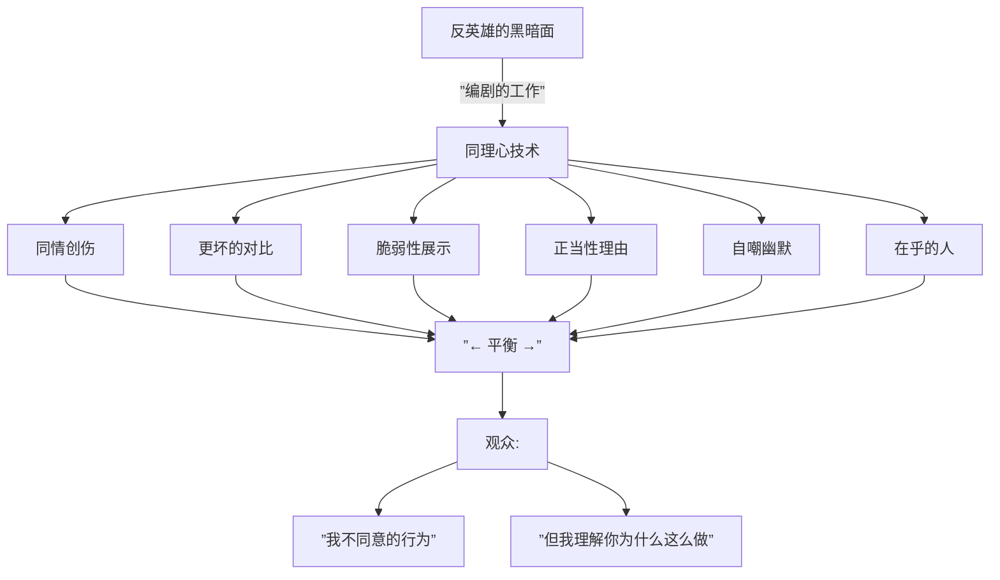
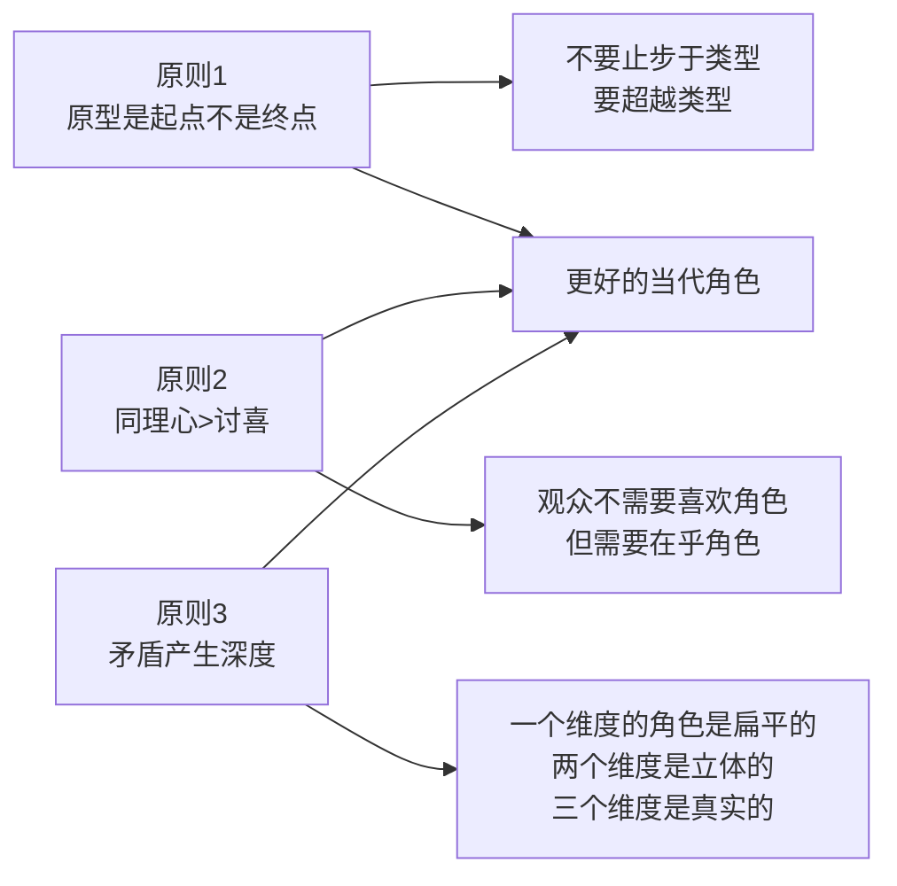

# 第09课：当代人物原型

## 概述

传统的原型体系（[[0007-character-archetypes|第07课]]）和原型关系（[[0008-archetype-relations|第08课]]）为故事提供了坚实的基础。但当代叙事对原型的使用方式已经发生了深刻的演化——观众不再满足于清晰的善恶二分，而是渴望更复杂、更矛盾的人物体验。本课将探讨三个关键议题：情绪宣泄与反转、同理心构建、以及反英雄的叙事机制。

> [!TIP]
> 当代原型的核心变化：**从"角色是什么"转向"观众感受到了什么"**。原型不再只是叙事功能，更是情感操控的工具。

---

## KP-037: 当代原型：情绪宣泄与反转

### 什么是情绪宣泄（Catharsis）

亚里士多德在《诗学》中提出，悲剧的核心功能是**通过怜悯和恐惧来净化（catharsis）这些情感**。在当代编剧语境中，情绪宣泄指的是**观众在故事结束时获得的强烈情感释放**。

### 反转（Reversal）作为宣泄的机制

反转（peripeteia / reversal）是制造情绪宣泄的最强大工具。它的原理是：**先建立一种情感状态，然后突然转向其对立面**。

```mermaid
flowchart LR
    subgraph ”经典反转模式”
        A[建立期待] -->|”正向”| B[积累]
        B -->|”反转点”| C[意外转向]
        C --> D[情感释放]
    end
    
    subgraph ”反转的情感路径”
        E[希望] -->|反转| F[绝望]
        G[恐惧] -->|反转| H[解脱]
        I[憎恨] -->|反转| J[同情]
        K[怀疑] -->|反转| L[信任]
    end
```

### 六种情绪反转策略

| 策略 | 反转前 | 反转后 | 宣泄类型 | 例子 |
|------|--------|--------|---------|------|
| **救赎反转** | 角色令人厌恶 | 角色展现人性 | 宽恕与怜悯 | 《悲惨世界》中的 Javert 之死 |
| **揭露反转** | 观众相信某种真相 | 真相被彻底推翻 | 震惊与重估 | 《第六感》——医生已死的揭示 |
| **道德反转** | "好人"在做好事 | "好人"行为有可怕的后果 | 道德困惑 | 《绝命毒师》Walter 的每一次"善意"选择 |
| **阵营反转** | 观众认为某人是盟友 | 此人其实是敌人 | 背叛的痛苦 | 《非常嫌疑犯》最后的反转 |
| **身份反转** | 弱者/受害者 | 强者/胜利者 | 力量与解放 | 《末路狂花》最后的飞跃 |
| **牺牲反转** | 自私的角色 | 做出无私的牺牲 | 感动与悲悯 | 《黑暗骑士》Harvey Dent 的堕落 |

> [!WARNING]
> 反转必须有**足够的铺垫**。没有伏笔的反转不是"意外之喜"而是"莫名其妙"。观众必须能在反转发生的瞬间感觉到"原来如此，我早该想到"。

### 宣泄的结构化设计

```mermaid
flowchart TD
    subgraph ”宣泄的前期准备”
        S1[建立情感投资\n让观众在乎角色]
        S2[制造道德复杂性\n模糊对错的边界]
        S3[设置伏笔\n暗示相反的可能]
    end
    
    subgraph ”宣泄的触发”
        T1[反转时刻\n关键信息的揭露或消失]
        T2[情感峰值\n音乐/画面/节奏的配合]
    end
    
    subgraph ”宣泄的余韵”
        A1[安静时刻\n观众消化情感]
        A2[意义重构\n前文被重新理解]
    end
    
    S1 --> T1
    S2 --> T1
    S3 --> T1
    T1 --> T2
    T2 --> A1
    A1 --> A2
```

> [!EXAMPLE]
> 《肖申克的救赎》中 Andy 越狱的揭露就是一次完美的反转宣泄：
>
> 1. **建立投资**：过去两小时观众和 Andy 一起承受了不公和压抑
> 2. **反转触发**：空床铺 + 爬过污水管的闪回
> 3. **情感峰值**：雷电中的 Andy 张开双臂
> 4. **余韵**：Red 念出 "Get busy living or get busy dying"——将情感从"胜利"转向"重生"的哲学层面

---

## KP-038: 为主角创造同理心

观众只有在**在乎**的时候才会被故事打动。同理心（Empathy）不是自动产生的——它是编剧通过特定技术"制造"出来的。

### 同理心的四个来源

```mermaid
flowchart TD
    subgraph ”同理心的四根支柱”
        SYM[同情 Sympathy\n角色遭受不公]
        LIK[讨喜 Likability\n角色有吸引人的特质]
        MOR[道德紧迫 Moral Urgency\n目标有正当性]
        GOAL[共享目标 Shared Goal\n观众也想要这个结果]
    end
    
    SYM --> EMP[观众同理心]
    LIK --> EMP
    MOR --> EMP
    GOAL --> EMP
    
    EMP --> INV[观众情感投入]
    INV --> PAY[结局的情感回报]
```

### 四种方法详解

| 方法 | 原理 | 具体技术 | 例子 |
|------|------|---------|------|
| **同情** | 观众本能地同情受害者 | 让角色在开场遭遇不公正的对待；让角色的困境与观众可理解的困境相似 | 《美丽人生》父亲为儿子编造游戏 |
| **讨喜** | 观众更容易喜欢有魅力的角色 | 幽默感、聪明才智、善良、忠诚、独特技能 | 《阿甘正传》阿甘的纯真 |
| **道德紧迫** | 观众支持"正确"的目标 | 目标涉及生死、公平、自由等普遍价值；对手的目标明显更"错" | 《魔戒》摧毁魔戒以拯救中土 |
| **共享目标** | 观众和角色想要同样的东西 | 目标简单、具体、人人想要（回家、得到爱、被尊重） | 《绿皮书》Doc 想要被平等对待 |

### 同理心构建的节奏

同理心不是一次性建立的，而是**逐步加深**的：

1. **快速入门（前5分钟）**：让观众对角色产生初步好感或同情——你不需要观众马上"爱"角色，只需要他们"愿意继续看"
2. **深度绑定（第一幕）**：通过展示角色的选择、牺牲和脆弱性，让观众的"在乎"从表面转向深度
3. **压力测试（第二幕）**：让角色面临越来越大的困难，观众对角色的同情会随着角色承受的痛苦而加深
4. **终极回报（第三幕）**：角色在压力下的终极选择——这时观众的同理心会产生最大的情感回报

> [!TIP]
> 一个常见的错误是"太着急"——编剧在开场就让角色做英雄般的壮举。观众还没有准备好。**同理心需要时间去生长**。就像现实中的友谊，它需要共同经历才能深厚。

---

## KP-039: 充满同理心的反英雄

### 反英雄的定义

反英雄（Anti-Hero）是一种**不具备传统英雄美德但仍然占据主人公位置**的角色。他们可能自私、暴力、愤世嫉俗、道德模糊——但观众仍然在乎他们。

### 反英雄的悖论

```mermaid
flowchart TD
    subgraph ”传统英雄”
        TH[道德清晰的]
        TH2[行动的动机利他]
        TH3[观众仰慕]
    end
    
    subgraph ”反英雄”
        AH[道德模糊的]
        AH2[行动的动机自私]
        AH3[观众认同/着迷]
    end
    
    TH -->|”观众效仿”| R1[仰慕式欣赏]
    AH -->|”观众共情”| R2[矛盾式着迷]
```

### 制造反英雄同理心的关键技术

反英雄的问题在于：观众**不应该**喜欢这样的人。那么编剧如何让他们喜欢？

| 技术 | 描述 | 例 |
|------|------|-----|
| **加一勺同情** | 让反英雄有一个"情有可原"的过去 | Walter White 的癌症诊断 |
| **加一个更坏的对手** | 让反英雄对比反派显得"没那么糟" | Tony Soprano 的敌人更残忍 |
| **展示脆弱时刻** | 让观众看到反英雄私下里的人性 | House 医生的孤独和痛苦 |
| **赋予一个"正当"目标** | 反英雄追求的目标在某种层面上合理 | Dexter 只杀罪犯 |
| **制造自嘲幽默** | 反英雄对自己的黑暗面有自知之明 | Deadpool 打破第四面墙吐槽自己 |
| **安排一个在乎的人** | 反英雄对某个人物有真诚的感情 | The Punisher 对家人的记忆 |



### 经典反英雄分析

#### 《绝命毒师》— Walter White

| 维度 | 内容 | 同理心技术 |
|------|------|-----------|
| **黑暗面** | 制毒、撒谎、操纵、让家人陷入危险 | — |
| **同理心来源** | 癌症诊断、经济困境、曾经的才华被埋没 | 同情 |
| **更坏的对手** | Gus Fring、Tuco、纳粹帮 | 对比 |
| **"正当"目标** | 为家人留下财富 | 道德紧迫 |
| **脆弱时刻** | 和 Jesse 的关系、对 Hank 的愧疚 | 人性展示 |

> Walt 的悲剧在于：观众一开始支持他，因为他有"正当"的理由。但每一季他都会跨过一条更黑暗的线，观众一次次问自己"我还能支持他吗？"——**正是这种持续的张力让反英雄如此迷人。**

#### 《伦敦生活》— Fleabag

| 维度 | 内容 | 同理心技术 |
|------|------|-----------|
| **黑暗面** | 自毁、滥交、对亲友刻薄 | — |
| **同理心来源** | 母亲的去世、内疚和孤独 | 同情+脆弱 |
| **自嘲幽默** | 打破第四面墙向观众吐槽 | 幽默 |
| **在乎的人** | Claire（姐姐）和牧师 | 展示真诚的情感能力 |

> Fleabag 的做法更精妙——她直接对着镜头和观众对话，让观众成为她的"同谋"。你在笑她的自毁行为时，已经被拉入她的世界了。

---

## 当代原型的三条原则



---

## 本课小结

| 知识点 | 核心内容 |
|--------|---------|
| 情绪宣泄与反转 | 反转是情绪宣泄的核心机制，需要充分的准备和伏笔 |
| 同理心四来源 | 同情、讨喜、道德紧迫、共享目标——四个维度缺一不可 |
| 同理心构建节奏 | 快速入门→深度绑定→压力测试→终极回报 |
| 反英雄 | 通过同情、对比、脆弱、幽默等技术让观众在乎"不该在乎"的角色 |
| 三条原则 | 原型是起点；同理心大于讨喜；矛盾产生深度 |

---

## 继续学习

- 回顾：[[0007-character-archetypes|第07课：人物原型体系]] 和 [[0008-archetype-relations|第08课：原型间的基本关系]]
- 下一模块：进入 **模块四：三幕式结构**（第10-12课）
- 参考文档：[[reference/archetype-reference|人物原型速查]]

---

## 应用作业

1. 想想你见过的最成功的反英雄角色。用上述表格分析他/她的同理心来源
2. 尝试为你正在写的主角设计一个"同理心审计"——他/她从四个来源（同情、讨喜、道德紧迫、共享目标）中获得了多少分？
3. 写一个反转场景的 outline：先用 100 字建立一种情感，再用 100 字描述反转后的新情感。确保伏笔在前 100 字中已经埋下