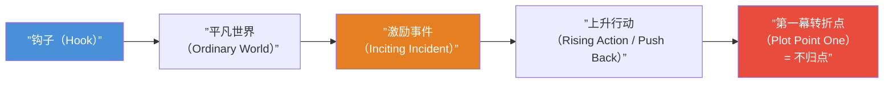

# 第10课：第一幕——开场

## Learning Objectives

- 理解钩子（Hook）的四种类型及其设计原则
- 掌握激励事件（Inciting Incident）的定义、时机及其对故事世界的冲击
- 学会识别和构建第一幕转折点（Plot Point）
- 理解"不归点"（Point of No Return）如何结束第一幕并驱动进入第二幕

## Core Idea

第一幕是整个剧本的基石，它必须在开篇几分钟内抓住观众的注意力，建立故事世界，引入核心人物，并在结尾处将故事推向不可逆转的方向。好莱坞叙事体系中，第一幕承担着四个关键功能：**钩住观众**、**打破常态**、**推动转向**、**锁定冲突**。

详细结构速查参考 [[reference/three-act-reference|三幕式结构速查]]。

---

## KP-041：钩子（Hook）的设计

钩子是剧本开篇第一分钟到前五分钟内用来抓住观众注意力的叙事装置。一个好的钩子能让观众在潜意识里产生一个无法忽略的问题，从而被"钩"住，愿意继续看下去。

### 钩子的四种类型

| 类型 | 核心机制 | 观众反应 | 典型案例 |
|------|----------|----------|----------|
| **戏剧性问题钩子 (Dramatic Question Hook)** | 在开场建立一个急需回答的问题 | "接下来会怎样？" | 《教父》——殡仪馆老板请求教父帮忙复仇（谁会答应？代价是什么？） |
| **动作钩子 (Action Hook)** | 以高能量动作场景开场，直接制造紧张感 | "这太刺激/危险了！" | 《黑客帝国》——崔妮蒂在超现实打斗中展现惊人能力 |
| **悬疑钩子 (Mystery Hook)** | 呈现一个无法立即解释的奇怪事件或情境 | "这到底是怎么回事？" | 《穆赫兰道》——好莱坞快车道上发生车祸，一个女人从残骸中走出 |
| **主题钩子 (Thematic Hook)** | 通过画外音、字幕或隐喻性画面暗示故事的核心主题 | "这故事是关于什么的？" | 《美国丽人》——莱斯特的画外音告诉观众他一年后会死，但此刻他活得毫无意义 |

> [!TIP] 原则一：钩子必须承诺故事类型
> 钩子不仅仅是吸引注意力的花招，它本质上是对观众的承诺。动作片的钩子承诺危险，悬疑片的钩子承诺答案，爱情片的钩子承诺相遇。观众从钩子中就能判断这是不是自己感兴趣的故事。

> [!TIP] 原则二：钩子不需要解释一切
> 很多新手编剧犯的错误是试图在开场中交代太多背景信息。钩子的力量恰恰在于它的不完整性——它给观众留下疑问，而后续的故事就是对这些疑问的回应。

---

## KP-042：激励事件（Inciting Incident）

激励事件是指打破主角平凡世界、迫使主角做出反应的事件。它通常发生在剧本的第10至15页（对应约10到15分钟），是让故事真正"开始运转"的引擎。

### 激励事件的三个特征

1. **不可预见性**——主角无法提前预知这个事件的发生
2. **不可逆转性**——一旦发生，平凡世界就无法恢复原状
3. **主动/被动触发**——主角可能主动引发（做出一个选择）或被被动卷入（遭遇意外）

### 激励事件 vs 钩子

| 维度 | 钩子 | 激励事件 |
|------|------|----------|
| 出现时间 | 第1-5分钟 | 第10-15分钟 |
| 功能 | 吸引注意力 | 驱动故事 |
| 与主角的关系 | 可能无关或间接 | 直接作用于主角 |
| 可撤销性 | 可被后续解释 | 不可撤销 |

> [!WARNING] 常见错误：激励事件迟到或缺失
> 如果在前20分钟还没有发生任何真正改变主角命运的事件，观众会感到无聊。最危险的情况是：影片开头的钩子很精彩，但之后又回到了普通的日常描写，观众很快会失去耐心。

> [!EXAMPLE] 《黑客帝国》的激励事件
> 开场（钩子）：崔妮蒂被警察和特工追捕，展现了一个不寻常的世界。
> 平凡世界展示：尼奥在写字楼里上班，是一个普通的程序员。
> 激励事件（第12分钟）：尼奥接到墨菲斯的电话，被告知"你被跟踪了"，墨菲斯的追随者带他离开了办公室。从此尼奥再也无法回到普通的日常生活。

---

## KP-043：转折点（Plot Point）

转折点是第一幕中最重要的结构性装置。它是一个事件或决定，将主角从被动反应状态推向主动行动状态，为进入第二幕制造动力。

### 转折点的双重功能

- **回顾性功能**：它重新定义观众对第一幕所有事件的理解
- **前瞻性功能**：它设定了第二幕的目标和方向

### 好的转折点 VS 差的转折点

| 好的转折点 | 差的转折点 |
|------------|------------|
| 主角主动做出选择 | 意外发生在主角身上 |
| 有明确的风险和代价 | 没有明显的后果 |
| 与故事主题紧密相关 | 与主题脱节 |
| 推动情节进入新方向 | 只是增加了更多信息 |

> [!EXAMPLE] 《寄生虫》的转折点
> 金家四口通过精心策划全部进入了朴社长家工作——这是他们的主动"胜利"。但转折点恰恰在于：当他们以为自己掌控了一切时，前任管家深夜返回地下室，打开了那扇隐藏的门。这个转折点将故事从"社会喜剧"推进到了"生存恐怖"的新方向。

---

## KP-044：第一幕的结束方式——不归点

第一幕结束标志着主角正式进入了一个新的、不可逆转的情境。这个时刻被称为**不归点（Point of No Return）**，主角从此无法回头。

### 不归点的三种典型形态

1. **物理不归点**——主角离开了熟悉的环境，无法返回
   - 例：《指环王》弗罗多带着魔戒离开夏尔
2. **情感不归点**——主角做出无法收回的情感承诺或背叛
   - 例：《泰坦尼克号》露丝决定和杰克在一起，背叛了她的未婚夫和社会阶层
3. **道德不归点**——主角越过了一条道德底线
   - 例：《绝命毒师》沃尔特在第一次杀人或拒绝接受帮助时

### 经典电影第一幕结束方式

| 电影 | 第一幕结束点 | 不归点的本质 | 进入第二幕的方向 |
|------|-------------|--------------|-----------------|
| 《教父》 | 索洛佐约见维托，维托拒绝参与毒品生意并被枪击 | 维托家族无法再保持中立 | 迈克尔为保护父亲而踏入黑帮世界 |
| 《黑客帝国》 | 尼奥选择红色药丸 | 物理不归点——从矩阵进入真实世界 | 学习真相并接受自己是"救世主"的可能性 |
| 《黑暗骑士》 | 蝙蝠侠决定抓捕小丑，小丑宣布"没有规则" | 蝙蝠侠被迫接受对手的规则 | 进入一场无法预测的猫鼠游戏 |
| 《星球大战》 | 卢克发现莱娅公主的消息并决定出发营救 | 情感+物理不归点，离开了图西肯的家 | 学习原力并参与反叛军行动 |

> [!QUESTION] 自检：你的第一幕完整吗？
> 检查你的剧本：
> 1. 第一分钟到前五分钟是否有明确的钩子？它属于哪种类型？
> 2. 第10-15分钟是否发生了激励事件？它是否真正打破了主角的平凡世界？
> 3. 第一幕结尾是否有一个明确的不归点？主角是否做出了一个不可逆转的选择？
> 4. 从钩子到不归点的线索是否连贯？

参考答案要点

- 钩子如果不能让观众产生"想知道答案"的冲动，就不是有效的钩子
- 激励事件最核心的检验标准：如果把这件事从剧本中移除，故事是否还能成立？如果不能，它就是有效的激励事件
- 第一幕的结尾不需要是爆炸性的动作场面，但它必须在情感或道德层面上让观众感受到"现在一切都不同了"
- 如果你发现自己的第一幕直到第25页才开始真正运转，你需要把激励事件往前移动

## Summary

第一幕是剧本的契约——它向观众承诺：这是一个什么类型的故事，主角是谁，他将面临什么挑战。四个关键节点（钩子、平凡世界、激励事件、转折点）共同构建了这一契约。第一幕的结尾（不归点）则是对这一契约的最强确认：观众相信后面的旅程是值得的。

| 节点 | 页码 | 功能 |
|------|------|------|
| 钩子 | p.1-5 | 抓住注意力，设立期待 |
| 平凡世界展示 | p.1-15 | 让观众了解"正常"是什么 |
| 激励事件 | p.10-15 | 打破平凡世界，启动行动 |
| 第一幕转折点/不归点 | p.20-30 | 确保故事无法回头，推入第二幕 |

## Next Step

进入 [[0011-act-two|第11课：第二幕——鲸鱼的肚子]]，探讨主角进入未知领域后的旅程。