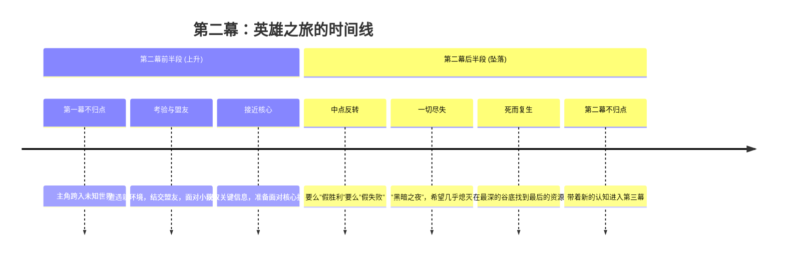

# 第11课：第二幕——鲸鱼的肚子

## Learning Objectives

- 理解英雄之旅（Hero's Journey）作为第二幕的理论基石
- 掌握"鲸鱼的肚子"概念的叙事含义
- 识别和运用英雄之旅在第二幕中的经典节拍
- 理解主角在面对反转时的心理和戏剧反应模式

## Core Idea

第二幕是好莱坞剧本中最长也最复杂的段落，通常占据整个剧本的50%以上。它被约瑟夫·坎贝尔称为"鲸鱼的肚子"——主角已经吞下了诱饵，被拖入了未知的水域，既不能退回起点，也无法看到出口。在这一幕中，主角通过一系列考验、盟友、敌人和反转，逐步转变，为第三幕的决战做好准备。



> [!TIP] 理解第二幕的关键隐喻
> "鲸鱼的肚子"不只是一个黑暗的空间，它也是主角内部转化的熔炉。正如圣经中约拿在鲸鱼肚子里三天三夜后重生，主角在第二幕的"腹中之旅"是他从旧自我死亡到新自我诞生的过程。

参考上一课的结尾回顾：[[0010-act-one|第10课]] 结束时主角刚刚跨越不归点，现在正式进入未知领域。

---

## KP-045：英雄之旅（Hero's Journey）与第二幕的关系

约瑟夫·坎贝尔在《千面英雄》中提出的英雄之旅模型是好莱坞编剧最常借鉴的叙事框架。它与三幕式结构并非互斥，而是互补的——英雄之旅为三幕式提供了更细粒度的节拍谱。

### 三幕式与英雄之旅的对应关系

| 三幕式结构 | 英雄之旅阶段 | 核心任务 |
|------------|-------------|----------|
| **第一幕** | 平凡世界 → 冒险召唤 → 拒绝召唤 → 导师相遇 → 跨越第一道门槛 | 建立世界，触发旅程 |
| **第二幕前半段** | 考验/盟友/敌人 → 接近最深的洞穴 | 适应新世界，积累经验 |
| **第二幕后半段** | 严峻考验 → 奖赏 → 回归之路 | 面对核心冲突，获取"宝物" |
| **第三幕** | 复活 → 带着宝物回归 | 回到平凡世界，展示改变 |

> [!WARNING] 常见的误解
> 很多编剧认为英雄之旅是"神话电影专属"的结构，但实际上它适用于几乎所有叙事类型。爱情片、犯罪片、职场喜剧甚至恐怖片都可以用英雄之旅的框架来理解。关键是找到属于你故事类型的"冒险符码"。

---

## KP-046："鲸鱼的肚子"——第二幕的开头

"鲸鱼的肚子"（Belly of the Whale）是坎贝尔在《千面英雄》中提出的概念。它指的是英雄在跨越第一道门槛（即第一幕不归点）之后进入的**陌生世界**。

### "鲸鱼的肚子"的五重含义

1. **空间的陌生化**——主角离开了熟悉的地理环境或社会圈层
2. **规则的颠覆**——旧世界的人际规则和价值观在新世界中失效
3. **身份的悬置**——主角在新世界中尚未获得新的身份定义
4. **孤独的加剧**——旧世界的支持系统已不可及，新的联盟还未建立
5. **方向的迷失**——目标清晰，但路径完全未知

### 不同类型电影的"鲸鱼肚子"

| 类型 | 鲸鱼的肚子 | 对主角意味着什么 |
|------|-----------|-----------------|
| 动作/冒险片 | 物理上的未知领土（丛林、敌营、外星球） | 面对生存威胁，依靠技能和本能 |
| 犯罪/黑帮片 | 犯罪世界的内幕与权力结构 | 道德底线的模糊与重新定义 |
| 爱情片 | 一段深刻关系的内部动态 | 暴露自己的脆弱，放弃保护层 |
| 职场/体育片 | 职业圈层的潜规则与竞争 | 从局外人变成有竞争力的局内人 |
| 心理恐怖片 | 主角内心深处的黑暗空间 | 直面自己不敢面对的恐惧和欲望 |

> [!EXAMPLE] 《教父》的鲸鱼肚子
> 当迈克尔在医院保护父亲维托之后，他不再是那个说"那是我的家族，不是我"的局外人。他进入了黑帮世界的腹地。这一幕的开头——他在医院走廊里独自面对警察和被收买的保安——就是他"鲸鱼肚子"的第一口呼吸。旧世界的规则（法律、体制、秩序）全部失效，新世界的规则（恐惧、暴力、血亲忠诚）开始生效。

---

## KP-047：英雄之旅的经典节拍（第二幕部分）

以下是英雄之旅在第二幕中的八个核心节拍，按时间顺序排列：

| 编号 | 节拍 | 英文名称 | 页码位置（约） | 功能描述 | 案例：《星球大战》 |
|------|------|----------|---------------|----------|-------------------|
| 1 | 考验之路 | Road of Trials | p.30-45 | 主角在新世界中遭遇一系列小规模挑战，每次挑战都在测试和塑造他 | 卢克在千年隼号上接受原力训练，打斗训练 |
| 2 | 与盟友相遇 | Meeting with the Ally | p.30-50 | 主角遇到关键盟友，建立支持关系 | 韩·索罗和楚巴卡加入 |
| 3 | 面对敌人 | Confronting the Enemy | p.35-55 | 主角首次面对主要反派或反派的代理人，通常是败退 | 死星首次展示摧毁力 |
| 4 | 接近最深洞穴 | Approach to the Inmost Cave | p.50-60 | 主角接近故事的核心危险区域，紧张感升级 | 千年隼号被死星捕获 |
| 5 | 严峻考验 | Ordeal | p.55-65（中点） | 故事最大危机之一，主角面对死亡或失败，是第二幕的转折点 | 卢克用原力指引鱼雷摧毁死星 |
| 6 | 奖赏 | Reward | p.65-75 | 主角因通过考验而获得"宝物"（知识、能力、物品或人） | 卢克获得欧比旺的肯定，获得盟友的尊重 |
| 7 | 回归之路 | The Road Back | p.75-85 | 主角尝试回到平凡世界，但发现没那么简单 | 帝国军追踪反叛军基地 |
| 8 | 复活前的黑暗 | Dark Night Before Resurrection | p.85-90 | 一切似乎尽失，集团分裂，希望渺茫 | 死星锁定反叛军基地，准备摧毁 |

> [!TIP] 中点的关键作用
> 中点（Midpoint，约第55-65页）是第二幕最重要的结构节点。它要么是"假胜利"（主角以为自己赢了但后来发现是假的），要么是"假失败"（主角以为自己输了但后来发现是转机）。中点之后，故事方向发生本质变化——主角从被动反应变为主动行动。

---

## KP-048：面对反转的反应

反转（Reversal）是第二幕的生命线。英雄之旅中最有价值的不是胜利，而是失败后的重新站起。编剧需要让主角经历一系列反转，并让观众看到主角如何在每一次反转中变化。

### 反转的三种类型

| 类型 | 定义 | 典型表现 | 观众的情感反应 |
|------|------|----------|---------------|
| **情境反转** | 外部条件的突然变化 | 胜利转为失败，安全转为危险 | 震惊和担忧 |
| **信息反转** | 关键信息的揭示改变了一切 | 发现盟友是叛徒，敌人有苦衷 | 震撼和重新审视 |
| **身份反转** | 主角自我认知的变化 | "我不是我以为的那种人" | 共情和反思 |

### "一切尽失"时刻（All Is Lost Moment）

这是第二幕最黑暗的时刻，通常出现在剧本第75-85页。它的特征是：

- 主角付出了巨大努力，但仍然失败了
- 盟友或团队分裂或丢失
- 核心目标看起来无法实现
- 主角面临最大的道德或存在危机

### 主角的心理反应弧线

```mermaid
stateDiagram-v2
    state ”第一次反转” as R1
    state ”尝试应对” as C1
    state ”第二次反转” as R2
    state ”混乱与迷茫” as CONF
    state ”第三次反转” as R3
    state ”一切尽失<br>黑暗之夜” as DARK
    state ”内在觉醒<br>重新定位” as AWAKEN
    state ”最后一次努力<br>进入第三幕” as FINAL

    R1 --> C1: 采用旧世界的方法
    C1 --> R2: 旧方法无效
    R2 --> CONF: 开始质疑自己
    CONF --> R3: 外部打击加剧
    R3 --> DARK: 希望熄灭
    DARK --> AWAKEN: 顿悟或外力介入
    AWAKEN --> FINAL: 带着新认知出发
```

> [!EXAMPLE] 《黑暗骑士》的反转弧线
> - **第一次反转**：蝙蝠侠抓到小丑，以为胜利了
> - **尝试应对**：瑞秋和哈维被绑架，蝙蝠侠必须选择救谁
> - **第二次反转**：小丑骗了蝙蝠侠，瑞秋死了，哈维毁容
> - **混乱与迷茫**：蝙蝠侠质问自己"我还能改变什么"
> - **第三次反转**：哈维变成双面人，开始疯狂的复仇
> - **一切尽失**：蝙蝠侠意识到自己创造的"光明骑士"形象崩塌了
> - **内在觉醒**：蝙蝠侠决定承担一切罪恶，成为黑暗骑士
> - **最后一次努力**：他追捕双面人，承担罪名，隐退

### 反转的有效性检验

> [!QUESTION] 自检清单
> 1. 每个反转是否让观众感到"意外但合理"？（意外不合理是混乱，合理不意外是公式化）
> 2. 反转是否改变了主角，而不仅仅是改变了外部状况？
> 3. "一切尽失"时刻是否扣到了故事的主题？（例：如果主题是"牺牲"，一切尽失应该与牺牲相关）
> 4. 黑暗之夜的觉悟是否足够具体，而不是简单的"我不能再放弃了"？

<details>
<summary>参考答案要点</summary>

- 反转的"意外但合理"法则：意外来自外部事件的不可预测性，合理来自人物性格的一致性
- 最好的反转是**同时改变外部和内部**的——故事中的"什么"变了，主角的"为什么"也变了
- 如果"一切尽失"时刻可以用另一句话概括而不改变剧本，说明它没有和主题绑定
- 黑暗之夜的觉悟必须是主角**通过自己的行动**获得，不能是别人告诉他的
</details>

## Summary

第二幕是剧本的"黑暗心脏"，占据了最多的篇幅和最密集的戏剧冲突。英雄之旅的框架为编剧提供了在第二幕中导航的工具，而"鲸鱼的肚子"的隐喻提醒我们：主角在这个阶段是迷失、孤独且正在被重塑的。关键在于理解反转不是随机发生的意外，而是一套有层次的、逐步升级的挑战系统，最终导向主角在第三幕的最终转变。

| 节拍 | 页码范围 | 第二幕阶段 | 能量方向 |
|------|----------|-----------|----------|
| 考验之路 ~ 接近最深的洞穴 | p.30-55 | 前半段（适应） | 上升（主角在积累） |
| 严峻考验（中点） | p.55-65 | 转折点 | 方向变化 |
| 奖赏 ~ 一切尽失 | p.65-85 | 后半段（崩溃） | 下降（主角在失去） |
| 黑暗之夜 ~ 觉醒 | p.85-90 | 准备落幕 | 触底反弹 |

## Next Step

进入 [[0012-act-three|第12课：第三幕——新创建的世界]]，看主角如何在经历"鲸鱼肚子"的洗礼后，带着全新的自我回到世界。