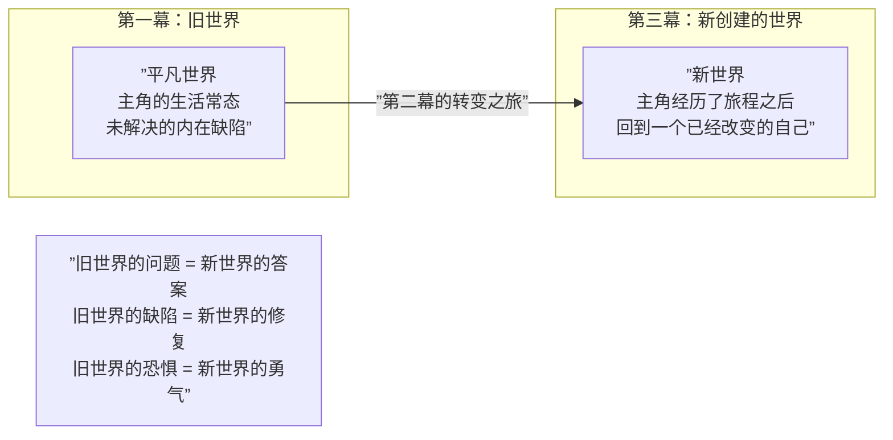

# 第12课：第三幕——新创建的世界

## Learning Objectives

- 掌握第三幕的核心构建要素：高潮与结局
- 理解子情节在主情节收束时的处理原则
- 理解"新创建的世界"（New Created World）的概念及其主题功能
- 学会比较旧世界与新世界的差异以获得主题性结论

## Core Idea

第三幕是剧本的终极裁决。在经历了第一幕的进入和第二幕的"鲸鱼肚子"之后，第三幕完成了两件事：**解决外部冲突**（高潮）和**确认内部变化**（新创建的世界）。最好的第三幕不止是让主角赢或输，而是通过对比第一幕的"旧世界"和第三幕的"新世界"，让观众清楚地看到主角的改变及其意义，从而完成主题的表达。

参考 [[0011-act-two|第11课]] 的内容，主角在第二幕结束时已经经历了"一切尽失"和"黑暗之夜"，现在带着新的觉悟进入第三幕。

---

## KP-049：第三幕——结局的构建

结局（Resolution）不是高潮之后的"尾巴"，而是整个故事的主题兑现场所。第三幕包含两个核心段落：**高潮**（Climax）和**结局**（Denouement）。

### 高潮 vs 结局

| 维度 | 高潮 (Climax) | 结局 (Denouement) |
|------|---------------|-------------------|
| 位置 | 剧本第85-95页附近 | 高潮之后至最后一页 |
| 功能 | 解决核心冲突 | 展示解决的后果 |
| 主角状态 | 最主动的行动 | 从行动到反思 |
| 节奏 | 最快、最紧张 | 逐渐放缓 |
| 对手 | 直接面对主要对手/障碍 | 对手已被解决（或后果显现） |
| 观众情感 | 紧张、期待、释放 | 满足、反思、感动 |

### 高潮的三要素

1. **主角必须主动行动**——高潮不是"事情发生"，而是"主角做出了最终选择或行动"
   - 不成立：炸弹自己停了
   - 成立：主角拆弹或选择了不拆弹

2. **高潮必须调用主角已经学到的东西**——高潮的成功取决于主角在第二幕中的成长
   - 不成立：主角用第一幕的技能赢了（等于成长无关）
   - 成立：主角用第二幕中学会的信任/牺牲/智慧做出了决定

3. **高潮必须有代价**——没有代价的高潮不是高潮，只是一个事件
   - 好的代价：主角实现了目标但失去了某些珍贵的东西（友谊、清白、生命）
   - 卓越的代价：主角选择了正确的目标但放弃了个人的欲望

> [!EXAMPLE] 《盗梦空间》的代价
> 柯布在高潮中成功完成了奠基任务，但他付出了巨大代价——斋藤履行了承诺让他回家，但柯布回家后看到了孩子的脸，却无法确定自己是否还在梦中。陀螺在结尾处是否停止的悬念，就是"主角为回家付出了代价，但代价是否包含了对真实的确信"的终极问题。

### 子情节收束原则

第三幕的一个常见陷阱是只顾主情节而忘记了子情节。以下是子情节收束的三个原则：

| 原则 | 说明 | 反例 |
|------|------|------|
| **子情节必须在主情节高潮前完成** | 只有子情节解决了，主角才能全神贯注于主高潮 | 如果爱情子情节在高潮途中仍有悬念，观众会分心 |
| **子情节收束必须服务主题** | 子情节的结局应该以不同的方式回应同一个主题 | 如果主情节主题是"牺牲"，子情节可以展示"不牺牲的代价" |
| **子情节收束不宜过于详细** | 子情节的收束通常只需一到两个场景 | 在结局中花太长时间解释子情节会稀释主高潮的力量 |

> [!WARNING] 结尾巴不要过长
> 一个常见的第三幕问题是高潮后拖延太久。观众的"内啡肽释放"只有短暂的窗口期。一旦主冲突已经解决，最多再用三到五个场景来收束子情节并展示新世界，然后就要结束。决不要让结局的篇幅超过高潮本身。

---

## KP-050：新创建的世界（New Created World）

"新创建的世界"是第三幕的结局段所呈现的画面——主角回到日常世界（或留在战斗中胜利后的世界），但他/她已经不再是出发时的那个人了。旧世界也因为主角的改变而发生了某种变化。

### 新旧世界对比框架

使用这个对比框架来分析你的剧本，可以确保第三幕完成了它的主题功能：

| 维度 | 旧世界（第一幕） | 新世界（第三幕结局） | 主题意义 |
|------|-----------------|---------------------|----------|
| **主角的外部处境** | 需求（Want）驱动的目标 | 需要（Need）驱动的选择 | 从"要什么"到"要成为什么" |
| **主角的内部状态** | 有意识或无意识地逃避真相 | 面对并接受真相 | 成长的代价和回报 |
| **主角的核心关系** | 孤独、误解、或虚假关系 | 真实连接、真相暴露或分离 | 什么是对的关系 |
| **社会的/世界的状态** | 不完整、危险或不公平 | 改变了（哪怕只是一点点） | 个人的改变如何影响世界 |
| **观众的情感** | 好奇/旁观 | 共鸣/满足 | 为什么这个故事值得讲 |

### 经典电影：旧世界 vs 新世界

| 电影 | 旧世界 | 新世界 | 改变意味着什么 |
|------|--------|--------|---------------|
| 《教父》 | 迈克尔说"那是我的家族，不是我"，与凯在一起，过着平民生活 | 迈克尔成为教父，关上门，凯看着门关上 | 为了保护家人，他变成了他最不想成为的人 |
| 《黑客帝国》 | 尼奥是托马斯·安德森，一个不满的程序员 | 尼奥是"救世主"，理解了矩阵的本质 | 接受命运不是被动的，而是主动的选择 |
| 《当幸福来敲门》 | 克里斯是推销员，流落街头 | 克里斯得到工作，在人群中的眼泪 | 坚持和父爱的力量可以穿透最深的绝望 |
| 《肖申克的救赎》 | 安迪是无辜的囚犯，被体制吞噬 | 安迪重获自由，瑞德追随他前往齐瓦塔尼奥 | 希望是永远不会被体制磨灭的东西 |

### 新世界的三种形态

1. **回归但改变**——主角回到原来的世界，但他/她已经不再是同一个人
   - 例：《星球大战》卢克回到反叛军联盟，但他已是原力使用者
2. **留在新世界**——主角选择留在第二幕的"新世界"中，因为旧世界已无法容纳改变后的他
   - 例：《黑客帝国》尼奥选择留在矩阵和真实世界之间战斗
3. **建立第三个世界**——主角既没有回到旧世界，也没有留在新世界，而是创造了一个全新的秩序
   - 例：《黑暗骑士》蝙蝠侠选择隐退，戈登继续保护城市，世界处于"蝙蝠侠不在但秩序得以维持"的脆弱平衡中

> [!TIP] 新世界是主题的最强表达
> "新创建的世界"是整个剧本主题的最终陈述。如果你能清楚地描述"主角离开时的世界和回到时的世界有什么不同"，你就找到了故事的主题。（参见 [[0013-social-network-analysis|第13课]] 中关于通过欲望与需求寻找主题的讨论。）

> [!QUESTION] 自检：你的第三幕是否完成了主题？
> 1. 高潮是否要求主角使用在第二幕中学到的东西？
> 2. 高潮的代价是否扣住了故事的主题？
> 3. 新世界和旧世界之间是否有观众能清楚看到的差异？
> 4. 结局部分是否在"过度解释"？观众会不会已经自己想到了结局？
> 5. 子情节的收束是否被草草处理或过度处理？

参考答案要点

- 如果你的高潮看起来像第一幕的主角也能完成，说明主角没有真正成长
- 代价是衡量一个故事严肃性的标尺：没有代价 = 没有风险的战斗 = 没有真正的高潮
- 观众不需要看到每个角色"从此幸福"的结局，但需要看到主角的核心变化如何反映在世界上
- 最好的结局往往在停止的那一刻让观众开始思考和讨论，而不是把所有答案都写出来

## Summary

第三幕不是故事的自然结束，而是**有意义的结束**。它通过高潮释放了第二幕积累的所有紧张感，通过结局展示了主角改变的最终结果。"新创建的世界"是整部剧本最容易被忽略但最重要的概念——它不是在说"故事结束了"，而是在说"因为主角经历了这个故事，世界（以及观众对世界的理解）从此不同了"。

| 元素 | 位置 | 功能 | 关键问题 |
|------|------|------|----------|
| 高潮 | p.85-95 | 解决核心冲突，主题兑现 | 主角是否用成长换来了胜利？ |
| 结局 | p.95-110 | 展示新世界，收束子情节 | 世界和主角有什么改变？ |
| 新创建的世界 | 全文最后一页 | 主题的最终陈述 | 旧世界的问题在新世界中是否被解决了？ |

## Next Step

进入 [[0013-social-network-analysis|第13课：三幕式架构分析——以《社交网络》为例]]，通过一部具体的电影拆解来深化对三幕式结构的理解。