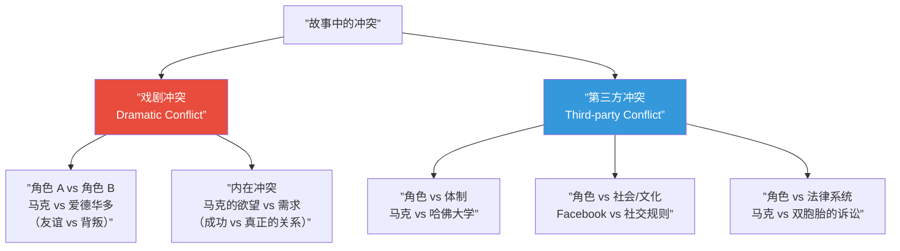

# 第13课：三幕式架构分析——以《社交网络》为例

## Learning Objectives

- 通过《社交网络》学习优秀的人物介绍技巧
- 理解"用行动而非描述"和"通过冲突塑造人物"的原则
- 区分戏剧冲突与第三方冲突，并理解各自的使用场景
- 掌握通过分析角色的欲望（Want）与需求（Need）来发现故事主题的方法

## Core Idea

《社交网络》（The Social Network, 2010，编剧：Aaron Sorkin）是现代三幕式结构教科书级别的案例。它用非线性的叙事（穿插两条听证会时间线）包裹了一个非常经典的三幕结构。更重要的是，Sorkin在人物介绍、冲突构建和主题表达上提供了极其清晰的学习样本。

本课将拆解这部剧本的人物介绍方法、冲突类型学，并展示如何从角色的欲望与需求的张力中找到故事的主题。

参考 [[0012-act-three|第12课]] 对新创建世界的讨论，以及 [[0007-character-archetypes|第07课]] 的角色原型体系，可以帮助你更深入理解本课内容。

---

## KP-051：《社交网络》的人物介绍分析

Sorkin的人物介绍从来不是"约翰，一个30岁的中年男子"式的平庸描写。他让人物在登场的第一场戏中就通过行动、决定和反应来定义自己。

### 主要人物介绍场景分析

| 角色 | 出场场景 | 介绍方式 | 揭示的核心信息 | 戏剧技巧 |
|------|----------|----------|---------------|----------|
| **马克·扎克伯格** | 酒吧中与女友艾丽卡谈话 | 通过一场密集的对话 | 聪明但社交笨拙，渴望被认可，话速极快，无法感知他人情绪 | "对立对话"——他说A，她听成B，两人的意图不断错位 |
| **艾丽卡·奥尔布赖特** | 同一场酒吧对话 | 在马克的衬托下定义 | 头脑敏锐，能看穿马克的自负，但她被马克的言语伤害后离开 | "通过离开定义角色"——她的主动离开定义了马克的失败和被抛弃感 |
| **爱德华多·萨维林** | 马克跑回宿舍撞到爱德华多 | 通过动作反应 | 爱德华多与马克关系亲密，性格更稳定，试图照顾马克 | "对比揭示"——爱德华多的冷静与马克的暴走形成对比 |
| **肖恩·帕克** | 餐厅中与马克的第一次对话 | 通过对话节奏和社交博弈 | 野心大、强势、知道怎么操控人，与爱德华多形成直接对立 | "通过外部反应定义"——从爱德华多紧张的表情可以感受到肖恩的威胁性 |
| **温克尔沃斯双胞胎** | 在哈佛校友会上的傲慢对话 | 通过权力姿态 | 出身优越，习惯发号施令，认为Facebook应该是他们的项目 | "通过制度权威定义"——他们是哈佛体制的代表，马克是挑战者 |
| **玛丽莲·德尔比** | 听证会上的开场提问 | 通过提问的内容和语气 | 理智、精准、不偏不倚，代表了法律系统的中立视角 | "通过功能定位"——她不只是提问者，她是观众的代理，帮助整理叙事 |

> [!EXAMPLE] Sorkin的"行走对话"技法
> 马克与爱德华多在校园中快走对话的场景是Sorkin标志性的"行走对话"（walk-and-talk）。这种技法通过**物理速度呼应思维速度**——角色边走边说，对话信息密度极高，观众被迫跟上角色的思维节奏。它暗示马克的思维速度远超常人。

---

## KP-052：如何进行人物介绍

《社交网络》展示了两个核心的人物介绍原则。

### 原则一：动作优于描述（Action Over Description）

> [!TIP] 核心信条
> 永远不要用形容词介绍人物。用行动和选择来让人物定义自己。

Sorkin的剧本几乎没有"马克是一个天才但社交能力差的计算机系学生"之类的人物描述。相反，他通过以下方式展示：

- **马克的天才**：在开场对话中，他用高速的逻辑链讨论"哈佛社交圈的排名机制"
- **马克的社交缺陷**：他在与艾丽卡对话中看不到自己的伤害性
- **马克的执着**：回到宿舍后立刻开始写FaceMash算法，完全不休息

| 糟糕的写法 | Sorkin式写法 |
|-----------|-------------|
| "马克是一个聪明但傲气的计算机学生" | 马克坐在酒吧，语速极快地告诉女友他发现了社交网络的数学漏洞 |
| "爱德华多是一个忠诚的朋友" | 爱德华多在凌晨三点陪着马克，给他提醒FACE被查封的后果 |
| "肖恩是一个魅力十足的操纵者" | 肖恩在餐厅中二十句话内就让马克抛弃了对爱德华多的承诺 |

### 原则二：通过冲突塑造人物（Character Through Conflict）

人物最真实的特质不是在独处中显现的，而是**在面对压力时的选择**中显现的。

| 角色 | 面对的压力 | 选择 | 揭示的特质 |
|------|-----------|------|-----------|
| 马克 | 艾丽卡指责他"以为自己是特别的" | 愤怒地跑回宿舍，开始写FaceMash | 极度渴望被认可，被轻视时会激烈反击 |
| 爱德华多 | 看到马克因为肖恩而忽视商业谨慎 | 试图反对肖恩的提案 | 守规矩、实际、但缺乏马克的果断和冒险精神 |
| 肖恩 | 双胞胎起诉Facebook | 用媒体公关和律师应战，不退缩 | 经历过Napster诉讼，不怕法律战 |
| 温克尔沃斯 | 马克偷了他们的创意 | 用体制的力量起诉 | 习惯于用制度和法律维护自己的阶层利益 |

> [!WARNING] 警惕"电话簿式介绍"
> 很多剧本在第一幕后半段安排一个"人物介绍场景"——所有角色在一个场景中依次被介绍，每个角色说一句话揭示自己的性格。这是一种偷懒的方式。真正有效的介绍是**将人物介绍嵌入故事行动中**：观众在理解故事的同时自然就认识了人物。

---

## KP-053：戏剧冲突 vs 第三方冲突

《社交网络》完美展示了两类冲突的并存与交织。

### 冲突分类框架

### 戏剧冲突（Dramatic Conflict）

戏剧冲突是**角色与角色之间**的直接对抗。它的特征是：

- 双方都有主观能动性
- 冲突通常是情感性和关系性的
- 观众可以理解双方各自的立场

《社交网络》的核心戏剧冲突：**马克与爱德华多的友谊破裂**。

| 阶段 | 冲突状态 | 关键场景 |
|------|----------|----------|
| 第一幕 | 友谊建立，目标一致 | 创立Facebook的初始兴奋 |
| 第二幕前期 | 裂痕出现，爱德华多被边缘化 | 肖恩出现，马克被吸引 |
| 第二幕后期 | 冲突公开化 | 爱德华多冻结账户，马克愤怒 |
| 第三幕 | 彻底破裂 | 爱德华多被稀释股份，马克签字 |

### 第三方冲突（Third-Party Conflict）

第三方冲突是**角色与外部系统或力量**之间的对抗。它的特征是：

- 对方不是一个具体的"反派"，而是一个制度、文化或社会力量
- 冲突中的"第三方"不会因个人情感而改变——它按照自身的规则运行
- 主角必须调整自己来应对或突破这个系统

《社交网络》的第三方冲突：

| 第三方 | 表现形式 | 对马克的挑战 |
|--------|----------|-------------|
| **哈佛大学体制** | 校园网络规则、学术荣誉制度 | 被勒令关闭FaceMash，面临开除 |
| **法律制度** | 双胞胎的诉讼、听证会 | 必须用法律语言辩护自己的创意权 |
| **社交规则/阶层壁垒** | 凤凰社俱乐部（Porcellian Club）、哈佛精英圈 | 马克作为局外人想要进入被拒绝的精英圈 |

> [!TIP] 两种冲突的协同作用
> 最好的剧本不会只依赖一种冲突。戏剧冲突提供情感深度（我们会为爱德华多的被背叛感到难过），第三方冲突提供结构张力（我们会对哈佛精英体制感到愤怒）。Sorkin让两种冲突交替出现，互相放大：双胞胎的起诉是第三方冲突，但它直接加剧了马克和爱德华多之间的戏剧冲突。

---

## KP-054：如何获得故事主题

《社交网络》的主题不是"关于一个网站的发明"，而是关于**身份、阶层和背叛**。

### 通过欲望 vs 需求寻找主题

Sorkin曾说："主题是故事所提出的问题的答案。"

在《社交网络》中，核心问题不是"Facebook是怎么创建的"，而是"为了成功你需要付出什么？"

| 角色 | 欲望（Want）——表层目标 | 需求（Need）——深层缺失 | 两者之间的矛盾 | 主题揭示 |
|------|----------------------|----------------------|---------------|----------|
| 马克·扎克伯格 | 被哈佛精英圈认可，创造赢过双胞胎的社交产品 | 真正的友谊和情感连接 | 他追求精英认可的行为破坏了他真实的关系 | 追求被世界认可的代价是失去真正理解你的人 |
| 爱德华多·萨维林 | Facebook的商业成功和财务稳定 | 马克的忠诚和友谊 | 他以为商业关系和朋友关系是同一件事 | 当朋友变成商业伙伴时，友谊会被稀释 |
| 肖恩·帕克 | 掌控下一个互联网大潮 | 停止漂泊，找到一个可以"回家"的地方 | 他的自由表象下是对归属的渴望 | 最追求自由的人往往最渴望被某件事接纳 |
| 艾丽卡·奥尔布赖特 | 只是想好好吃一顿晚餐 | 不想被当作社交实验中的分母 | 她只想要最简单的尊重，而马克给不了 | 聪明人最大的盲点是最基本的尊重 |

### 找到主题的三步法

1. **写下主角的欲望（Want）**——在故事中主角最明确的目标是什么？
   - 马克：成立Facebook，成为精英
2. **写下主角的需求（Need）**——在故事结束时主角最需要学习/接受的是什么？
   - 马克：他需要面对"为了成功他牺牲了什么人"
3. **欲望和需求的冲突之间，就是主题**
   - 主题：《社交网络》的主题是——"你不可能在不付出代价的情况下赢得一切。代价就是你最珍视的东西。"

> [!EXAMPLE] 主题验证
> 看看《社交网络》的最后一幕：马克不停地刷新艾丽卡的Facebook页面——他赢得了Facebook、赢得了与精英的战争，但他无法修复与艾丽卡的关系，甚至无法让爱德华多原谅他。这个场景就是对主题的最强表达。如果最后一幕是马克站在聚光灯下接受成功，而没有这个孤独的结尾，主题就不存在了。

> [!QUESTION] 自检：你的故事主题是什么？
> 1. 主角在故事中想要什么？（欲望）
> 2. 主角在故事中需要什么？（需求）
> 3. 当欲望和需求发生冲突时，主角选择了什么？
> 4. 这个故事在问一个什么问题？
> 5. 故事的结局是对这个问题的什么答案？

参考答案要点

- 欲望是具体的、外部的、可以写在海报上的（"成为富翁""赢得比赛""找到真爱"）
- 需求是抽象的、内部的、通常与人格缺陷相关（"学会信任""接受失去""面对真相"）
- 主角通常直到第二幕结束时才意识到自己的需求是什么
- 最好的结局不是"主角欲望实现了"，而是"主角需求被满足了"——这意味着欲望可能失败而需求成功，反之亦然
- 如果你无法用一句话说出故事的主题（不是情节，是主题），说明你的故事可能还没有找到它的"为什么"

## Summary

《社交网络》是三幕式结构教学的完美样本，因为它用最前卫的叙事技法包裹了最经典的结构逻辑。通过这部剧本，我们学到了：

- **人物介绍**的核心不是描述而是行动，不是在静态中定义而是在冲突中展示
- **冲突类型学**告诉我们，最丰富的故事同时包含个人层面的戏剧冲突和系统层面的第三方冲突，两者形成共振
- **主题发现**的方法不是凭空想一个道理，而是追踪主角欲望与需求之间的张力，让故事自己说出它的答案

| 知识点 | 核心概念 | 《社交网络》中的体现 |
|--------|---------|---------------------|
| 人物介绍 | 行动优于描述，冲突中揭示 | 酒吧对话定义马克，肖恩的餐桌博弈定义三人关系 |
| 冲突类型 | 戏剧冲突 vs 第三方冲突 | 马克vs爱德华多（戏剧）+ 马克vs哈佛体制（第三方） |
| 主题发现 | 欲望vs需求的冲突 | 马克的欲望（被认可）vs 需求（真实连接） |
| 原型映射 | 角色与原型的关系 | 马克（叛逆者）、爱德华多（知己）、哈佛（体制） |

## Next Step

进入 [[0014-character-arc-semiotics|第14课：故事弧光与符号学应用]]，在人物介绍和冲突分析的基础上，进一步学习人物弧光的设计方法和符号学的跨叙事应用。