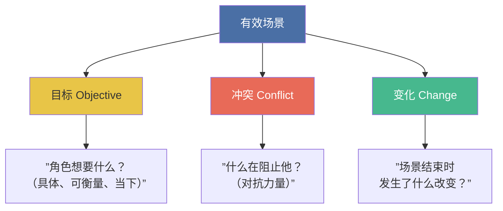
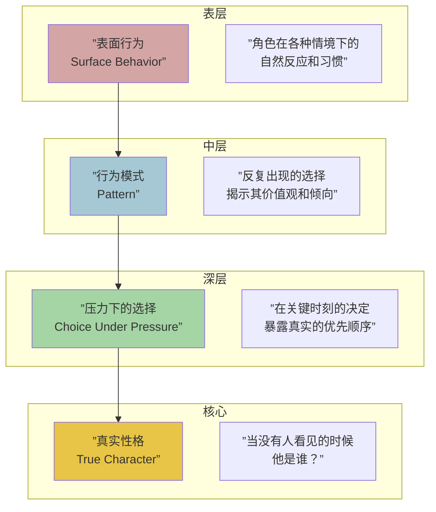

# 第15课：场景绘制法则（上）

## KP-057：剧本的语言和语法格式

剧本是一种独特的文学形式，有自己严格的视觉语法。每一行文字只有一个目的：最终被翻译成影像和声音呈现在银幕上。标准的剧本格式是行业通用的"密码"，它让导演、演员、摄影师等所有部门能够高效协作。

### 六大基本元素

| 元素 | 英文 | 格式规则 | 用途 |
|------|------|----------|------|
| 场景标题 | Slug Line / Scene Heading | 全部大写，如 `内·约翰的公寓 - 日` | 告诉剧组在哪里、什么时间拍摄 |
| 动作描写 | Action | 顶格写，现在时，只写观众能看到和听到的 | 描述画面和声音，推动视觉叙事 |
| 角色名 | Character | 居中上方，全部大写，如 `约翰` | 标示即将说话的角色 |
| 对白 | Dialogue | 角色名下方，居中，左右缩进 | 角色说的话 |
| 括号说明 | Parenthetical | 角色名下方、对白上方，用小括号包裹 | 提示说话方式或动作（慎用） |
| 转场 | Transition | 右对齐，全部大写，如 `切至：` | 指示剪辑方式（现代剧本已减少使用） |

> [!tip] 格式即纪律
> 专业的剧本格式不是桎梏，而是一种纪律。当你严格遵守格式时，你实际上是在告诉读者：你知道自己在做什么。关于完整的格式规范，请参见 [[reference/screenplay-format|剧本格式标准]]。

> [!warning] 常见误区
> 初写者常常在动作描写中插入角色的内心想法（"他感到很难过"）。记住：动作描写只写**观众能看到和听到**的东西。悲伤要通过行为来展现——他沉默地收拾桌子，手在发抖。

---

## KP-058：单刀直入（Get In Late, Get Out Early）

这是场景写作中最实用的法则之一，由编剧大师 William Goldman 等大力倡导。

### 迟进早出

- **迟进（Get In Late）**：从场景的最后一刻切入。省略寒暄、进门、脱外套等日常动作，直接进入冲突的核心。
- **早出（Get Out Early）**：一旦场景的核心目的达成，立刻切出。不要在多余的解释或反应中停留。

### 操作方法

1. **问自己**：这个场景真正的开始在哪一刻？去掉前三行（甚至前五页），你会发现故事往往从那里才开始。
2. **问自己**：这个场景真正的结束在哪一刻？在情绪或信息的最高点切断。
3. **检查每个场景的开头和结尾**：删掉一切"进入"和"离开"的冗余动作。

> [!example] 实操对比
> **平庸的写法**（进入太早）：
> > 约翰走进咖啡馆，脱下外套，四处张望，看到玛丽在角落，走过去坐下。
>
> **专业的写法**（直接切入）：
> > 约翰在玛丽对面坐下。"你叫我来的。"
>
> 观众不需要看到走进和坐下——他们已经自动脑补了。直接进入冲突。

---

## KP-059：场景创建方法

一个有效的场景建立在三个支柱之上。缺少任何一根，场景就会垮掉。

### 场景的三要素

### 三要素详解

**1. 目标（Objective）**
每个场景中，至少有一个角色有明确的目标。这个目标必须：
- **具体**：不是"想要快乐"，而是"想要拿到那个U盘"
- **可衡量**：观众能判断目标是否达成
- **当下**：在这个场景中就能争取或失败，不是遥远的人生目标

**2. 冲突（Conflict）**
没有冲突就没有戏剧。冲突不等于吵架——它可以是：
- 两个角色想要不同的东西
- 两个角色想要同一个东西，但只能一个人得到
- 一个角色想要的和他内心相信的东西互相矛盾
- 外部环境阻止角色达成目标

**3. 变化（Change）**
场景结束时，必须有一个不可逆的变化：
- 角色A知道了之前不知道的信息
- 角色之间的关系发生了转变
- 故事的方向发生了偏移
- 即使变化是微妙的，它也必须是**真实存在的**

> [!question] 自检
> 写完一个场景后，问自己：
> - 这个场景开始时，角色想要什么？
> - 谁/什么在阻止他？
> - 场景结束时，和开始时有什么不同？
>
> 如果第三个问题答不上来——你的场景没有存在的理由。

---

## KP-060：逐步揭露人物

优秀的剧本不靠描述来定义人物，而是通过人物的**行为**和**选择**来逐步揭露其内在本质。

### 揭露层次

### 揭露原则

| 层次 | 举例 | 揭示内容 |
|------|------|----------|
| 表面行为 | 他每天早晨给咖啡店的小费特别多 | 慷慨？还是出于愧疚？ |
| 行为模式 | 他对所有服务人员都非常友好 | 尊重劳动？还是需要被喜欢？ |
| 压力下的选择 | 他在升职和替同事说话之间选择了后者 | 正义感高于个人利益 |
| 真实性格 | 独处时他对着镜子练习微笑 | 表面的友善其实是一种表演 |

> [!important] 不要用形容词
> 不要写"约翰是一个善良的人"。要让观众自己得出这个结论。写"约翰把自己的午饭给了街角的流浪汉，然后饿了一下午。"

---

## KP-061：准备场景和后续场景

场景不是孤立的岛屿，它是叙事河流中的一段。每一个场景都应该**为下一个场景做好准备**，同时也**受上一个场景的推动**。

### 场景的衔接机制

### 三种衔接方式

1. **因果链（Cause and Effect）**
   场景A导致场景B。约翰被发现偷了钱（A），所以他被解雇了（B）。这是最有力也最常见的衔接方式。

2. **主题呼应（Thematic Echo）**
   场景A和B看似无关，但共享同一个主题。A中丈夫对妻子撒谎，B中政治人物对公众撒谎——两者呼应了"欺骗"的主题。

3. **情绪延续（Emotional Continuity）**
   场景A结尾留下某种情绪，场景B在同样的情绪基调上继续发展。

> [!tip] 写作练习
> 取你剧本中的连续三个场景，问自己：
> - 场景1的结尾是否自然导向场景2的开始？
> - 如果去掉场景2，故事会断吗？
> - 场景3是否利用了场景1或2中建立的东西？
>
> 如果答案是"不"——你的场景可能只是按时间顺序排列，而不是真正有机衔接。

---

## 本课自测

点击展开自测题

**题目1：以下哪个不是场景标题（Slug Line）的正确格式？**
A. `内·约翰的公寓 - 日`
B. `外·中央公园 - 夜`
C. `约翰走进房间`
D. `内·实验室 - 黄昏`

**答案：C**。场景标题必须以"内"或"外"开头，然后是地点和时间。C是一个动作描述。

---

**题目2："Get In Late, Get Out Early" 是什么意思？**
A. 写剧本要迟到，交稿要早
B. 从冲突即将爆发的时刻切入，在目的达成后立即切出
C. 角色要晚出场早离场
D. 场景要写在页面的靠后位置

**答案：B**。

---

**题目3：场景三要素是哪三个？**
A. 角色、地点、时间
B. 开场、发展、结尾
C. 目标、冲突、变化
D. 对白、动作、转场

**答案：C**。

---

**题目4：以下哪种方式最能"逐步揭露"一个人物？**
A. 在角色介绍中写"她是一个勇敢的女人"
B. 在场景中让她面对危险时挺身保护别人
C. 让其他角色说她很勇敢
D. 在括号说明中标注"勇敢地"

**答案：B**。行为展示性格，描述只是告诉。

---

**题目5：两个场景之间最有力的衔接方式是什么？**
A. 时间顺序排列
B. 因果链（场景A导致场景B）
C. 同一个地点
D. 同一个角色出现

**答案：B**。

---

> 继续学习 [[0016-scene-writing-2|第16课：场景绘制法则（下）& 对话]]