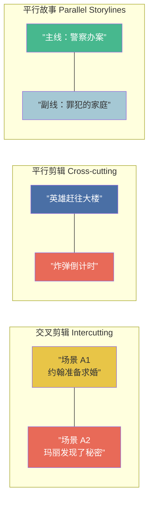

# 第16课：场景绘制法则（下）& 对话

## KP-062：平行情节（Parallel Plot）

平行情节是指在同一时间段内，两条或多条故事线交替展开，通过交叉剪辑在观众心中建立关联和对比。

### 三种基本形式



| 类型 | 英文 | 用途 | 经典案例 |
|------|------|------|----------|
| 交叉剪辑 | Intercutting | 同一时间不同地点的事件交替，常用于电话对话、追逐场面 | 《教父》洗礼与屠杀交叉 |
| 平行剪辑 | Cross-cutting | 创造悬念和对比，让观众知道角色不知道的信息 | 《盗梦空间》多层梦境 |
| 平行故事 | Parallel Storylines | 独立但主题相关的多条故事线 | 《撞车》《巴别塔》 |

### 平行情节的原理

平行情节之所以有效，是因为它利用了观众的**大脑自动寻找关联的本能**。当两条看似无关的线索被剪在一起时，观众会自动问："它们之间有什么关系？" 这种主动参与感让观影体验更加深刻。

> [!tip] 写作技巧
> 在剧本中使用 `交叉剪辑（INTERCUT）` 标注。例如：
> ```
> 交叉剪辑 - 约翰和玛丽的电话对话：
>
> 约翰
> (对着电话)
> 我需要见你。
>
> 玛丽
> （另一端）
> 我也是。
> ```

---

## KP-063：场景转换技巧

场景之间的转换不仅仅是技术操作，更是叙事语言的一部分。每一次转场都在告诉观众：**空间变了、时间变了、或者视角变了**。

### 转场类型速查

| 转场 | 英文 | 观感 | 最佳使用场景 |
|------|------|------|-------------|
| 硬切 | Cut | 直接、中性、不可见 | 默认选项，90%的场景转换 |
| 淡入/淡出 | Fade In / Out | 柔和、结束感 | 剧本开始/结束，重大时间跨度 |
| 化入 | Dissolve | 梦幻、流畅 | 时间流逝、回忆、抒情过渡 |
| 划变 | Wipe | 风格化、节奏感 | 类型片（如《星球大战》）、并行故事 |
| 匹配切 | Match Cut | 视觉或听觉上的关联 | 建立象征关联，如《2001太空漫游》骨棒→飞船 |
| 声音桥 | Audio Bridge | 声音延续穿接画面 | 下一个场景的声音提前进入，创造连续性 |

> [!important] 核心原则
> **最好的转场是观众注意不到的转场。** 除非有特殊的艺术目的（如匹配切），否则用标准的"切至（CUT TO）"就够了。事实上，当代大多数剧本已经不再标注"切至"，默认就是硬切。

### 匹配切的魔力

匹配切是最具创造力的转场方式。它利用两个场景之间的视觉、听觉或概念上的相似性，在观众潜意识中建立联系。

- **视觉匹配**：圆形的太阳 → 圆形的车轮
- **动作匹配**：角色在A场景关门 → 另一个角色在B场景开门
- **声音匹配**：A场景的警笛声 → B场景的婴儿哭声
- **概念匹配**：上一秒主角说"我要赌一把" → 下一秒镜头在赌场

---

## KP-064：荧幕外（OS）及画外音（VO）

这是两个经常被混淆的概念，但它们有本质的区别。

### OS vs VO

| 元素 | 英文 | 含义 | 角色位置 |
|------|------|------|----------|
| 荧幕外 | O.S. (Off-Screen) | 角色在同一场景中但不在画面里 | 在同一个时空环境中（如隔壁房间） |
| 画外音 | V.O. (Voice-Over) | 声音来自画面以外的时间/空间 | 不在当前场景的时空中（如回忆、旁白） |

### 使用规则

**O.S. 用法：**
- 角色A在厨房，角色B在客厅大喊回答——标注 `B (O.S.)`
- 门外的声音、电话另一头（但如果是同一时空）—— O.S.

**V.O. 用法：**
- 叙述者的旁白（NARRATOR (V.O.)）
- 角色在回忆过去的自己说话
- 内心独白（但慎用——电影是视觉媒介）

> [!warning] 避免过度使用 V.O.
> 画外音是一个强有力的工具，但容易被滥用。优秀的画外音**补充**画面而非**重复**画面。如果你用 V.O. 来解释观众已经通过画面理解的内容——删掉它。

---

## KP-065：情节格式（蒙太奇等）

某些叙事手法有特殊的格式约定。

### 蒙太奇（Montage）

蒙太奇是一系列短镜头的集合，用来压缩时间、展示过程或建立情绪。

**标准格式：**
```
蒙太奇 - 约翰的康复训练：

A) 约翰在理疗师的帮助下试着走路。
B) 汗水从他脸上滴落。
C) 跑步机上的速度不断增加。
D) 他的腿不再颤抖。

蒙太奇结束
```

### 连续镜头（Series of Shots）

与蒙太奇类似，但更侧重叙事的连续性而非情绪。

### 闪回（Flashback）

- 如果闪回较长，用新的场景标题加注时间信息：`内·老房子 - 日（闪回 - 1999年）`
- 如果闪回较短，在动作描述中标注即可

> [!tip] 闪回原则
> 闪回不是拐杖。不要用闪回来逃避当前的叙事挑战。最好的闪回是**不可替代**的——如果去掉它故事会受损，而不是更方便。

---

## KP-066：视觉编写（Writing Visually）

电影是看的艺术。编剧的工作是用文字激发读者的视觉想象。

### 展示，不要告诉（Show, Don't Tell）

| 告诉（Tell） | 展示（Show） |
|-------------|-------------|
| 他很紧张 | 他不停地按圆珠笔，咔嚓咔嚓响 |
| 他们很穷 | 墙壁上有一个用胶带补了三次的洞 |
| 她爱上了他 | 她偷偷把餐巾纸折成了他的样子 |
| 城市很危险 | 商店橱窗上装的铁栅栏比监狱还密 |
| 他很孤独 | 他一个人吃着泡面，手机屏幕是黑的 |

### 视觉写作的四条法则

1. **动作描写只写观众能看到和听到的**——摄像机无法拍摄"内心"
2. **用具体代替抽象**——不说"糟糕的社区"，写"人行道上躺着空酒瓶和针筒"
3. **用细节制造真实感**——一个有特色的细节胜过十句泛泛的描述
4. **每一行动作描写都推动故事或揭示人物**——如果它不需要在银幕上呈现，删掉它

> [!question] 自我检查
> 通读你剧本中的所有动作描写段落。把你自己的内心声音读出来。删掉任何一句摄像机拍不出来的内容。

---

## KP-067：人物对话与潜台词

对话中最重要的原则：**角色说的不等于角色想的**。

### 对话 vs 潜台词

| 角色说出口的话 | 真正想表达的意思 | 潜台词类型 |
|---------------|-----------------|-----------|
| "我没事。" | "我受伤了，但我不想让你知道。" | 防御性否认 |
| "你真是太体贴了。" | "你的关心让我窒息。" | 反讽 |
| "我们谈谈吧。" | "我们分手吧。" | 委婉回避 |
| "你随便吧。" | "求你别走。" | 反向表达 |
| "恭喜你。" | "我恨你为什么成功。" | 表面礼节的伪装 |
| "这里真安静。" | "我害怕我们之间无话可说。" | 隐喻 |

### 潜台词创作的三个层次

1. **表面文本（Surface Text）**：角色实际说出的词语
2. **潜在意图（Subtext）**：角色真正想要达成的目的
3. **观众解读（Audience Interpretation）**：两者之间的差距创造了戏剧张力

最精彩的对话发生在观众能**自己察觉潜台词**的时候。当观众想"他嘴上说没事，其实他很痛苦"，你成功了。

> [!example] 对比
> **无潜台词（On the Nose）：**
> > 约翰："我很生气你背叛了我。"
>
> **有潜台词：**
> > 玛丽："你还好吗？"
> > 约翰倒了一杯酒，一饮而尽："我真好，从来没这么好过。"

---

## KP-068：人物对话的写作建议

### 五条核心建议

**1. 删掉10%**
写完每场对话后，至少删掉10%。角色说话越精炼，力量越大。多余的对话稀释了戏剧效果。

**2. 避免"正中眉心"式对话（On-the-Nose Dialogue）**
现实中有教养的人很少直接说出自己的真实想法。电影的对话应该比现实更有节制，更有层次。

**3. 利用节奏和停顿**
在剧本中用 `（停顿）`、`（长停顿）` 和动作描写来创造节奏。沉默有时候比话语更有力。

```
约翰
（停顿）
我不确定我还能信任你。

（他站起来，走向窗户。）

约翰（O.S.）
你走吧。
```

**4. 区分角色声线**
每个角色的说话方式应该独特——词汇量、句式长度、口头禅、语速偏好都不相同。遮住角色名，读者应该能通过对话风格判断出是谁在说话。

**5. 让对话服务于角色，不服务于情节**
如果一段对话只是向观众传递信息（"信息倾销"），那它在艺术上失败了。好的对话在做两件事：**揭示角色**和**推动冲突**。信息应该巧妙地编织在其中。

### 检查清单

> [!todo] 对话自查
> - [ ] 这段对话可以缩短10%吗？
> - [ ] 角色说的话是否过于直接说出了自己的感受？
> - [ ] 角色A和角色B的说话方式一样吗？
> - [ ] 这段对话有没有推动冲突或揭示角色？
> - [ ] 这段对话是在传递信息，还是在创造戏剧？

---

## 本课自测

<details>
<summary>点击展开自测题</summary>

**题目1：以下哪个是平行情节中制造悬念最常用的手法？**
A. 线性叙事
B. 交叉剪辑
C. 画外音
D. 淡入淡出

**答案：B**。

---

**题目2："匹配切"（Match Cut）的最佳用途是什么？**
A. 节省剪辑时间
B. 在两个场景之间建立视觉或概念上的关联
C. 让观众看不到转场
D. 增加特效镜头

**答案：B**。

---

**题目3：一个角色在卧室里说话，另一个角色在门外的走廊上回答，应该用什么标注？**
A. V.O.
B. O.S.
C. 括号说明
D. 不需要标注

**答案：B**。O.S. 用于同一场景中但不在画面里的角色。

---

**题目4："展示，不要告诉" 以下哪个是展示？**
A. "他很悲伤"
B. "她的眼中含着泪水，但她咬着嘴唇没有让它们掉下来"
C. "这是一个悲伤的场景"
D. "他对妻子的去世感到悲痛"

**答案：B**。

---

**题目5："潜台词"指的是什么？**
A. 对话中非常小声的部分
B. 角色话语之下的真实意图
C. 剧本的隐含主题
D. 导演添加的额外对白

**答案：B**。

---

**题目6：关于对话写作，以下哪条建议是正确的？**
A. 角色应该把想说的都说清楚
B. 每个角色应该用同样的方式说话，以便统一风格
C. 写完对话后尝试删掉10%
D. 对话是传递情节信息最有效的方式

**答案：C**。

</details>

---

> 上一课：[[0015-scene-writing-1|第15课：场景绘制法则（上）]]
> 下一课：[[0017-feedback-criticism|第17课：作品分享与批评]]