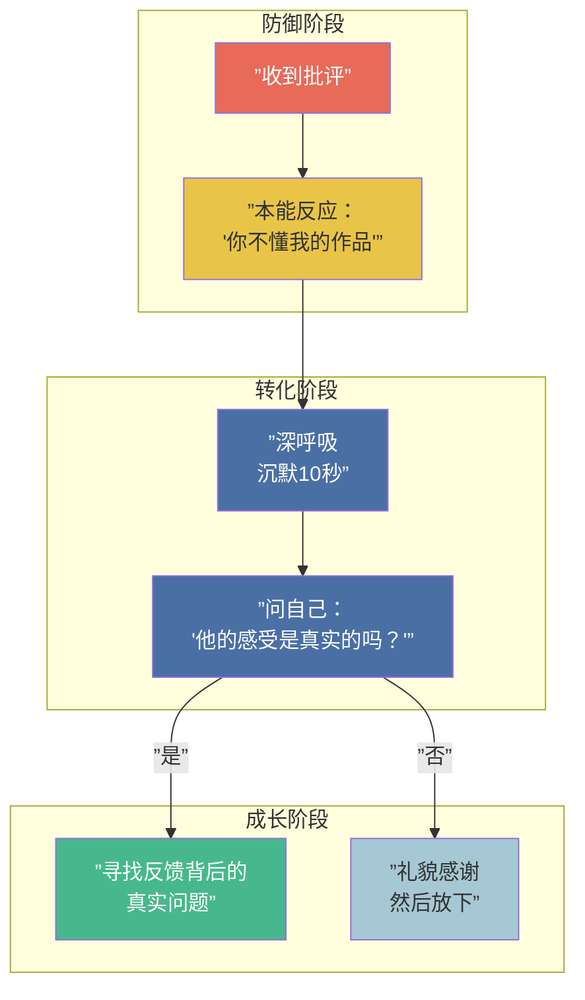
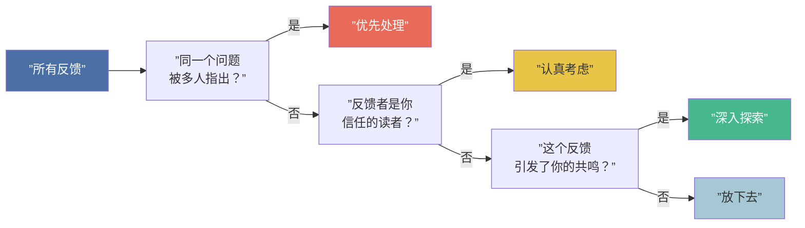
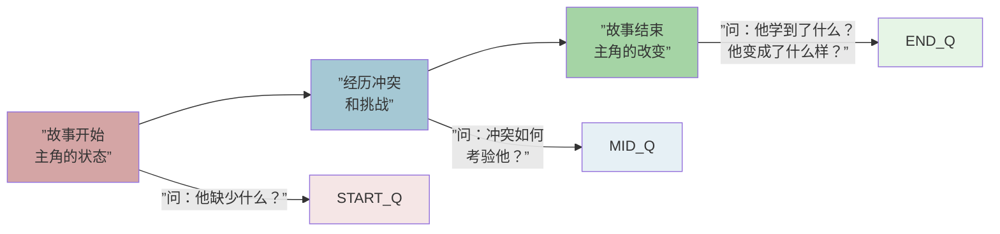

# 第17课：作品分享与批评

## KP-069：面对批评与作品分析方法

写作是一项孤独的工作，但**修改**需要他人的眼睛。如何接受批评、如何筛选反馈、如何系统地分析自己的作品——这些技能和专业写作技巧同样重要。

### 反馈的心理防线

当别人批评你的作品时，你的本能反应是防御。这很正常——剧本是你花了无数心血创造的。但顶尖编剧和业余写手的区别就在于：前者学会了**把批评当作免费的诊断工具**。

### 接收反馈的四步法则

#### 第一步：不解释

当你收到反馈时，**不要解释你本来想写什么**。如果你需要解释，说明它没有出现在页面上。解释是修改的敌人。你听到的每一句"我本来想……"都意味着你需要回去改剧本。

#### 第二步：寻找共识

如果三个人都指出同一个问题——无论你是否同意他们的解决建议——**那里一定有问题**。观众的直觉（"这里感觉不对"）往往是准确的，但他们提出的解决方案通常是错的。你的工作是发现问题，然后自己找到解决办法。

#### 第三步：分层过滤

将所有反馈按照以下层级分类：

| 层级 | 内容 | 处理方式 |
|------|------|----------|
| 一级：问题报告 | "第三幕节奏太慢" | 高度重视，寻找节奏问题的根源 |
| 二级：感受描述 | "我不喜欢女主角" | 有价值——但"不喜欢"可能是因为她塑造得太成功（她本就是个讨厌的人） |
| 三级：解决方案 | "你应该让男主角死掉" | 低优先级——这是别人的创作冲动，不是你的 |
| 四级：品味差异 | "我更喜欢快节奏的电影" | 忽略——这是个人偏好，不是客观问题 |

#### 第四步：筛选与行动

---

### 自我分析：用工具代替直觉

除了依靠别人的反馈，你还需要一套自我分析的工具箱。以下是一些经过验证的分析方法。

#### 1. 结构分析清单

| 检查项 | 问题 |
|--------|------|
| 激励事件 | 第25页之前是否发生了不可逆转的改变？ |
| 第一幕转折 | 主角是否做出了一个无法回头的决定？ |
| 中点 | 故事是否有重大转折或升级？ stakes 是否提高了？ |
| 第三幕 | 主角是否主动（而非被动）进入最终冲突？ |
| 结局 | 是否有情感和故事的闭合？ |

#### 2. 场景级诊断

逐场问自己：
- 这个场景有**冲突**吗？哪怕只是观点上的分歧。
- 这个场景结束时，**什么变了**？
- 如果删掉这个场景，**故事会受影响**吗？
- 这个场景的**目的**是什么——推动情节、揭示角色、还是制造气氛？
- 一个场景可以同时做三件事——但最少要做一件事。

#### 3. 对话检查

- 遮住角色名，还能分清谁在说话吗？
- 有没有"信息倾销"段落？
- 角色说的话是否太直接（on the nose）了？
- 有没有可以删掉10%的段落？

#### 4. 人物弧光检查

---

### 剧本朗读（Table Read）

剧本朗读是修改过程中最有力的工具之一。它让你的剧本从纸上站起来，变成活的对话。

#### 如何组织一场有效的剧本朗读

| 步骤 | 操作 | 注意事项 |
|------|------|----------|
| 选角 | 找能读的演员或写作者朋友 | 不要自己读所有角色——你听不到问题 |
| 环境 | 舒适的阅读环境，最好能录音 | 录音后可以反复听 |
| 阅读 | 不加表演、不加动作，只读对白 | 目的是听节奏和语言，不是看演技 |
| 反馈 | 读完后先不要说话，静默30秒 | 让感受沉淀，让大家消化 |
| 讨论 | 先从"整体感受"开始，再逐点讨论 | 不要跳过第一印象——它最真实 |

#### 朗读后的关键问题

- 哪些部分让人发笑？哪些部分安静了？（不管是不是你预期的）
- 哪段对话感觉很"写"而不是"说"？
- 哪个角色听起来和其他角色太像？
- 观众在哪个地方感到困惑或失去兴趣了？

> [!tip] 沉默是最好的反馈
> 如果一个应该有效果的场景在朗读时没有任何反应——那就是最诚实的反馈。不要找借口（"那是因为他们没有好好读"）。回到电脑前，修改它。

---

### 分辨噪音：什么时候忽略反馈

不是所有的反馈都有价值。学会区分以下情况：

**应该忽略的反馈类型：**
- 基于个人品味的偏好（"我不喜欢悲剧"）
- 基于误解的批评（如果只有一个人误解，可能是他的问题——如果三个人都误解，是你的问题）
- 没有具体依据的否定（"就是感觉不对"——但不能提供任何具体位置和原因）
- "如果是我会这样写"式的反馈（这是别人的创作冲动，不是你的问题）

**应该重视的反馈类型：**
- 多个读者独立指出的同一个问题
- 读者能准确说出"哪里"和"为什么"感觉不对
- 读者第一次阅读时产生的即时反应（"这里我搞不懂谁在说话"——这是金矿）
- 来自你信任的专业人士的建议

### 修改的哲学

> 写作就是重写。—— 所有伟大的编剧

最后的建议：**不要爱上你的初稿。** 第一稿只是你搞清楚故事说了什么的过程。真正的写作从第二稿开始。修改不是惩罚——它是剧本打磨的过程。一块大理石在被凿成千百次之前，只是一块石头。

> [!quote]
> 剧本不是写出来的，是改出来的。
>
> —— 佚名（但所有编剧都这么说）

---

## 本课自测

点击展开自测题

**题目1：收到反馈时，第一步应该做什么？**
A. 解释你本来想写什么
B. 反驳对方
C. 沉默，不解释
D. 立即修改

**答案：C**。不要解释。如果它没出现在页面上，解释也没有用。

---

**题目2：如果三个不同的人指出了同一个问题，你应该怎么处理？**
A. 认为他们都没看懂
B. 高度怀疑那里确实有问题
C. 询问他们应该怎么改
D. 忽略，因为每个人的品味不同

**答案：B**。多个独立读者指出同一个问题，那里一定有问题。

---

**题目3：关于"剧本朗读"（Table Read），以下哪项做法是错误的？**
A. 由作者本人读所有角色的对白
B. 找不同的演员或朋友来读不同的角色
C. 朗读后静默30秒再讨论
D. 对朗读过程进行录音

**答案：A**。作者读所有角色会丧失客观性，也无法听出对话节奏的问题。

---

**题目4：以下哪种反馈最值得重视？**
A. "应该让男主角死掉"
B. "这里我搞不懂谁在说话"
C. "我不喜欢爱情片"
D. "如果是我会设置成反转结局"

**答案：B**。准确指出具体位置和问题的反馈是最有价值的。

---

**题目5：专业编剧如何看待"修改"？**
A. 修改是初稿失败的表现
B. 真正的写作从修改开始
C. 改三遍就够了
D. 修改应该交给编辑来做

**答案：B**。第一稿只是搞清楚故事的过程，真正的写作从第二稿开始。

---

> 上一课：[[0016-scene-writing-2|第16课：场景绘制法则（下）& 对话]]