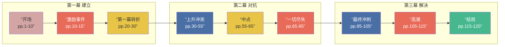

# 三幕式结构速查

## 结构总览

## 九大节拍速查

### 第一幕：建立（Act One: Setup）— 约25页

| 节拍 | 英文 | 页码 | 描述 |
|------|------|------|------|
| 开场 | Opening Image | pp.1-5 | 主角在日常世界中的状态，与结局形成对比 |
| 主题宣告 | Theme Stated | pp.5-10 | 有人（通常非主角）说出故事的潜在主题 |
| 激励事件 | Inciting Incident | pp.10-15 | 打破平衡的事件，让主角不得不行动 |
| 第一幕转折 | Act One Turning Point | pp.20-30 | 主角做出不可逆的决定，进入新的世界 |

### 第二幕：对抗（Act Two: Confrontation）— 约60页

| 节拍 | 英文 | 页码 | 描述 |
|------|------|------|------|
| 上升冲突 | Rising Action | pp.30-55 | 主角遭遇越来越多的挑战，stakes持续升高 |
| 中点 | Midpoint | pp.55-65 | 重大转折——主角从被动应对转为主动进攻，或发现真相 |
| 一切尽失 | All Is Lost | pp.65-85 | 最低谷，主角似乎已经失败，看不到希望 |

### 第三幕：解决（Act Three: Resolution）— 约35页

| 节拍 | 英文 | 页码 | 描述 |
|------|------|------|------|
| 最终冲刺 | Final Push | pp.85-105 | 主角重新集结，为最后的决战做准备 |
| 高潮 | Climax | pp.105-115 | 主角与主要冲突正面对决，故事的核心问题得到解决 |
| 结局 | Resolution | pp.115-120 | 新平衡建立，展现主角的变化和世界的状态 |

## 每幕核心功能

| 幕 | 目的 | 关键问题 | 情感曲线 |
|----|------|----------|----------|
| 第一幕 | 引入世界和人物，建立 stakes | 主角想要什么？为什么现在？ | 好奇心 -> 投入 |
| 第二幕 | 考验主角，推至极限 | 主角如何应对不断升级的挑战？ | 希望 -> 绝望 |
| 第三幕 | 解决问题，揭示主题 | 主角变成了什么样的人？ | 绝望 -> 释放 -> 满足 |

> [!tip] 页面分配不是铁律
> 以上页面分配以120页剧本为基准。不同类型电影的节奏不同——动作片第二幕可能更长，喜剧片的节拍通常更快。把页面分配当作参考框架，而不是刻板公式。

## 经典电影结构示例

| 节拍 | 《黑客帝国》 | 《绿野仙踪》 |
|------|-------------|-------------|
| 开场 | 尼奥在电脑前 | 多萝西在堪萨斯农场 |
| 激励事件 | 崔妮蒂找到尼奥 | 龙卷风到来 |
| 第一幕转折 | 尼奥吃下红色药丸 | 多萝西踏上黄砖路 |
| 中点 | 尼奥找到先知 | 到达翡翠城 |
| 一切尽失 | 尼奥"死亡" | 被西方女巫抓走 |
| 高潮 | 尼奥复活，击败特工 | 用水消灭女巫 |
| 结局 | 尼奥飞走，世界改变 | 多萝西回家，"没有地方比家更好" |

---

> 参见 [[glossary|编剧术语表]] | [[semiotics-reference|符号学速查]]