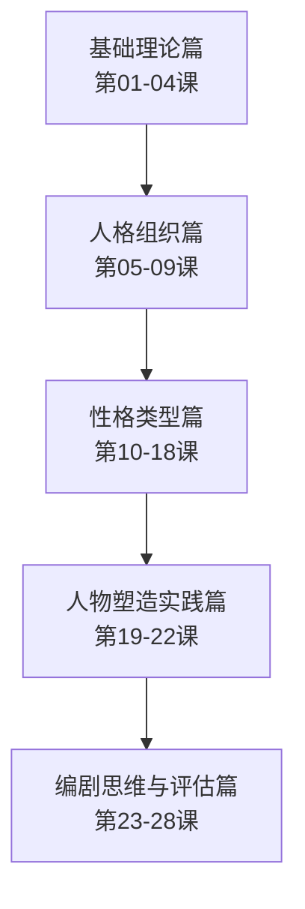

# 课程地图

## 学习路径图

## 模块依赖关系

| 模块 | 课程 | 前置依赖 |
|------|------|----------|
| 基础理论 | 第01-04课 | 无 |
| 人格组织 | 第05-09课 | 基础理论 |
| 性格类型 | 第10-18课 | 人格组织（理解Y轴定位） |
| 人物塑造 | 第19-22课 | 性格类型（理解各类型行为模式） |
| 编剧思维 | 第23-28课 | 人物塑造（性格→剧情转化） |

## 推荐学习节奏

- **系统学习者**：按顺序每天1课，约4周完成
- **快速入门**：先读第04、05课建立框架，然后直接进入第10-18课性格类型
- **实战导向**：先读第19-22课人物塑造，遇到类型问题时回查性格类型篇
- **参考为主**：善用术语表、性格类型速查表、防御机制层级表

## 关键概念索引

| 概念 | 所在课程 | 页码 |
|------|----------|------|
| Y轴（人格组织水平） | 第04课 | [[lessons/0004-y-axis-x-axis]] |
| X轴（性格分类） | 第04课 | [[lessons/0004-y-axis-x-axis]] |
| 防御机制三大层级 | 第05课 | [[lessons/0005-personality-spectrum]] |
| 现实检验能力 | 第05课 | [[lessons/0005-personality-spectrum]] |
| 自恋四象限 | 第09课 | [[lessons/0009-narcissism-depression]] |
| 实体自恋 vs 虚体自恋 | 第09课 | [[lessons/0009-narcissism-depression]] |
| A/B/C三类编码 | 第10-18课 | [[reference/personality-types]] |
| 人物颠覆三层次 | 第25课 | [[lessons/0025-character-goals-traits]] |

## 电影案例索引

| 电影 | 分析角度 | 所在课程 |
|------|----------|----------|
| 《纸牌屋》Frank | 反社会型行为推演 | 第01课 |
| 《搏击俱乐部》 | 精神病性人格 | 第06课 |
| 《这个杀手不太冷》 | 回避型+边缘型搭配 | 第08、15、21课 |
| 《卧虎藏龙》玉娇龙 | 边缘型人格 | 第15课 |
| 《被嫌弃的松子的一生》 | 分裂型人格 | 第11课 |
| 《疯狂动物城》 | 抑郁转躁狂+人格颠覆 | 第09、25课 |
| 《爆裂鼓手》 | 偏执型+受虐型+强迫型组合 | 第10、18课 |
| 《触不可及》 | 角色性格重设分析 | 第22课 |
| 《黑暗骑士》 | 反社会+偏执+强迫三角 | 第20、21课 |
| 《肖申克的救赎》 | 高功能偏执型 | 第10课 |