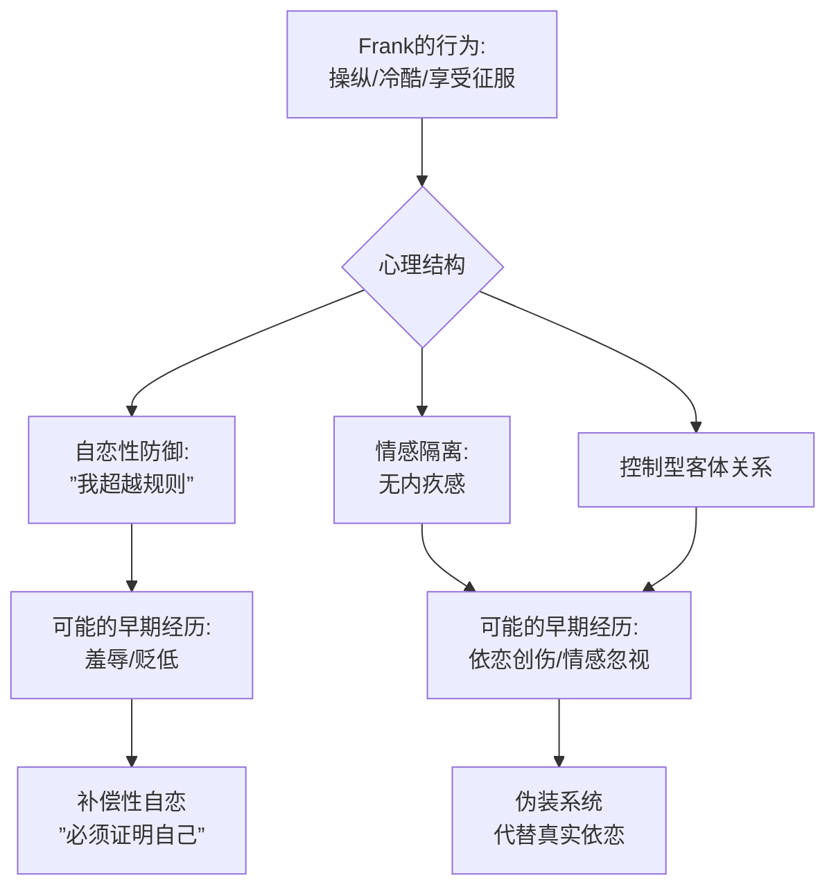
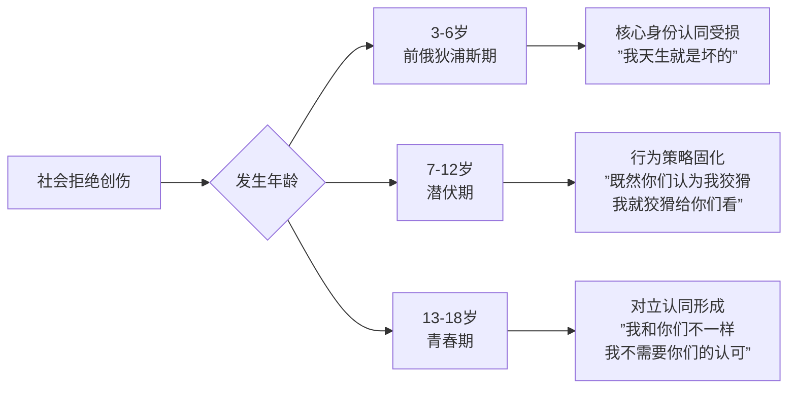

# 第01课：性格决定命运 — 课程导论与核心理念

## Learning Objectives

- 理解"行为→习惯→性格→关系→剧情"的因果链条及其在人物创作中的运用
- 掌握性格一致性原则与"真实人物检验"法则
- 学会从行为表现倒推人物早期经历的分析方法
- 理解创伤年龄对性格形成的核心影响

## 讲师背景与课程定位

本课程由**北京大学临床心理学专业**背景人士主讲，拥有超过**12年人格障碍研究**与临床评估经验。这一背景决定了本课程的核心特色：**不传授直觉式的人物写作技巧，而是提供一套可复制、可验证的性格分析框架**。

电影与叙事作品在本质上是一种**集体心理治疗**——观众在安全距离外体验角色的冲突、创伤与转变，从而实现情感的宣泄与认知的整合。编剧要做的，是创造经得起心理学推敲的人物。

> [!NOTE] 电影作为集体心理治疗
> 亚里士多德在《诗学》中提出"卡塔西斯"（Catharsis）概念，认为悲剧通过引发怜悯与恐惧来净化观众的情感。当代临床心理学发现，观众对虚构角色的深度认同，本质上与心理治疗中的"替代性体验"机制相通。好的人物不是编出来的，是从心理学规律中生长出来的。

## 因果链：从行为到剧情

性格分析的底层逻辑是一根因果链：

一个人的**行为**是可见的，反复出现的行为固化成了**习惯**，习惯的集合构成了**性格**——这个人的默认反应模式。性格（而非单次选择）决定了他在关系中如何行动，而**关系动力**最终推动**剧情**向前发展。

反推亦然。当编剧需要某个剧情结局时，他不是强行编造情节，而是从结局出发反推：**什么性格的人，在什么关系里，必然会导致这个结局？**

> [!TIP] Key Insight
> 编剧的功力不在于编造情节，而在于建构"只能这样行动"的性格。当人物性格足够自洽，剧情会自动展开，根本不需要编剧"安排"。

## Frank Underwood 个案分析

《纸牌屋》的 Frank Underwood 是一个绝佳的分析标本。让我们从**行为出发，倒推他的早年经历**：

**行为层面**：
- 冷静操纵他人，将人视为工具
- 在权力被剥夺时毫不犹豫地清除障碍（包括盟友）
- 能够在亲密关系中切换温情与冷酷
- 享受征服的快感而非权力带来的实质利益

**倒推的心理结构**：
- **自恋性防御**：核心信念是"我比所有人都强，规则只适用于普通人"
- **情感隔离**：能够实施暴力而不产生内疚，暗示情感体验与道德认知的断裂
- **控制型客体关系**：无法体验真正的依恋，所有的"关系"都是控制与被控制

**推测的早期经历**：
- 可能存在**早期的羞辱经历**（父亲贬低、社会阶层屈辱），导致他发展出"必须证明自己"的补偿性自恋
- **早期依恋创伤**使他没有学会用真实情感建立关系，取而代之的是一套精密的伪装系统

## 性格一致性与反分裂原则

**性格一致性原则**（Principle of Character Consistency）是性格分析的基石。用临床心理学的术语说，它等同于**反分裂原则**（Anti-Splitting Principle）：

> 一个性格健康的人，在不同情境下的行为表现应当在95%以上保持一致。如果一个人在 A 情境和 B 情境下的表现截然相反，这不叫"丰富"，而叫**分裂**（Splitting）——是人格障碍的核心特征。

**对编剧的实践含义**：

> [!WARNING] 编剧的红线
> 不要让角色为了推进剧情而做出"不符合性格"的行为。这是最容易被观众识破的作弊行为。如果一个懦弱的角色突然在关键时刻英勇无畏，必须在剧中给出充分的性格转变铺垫——要么是外部压力突破了他的防御，要么是某种动机压倒了他的恐惧。

**"真实人物检验"法则**：写完一场戏后问自己——如果你在现实生活中认识这个角色，他会这样说话、这样行动吗？如果你的回答需要"但是在剧情中……"才能圆回来，说明性格出现了裂缝。

## 荆轲刺秦王：性格推演实战

这是一个经典的**性格推演**练习。已知条件：

- 荆轲接受了燕太子丹的委托，携带地图和樊於期的人头前往秦国
- 在秦廷上，图穷匕见，荆轲未能刺中秦王

问题：**如果荆轲刺死了秦王，历史会怎样？**

> [!QUESTION] 性格推演练习
> 尝试用性格一致性原则推演荆轲的性格特征。一个能接受"用人头做投名状"的人，他的道德结构是怎样的？一个在秦廷上失手的人，他的压力应对模式是怎样的？如果你推测出荆轲的性格，那么"刺杀成功"后的剧情会如何发展？

展开分析

**性格推论**：荆轲能接受用樊於期的人头换取向秦王靠近的机会，说明他具备**工具性道德观**——目的是正当的，手段可以灵活。这类性格的人本质上是一个"任务者"，他的行为由外部目标驱动，而非内部信念驱动。

**如果刺杀成功**：历史剧情会发生根本性转向。荆轲被当场处决，燕国加速灭亡。但秦始皇的早期死亡可能导致秦国陷入继承权争夺，统一的进程可能推迟数年甚至数十年。注意——这个结局不是"好"或"坏"的问题，而是**性格之必然**。一个"任务者"性格的人，完成了任务，但不会考虑任务完成后的系统后果。这本身就是历史剧变中最大的戏剧张力来源。

## 创伤年龄对性格的影响

同样的创伤事件，发生在不同年龄，会形成截然不同的性格结构。

**《疯狂动物城》Nick Wilde 的例子**：

年幼的 Nick 想要加入童子军，其他动物却给他戴上嘴套，嘲笑他是"狡猾的狐狸"。这是一个**社会拒绝性创伤**。

如果这件事发生在不同年龄：

Nick 的反应属于 **7-12岁潜伏期**的反应模式：他没有内化"我是坏的"这一身份（那是前俄狄浦斯期的反应），而是策略性地接受了"狡猾"的标签，把它变成一套生存策略——"既然你们认为我狡猾，那我就用狡猾来生存"。这个人物的**可改变性**恰恰来源于此：他的"狡猾"不是核心身份，而是一套可以被新体验取代的策略。

## 性格分析的两大目的

在人物创作中，性格分析服务于两个明确的目的：

1. **理解人物前史（Backstory Construction）**：从人物在剧中的行为模式倒推出他的早期经历。这不是编年史，而是一套"如果……那么……"的因果假设。

2. **推演极端反应（Extreme Reaction Deduction）**：把人物放在极端情境下，推演他会如何反应。这是编剧生成情节的"超级引擎"——人物的性格越清晰，极端情境下的反应越可预测，而越可预测，越有说服力。

> [!EXAMPLE] "小同行认可"原则
> 在临床心理学界有一个经验法则：**一个案例分析的优劣，可以用你是否有勇气拿给同行看作为检验标准**。同样，人物创作也可以这样做：把这个角色的行为逻辑写成一份"人物小传"，然后交给熟悉这个角色（或类似角色）的人看，如果他们点头，说明你的人物立住了；如果他们说"他不可能这样做"，说明性格一致性出了问题。

## Summary

- 性格分析的核心理念：**行为→习惯→性格→关系→剧情**，因果链可正推可反推
- 电影是**集体心理治疗**，观众通过角色进行替代性情感体验
- 性格一致性原则（反分裂原则）：健康人格在不同情境下保持95%以上的一致性
- "真实人物检验"法则：用"在生活中是否认识这样的人"检验角色的真实性
- 创伤年龄决定创伤对性格的影响方式——同一事件在不同发展阶段产生不同结构
- 性格分析的两大目的：**建构前史**与**推演极端反应**

## 术语卡

| 术语 | 英文 | 定义 |
|------|------|------|
| 人物小传 | Character Biography | 基于性格推演而建构的人物早期经历记录，不是编年史，而是一套因果假设模型 |
| 性格一致性 | Character Consistency | 健康人格在不同情境和时间跨度下保持稳定反应模式的原则，反分裂原则在人物创作中的体现 |
| 模型建构 | Model Construction | 从行为数据中提取规律、形成可验证假设的系统化过程，是性格分析的核心方法论 |

## Next Step

继续下一课 [[0002-character-analysis|第02课：性格分析的定义与方法]]，深入学习性格分析的定义、共情能力与个案评估流程。