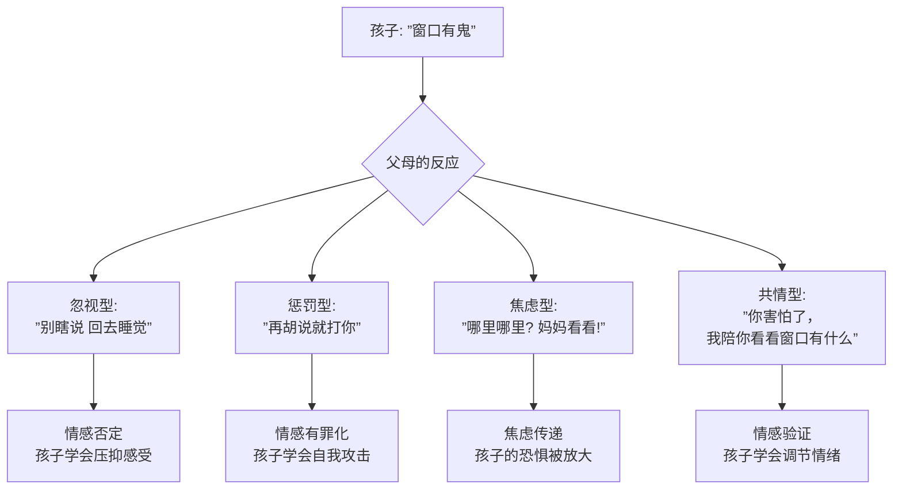
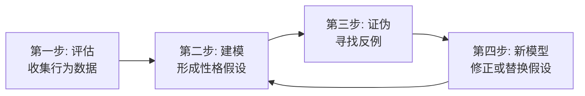

# 第02课：性格分析的定义与方法

## Learning Objectives

- 掌握性格的两个核心定义：稳定性与独特性
- 理解共情能力作为性格分析的核心工具及其运作机制
- 学习Formulation四步评估流程及其在人物创作中的应用
- 掌握竞争性模型策略与临床预测方法

## 性格的两个定义

### 定义一：跨时间跨情境的稳定性

在人格心理学中，**性格（Personality）** 的第一个定义是：

> 个体在**不同时间**和**不同情境**中表现出的稳定行为模式的一致性。

临床研究表明，一个健康成年人在不同情境下的行为模式相似度高达**95%**。这95%构成了可预测的"性格轮廓"，剩下的5%则是情境弹性——一个人在面对丧亲、失业等极端压力时可以做出非典型反应，但事后会回到基线。

> [!WARNING] 两种例外
> 只有两种人可以不需要符合95%稳定性的标准：
> 1. **精神分裂症谱系患者**——由于现实检验能力的波动，其行为缺乏跨时间的连续性
> 2. **情绪不稳定者（严重边缘性/双相障碍）**——其情感状态频繁切换导致行为缺乏跨情境的一致性
>
> 如果你的角色属于这两种，可以赋予其"不可预测性"——但必须给出诊断水平的逻辑支撑。

### 定义二：独特性与个性

性格的第二个定义是：**使一个人区别于他人的、相对稳定的心理特征的总和**。之所以有"独特性"，是因为每个人的经历组合、创伤位置、防御方式、核心信念都是独一无二的。

> [!NOTE] 两个性格相似的人的"恩怨"
> 临床上有一个有趣的现象：两个性格高度相似的人在一起，往往不是惺惺相惜，而是相互排斥。原因在于，你在他身上看到了自己最不想看到的那个部分——心理学称之为"投射"。例如，两个同样具有强迫性控制欲的角色共处，不会合作无间，而会在"谁控制谁"的问题上爆发激烈冲突。这是人物关系设计中的一块富矿。

## 共情：性格分析的核心工具

### "鬼在窗口"案例

想象一个情景：孩子在半夜说"窗口有鬼"，跑来找父母。四种类型的父母会有截然不同的反应：

**共情（Empathy）** 指"感受他人内心世界的能力"。它不是"对人好"，而是一种**认知能力**——能够准确理解另一个人的情感状态、思维模式和行动动机。

在性格分析中，共情是两个方向同时运作的：
- **对内的共情**：理解角色自己如何看待世界（他的主观体验）
- **对外的共情**：理解角色如何被他人感知（他的关系效果）

> [!TIP] 编剧的共情训练
> 每写一个角色，练习用一个句子回答："这个角色最害怕的是什么？"不需要是外部威胁，而是**核心恐惧**——比如"害怕被当作普通人"（自恋型）、"害怕被控制"（偏执型）、"害怕被抛弃"（边缘型）。如果你能准确说出每个角色的核心恐惧，你已经完成了80%的性格分析。

## 精神分析的两大传统比喻

在精神分析的发展史上，有两个学派始终存在方法论之争。我将其比喻为武侠世界中的**剑宗和气宗**：

| 流派 | 隐喻 | 核心方法 | 代表人物 |
|------|------|----------|----------|
| 解释学派（剑宗） | 精妙的剑术招式 | 通过解释无意识冲突来改变人格 | 弗洛伊德、克莱因 |
| 关系学派（气宗） | 深厚的内功修为 | 通过治疗关系本身来修复人格 | 温尼科特、科胡特 |

两种方法都承认**无意识**的重要性。无意识的运作机制可以用"冰山比喻"来理解：

> 人的心理如同冰山。水面之上的可见部分（意识）仅占4%，如同宇宙中可见的普通物质。水面之下的无意识部分占96%，如同暗物质和暗能量——看不见，但主导着一切运动。

在人物创作中，**角色的无意识动机**远比他有意识说出来的台词重要。一个角色嘴上说"我想要成功"，但他的行为模式却一再自毁——这就是无意识在说话。

## Formulation：四步评估流程

在临床心理学中，性格分析不是拍脑袋的直觉判断，而是遵循**Formulation（个案概念化）** 的系统流程：

### 由外向内评估法

评估阶段的核心方法叫**由外向内（Outside-in）评估法**——从可以观察的行为开始，而不是直接猜测内心状态。这在实际运用中极其有效：

- **罪犯评估场景**：不是问他"你后悔吗？"（他会说"后悔"），而是观察他提到受害者时的**微表情、语速变化、身体朝向**
- **招聘评估场景**：不是问他"你抗压能力如何？"（所有人都会说"很好"），而是观察他描述失败经历时**能否提供具体的应对细节**

### 案例：一家三口被杀案中的模型更替

这是一个经典的临床教学案例。

**初始数据**：警方报告，一家三口在家中遇害，现场没有强行闯入痕迹，邻居未听到异常声响。

**模型A（初始假设）**：职业杀手所为，手法干净利落，死者没有挣扎。

**反例**：现场没有职业杀手的标准痕迹——没有伪造现场、没有销毁指纹。更像是熟人作案。

**模型B（修正假设）**：家庭成员中的父亲所为，先杀妻儿后自杀伪装成他杀。

**新证据**：父亲的鞋印出现在厨房门口，但他说案发时自己不在家。

这个案例说明了Formulation流程的核心——**每一个模型都必须能容纳已知的所有数据，如果有一个数据点无法解释，模型就必须被修正或被替换**。

> [!QUESTION] 竞争性模型策略
> 当你为一个人物建构性格模型时，永远不要只持有一种假设。临床心理学家有一个铁律：**同时维护至少两个竞争性模型**。例如：
> - 模型A：这个角色是自恋型人格——他的所有行为都是为了维护膨胀的自我形象
> - 模型B：这个角色是回避型人格——他的冷漠外表下是对拒绝的极度恐惧
>
> 在什么场景下模型A更能解释他的行为？在什么场景下模型B更准确？真正的高手不是找证据证明自己对了，而是找证据证明自己错了。

## 临床预测：表面正常者的深层危机

性格分析的终极目标不是分类，而是**预测**。在编剧语境中，这意味着：你能否预测角色在极端情境下会做什么？

最值得警惕的案例是**表面正常者（Apparently Normal Person）**——那些在社会功能层面完全正常（有工作、有家庭、有社交），但在亲密关系中暴露出深层病理的人。

> [!EXAMPLE] 临床中的"表面正常者"
> 一位中年男性，事业成功，社交得体，但在亲密关系中出现了严重的控制行为。追溯其早年经历发现：他母亲有边缘性人格倾向，情绪极度不稳定。他童年时发展出了一套"完美伪装"——在外面做"好孩子"，从不在外惹事，以此避免母亲的怒火。这套伪装让他成年后在社会层面"成功"，但亲密关系触发了被控制的创伤，导致他在最亲近的人面前展现出与社交场合完全不同的另一面。
>
> 在人物设计中，这种"内外反差"是最具戏剧张力的人物类型之一。

## Summary

- 性格的两个定义：**跨时间跨情境的稳定性**（95%一致性）和**独特性**（区别于他人的特征系统）
- 共情是性格分析的核心工具——能进入角色的主观世界，又能退出来做客观评估
- 精神分析的"剑宗vs气宗"之分：解释学派侧重内容解析，关系学派侧重关系修复
- 无意识如同96%的暗物质——主导着角色行为但不可见
- **Formulation四步流程**：评估→建模→证伪→新模型（迭代循环），是性格分析的方法论骨架
- **竞争性模型策略**：同时维护至少两个模型，找反证而非找支持

## 术语卡

| 术语 | 英文 | 定义 |
|------|------|------|
| 共情 | Empathy | 理解他人内心世界的能力，包含认知层面（理解对方在想什么）和情感层面（感受到对方的感受）两种独立系统 |
| 个案研究 | Case Study | 对单一对象（一个角色/一个人）进行深度、多维度分析的研究方法，追求的是纵向的深度而非横向的广度 |
| Formulation | Formulation/Case Conceptualization | 将临床数据组织为可检验假设的系统化流程，包括评估、建模、证伪、修正四个迭代步骤 |
| 投射认同 | Projective Identification | 一个个体将自己无法承受的情感投射到另一个人身上，并通过互动诱导对方产生相应感受的潜意识过程 |

## Next Step

继续下一课 [[0003-psychoanalytic-theory|第03课：精神分析四大流派]]，深入了解精神分析的四大理论体系及其对性格分析的贡献。