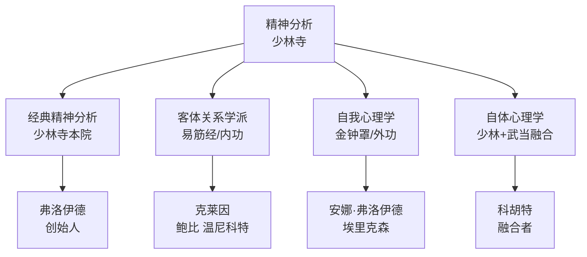
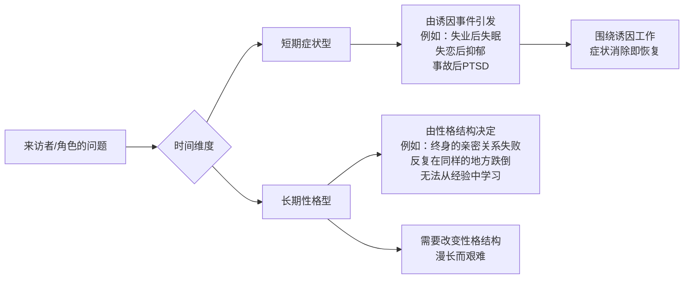

# 第03课：精神分析四大流派

## Learning Objectives

- 掌握精神分析四大流派的核心理论与代表人物
- 理解经典精神分析、客体关系、自我心理学、自体心理学在性格问题上的不同侧重
- 区分短期症状型问题与长期性格型问题
- 初步了解"性格盔甲"概念及其临床来源

## 精神分析的"少林寺"比喻

如果把精神分析比作一座**少林寺**，那么不同的流派就像是少林七十二绝技，出自同一源头，但各有侧重、各有心法：

这四大流派并非互斥，而是如同盲人摸象——每个流派摸到了大象的不同部位，各自描述了真实的局部。整合起来，才能接近完整的"大象"（即人的心理全貌）。

> [!NOTE] 学习四大流派的两个好处
> 1. **理解性格分析的理论源头**：心理学一百年的性格研究所积累的洞察，远胜任何个人的直觉
> 2. **刻画无意识的运作机制**：无意识不是一个"黑箱"，它有结构、有动力、有发展规律——四大流派分别从不同角度揭示了这些规律

## 经典精神分析（弗洛伊德）

**核心洞察**：人的心理由**潜意识冲突**驱动——主要是本能欲望（力比多、攻击性）与社会规范之间的冲突。

**对性格的影响**：性格是潜意识冲突的**妥协形成（Compromise Formation）**。例如，一个极度整洁的人可能不是在"喜欢干净"，而是在用仪式化的清洁行为来控制潜意识中的"脏"的冲动。

**代表人物**：西格蒙德·弗洛伊德（Sigmund Freud）

> [!WARNING] 弗洛伊德并非"过时"
> 许多人对弗洛伊德的印象停留在"泛性论"层面，事实上，弗洛伊德的结构模型（本我-自我-超我）、防御机制理论、潜意识动力学说，仍然是当代心理动力学治疗的基石。

## 客体关系学派（易筋经/内功）

**核心洞察**：人的性格不是由"本能冲突"塑造的，而是由**早期关系中形成的"内在客体"——即内心对他人的表征——塑造的。**

换个更容易理解的说法：你童年时和父母的关系模式，会内化到你的心里，成为你之后所有关系的"模板"。这个模板决定了你如何感知他人、如何期待他人对待你。

**三大代表人物及其贡献**：

| 代表人物 | 核心贡献 | 可用在人物创作中的概念 |
|----------|----------|------------------------|
| **梅兰妮·克莱因**（Melanie Klein） | 偏执-分裂位相与抑郁位相的理论 | 角色在"世界是坏的"和"世界是好的"之间的摆动 |
| **约翰·鲍比**（John Bowlby） | 依恋理论 | 安全型/焦虑型/回避型/混乱型依恋模式——人物关系的底层逻辑 |
| **唐纳德·温尼科特**（D.W. Winnicott） | "足够好的母亲"与真假自体 | "假自体"角色——用伪装适应社会但失去了真实感的人物 |

> [!TIP] 依恋理论在编剧中的运用
> 两个角色的依恋模式冲突是天然的关系张力来源：
> - **焦虑型依恋** × **回避型依恋** = 一个拼命靠近，一个拼命逃离，是爱情线和友情线的经典动力
> - **混乱型依恋** × **安全型依恋** = "伤痕累累的人遇到了温暖的港湾"，治愈与恐惧并存的复杂关系
>
> 具体内容将在[[0020-relationships-and-plot|第20课：性格、人物关系与剧情]]中深入展开。

## 自我心理学（金钟罩/外功）

**核心洞察**：关注**自我（Ego）的功能**——包括现实检验、冲动控制、判断力、挫折耐受等能力。性格可以被理解为"自我适应环境的策略系统"。

**代表人物**：
- **安娜·弗洛伊德**（Anna Freud）：系统化整理了**防御机制**（Denial、Projection、Rationalization等），使"看不见的心理活动"变成了可分类可识别的操作化概念
- **埃里克·埃里克森**（Erik Erikson）：提出**毕生发展八阶段理论**，强调人格在人的一生中持续发展，而非弗洛伊德所言"童年决定一切"

> [!EXAMPLE] Reich：性格分析的奠基人
> 在自我心理学的发展中，有一个承上启下的关键人物——**威廉·赖希**（Wilhelm Reich）。他在1945年出版的《性格分析》（Character Analysis）一书中首次提出了完整的性格分析框架。
>
> 赖希的核心观点：**性格不是"人天生如此"，而是人在成长过程中为了应对环境压力而"穿上"的一套防御盔甲。** 这套盔甲最初是为了保护自己（例如，一个被父母经常贬低的孩子发展出了"我不在乎"的态度作为保护），但久而久之，盔甲变成了性格本身，穿得太久脱不下来了。
>
> 这个概念对编剧的价值在于：**人物的改变，本质上就是脱下盔甲的过程。**

## 自体心理学（科胡特）

**核心洞察**：人格健康的核心在于**自体的凝聚性（Cohesion of the Self）**。如果一个人拥有一个"凝聚的自体"（稳定的自我感），他就能健康地应对生活；如果自体是**碎片化的**，他就会不断体验"我到底是谁"的混乱感，需要用外部反馈（赞美、攻击、关系）来暂时缝合碎片化的自我感。

**代表人物**：海因茨·科胡特（Heinz Kohut）

科胡特整合了经典精神分析（关注冲突）和客体关系（关注内在关系）的思路，形成了一种"融合前两者"的理论——他承认弗洛伊德的冲突论和克莱因的关系论都有道理，但认为**自体的发展需求**——需要被"镜映"（被看见、被肯定）和"理想化"（找到可仰望的对象）——才是人格发展的核心驱动力。

## 短期症状型 vs 长期性格型

理解四大流派之后，还需要一个关键区分——它直接决定了你的角色问题应该被如何处理：

### 案例：社交焦虑 vs 回避型人格

**社交焦虑（短期症状型）**：一个人在公众场合发言时手心出汗、心跳加速。这是**情境性的**——它的触发条件是明确的。去掉诱因，症状消失。

**回避型人格（长期性格型）**：如《这个杀手不太冷》中的 Leon。他不仅仅是"在社交场合紧张"，而是**用一整套生活方式来回避人际关系**——独居、不交朋友、只通过中介接任务。他的回避不是情境反应，而是性格结构。

> [!WARNING] 区分的关键
> 短期症状型角色适合写"克服困难"的弧线（90分钟电影的标准结构）。长期性格型角色不适合"一部电影治好"——人格改变需要以年为单位。强行让一个长期性格型角色快速改变，会违背"性格一致性原则"。

## Summary

- 四大流派如同一座少林寺：**经典精神分析**（弗洛伊德-冲突论）、**客体关系学派**（克莱因/鲍比/温尼科特-关系模板论）、**自我心理学**（安娜·弗洛伊德/埃里克森-适应策略论）、**自体心理学**（科胡特-自体凝聚论）
- Reich的《性格分析》：性格是"防御盔甲"，可穿上也可脱下——这是人物弧线的理论基础
- **短期症状型 vs 长期性格型**：前者的改变可以快（受诱因驱动），后者的改变必须慢（受结构驱动）
- 依恋理论为人物关系提供了"底层逻辑"——焦虑型、回避型、安全型、混乱型的排列组合产生无限的故事张力

## 术语卡

| 术语 | 英文 | 代表人物 |
|------|------|----------|
| 经典精神分析 | Classical Psychoanalysis | 弗洛伊德（Sigmund Freud） |
| 客体关系学派 | Object Relations Theory | 克莱因（Melanie Klein）、鲍比（John Bowlby）、温尼科特（D.W. Winnicott） |
| 自我心理学 | Ego Psychology | 安娜·弗洛伊德（Anna Freud）、埃里克森（Erik Erikson） |
| 自体心理学 | Self Psychology | 科胡特（Heinz Kohut） |

## Next Step

继续下一课 [[0004-y-axis-x-axis|第04课：Y轴与X轴 — 人格水平与性格分类]]，进入双轴坐标模型的系统性学习。