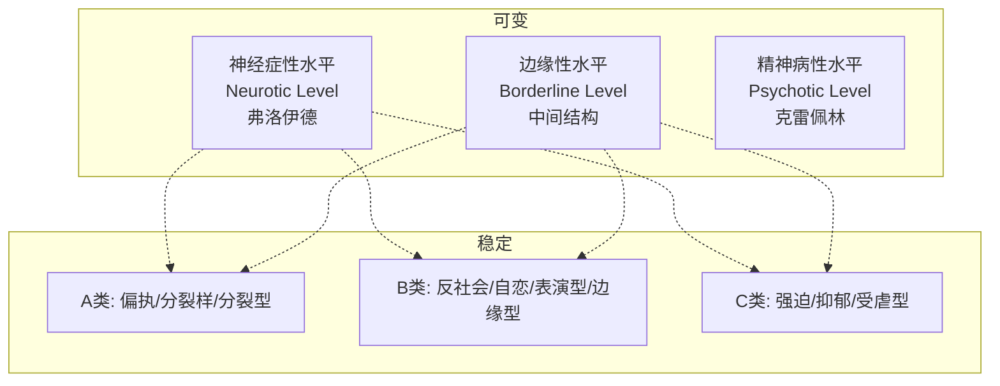
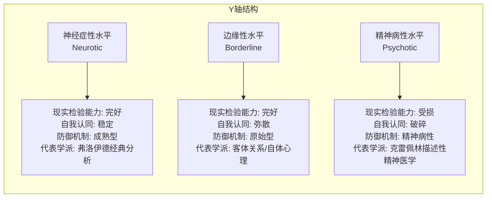
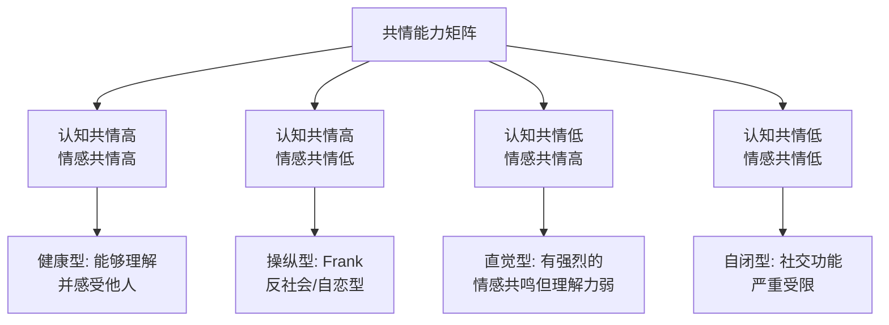

# 第04课：Y轴与X轴 — 人格水平与性格分类

## Learning Objectives

- 掌握双轴坐标模型的结构：Y轴（心智成熟度）与X轴（性格类型）
- 理解Kernberg人格组织三层结构：神经症性→边缘性→精神病性
- 区分认知性共情与情感性共情两种独立系统
- 理解早期虐待与情感验证对共情能力发展的影响

## 双轴坐标模型

在临床心理学中，同一个性格类型可以表现为完全不同的成熟水平。为了系统化理解这一现象，Kernberg整合前人理论，提出了一个**双轴坐标模型**：

**Y轴 —— 心智成熟度（可变维度）**：表示人格组织的成熟度水平。它不是"正常vs不正常"的二分，而是一个连续谱。一个人可以随着心理治疗、重大生活事件或年龄增长，在Y轴上移动。

**X轴 —— 性格类型（稳定维度）**：表示个体惯用的防御模式、核心信念和关系模板。一旦固型，X轴上的位置相对稳定。

> [!NOTE] 同样类型，不同成熟度
> 以"强迫型人格"为例：
> - **神经症性水平的强迫者**：表现为过度追求完美、条理性强、有反省能力。Ta知道自己的强迫给自己带来了困扰，但控制不住。这类角色有**内省能力**——他们可以意识到自己的问题。
> - **边缘性水平的强迫者**：表现为僵化的仪式化行为、使用分裂性防御（非黑即白）、缺乏内在整合。没有内省能力——他们认为"问题都在别人身上"。
>
> 你需要为角色决定：他的性格类型是什么（X轴）？他处于哪个成熟水平（Y轴）？同样的X轴标签，处在不同的Y轴位置，人物的行为表现和可改变性是截然不同的。

### Y轴的三层结构：Kernberg整合

**奥托·肯伯格**（Otto Kernberg）整合了弗洛伊德（关注的神经症性水平）与克雷佩林（关注的精神病性水平）之间的理论鸿沟，提出了中间层——**边缘性人格组织（Borderline Personality Organization, BPO）**。

这个三层结构将在[[0006-psychotic-level|第06课：精神病性人格水平]]和[[0007-borderline-neurotic-level|第07课：边缘性与神经症人格水平]]中深入展开。

## 共情的两种系统

Y轴的成熟度与共情能力密切相关。但共情并不是单一的"能力"，它包含两个彼此独立的系统：

### 认知性共情 vs 情感性共情

| 维度 | 认知性共情 | 情感性共情 |
|------|-----------|-----------|
| 定义 | 理解他人"在想什么"的能力 | 感受他人"在感受什么"的能力 |
| 别称 | 心理理论（Theory of Mind） | 情感共鸣（Emotional Resonance） |
| 神经基础 | 前额叶皮层、颞顶联合区 | 前扣带皮层、岛叶、镜像神经元 |
| 是否自主 | 主动推理过程 | 被动自动过程 |
| 损坏后果 | 无法理解他人动机 | 无法共享他人情感 |

> [!WARNING] 两个系统可以分离运作
> 一个人可以**理解你的痛苦但不感到痛苦**。这正是反社会人格者的典型特征——认知性共情完好（否则无法操纵他人），但情感性共情缺失（否则无法实施伤害而无内疚）。
>
> 在人物创作中，识别角色是两个系统中的一个受损、还是两个系统都受损、还是两个系统完好的"高共情者"——决定了角色的道德感和情感深度。

### 案例：Frank Underwood 与《心灵捕手》的 Will

**Frank Underwood** 是"高认知共情+低情感共情"的典型。他精准地知道每个人的欲望和恐惧（认知共情），但无法与他人建立真正的情感连接（情感共情缺失）。这使他在政治上无往不利，在亲密关系中冷酷无情。

**《心灵捕手》的 Will Hunting** 则相反——他有极高的情感共情能力（能直觉地感受到他人的情感），但他的成长经历（被遗弃、被虐待）使他的认知共情在某些领域受阻——尤其是面对权威关系时，他无法准确理解治疗师Sean的善意，因为他的内在关系模板是"权威=危险"。

### 早期虐待对共情的损害

**情感验证（Emotional Validation）** 与**情感否定（Emotional Invalidation）** 是影响共情发展的关键变量。

- **情感验证**：父母对孩子说"你看起来很难过，是因为那个小朋友抢了你的玩具吗？"——这帮助孩子识别自己的情绪，并为情绪命名，从而发展出识别他人情绪的能力。
- **情感否定**：父母对孩子说"别哭了，有什么好哭的"——这传递的信息是"你的感受不重要/不正确"，导致孩子既无法处理自己的情绪，也无法理解他人的情绪。

> [!QUESTION] 你的角色的共情模式是什么？
> 当你设计一个人物时，评估他的共情能力矩阵：
> 1. 他的认知性共情和情感性共情是否平衡？还是其中一系统占主导？
> 2. 他的早期经历是偏向情感验证还是情感否定？
> 3. 这一共情模式如何影响他的决策风格和人际关系？

人物共情构建练习

以你正在创作或最喜欢的角色为例，回答以下问题：

1. **认知共情水平**：他能准确理解别人的动机吗？还是经常"读错"别人的意图？（前者可能偏执型，后者可能孤独谱系）

2. **情感共情水平**：他能感同身受别人的情感吗？还是看完别人的痛苦后毫无波澜？

3. **共情不对称的原因**：如果两个水平不匹配（如高认知+低情感），是什么早期经历造成了这种不对称？

4. **对剧情的影响**：这一共情模式是否在关键时刻影响了角色的核心选择？

这个练习可以帮助你定位角色的Y轴成熟度和核心性格动力。

## IQ与性格类型的独立关系

值得一提的是，**IQ（智力）与性格类型是相对独立的维度**。一个高智商的人可以是强迫型、自恋型、偏执型——智商只是工具，性格决定他如何使用这个工具。

**情商（EQ）与智商（IQ）的发育路径不同**：
- 智商在20岁左右达到峰值，之后缓慢下降
- 情商（主要指共情能力和情绪调节能力）则随着年龄和阅历增长持续提升——前提是这个人有足够的反思能力和安全的人际环境

这给编剧带来的启发是：一个50岁的角色不应和20岁的角色拥有同样的共情能力，除非他身上存在**创伤冻结**——某种早期创伤使他的情感发展在某个年龄停滞了。

> [!TIP] "人类学观察法"
> 在临床心理学中有一个"人类学观察法"——把自己当成一个初次进入陌生部落的人类学家，不去做道德判断，只做**行为记录和模式识别**。编剧在日常生活中可以刻意练习：
> 1. 在咖啡馆/地铁观察陌生人，记录他们的**非语言行为**（坐姿、说话的节奏、眼神停留时间）
> 2. 试着为这个陌生人建构一个"性格模型"——他的X轴是什么？Y轴在什么水平？
> 3. 然后问自己：如果我给他施加一个极端压力（比如突然失业），他会怎么做？
>
> 这是最好的编剧"基本功训练"——比任何写作技巧课都有效。

## Summary

- **Y轴（心智成熟度）** 是可变维度，描述人格组织的水平：神经症性→边缘性→精神病性
- **X轴（性格类型）** 是稳定维度，描述防御模式和行为风格：A类/B类/C类
- 同一性格类型在不同Y轴水平上表现出截然不同的行为模式——这是人物深度的来源
- **认知性共情与情感性共情是两种独立的系统**，可以分离运作
- 早期经历（情感验证vs情感否定）塑造了共情能力的发展轨迹
- IQ与性格类型相对独立，但E（Q情商）受创伤和成长环境影响深远

## 术语卡

| 术语 | 英文 | 定义 |
|------|------|------|
| 认知共情 | Cognitive Empathy | 理解他人想法、意图、信念的能力，又称心理理论（Theory of Mind），由前额叶皮层主导 |
| 情感共情 | Affective Empathy | 感受到他人情感状态的能力，是一种自动的神经共鸣过程，由镜像神经元和边缘系统主导 |
| 边缘性组织 | Borderline Personality Organization | 肯伯格描述的一种人格组织水平，处于神经症和精神病之间，特征是自我认同弥散、使用原始防御机制，但现实检验能力基本完好 |

## Next Step

本课建立了双轴模型的基本框架。在下一课 [[0005-personality-spectrum|第05课：人格组织水平总论]] 中，我们将深入探讨Y轴的三层结构，包括防御机制层级和现实检验能力等核心评估维度。