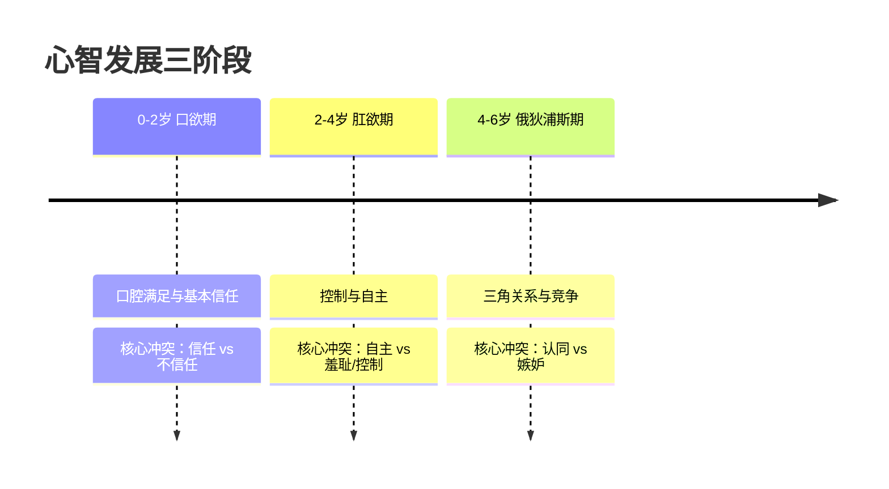

# 第05课：人格组织水平总论

## 心理健康三把标尺

心理健康的定义众说纷纭，但精神分析界有一个经典共识：**爱得好、工作得好、玩得好**。这三件事覆盖了一个人全部的生存维度——关系、成就与创造力。

> [!NOTE] 三把标尺的深层含义
> **爱得好**：有能力建立并维持深度客体关系，不只是需要对方，而是真正看见对方。**工作得好**：能发挥天赋，承受挫折，延迟满足。**玩得好**：有幻想空间，能放松，有幽默感。

这三把标尺构成了我们评估角色心理水平的起点。一个角色如果在这三个维度上都严重受损，那几乎可以断定处于精神病性水平；如果只在某一个维度上卡住，那可能是神经症性的局部冲突。

### 自恋的爱 vs 客体的爱

在"爱得好"这个维度上，最核心的区分是：

- **自恋的爱**：对方是我的镜子，我爱的是对方眼中的我自己。关系中充满了"你应该懂我""你应该让我舒服"的期待。一旦对方不配合，立刻暴怒或抑郁。
- **客体的爱**：我能看到对方是独立的、有自己需求和感受的另一个人。我不只是在"被爱"，也在"给予爱"。

> [!TIP] 创作提示
> 很多爱情片的戏剧张力就建立在"从自恋的爱走向客体的爱"这条弧线上。比如《爱在黎明破晓前》——男女主角一开始都在投射幻想，直到黎明分别前才开始真正看见对方。

## 心智发展的三个关键期

人格组织水平的根源，可以追溯到童年早期的心智发展。弗洛伊德提出了三个关键阶段：



- **口欲期（0-2岁）**：世界=嘴，好=被喂饱，坏=饥饿。这个阶段的心理任务是对世界的**基本信任**。如果严重创伤（被遗弃、虐待），人格会停在精神病性水平。
- **肛欲期（2-4岁）**：大小便训练=第一次社会规则。核心冲突是**控制与反抗**。这个阶段出问题，容易形成强迫性人格结构（边缘性水平常见）。
- **俄狄浦斯期（4-6岁）**：孩子意识到自己是"两个人生的"，进入三角关系。男孩想要妈妈，但怕爸爸惩罚；女孩想要爸爸，但怕失去妈妈的爱。这个阶段的健康度过意味着：**我能和强者竞争而不必摧毁对方/被对方摧毁**。

### 俄狄浦斯三角与剧情设计

俄狄浦斯三角是所有三角关系的原型。从《俄狄浦斯王》到《哈姆雷特》，从《无间道》的三人关系到《燃冬》的三人行，所有精彩的三角关系本质上都是俄狄浦斯结构的变形。

> [!TIP] Key Insight
> 俄狄浦斯冲突的健康解决 = 角色能够接受"我不是世界的中心，但我仍然有价值"。这正是主角成长弧线的核心。

## 攻击性控制作为心智成熟指标

攻击性是精神分析中仅次于力比多的核心驱力。判断一个角色心智成熟度的最好方法之一，就是看**他如何处理攻击性**：

- **精神病性水平**：攻击性直接转化为行动（或妄想）。比如《《被嫌弃的松子的一生》》中松子的男友们，一言不合就动手。
- **边缘性水平**：攻击性被强烈体验但无法调节，在爆发和自我惩罚之间震荡。玉娇龙在《卧虎藏龙》中的表现就是典型。
- **神经症性水平**：攻击性被压抑，转化为内疚、焦虑或躯体症状。"我怎么可以生气"——但他们明明就是生气。
- **成熟健康水平**：攻击性被觉察、理解、适度表达。能用语言说"我很愤怒"而不是用拳头说。

## 防御机制三大层级

人格组织水平的差异，最直观地体现在防御机制的运用上。

```mermaid
quadrantChart
    title 防御机制三层级
    x-axis 原始 --> 成熟
    y-axis 适应不良 --> 适应良好
    quadrant-1 成熟防御
    quadrant-2 神经症性防御
    quadrant-3 原始防御
    quadrant-4 （过渡区）
    point ”升华” : 0.9, 0.9
    point ”幽默” : 0.85, 0.8
    point ”利他” : 0.8, 0.85
    point ”压抑” : 0.6, 0.6
    point ”隔离” : 0.55, 0.55
    point ”抵消” : 0.5, 0.5
    point ”投射” : 0.25, 0.3
    point ”投射认同” : 0.2, 0.2
    point ”分裂” : 0.15, 0.1
    point ”见诸行动” : 0.1, 0.15
```

### 原始防御：精神病性与边缘性的标配

**投射（Projection）**：把自己无法承受的情绪、冲动归因到别人身上。"不是我恨他，是他恨我。"这是精神病性水平的常用武器。

**投射性认同（Projective Identification）**：这是投射的升级版——不只是"我认为你恨我"，而且我会**诱导你真的恨我**。比如一个边缘性人格的妻子不断指责丈夫不爱她，最后把丈夫逼到真的冷漠离开，然后说"你看吧，你就是不爱我"。

> [!WARNING] 投射 vs 投射性认同
> 投射是单人的幻想游戏——"我认为你是坏人"。投射性认同是双人的催眠术——"我让你真的变成我认为的那个坏人"。编剧在处理反派时，前者适合做配角的速写，后者适合做核心冲突的引擎。

**分裂（Splitting / 非黑即白）**：世界上只有两种人——好人和坏人。这是边缘性人格组织的标志性防御。样板戏里的人物都是分裂的：共产党员=全好，国民党=全坏。而《无间道》的伟大之处在于——它打破了分裂：陈永仁有阴暗面，刘建明有良知面。好的角色都是灰色的。

**见诸行动（Acting Out）**：有情绪就行动，不经过心理加工。一言不合就摔门、打架、出轨。

### 神经症性防御

**压抑（Repression）**：把痛苦记忆、冲动压到潜意识里。我"忘记"了我被伤害的经历，但那种被伤害的感觉一直在。

**隔离（Isolation）**：我记得那件事，但它的情感被切断了。"我讲了一个很悲伤的故事，但我不觉得难过。"

**抵消（Undoing）**：做了不好的事之后，用仪式性的行为"抵消"内心罪疚。比如不断洗手——不只是强迫症，也是在"洗去"内心的罪恶感。

### 成熟防御

**升华（Sublimation）**：把攻击性、性驱力转化为创造性的、社会可接受的表达。写暴力小说而不是真打人。

**利他（Altruism）**：帮助别人来缓解自己的焦虑。过度利他有时是反向形成——但健康的利他是真正共情的。

**幽默（Humor）**：能用笑来应对痛苦。笑不是因为不痛，而是因为可以站在更高处看自己的困境。《《她》》中西奥多用自嘲来面对离婚的伤痛，这就是成熟。

**过度唯美（Excessive Aestheticism）**：把痛苦体验转化为对美的感知。王尔德说的"艺术高于生活"，也是一种防御，但它是成熟的。

## 现实检验能力的三个层面

现实检验是人格组织水平最硬性的指标：

1. **物理现实检验**：能把幻想和现实分开。这是最基本的——精神病性水平在这个层面就出问题（幻觉、妄想）。
2. **关系现实检验**：能理解别人不是我的延伸。边缘性水平在这个层面挣扎——"你不回消息就是不爱我"。
3. **社交现实检验**：能理解社会规则和潜规则。神经症性水平可能在这个层面有点笨拙，但基本能运作。

## 自我认同稳定性

- **精神病性**：认同碎片化。"我是谁"这个问题没有答案，或者答案是妄想的（"我是耶稣"）。
- **边缘性**：认同混乱。今天觉得自己是艺术家，明天觉得自己是废物。只有此刻的情绪能定义我是谁。
- **神经症性**：认同基本稳定，但存在内在冲突。我知道我是谁，但我不喜欢一部分的自己。
- **健康**：认同稳定且有弹性。我知道我是谁，我能接受我的多面性，而且我还在成长。

### 《被嫌弃的松子》——认同问题的经典案例

松子的一生就是认同不稳定的教科书：她从父亲的否定中长大（"爸爸只爱妹妹"），从此把自我价值绑定在"被爱"上。谁对她好，她的认同就交给谁。她可以为一个作家做妓女，为另一个男人去杀人——她的每一个"我"都是别人给的。

松子的悲剧不在于她不够善良，而在于她没有自己的内核。所以当所有关系都离她而去时，她的自我就真的碎了。

## 移情与反移情在创作中的应用

精神分析中的**移情**，是指来访者把对早期重要他人的情感和期待，无意识地转移到分析师身上。而**反移情**是分析师对此的情绪反应。

> [!TIP] 创作中的应用
> 编剧可以利用"移情"来设计角色关系。比如一个女主角对年长的男性上司产生了强烈的依赖和仰慕——那不是爱情，而是她对理想父亲的移情。当观众意识到这一点时，戏剧张力和悲剧感会同步升级。

反移情对编剧的价值更大：**当你写一个角色时，你作为作者在这个角色身上感受到的情绪，可能就是角色应该带给观众的情绪。** 如果你写一个角色时觉得很烦、很累、想尽快写完——这很可能就是角色本身带给周围人的感受，你恰好共情到了这一点。


> [!QUESTION] 自我检查
> 1. 心理健康的三大功能是什么？请用一个电影角色举例说明其中任一功能的受损表现。
> 2. 投射和投射性认同的关键区别是什么？为什么投射性认同更适合做剧情冲突的引擎？
> 3. 为什么说《无间道》打破了"分裂"防御？这对角色创作有什么启发？
> 
> <details>
> <summary>参考答案</summary>
> 
> **1.** 爱得好、工作得好、玩得好。举例：松子在工作上（做教师时被冤枉偷钱）和爱上（不断被家暴却离不开）都严重受损，玩的功能也丧失了。
> 
> **2.** 投射是单人幻想（"我认为你坏"），投射性认同是双人互动（"我让你真的变坏"）。投射性认同会引发对方的真实反应，形成剧情中的行动-反应循环，天然适合讲故事。
> 
> **3.** 分裂是非黑即白。传统警匪片里警察=好人、匪徒=坏人。《无间道》让陈永仁（警察卧底）有暴力冲动和破坏欲，让刘建明（黑帮卧底）有良知和痛苦——每个人都是黑白混合体。启发：好角色需要打破非黑即白的刻板印象。
> </details>

## 下一步

你已经掌握了人格组织水平的总体框架。接下来，我们将逐一深入每个水平层次。下一课我们将从最底端开始——[[0006-psychotic-level|第06课：精神病性人格水平]]。

> [!TIP] **练习**
> 从你正在创作或喜欢的作品中找出一个角色，用本课的三把标尺（爱/工作/玩）和防御机制评估他/她的人格组织水平。注意：好的角色往往不只有一种防御机制，而是有防御组合。写一段200字左右的角色分析笔记。