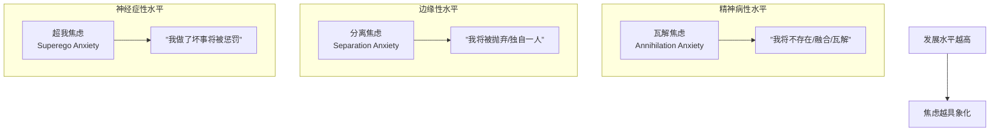

# 第06课：精神病性人格水平

## 精神病性核心特征

精神病性人格水平位于Y轴的最低端。注意：这不等于"疯子"或"危险的坏人"。精神病性在临床上有一个非常精确的定义——**现实检验严重受损**。

核心特征三合一：

1. **现实检验严重受损**：分不清内在幻想和外在现实。幻觉、妄想是典型表现。
2. **原始防御主导**：投射、分裂、否认、妄想性投射是最常用的心理应对方式。
3. **攻击性与幻想并存**：攻击性无法被象征化处理，直接从行为或妄想中表现出来。

> [!WARNING] 关键区分
> 精神病性人格 ≠ 精神病发作。人格水平是你"习惯性的心理运作模式"，而发作是急性状态。一个神经症性人格也可能在极端压力下短暂"精神病性发作"——但这不改变他的人格基础是神经症性。

## 焦虑类型与心智发展水平的对应

焦虑不是一种东西。不同人格水平体验到的焦虑性质完全不同：



最底层的焦虑是**瓦解焦虑（Annihilation Anxiety）**——害怕自己的存在会被消灭、被吞噬、被融化。这不是"害怕被惩罚"（那是神经症性的），而是"害怕我这个人不复存在"。

往上一个台阶是**分离焦虑**——害怕被抛弃、被单独留下。这是边缘性水平的典型焦虑。

再往上是**超我焦虑**——害怕被惩罚、被道德谴责。这是神经症性的焦虑，意味着已经有了一定的内在道德结构，才谈得上"违规"和"自责"。

> [!TIP] Key Insight
> 理解焦虑层级对编剧的意义：**焦虑类型决定了角色的行为逻辑**。一个害怕"不复存在"的角色（精神病性），和一个害怕"被惩罚"的角色（神经症性），在同样情境下的反应天差地别。

### 小汉斯与怕马——被阉割焦虑

弗洛伊德的经典案例"小汉斯"是一个5岁男孩，突然害怕马会咬他。表面上看是"恐马症"，但弗洛伊德的分析揭示出深层逻辑：

- 小汉斯潜意识里对母亲有俄狄浦斯式的依恋
- 因此对父亲产生竞争恐惧
- 但他不能直接说"我怕爸爸惩罚我/阉割我"
- 于是把恐惧投射到了马身上——因为马的黑色嘴套像胡子，马的大小像父亲

这是一个典型的**被阉割焦虑（Castration Anxiety）** 的案例。注意：小汉斯本身不是精神病性的——他有现实检验能力（他知道马是马），但他的焦虑是通过"投射"加工出来的。这是儿童发展过程中正常的神经症性焦虑。

> [!NOTE] 创作中的应用
> 如果你想写一个角色有深层的恐惧，不要让角色直接说出来。给恐惧穿一件衣服。恐惧的对象可以是物（马、水、黑暗）、可以是情境（被看、被评价），但真正的恐惧对象往往是角色自己不敢面对的。

## 《搏击俱乐部》——精神病性角色设计

《《搏击俱乐部》》的角色设计是精神病性人格的教科书级案例。主角（叙述者）的人格组织水平分析：

- **现实检验受损**：他没有意识到Tyler Durden是自己分裂出来的另一人格。他的内在世界和外在世界混在一起。
- **原始防御机制**：分裂——好/坏的部分彻底分离。好的是失眠的倒霉白领，坏的是Tyler Durden。投射——他把自己的攻击性全部放在Tyler身上，觉得自己是被Tyler"感染"的。
- **瓦解焦虑**：他最深的恐惧不是"被惩罚"，而是"我将不存在"——所以他创造了Tyler来让自己"存在"。

> [!TIP] 改进建议
> 《搏击俱乐部》的台词设计隐含了一个精妙技巧：Tyler的台词永远用"我要怎样"，而主角的台词是"Tyler要怎样"——因为Tyler才是主角分裂出去的"有力量的自己"。如果你在写一个精神病性角色，尝试这个技巧：**让角色不用"我"作为主语提起自己有力量的行为，而是说"他/某个人要怎样"**。

## IQ与人格功能水平的独立性

这是一个极其重要的点：**智商和人格功能水平是完全独立的两个维度**。

```mermaid
quadrantChart
    title IQ vs 人格功能水平（相互独立）
    x-axis 低智商 --> 高智商
    y-axis 低人格功能 --> 高人格功能
    quadrant-1 高能健康（如：完美主角）
    quadrant-2 高能病态（如：汉尼拔）
    quadrant-3 低能病态（如：现实中的严重患者）
    quadrant-4 低能健康（如：阿甘）
    point ”约翰·纳什” : 0.95, 0.3
    point ”汉尼拔” : 0.9, 0.15
    point ”阿甘” : 0.3, 0.8
```

**神经系统的分工**：IQ（逻辑、计算、规划）依赖大脑皮层。情商/人格功能（情绪调节、关系能力）依赖皮层-边缘系统的平衡。这两套系统可以独立损伤。

### 纳什（John Nash）——高逻辑对抗精神分裂

《美丽心灵》中的约翰·纳什是完美的例子。他的智商极强（博弈论，诺贝尔奖得主），但他的精神分裂症让他看到不存在的人、听到不存在的对话。

纳什的挣扎是双重的：一方面是他的精神病症状（幻觉中的室友、小女孩），另一方面是他用超强的理性去"识别"哪些是幻觉、哪些是现实。到了晚年，他发展出了一个精妙的应对策略——**不是消灭幻觉，而是学会和幻觉共处，用逻辑判断"我不必回应你"**。

> [!WARNING] 创作误区
> 不要在电影里把高功能精神病性角色写成"天才疯子"的刻板印象。真实的高功能精神病性患者并不是"疯癫但有才华"——而是他们的才华和他们的病可以在大脑的不同模块里共存。纳什不是因为疯了才聪明，而是聪明的那个部分恰好没有受损。

### 焦虑层级与人格水平对应

```mermaid
graph TB
    subgraph 焦虑层级
        L6[”存在焦虑<br>我是谁？活着有意义吗？”] --> 健康/超越
        L5[”超我焦虑<br>我做错了要被惩罚”] --> 神经症性
        L4[”分离焦虑<br>你不要离开我”] --> 边缘性
        L3[”被阉割焦虑<br>我会被伤害/去势”] --> 神经症性·俄狄浦斯
        L2[”被迫害焦虑<br>有人要害我”] --> 边缘性/精神病性
        L1[”瓦解焦虑<br>我将不复存在”] --> 精神病性
    end
```

注意这里的层次不完全是线性的。被阉割焦虑（L3）和被迫害焦虑（L2）可能同时存在。但最底层的**瓦解焦虑**只出现在精神病性水平——因为只有在这个水平，"自我"的边界还没有建立或已被摧毁。

## 梦境设计在角色创作中的应用

精神病性角色与梦境有一个天然的联系：**当现实和梦境的界限消失时，精神病性体验就开始了**。

> [!TIP] 创作技巧
> 如果你想让观众体验到精神病性角色的内在世界，不要直接"展示幻觉"。让梦境和现实之间的过渡**不被标记**——不切画面、不变色调、不改音乐。当观众和角色一起困惑"这是真的吗"时，共情就发生了。

经典案例：《盗梦空间》中柯布的妻子茉儿——她是死去的人，但在梦里是真实的。柯布无法区分他梦境中的茉儿和真实的记忆中的茉儿，这正是精神病性体验的核心：**你爱的人是真实的还是你创造的？你记得的事是发生了还是你编的？**

> [!QUESTION] 自我检查
> 1. 精神病性人格水平的三个核心特征是什么？请用自己的话解释"现实检验受损"。
> 2. 瓦解焦虑和超我焦虑有什么本质区别？分别对应哪个人格水平？
> 3. 为什么说《搏击俱乐部》的主角是精神病性水平设计？他的分裂防御是如何操作的？
> 4. 为什么约翰·纳什能在精神分裂症的情况下仍然获得诺贝尔奖？
> 
> <details>
> <summary>参考答案</summary>
> 
> **1.** 现实检验严重受损、原始防御主导、攻击性与幻想并存。现实检验受损意味着人无法可靠地区分内在的心理世界（幻想、恐惧、愿望）和外在的客观世界——比如把梦当现实，把脑海里的声音当成真实的人声。
> 
> **2.** 瓦解焦虑是害怕自己的存在会被摧毁、同化或湮灭，是最底层/最原始的焦虑（精神病性）。超我焦虑是害怕违背了内在的道德规则会被惩罚（神经症性）。前者的主题是"存在 vs 不存在"，后者的主题是"对 vs 错"。
> 
> **3.** 主角分裂出了Tyler Durden这个独立的"人格"，有自己名字、身份、行为，且主角完全不知道那是自己的一部分。这是典型的分裂防御——把无法接受的自我部分（攻击性、破坏欲、力量感）完全分离出去，投射到另一个人格上。
> 
> **4.** 因为IQ（依赖大脑皮层）和人格功能（依赖皮层-边缘系统平衡）是相互独立的神经系统。纳什的病理主要影响他的情绪调节和现实检验，但他的逻辑、数学能力所在的脑区相对完好。这就是为什么"高智商+人格功能严重受损"在神经科学上是完全可能的。
> </details>

## 下一步

精神病性水平是人格谱系的极端。在下一课中，我们将进入更常在银幕上出现的两个人格水平——边缘性和神经症性，看看它们如何成为剧情发动机。继续学习 [[0007-borderline-neurotic-level|第07课：边缘性与神经症人格水平]]。

> [!TIP] **练习**
> 写一段30秒的独白，让一个精神病性水平的角色描述"一个他最好的朋友"——但观众逐渐意识到这个朋友可能是幻觉。注意使用"不使用第一人称主语"的技巧。写完后再读一遍，检查你是否在暗示"朋友=幻觉"还是直接说明了这一点。好编剧"展示"而非"告诉"。