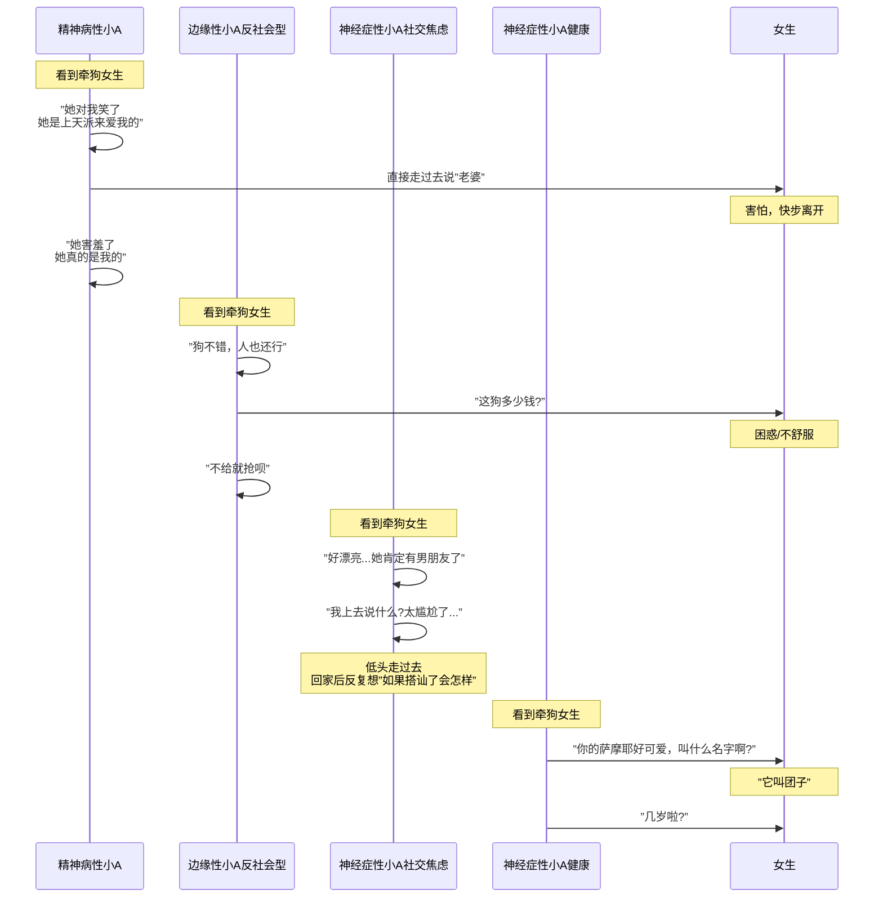

# 第07课：边缘性与神经症人格水平

## 边缘性人格的核心特征

边缘性人格水平位于Y轴的中间偏下区域。它的核心特征只有一句话：**情绪极端不稳定**。

但这种"不稳定"不是一个简单的脾气问题，而是结构性的：

- **情绪的烈度爆炸**：一件小事（朋友五分钟没回消息）可以引发暴怒或崩溃的情绪反应。
- **情绪切换极快**：上一秒觉得你是全世界最好的人，下一秒觉得你是最大的恶魔。这种"好-坏"的快速切换不是普通的情绪化，而是**分裂防御**在实时运作。
- **空虚感**：当外界刺激消失时，边缘性人格体验到的不是平静，而是"我不存在"的巨大空洞。
- **关系模式**：靠近时害怕被吞噬，远离时害怕被抛弃。在亲密关系中表现为"黏上去-推开-黏上去"的循环。

### 玉娇龙——爱恨极端，剧情发动机

《卧虎藏龙》中的玉娇龙是边缘性人格角色的完美范本。分析她的行为模式：

- **分裂的好-坏世界**：她心中的人分成两类——让她"自由"的人（罗小虎、碧眼狐狸）是好的，管束她的人（俞秀莲、李慕白）是坏的。她无法理解任何人可以同时包含两面。
- **情绪失控即行动**：当她感受到约束或背叛时，不是内省而是直接行动。偷青冥剑、离家出走、大闹镖局——见诸行动是她的默认程序。
- **攻击性与诱惑的交替**：面对李慕白，她在"我要你教我"和"我恨你管我"之间反复横跳。

> [!NOTE] Key Insight
> 玉娇龙的"江湖梦"本身并不怪异——很多少女都有这种幻想。骇人的是她为这个幻想不惜摧毁一切现实关系的能力。这正是边缘性人格角色的致命魅力：她们如此强烈，以至于旁边的所有人都被卷入了她们的情绪风暴。

边缘性人格角色是剧情发动机的原因很直接：**她们的行为不可预测但逻辑一致**——事件后果再严重也挡不住当下的情绪冲动。编剧只需要设置一个让她们情绪波动的情境，剩下的剧情会自动生成。

## 神经症性人格特征

神经症性水平位于Y轴中上区域，是**最普遍的**人格水平（约占总人口的50%）。

核心特征：**轻度心理病理，跟自己过不去**。

神经症性的人有现实检验能力（知道什么是真的、什么是假的），有稳定的自我认同（知道我是谁），有道德感（知道对错），但问题在于——**他们对自己太苛刻了**。

- **内在冲突**：不够瘦、不够有钱、不够优秀、不够自律。神经症性的人不是没有成功，而是永远觉得不够。
- **内疚驱动**：做了让自己不满的事不需要外界惩罚，自己已经先内疚了。
- **压抑为默认防御**：有了情绪不表达，先压着。"没事，我不生气"——但明明整个下午都在气。

> [!TIP] 创作定位
> 绝大多数电影的主角是神经症性水平的。因为神经症性的人有矛盾、有冲突、有挣扎，但没有失去现实基础。观众能在他们身上看到自己：一个普通人在做对的事和让自己舒服的事之间反复摇摆。

## 同一情境，三种人格水平

这是本课最核心的对比。通过同一个场景，你能直观看到人格组织水平如何决定角色行为。

> [!NOTE] **场景**：小A在下班路上遇到一个牵着白色萨摩耶的女生，长得很漂亮。

**分析**：
- **精神病性**（钟情妄想）：完全没有现实检验——他看到的不是真实的她，而是他幻想中的她。沟通不是交朋友，而是"确认关系"。
- **边缘性/反社会型**：攻击性直接——喜欢就想要，不给我就抢。考虑的不是对方感受，而是自己的欲望。
- **神经症性/社交焦虑**：现实检验完好——他知道自己的焦虑是不合理的，但他被焦虑压倒了。痛苦是内在的（自我攻击），不涉及对外界的伤害。
- **神经症性/健康**：现实检验完好 + 焦虑可管理——他能看到对方的"人"（不是幻想对象，不是欲望物品），能用合适的方式建立连接。

> [!WARNING] 编剧提示
> 同一个外部情境，不同人格水平的角色会走出完全不同的剧情路径。当你想写一段戏但不知道角色该怎么做的时候，**先回头检查你锁定了人物的Y轴没有**。如果Y轴没锁定，角色的行为就会飘忽不定。

## 内疚感作为成熟标志

听起来反直觉，但**能感受到内疚感其实是心理健康的表现**。

- 精神病性水平：没有内疚感，只有被迫害感。"我没错，是这个世界错了。"
- 边缘性水平：原始的羞耻感覆盖了内疚感。"我太坏了，所以我要自我毁灭。"
- 神经症性水平：有成熟的内疚感。"我做了不好的事，我为此感到抱歉。我想弥补。"

> [!TIP] Key Insight
> 内疚需要两个先决条件：①有一个稳定的"超我"（内在道德标准）；②有能力把自己看作行为的主体。这两个条件在精神病性和边缘性水平都不完全具备。所以当你的角色说"对不起"的时候——TA做出道歉的瞬间其实就在告诉你TA的人格水平。

## 幽默作为成熟防御机制

这是编剧最需要掌握的防御机制之一。

健康的幽默不是"用笑话逃避痛苦"，而是**用认知的重构来包含痛苦**。《《她》》中的西奥多（华金·菲尼克斯饰）面对离婚时，在酒馆里和朋友有一场关于"和操作系统谈恋爱算不算劈腿"的对话。他没有哭诉、没有愤怒，而是用一种温柔的、自嘲的幽默去表达：

> "我就是觉得，和一个操作系统分手太荒谬了——但你永远拿不回你的东西。"

这种幽默中有三层东西：①他有痛苦（不否认）；②他能从远处看自己的处境（认知弹性）；③他没有把自己完全当成受害者（有自我能动性）。

> [!NOTE] 不同人格水平的幽默
> 边缘性的幽默可能是刻薄的、攻击的（以幽默的名义伤人）。神经症性的幽默可能是自嘲式的、带苦味的。健康的幽默是开放的、包容的——笑的是处境，不是人。

## 人格结构决定角色能承受的剧情张力

想象一下：你有一台车的发动机是奥拓的，但你想装一个Q7的底盘和轮胎。这车要么散架，要么开起来极其别扭。

**角色也是一样**。

- 一个神经症性的角色可以承载复杂的道德困境（"杀一个人救五个人"），因为他的内心有足够的结构来消化这种张力。
- 一个边缘性的角色可以承载爱恨交织的感情线，但承担不了"我在做一件极其邪恶的事但同时我是正义的"这种认知复杂度。
- 一个精神病性的角色无法承载任何需要现实检验的剧情转折。

> [!TIP] 编剧创作中Y轴界定流程
> 当你在构思一个角色时，按这个流程走：
> 1. **确定Y轴位置**：这个角色是精神病性、边缘性、神经症性还是健康水平？
> 2. **检验一致性**：这个剧情转折需要角色具备什么心理能力？TA的Y轴位置能支撑吗？
> 3. **设计成长弧线**：如果角色要在剧情中"成长"，TA的Y轴位置是否需要改变？能改变多少？
> 4. **检查X轴互动**：确定Y轴后，再叠加X轴性格类型，看两者是否一致。

> [!QUESTION] 自我检查
> 1. 边缘性人格水平最核心的特征是什么？为什么它让角色成为"剧情发动机"？
> 2. 请用自己的话复述"牵狗女生"场景中四种反应对应的人格水平，核心区分点是什么？
> 3. 为什么说"能内疚是心理健康的表现"？
> 4. 在《她》中，西奥多的幽默为什么被视为成熟防御？
> 5. 如果你的角色在第三幕突然要面对一个极其复杂的道德选择，但TA被设定为边缘性人格水平，你会怎么处理？
> 
> 

> 
参考答案

> 
> **1.** 情绪极端不稳定。边缘性角色的行为由当下的情绪直接驱动，不顾后果——正是这种"不可预测但逻辑一致"的特质，让TA不需要编剧额外推动就会自己制造剧情冲突。
> 
> **2.** 四种反应对应：精神病性(钟情妄想)、边缘性反社会型(想要就直接采取行动)、神经症性社交焦虑(想要但被焦虑压住、回家做梦)、神经症性健康(能管理焦虑、正常社交)。核心区分在于：现实检验是否完好 + 攻击性是向外还是向内。
> 
> **3.** 内疚需要两个前提：内在道德标准和"自己是行为主体"的意识。这两个条件只有到了神经症性以上才完全具备。不能内疚的人才真正危险——因为他们永远觉得自己没错。
> 
> **4.** 因为他的幽默不否认痛苦，而是用一种有认知弹性的方式重新框架痛苦。健康的幽默不是逃避，而是一种整合——笑和痛共存。
> 
> **5.** 要么调整角色在剧情中的道德困境复杂度(让选择更直白、更情绪化)，要么加入一个更成熟的角色在关键时刻为TA提供支持或视角。不要让边缘性角色独自面对神经症性水平的道德困境——就像不要让奥拓发动机去拉Q7的车身。
> 

## 下一步

我们已经走过了Y轴上的三个主要水平。下一课我们将探讨这些水平如何分布在社会中、不同类型的心理动力关系，以及性格的升华方向。继续学习 [[0008-spectrum-and-dynamics|第08课：性格图谱与心理动力]]。

> [!TIP] **练习**
> 找一部你没看过的电影，先看第一个15分钟，然后写下你对主角Y轴位置的初步判断（精神病性/边缘性/神经症性/健康）。继续看完电影，再检查你的判断是否正确。如果角色的Y轴位置在剧情中改变了，思考是什么事件触发了这个改变。记录下来作为你的训练笔记。