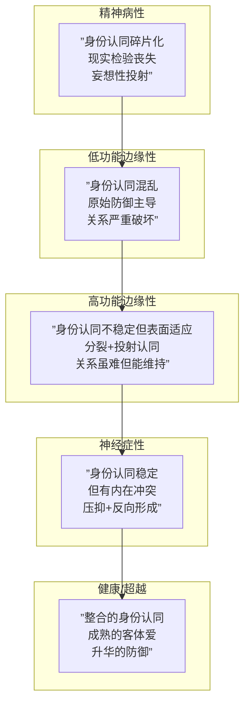

# 第08课：性格图谱与心理动力

## Y轴四区域：人格分布图谱

前几课我们已经在Y轴上划分了三个人格水平。但在真实世界中，人群的分布不是均匀的。以下是临床经验中的大致比例：


这些数字不是精确的流行病学数据，但反映了临床工作者的观察：

- **超越神经症性（约5%）**：极少数高度成熟的人。能够深度爱、高效工作、有创造力地玩。能够承受巨大的不确定性而不崩溃。
- **神经症性（约50%）**：主流人群。有现实检验能力，有稳定的自我认同，有内疚感。主要问题限于"对自己太苛刻"和"压抑的冲动时不时冒出来"。
- **边缘性（约30%）**：比你以为的多。情绪不稳、关系模式极端、空虚感。很多人表面功能良好，但亲密关系中就"露馅"。
- **精神病性（约10-20%，含亚临床）**：包含精神分裂谱系、严重人格障碍、以及"亚临床"水平的现实检验问题。很多人在日常生活中看起来正常，但在特定主题下（如亲密关系、权威关系）会突然失去现实检验。

> [!WARNING] 编剧提醒
> 不要把"边缘性"等同于"坏人"，也不要让"神经症性"变成"无聊的正常人"。边缘性角色的激情和极端正是戏剧性所在；神经症性角色的压抑和内在冲突正是喜剧和正剧的沃土。

## 爱的能力与攻击性的分水岭

这是Y轴上最重要的一条线——**爱的能力的分水岭**。

```mermaid
graph LR
    subgraph 线上：有客体爱能力
        A[超越神经症性] --> A1[能爱真实而完整的他人]
        B[神经症性] --> B1[能爱，但伴随内疚和压抑]
    end
    subgraph 线上边缘 - 临界区
        C[高功能边缘性] --> C1[能短暂客体爱，但压力下退行]
    end
    subgraph 线下：攻击性直接
        D[低功能边缘性] --> D1[”爱=我需要你/我占有你”]
        E[精神病性] --> E1[”爱=你是我的幻想的一部分”]
    end
```

**"线以上"**是指这个人已经发展出了**客体爱**的能力——能把对方当作一个独立的、完整的人来爱。这种爱不一定完美（神经症性的爱带着内疚、焦虑），但它的方向是对的。

**"线以下"**是指这个人还没有发展出客体爱的能力。他们的"爱"本质上是**需要**——"我爱你"的意思是"我需要你""你让我感觉舒服""你是我的"。一旦对方不能满足需求，爱就变成恨。

> [!TIP] Key Insight
> 这对编剧的核心含义是：**线上角色的关系冲突是"我想要爱但不知道怎么爱"，线下角色的关系冲突是"你给我我就要，你不给我就毁了你"**。这两类角色在同一个剧本里相遇，天然产生强大的戏剧张力。

## Kernberg纵向发展连线

奥托·肯伯格（Otto Kernberg）是当代人格组织理论最重要的理论家之一。他的贡献在于把传统的精神分析理论整合成了一个清晰的纵向发展模型：



这个模型的美丽之处在于它把看似互不相干的精神疾病统一在了一个发展轴上。从精神分裂症到强迫症到健康成熟，所有的人格组织方式都可以在这个纵轴上找到位置。

> [!NOTE] Kernberg的核心洞见 
> 构成人格组织水平的四个基本维度：①身份认同的整合度、②防御机制的成熟度、③现实检验能力、④客体关系的质量。这四个维度**一起变动**——不是单独发育的。

## 回避型人格与「抛弃-先出手」模式

"在你抛弃我之前，我先抛弃你"——这是回避型人格核心的动力公式。

《这个杀手不太冷》中的Leon就是典型的回避型人格结构。分析他的心理模式：

- **早年创伤**：可能有被抛弃或严重失望的经历（电影中暗示了他早年恋人的死亡）。
- **防御策略**：不建立深层连接 = 不会再受伤。独居、不社交、不动感情。
- **模式触发**：一旦开始在意某人（Mathilda），他的第一反应是推开——"不要靠近我"。
- **转变条件**：只有对方足够坚持、足够"不抛弃"，他才可能突破这个防御。

> [!WARNING] 创作陷阱
> 不要写"回避型角色被爱改变"的简单童话。现实中，回避型的防御策略非常顽固，不是一个人对你够好就能打破的。好的剧本应该呈现这个改变的艰难——"几乎放弃了，但最终没有"的过程，而不是"一个拥抱就好了"。

## 智性区间（人格浮动范围）

每个人的Y轴位置不是一个精确的点，而是一个**浮动范围**。

- **基线水平**：日常状态下的人格组织水平。
- **压力水平**：在极端压力下，人格会"退行"到更低水平。
- **恢复能力**：压力过后，能否弹回基线。

> [!TIP] 创作意义
> 一个角色的智性区间决定了TA能承受多少剧情的压力而不"变形"。如果压力超过了TA的浮动范围上限，角色的行为就会从TA设定的Y轴位置"掉下来"。这在剧情中是非常有力的转场。
> 
> 比如一个神经症性的好父亲，在女儿被绑架后可能短暂"退行"到边缘性水平——情绪失控、见诸行动、做出非理性的决定。这不是情节漏洞，而是心理上的可信退行。

## 克莱因理论：死本能与被迫害焦虑

梅兰妮·克莱因将弗洛伊德的理论向更原始的层次推进。对她来说，婴儿一出生就面对一个根本冲突：**生本能（爱、创造）vs 死本能（攻击、毁灭）**。

婴儿无法承受自己的死本能（因为太可怕了），所以把它投射出去——"不是我恨你，是你恨我/你是坏人"。这就是**被迫害焦虑**的起源。

> [!NOTE] 死本能的编剧意义
> 克莱因认为人类最深层的恐惧不是"死"，而是"被摧毁"。这是一个微妙的但重要的区分。如果角色的核心动力是被迫害焦虑驱动，他所有的行为（包括攻击行为）本质上都是"防御性的"——他不是在主动作恶，而是在"反击"他认为会伤害他的世界。这正是《《闪灵》》中杰克·托伦斯的角色逻辑。

## 结构（车架）与动力（发动机）的匹配

这个概念在[[0007-borderline-neurotic-level|第07课]]结尾已经提出，现在深化：

```mermaid
graph LR
    subgraph 结构=人格组织水平Y轴
        S1[车架强度]
    end
    subgraph 动力=性格类型X轴
        D1[发动机类型]
    end
    S1 --> M{匹配度}
    D1 --> M
    M --> O1[匹配：剧情张力自然可信]
    M --> O2[不匹配：角色行为不连贯]
```

**具体的匹配逻辑**：
- 强迫型X轴 + 神经症性Y轴 = 一个精细、焦虑、内在冲突丰富的角色（匹配度高）
- 强迫型X轴 + 精神病性Y轴 = 角色行为矛盾（强迫需要现实检验能力，但精神病性有现实检验问题——冲突）
- 反社会型X轴 + 边缘性Y轴 = 自然匹配（反社会需要低共情+冲动性，边缘性正好提供）
- 反社会型X轴 + 神经症性Y轴 = 极其有趣的矛盾角色（一个本能上有攻击性但内心有内疚感的人——《无间道》的刘建明）

## 依赖型与回避型的动态关系

在性格图谱中，某些类型之间天然存在"磁力"——他们被彼此吸引，又彼此伤害。最典型的组合之一是**依赖型 vs 回避型**。

> 依赖型：我需要你，别离开我。
> 回避型：你太需要我了，我要逃。
> 依赖型：看吧，你真的不爱我，所以我更需要你了。
> 回避型：看吧，你永远不满足，所以我更想逃了。

这个循环可以无限持续下去。从外部看，这是一个互相折磨的关系。从内部看，两个人在重复各自的童年创伤——依赖型在重复"被抛弃"的恐惧，回避型在重复"被吞噬"的恐惧。

> [!TIP] 创作应用
> 这种循环在恋爱情节中极其常见。好的编剧会做一件事：**跳出循环的瞬间才是高潮**。当依赖型说"我可以放手"或回避型说"我不会走"的时候，角色成长才真正发生。

## 人格类型的升华方向

每个人的X轴性格类型都包含一种"负面的本质"。心理治疗的目的不是消灭这个本质（因为本质上消灭不了），而是**升华它**——把同一股心理能量导向更健康、更有创造性的方向。

| 类型 | 负面状态 | 升华方向 |
|------|---------|---------|
| 抑郁型 | 自我攻击、压抑 | **慈悲**：把对自己严苛的善良转向他人 |
| 强迫型 | 控制、僵化 | **勇气**：在可控的范围内选择冒险 |
| 偏执型 | 敌意投射 | **警觉**：有智慧地防御而不是想象性攻击 |
| 表演型 | 过度情感化 | **感染力**：用情感连接他人而非控制他人 |
| 自恋型 | 需要镜映 | **领导力**：健康的自信带动他人成长 |

### 「五彩石公益计划」案例

五彩石是一个真实案例：一群有抑郁倾向的大学生（X轴抑郁型）参与到帮助山区儿童的公益项目中。在帮助孩子的过程中，他们把自己的"过度自我攻击"转化成了"对他人的慈悲"。

注意这个转化机制：抑郁型人格的本质能量（对自己太苛刻、太想"修复"自己）没有消失，而是被导向了外部——"我不需要修复自己，我可以修复别人的童年"。这条路径恰好是抑郁型人格最健康的升华方向。

> [!WARNING] 升华 vs 压抑
> 升华不是压抑。压抑是"我不承认我有攻击性"，而升华是"我的攻击性可以转化为创造性的工作"。升华后的能量依然有它的原始颜色——一个升华的抑郁型人不是变成了乐观人，而是用"抑郁式的认真和深刻"去关怀他人。

> [!QUESTION] 自我检查
> 1. 简述Y轴四区域的人口分布比例。为什么"边缘性30%"这个数字对编剧很重要？
> 2. 什么是"爱的能力的分水岭"？线上和线下的"爱"有什么本质区别？
> 3. 回避型人格Leon的核心心理模式是什么？这个模式是怎么形成的？
> 4. 请解释克莱因的"死本能"和"被迫害焦虑"的关系。
> 5. 抑郁型人格的升华方向是什么？"五彩石公益计划"对这个方向有什么启示？
> 
> <details>
> <summary>参考答案</summary>
> 
> **1.** 超越神经症性约5%，神经症性约50%，边缘性约30%，精神病性约15%。边缘性30%意味着银幕上大量角色的行为逻辑是"情绪主导+关系极端"——这正是戏剧性的温床。
> 
> **2.** 分水岭是"能不能把对方当作一个独立完整的个体来爱"。线上（神经症性以上）的爱是有客体能力的爱——虽然可能带着内疚和焦虑。线下的爱本质上是需要——"你满足我我就爱你，你不满足我我就恨你"。
> 
> **3.** Leon的核心模式是"在你抛弃我之前我先抛弃你"。模式形成于早年被抛弃或严重失望的创伤经验——内心形成了一个信念："近=受伤，远=安全"。
> 
> **4.** 婴儿无法承受自己的死本能（攻击/毁灭冲动），所以把它投射出去——变成"不是我恨你，而是你恨我"。这个"你恨我"的体验就是被迫害焦虑。
> 
> **5.** 抑郁型的升华方向是慈悲——把对自己的严苛善良转向他人。五彩石的启示是：升华并不是"变成另一个人"，而是把同一股能量放在不同的地方——"不需要修复自己，可以修复别人的童年"。
> </details>

## 下一步

我们已经走完了Y轴全景和X轴的整体动力关系。下一课我们将深入两个最重要、也最常被误解的性格维度——自恋与抑郁。继续学习 [[0009-narcissism-depression|第09课：自恋与抑郁]]。

> [!TIP] **练习**
> 选择一个你熟悉的电影角色，分析TA的Y轴基线和智性区间（日常水平 vs 压力下的退行水平）。然后分析TA的X轴类型，思考这个类型的"升华方向"是什么。角色的成长弧线是不是朝着这个方向走的？如果不是，你认为编剧应该怎么调整？写300字分析笔记。