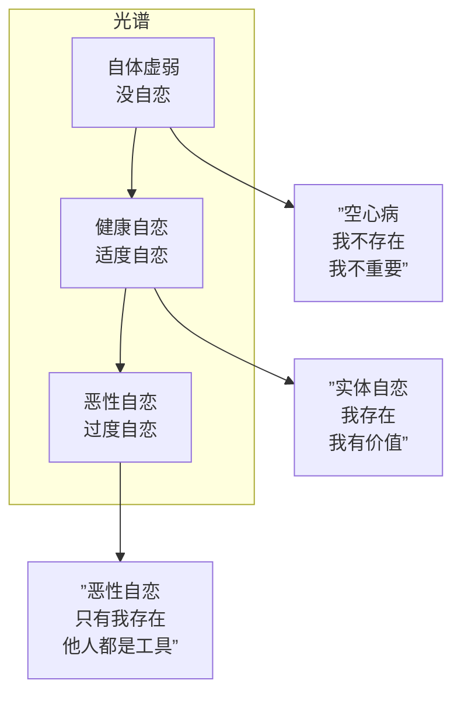

# 第09课：自恋与抑郁

## 自恋的本质

"自恋"在今天的流行语境里几乎是一个完全的贬义词——自恋=以自我为中心=自私。但在精神分析的框架里，自恋是一个中性概念：**自恋是对自我价值的心理投资**。

问题不在于"有没有自恋"，而在于"自恋是怎么工作的"。

### 恶性自恋：无视他人利益和生命

当自恋走到极端，就变成了恶性自恋。核心特征是：

- **利用他人作为自恋的养料**：别人不是人，是"自恋补给站"。夸奖=好的补给站，批评=坏的补给站（必须摧毁）。
- **无法耐受自恋损伤**：被批评、被忽视、被超越 —— 这些是恶性自恋者最大的心理灾难。反应可能是暴怒、贬低对方、或者用幻想修复自恋。
- **缺乏共情**：不是"不能"共情，而是"不愿"共情。共情是对自恋的威胁——如果我理解了你，我就不能全心全意地关注我自己。

> [!WARNING] 创作中的恶性自恋
> 银幕上的恶性自恋角色往往被写成"表面嚣张"的类型。但真正让角色立体的是**自恋损伤下的脆弱**——不是他嚣张的时候，而是他感到被忽视/被看低的时候。那个瞬间的暴怒、失态或崩溃，才是角色真正的面孔。《《了不起的盖茨比》》中盖茨比在黛西说出"我曾经爱过他"时的崩溃就是这种时刻。

### 健康自恋 vs 自体虚弱

自恋的谱系不是"自恋强=坏，自恋弱=好"。它是一个平衡：



**自体虚弱（Empty Self / 空心病）**：不是"我太爱自己了"，而是"我没有自己"。感觉像一个空壳，需要用外界的认可来填充。如果外界不给认可，就感觉自己不存在。

《《海上钢琴师》》中的1900就是自体虚弱的经典隐喻——他有一切才华（钢琴天才），但他没有"身份"（没有出生证明、没有国籍、从未下船）。他的存在完全依赖于弗吉尼亚号这艘船。当船要被炸毁时，他选择留在船上。这不是"殉道"，不是"浪漫"，而是一个自体虚弱的人面对"世界那么大"时的崩溃——他没有一个足够结实的"自己"去面对真实的世界。

> [!NOTE] 空心病 vs 抑郁
> 空心病不是抑郁。抑郁是你知道自己痛苦，你还有能力痛苦。空心病是你连痛苦的能力都减弱了——只剩空洞。在抑郁中，你的世界里充斥的是"我很糟糕"的想法；在空心中，你的世界是"我什么都不是"的虚无。

## 自恋四象限坐标

这是本课最实用的工具——用两个维度来描述一个人的"自恋配置"：

- **横轴**：我好不好？（自我评价）
- **纵轴**：别人好不好？（他人评价）

```mermaid
quadrantChart
    title 自恋四象限坐标
    x-axis 我不好 --> 我好
    y-axis 别人不好 --> 别人好
    quadrant-1 我好+别人好
    quadrant-2 我不好+别人好
    quadrant-3 我不好+别人不好
    quadrant-4 我好+别人不好
    point ”实体自恋<br>（健康）” : 0.85, 0.85
    point ”雷锋型<br>（自虐性利他）” : 0.2, 0.85
    point ”抑郁型<br>（自我贬值）” : 0.2, 0.2
    point ”恶性自恋<br>（毁灭型）” : 0.85, 0.15
```

### 四象限详解

- **第一象限（我好+别人也好）—— 实体自恋**：这是健康的心理状态。我知道我有价值，我也能欣赏他人的价值。我的自尊不依赖于贬低别人或讨好别人。代表人物：小李子在《《猫鼠游戏》》结局时的卡尔·汉拉提——他知道自己是好警察，也知道弗兰克是天才，不需要贬低弗兰克来证明自己。

- **第二象限（我不好+别人好）—— 雷锋型 / 自虐性利他**："我太差了，但你是完美的，所以我为你付出一切。"表面上这是高尚，但深层是一种自恋的扭曲——通过无限度地付出，来换取"我被好人认可了"的自恋满足。现实中这是"讨好型人格"的原型。

- **第三象限（我不好+别人也不好）—— 抑郁型**："我差，全世界也差。"这是抑郁投射——把我的不好的感觉扩散到整个世界。有时这在深度思考或艺术家身上看起来像"清醒"或"看透了"，但区别在于：清醒者看到了世界的阴暗但不被它淹没，而第三象限的人是被"都不好"的感知困住了。

- **第四象限（我好+别人都死）—— 恶性自恋**："只有我是好的，你们都是垃圾。"这是最危险的自恋形式。当一个人不仅认为"我好"，而且"你的不好需要被清除"时，毁灭就开始了。

> [!TIP] 编剧工具
> 这四象限不仅适用于主角，也适用于配角甚至是反派。最精彩的反派不是纯粹的第四象限——而是让观众看到TA是如何从其他象限"滑"到第四象限的。比如一个曾经在第一象限的人，在经历了重大创伤后，对世界产生了"既然你们不给我好的，我就让你们都不好"的转变。

## 实体自恋 vs 虚体自恋

这是自体心理学大师科胡特（Heinz Kohut）最重要的贡献之一：

- **实体自恋（Lead Ball）**：像铅球。你打击它，它不会弹跳，不会变形。你的自我价值感来自于内在——你做过的事、你相信的东西、你与他人的真实连接。"我很好"不是因为别人刚夸了我，而是因为我知道我是谁。
- **虚体自恋（Balloon）**：像气球。轻轻一戳就破，或者随着风向乱飞。你的自我价值感依赖于外界的反馈——今天有人夸了，我就是全宇宙最好的；明天有人批评了，我就是一堆垃圾。

```mermaid
graph LR
    subgraph 实体自恋（铅球）
        A[内核稳定] --> A1[不因外界评价而晃动]
        A --> A2[”我接受自己的局限”]
        A --> A3[能承认错误而不崩溃]
    end
    subgraph 虚体自恋（气球）
        B[内核空洞] --> B1[依赖外界评价充气]
        B --> B2[不能接受批评=>暴怒或崩溃]
        B --> B3[不断需要新的”自恋供给”]
    end
```

### 荆轲（实体）与秦舞阳（虚体）

这是实体自恋 vs 虚体自恋的最佳文学对比。

**荆轲刺秦王**，这是一个载入史册的行动。但荆轲不是一个人去的——他带了一个副手**秦舞阳**。司马迁在《史记》里记载：秦舞阳"年十三，杀人，人不敢忤视"——13岁就杀过人，普通人都不敢直视他。

但——当两人真正走上秦廷的台阶时：

- **秦舞阳（虚体自恋）**：脸色突变，浑身发抖，秦国大臣都看出异样。他的"强大"是气球式的——在没有真正的压力时看起来很强，但一旦面临真实的威胁，他的内核就暴露了。他的杀人不是因为勇敢，而是因为他在更弱的人面前无法被挑战。当面对真正的权威（秦王）时，崩溃了。
- **荆轲（实体自恋）**：知道秦舞阳已经靠不住了，但他没有崩溃。"我独自完成"，他在那个瞬间做了一个决定——不管有没有副手，不管胜算多少，我来完成我的使命。他的自恋不需要秦王的认可，不需要成功来证明。"我做了该做的事"——这就是实体自恋的终极表现。

> [!WARNING] 编剧对比
> 当你设计一个"看起来很强大"的角色时，问自己：TA是荆轲还是秦舞阳？最精彩的反转往往发生在这里——看似强大的人在关键时刻崩溃了，而看似普通的人在关键时刻站起来了。这种反转的本质，就是实体自恋和虚体自恋的暴露。

## 治疗能改变Y轴，但难改变X轴

这是一个非常重要的临床观察，也是编剧需要理解的原则：

- **心理治疗可以改变Y轴位置**：边缘性人格经过长期治疗，可以稳定到神经症性水平。精神病性有一些调整空间。神经症性可以更健康。
- **但X轴性格倾向是相对稳定的基模**：一个抑郁型的人，经过治疗不会变成表演型的人。TA的"底色"还是抑郁型的——但TA可以学会把"自我攻击"升华为"慈悲"（见[[0008-spectrum-and-dynamics|第08课]]升华方向）。

> [!TIP] Key Insight
> 这对角色成长弧线的设计意味着：**角色的"性格类型"（X轴）不需要改变，变的是TA"处理自己性格的方式"（Y轴上升）**。
> 
> 一个强迫型血型的角色，成长了还是强迫型的——但他在成长前是用强迫来控制恐慌，成长后是用强迫来创造结构。性格没有消失，它被升华了。

### 心理成熟度 vs 性格原型

```mermaid
graph TB
    subgraph 心理成熟（Y轴上升）
        Y1[”原始防御 --> 成熟防御”] 
        Y2[”非黑即白 --> 整合”]
        Y3[”见诸行动 --> 语言化”]
        Y4[”投射 --> 共情”]
    end
    subgraph 性格原型（X轴不变）
        X1[”敏感型还是敏感型”]
        X2[”好斗型还是好斗型”]
        X3[”完美主义还是完美主义”]
    end
    Y1 & Y2 & Y3 & Y4 --> Z[角色成长弧线]
    X1 & X2 & X3 --> Z
```

角色的成长，不是"变成另一个人"，而是"成为更深的自己"。

> [!QUESTION] 自我检查
> 1. 恶性自恋的三个核心特征是什么？其中哪一个对编剧来说最有戏剧价值？
> 2. 自体虚弱（空心病）和抑郁的核心区别是什么？
> 3. 自恋四象限坐标的四个象限分别是什么？请为每个象限想一个电影角色例子。
> 4. 荆轲和秦舞阳的对比如何说明实体自恋和虚体自恋的区别？
> 5. 为什么说"治疗可以改变Y轴但难改变X轴"？这对角色成长弧线的设计有什么启示？
> 
> <details>
> <summary>参考答案</summary>
> 
> **1.** 利用他人作为自恋养料、无法耐受自恋损伤、缺乏共情。最有戏剧价值的是"自恋损伤下的脆弱"——角色在外表强悍的瞬间突然崩溃，这个反差是创造复杂反派的关键。
> 
> **2.** 抑郁型的人知道自己痛苦，有能力痛苦，痛苦的内容是"我很糟糕"。空心病的人失去的是痛苦的能力本身——不是"我很糟糕"，而是"我什么都不是"。空洞 vs 痛苦，是本质区别。
> 
> **3.** 第一象限（我好+别人好）=实体自恋/健康——如《猫鼠游戏》的汉拉提。第二象限（我不好+别人好）=自虐性利他/雷锋型——如《被嫌弃的松子》前期。第三象限（我不好+别人也不好）=抑郁型——如《海边的曼彻斯特》的李·钱德勒。第四象限（我好+别人都不好）=恶性自恋——如《黑暗骑士》的小丑。
> 
> **4.** 秦舞阳13岁杀人、无人敢视——看似极强，但面对真正的权威（秦王）就崩溃，是气球式的"虚体强大"。荆轲明知胜算极小仍然前行——他的自恋不依赖结果，是铅球式的"实体强大"。两个人在秦廷上的差别不是技能差别，而是自恋结构差别。
> 
> **5.** 心理治疗可以帮助一个人整合分裂、成熟防御、增强共情能力——这些都是Y轴的上升。但一个人"敏感的底色"或"好斗的倾向"（X轴）是更深层的、贯穿一生的气质。启示：不要写角色"性格变了"，而写角色"用更成熟的方式处理了自己的性格"。
> </details>

## 下一步

自恋与抑郁是X轴上最重要的两个维度之一。在接下来的课程中，我们将逐一深入每个X轴性格类型——从偏执型开始。继续学习 [[0010-type-a-paranoid|第10课：偏执型人格]]。

> [!TIP] **练习**
> 使用自恋四象限坐标，为一个剧本中的三个角色分配象限位置：主角、配角、反派。然后写出一个场景——在这个场景中，三个角色都面临"失败"。观察每个象限的角色对失败的反应有何不同。注意：象限位置不仅是"态度"，它还决定行动。第四象限的人会攻击别人，第二象限的人会攻击自己。300字左右的场景设计。